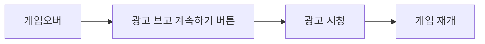
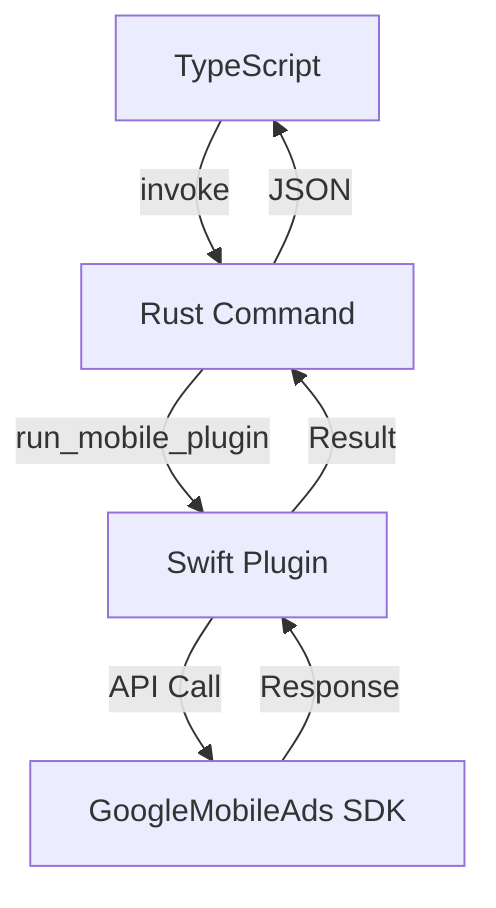
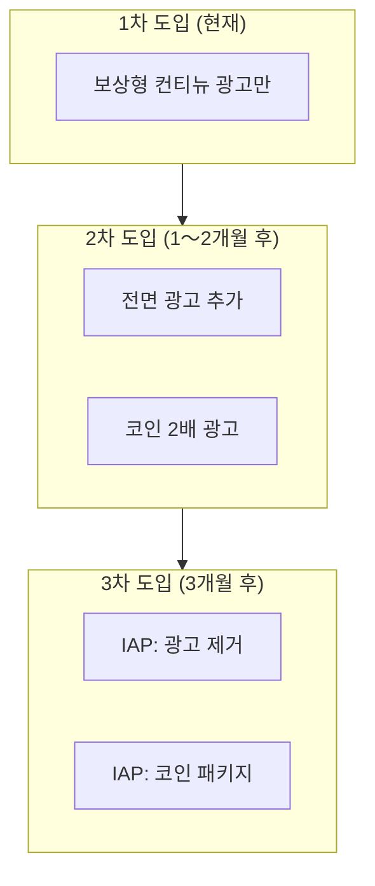

import { Image } from 'astro:assets';
import screenshot01 from '../../../assets/portfolio/shadow-dash/shadow-dash-01_iphone.png';
import screenshot04 from '../../../assets/portfolio/shadow-dash/shadow-dash-04_iphone.png';

## 개요

Tauri 2.x로 iOS 앱을 개발했는데, 수익화를 위해 AdMob 광고를 연동하려면 어떻게 해야 할까요?

안타깝게도 **Tauri에는 공식 AdMob 플러그인이 없습니다**. 이 글에서는 직접 Swift 플러그인을 개발하여 AdMob 보상형 광고를 연동한 전체 과정을 공유합니다.

> 이 글은 [Tauri + PixiJS로 iOS 게임 개발](/ko/blog/ko/tauri-pixijs-ios-game-development) 포스트의 후속편입니다. Shadow Dash 게임에 광고를 연동한 실제 경험을 바탕으로 작성했습니다.

<Image src={screenshot04} alt="Shadow Dash 게임오버 화면" width={300} class="mx-auto rounded-lg shadow-lg" />

## 왜 AdMob인가?

### 모바일 게임 수익화 옵션 비교

| 방식 | 장점 | 단점 |
|------|------|------|
| **보상형 광고** | 사용자 경험 좋음, 높은 eCPM | 구현 복잡 |
| 배너 광고 | 구현 간단 | 낮은 eCPM, UX 저해 |
| 인앱 구매 | 높은 수익 | 구현 복잡, 결제 심사 |

### 보상형 광고를 선택한 이유

Shadow Dash에서는 **컨티뉴 시스템**에 보상형 광고를 적용했습니다:



사용자가 **자발적으로** 광고를 시청하고 보상(게임 계속)을 받는 구조로, 사용자 경험을 해치지 않습니다.

### 광고 SDK 선택 과정

Tauri 앱에서 사용할 수 있는 광고 SDK를 검토했습니다:

| SDK | 장점 | 단점 | 채택 여부 |
|-----|------|------|----------|
| **AdMob** | 높은 eCPM, 다양한 광고 형식 | 네이티브 플러그인 필요 | ✅ 채택 |
| AppLixir | JS SDK만으로 연동 가능 | **DAU 5,000명 이상 필요** | ❌ 미채택 |
| H5 Game Ads | HTML5 게임 특화 | **베타 서비스 (불안정)** | ❌ 미채택 |

**AppLixir를 선택하지 않은 이유**:
- 최소 일일 활성 유저(DAU) 5,000명 이상을 달성해야 신청 가능
- 신규 앱에서는 이 조건을 충족하기 어려움

**H5 Game Ads를 선택하지 않은 이유**:
- 아직 베타 서비스 단계
- 안정성과 수익성이 검증되지 않음

### AdMob vs AppLixir 상세 비교

AdMob과 AppLixir의 성능을 비교하면:

| 항목 | AdMob | AppLixir |
|------|-------|----------|
| eCPM (보상형) | $20〜30 | $15〜25 |
| Fill Rate | 95%+ | 80〜90% |
| 지원 형식 | 보상형, 전면, 배너 | 보상형만 |
| Mediation | 지원 | 미지원 |
| 연동 난이도 | 높음 (네이티브 필요) | 낮음 (JS SDK) |
| 진입 장벽 | 없음 | DAU 5,000명 이상 |

**결론**: 네이티브 플러그인 개발이 필요하지만, AdMob은 진입 장벽이 없고 높은 eCPM과 Fill Rate를 제공합니다.

---

## Tauri CLI 업그레이드

### XCFramework 지원 필요

Tauri v2에서 iOS 플러그인을 개발하려면 Swift Package Manager(SPM)를 사용해야 합니다. GoogleMobileAds SDK처럼 외부 프레임워크 의존성이 필요한 플러그인을 만들려면 **XCFramework 지원**이 필요합니다.

### Tauri CLI 2.9.6+ 업그레이드

```bash
# Cargo를 통한 Tauri CLI 업그레이드
cargo install tauri-cli --force

# 버전 확인
cargo tauri --version
# 출력: tauri-cli 2.9.6 (또는 그 이상)
```

### --ios-framework 옵션

플러그인 생성 시 iOS 프레임워크 타입을 지정할 수 있습니다:

```bash
# Xcode 프로젝트 방식 (SPM 의존성 추가 용이) - 권장
cargo tauri plugin new admob --ios --ios-framework xcode

# XCFramework 방식
cargo tauri plugin new admob --ios --ios-framework xcframework
```

| 옵션 | 설명 | 장점 | 단점 |
|------|------|------|------|
| `xcode` | Xcode 프로젝트 생성 | SPM으로 의존성 추가 용이 | 프로젝트 파일 관리 필요 |
| `xcframework` | XCFramework 생성 | 배포 용이 | 외부 의존성 추가 복잡 |

**AdMob 플러그인에는 `xcode` 옵션 권장**: GoogleMobileAds SDK를 SPM으로 쉽게 추가할 수 있습니다.

---

## Tauri 플러그인 구조 이해

### 디렉토리 구조

```
tauri-plugin-admob/
├── src/                    # Rust 코드
│   ├── lib.rs             # 플러그인 진입점
│   ├── mobile.rs          # iOS/Android 브릿지
│   ├── desktop.rs         # 데스크톱 스텁
│   ├── commands.rs        # Tauri 커맨드
│   └── models.rs          # 요청/응답 타입
├── ios/                    # iOS 네이티브 코드
│   └── tauri-plugin-admob/
│       └── AdmobPlugin.swift
├── guest-js/              # TypeScript API
│   └── index.ts
├── permissions/           # Tauri 권한 설정
│   └── default.toml
├── build.rs               # 빌드 스크립트
└── Cargo.toml
```

### 데이터 흐름



---

## 플러그인 개발 시작

### 플러그인 스캐폴딩

```bash
# Xcode 프로젝트 방식으로 생성
cargo tauri plugin new admob --ios --ios-framework xcode
```

### GoogleMobileAds SDK 추가

Xcode에서 플러그인 프로젝트를 열고 Swift Package Manager로 SDK 추가:

1. `tauri-plugin-admob/ios/tauri-plugin-admob.xcodeproj` 열기
2. **File → Add Package Dependencies**
3. URL 입력: `https://github.com/googleads/swift-package-manager-google-mobile-ads`
4. **GoogleMobileAds** 선택 후 추가

---

## Swift 플러그인 구현

### AdmobPlugin.swift

```swift
import SwiftRs
import Tauri
import UIKit
import WebKit
import GoogleMobileAds

// MARK: - Argument Types
class InitializeArgs: Decodable {}

class LoadRewardedArgs: Decodable {
    let adUnitId: String
}

class ShowRewardedArgs: Decodable {}

// MARK: - AdMob Plugin
class AdmobPlugin: Plugin {
    private var rewardedAd: GADRewardedAd?
    private var isInitialized = false
    private var pendingInvoke: Invoke?

    // 테스트 광고 ID (프로덕션에서는 실제 ID 사용)
    private let testAdUnitId = "ca-app-pub-3940256099942544/1712485313"

    @objc public override func load(webview: WKWebView) {
        NSLog("[AdMob Plugin] Loaded")
    }

    // SDK 초기화
    @objc public func initialize(_ invoke: Invoke) {
        if isInitialized {
            invoke.resolve(["success": true, "message": "Already initialized"])
            return
        }

        GADMobileAds.sharedInstance().start { status in
            self.isInitialized = true
            NSLog("[AdMob Plugin] SDK Initialized")
            invoke.resolve(["success": true, "message": "SDK initialized"])
        }
    }

    // 보상형 광고 로드
    @objc public func loadRewardedAd(_ invoke: Invoke) {
        do {
            let args = try invoke.parseArgs(LoadRewardedArgs.self)
            let adUnitId = args.adUnitId.isEmpty ? testAdUnitId : args.adUnitId

            let request = GADRequest()
            GADRewardedAd.load(withAdUnitID: adUnitId, request: request) { [weak self] ad, error in
                if let error = error {
                    invoke.resolve(["success": false, "error": error.localizedDescription])
                    return
                }

                self?.rewardedAd = ad
                self?.rewardedAd?.fullScreenContentDelegate = self
                invoke.resolve(["success": true])
            }
        } catch {
            invoke.reject(error.localizedDescription)
        }
    }

    // 광고 준비 상태 확인
    @objc public func isRewardedAdReady(_ invoke: Invoke) {
        let isReady = rewardedAd != nil
        invoke.resolve(["ready": isReady])
    }

    // 광고 표시
    @objc public func showRewardedAd(_ invoke: Invoke) {
        guard let rewardedAd = rewardedAd else {
            invoke.resolve(["success": false, "rewarded": false, "error": "No ad loaded"])
            return
        }

        guard let rootViewController = getRootViewController() else {
            invoke.resolve(["success": false, "rewarded": false, "error": "No root view controller"])
            return
        }

        pendingInvoke = invoke

        DispatchQueue.main.async {
            rewardedAd.present(fromRootViewController: rootViewController) { [weak self] in
                let reward = rewardedAd.adReward
                if let pending = self?.pendingInvoke {
                    pending.resolve([
                        "success": true,
                        "rewarded": true,
                        "rewardAmount": reward.amount.intValue,
                        "rewardType": reward.type
                    ])
                    self?.pendingInvoke = nil
                }
            }
        }
    }

    // Root View Controller 가져오기
    private func getRootViewController() -> UIViewController? {
        if let windowScene = UIApplication.shared.connectedScenes
            .compactMap({ $0 as? UIWindowScene })
            .first(where: { $0.activationState == .foregroundActive }),
           let keyWindow = windowScene.windows.first(where: { $0.isKeyWindow }),
           let rootVC = keyWindow.rootViewController {
            var topController = rootVC
            while let presented = topController.presentedViewController {
                topController = presented
            }
            return topController
        }
        return nil
    }
}

// MARK: - GADFullScreenContentDelegate
extension AdmobPlugin: GADFullScreenContentDelegate {
    func adDidDismissFullScreenContent(_ ad: GADFullScreenPresentingAd) {
        rewardedAd = nil
        if let pending = pendingInvoke {
            pending.resolve(["success": true, "rewarded": false])
            pendingInvoke = nil
        }
    }

    func ad(_ ad: GADFullScreenPresentingAd, didFailToPresentFullScreenContentWithError error: Error) {
        rewardedAd = nil
        if let pending = pendingInvoke {
            pending.resolve(["success": false, "rewarded": false, "error": error.localizedDescription])
            pendingInvoke = nil
        }
    }
}

// MARK: - Plugin Export
@_cdecl("init_plugin_admob")
func initPlugin() -> Plugin {
    return AdmobPlugin()
}
```

### 핵심 포인트

1. **`@objc` 어노테이션**: Rust에서 호출하려면 Objective-C 런타임에 노출해야 합니다
2. **`pendingInvoke` 패턴**: 비동기 광고 콜백을 Tauri의 동기 invoke 패턴에 맞추기 위해 사용
3. **`GADFullScreenContentDelegate`**: 광고 닫힘/에러 이벤트 처리
4. **`@_cdecl("init_plugin_admob")`**: Rust에서 플러그인을 로드하기 위한 C 함수 내보내기

---

## Rust 브릿지 구현

### models.rs

```rust
use serde::{Deserialize, Serialize};

#[derive(Debug, Clone, Default, Deserialize, Serialize)]
#[serde(rename_all = "camelCase")]
pub struct InitializeResponse {
    pub success: bool,
    pub message: Option<String>,
}

#[derive(Debug, Deserialize, Serialize)]
#[serde(rename_all = "camelCase")]
pub struct LoadRewardedAdRequest {
    pub ad_unit_id: String,
}

#[derive(Debug, Clone, Default, Deserialize, Serialize)]
#[serde(rename_all = "camelCase")]
pub struct LoadRewardedAdResponse {
    pub success: bool,
    pub error: Option<String>,
}

#[derive(Debug, Clone, Default, Deserialize, Serialize)]
#[serde(rename_all = "camelCase")]
pub struct IsRewardedAdReadyResponse {
    pub ready: bool,
}

#[derive(Debug, Clone, Default, Deserialize, Serialize)]
#[serde(rename_all = "camelCase")]
pub struct ShowRewardedAdResponse {
    pub success: bool,
    pub rewarded: bool,
    pub reward_amount: Option<i32>,
    pub reward_type: Option<String>,
    pub error: Option<String>,
}
```

### mobile.rs

```rust
use serde::de::DeserializeOwned;
use tauri::{
    plugin::{PluginApi, PluginHandle},
    AppHandle, Runtime,
};
use crate::models::*;

#[cfg(target_os = "ios")]
tauri::ios_plugin_binding!(init_plugin_admob);

pub fn init<R: Runtime, C: DeserializeOwned>(
    _app: &AppHandle<R>,
    api: PluginApi<R, C>,
) -> crate::Result<Admob<R>> {
    #[cfg(target_os = "ios")]
    let handle = api.register_ios_plugin(init_plugin_admob)?;
    Ok(Admob(handle))
}

pub struct Admob<R: Runtime>(PluginHandle<R>);

impl<R: Runtime> Admob<R> {
    pub fn initialize(&self) -> crate::Result<InitializeResponse> {
        self.0.run_mobile_plugin("initialize", ()).map_err(Into::into)
    }

    pub fn load_rewarded_ad(&self, ad_unit_id: String) -> crate::Result<LoadRewardedAdResponse> {
        self.0.run_mobile_plugin("loadRewardedAd",
            LoadRewardedAdRequest { ad_unit_id }).map_err(Into::into)
    }

    pub fn is_rewarded_ad_ready(&self) -> crate::Result<IsRewardedAdReadyResponse> {
        self.0.run_mobile_plugin("isRewardedAdReady", ()).map_err(Into::into)
    }

    pub fn show_rewarded_ad(&self) -> crate::Result<ShowRewardedAdResponse> {
        self.0.run_mobile_plugin("showRewardedAd", ()).map_err(Into::into)
    }
}
```

### build.rs (중요!)

```rust
const COMMANDS: &[&str] = &[
    "initialize",
    "load_rewarded_ad",
    "is_rewarded_ad_ready",
    "show_rewarded_ad"
];

fn main() {
    // iOS 빌드 시 프레임워크 링크
    let target = std::env::var("TARGET").unwrap_or_default();
    if target.contains("ios") {
        println!("cargo:rustc-link-lib=framework=GoogleMobileAds");
        println!("cargo:rustc-link-lib=framework=UserMessagingPlatform");
    }

    tauri_plugin::Builder::new(COMMANDS)
        .android_path("android")
        .ios_path("ios")
        .build();
}
```

**주의**: `#[cfg(target_os = "ios")]`는 build.rs에서 작동하지 않습니다. build.rs는 **호스트 머신**(macOS)에서 실행되므로, `std::env::var("TARGET")`으로 타겟을 확인해야 합니다.

---

## TypeScript API 구현

### guest-js/index.ts

```typescript
import { invoke } from '@tauri-apps/api/core'

export interface InitializeResponse {
  success: boolean;
  message?: string;
}

export interface LoadRewardedAdResponse {
  success: boolean;
  error?: string;
}

export interface IsRewardedAdReadyResponse {
  ready: boolean;
}

export interface ShowRewardedAdResponse {
  success: boolean;
  rewarded: boolean;
  rewardAmount?: number;
  rewardType?: string;
  error?: string;
}

export async function initialize(): Promise<InitializeResponse> {
  return await invoke<InitializeResponse>('plugin:admob|initialize');
}

export async function loadRewardedAd(adUnitId: string = ''): Promise<LoadRewardedAdResponse> {
  return await invoke<LoadRewardedAdResponse>('plugin:admob|load_rewarded_ad', {
    adUnitId,
  });
}

export async function isRewardedAdReady(): Promise<IsRewardedAdReadyResponse> {
  return await invoke<IsRewardedAdReadyResponse>('plugin:admob|is_rewarded_ad_ready');
}

export async function showRewardedAd(): Promise<ShowRewardedAdResponse> {
  return await invoke<ShowRewardedAdResponse>('plugin:admob|show_rewarded_ad');
}
```

---

## 앱에 플러그인 연동

### Cargo.toml에 플러그인 추가

```toml
[dependencies]
tauri-plugin-admob = { path = "../tauri-plugin-admob" }
```

### lib.rs에 플러그인 등록

```rust
pub fn run() {
    tauri::Builder::default()
        .plugin(tauri_plugin_admob::init())
        .run(tauri::generate_context!())
        .expect("error while running tauri application");
}
```

### 권한 설정

**src-tauri/capabilities/default.json**:

```json
{
  "permissions": [
    "core:default",
    "admob:default"
  ]
}
```

**tauri-plugin-admob/permissions/default.toml**:

```toml
[default]
description = "Default permissions for the AdMob plugin"
permissions = [
    "allow-initialize",
    "allow-load-rewarded-ad",
    "allow-is-rewarded-ad-ready",
    "allow-show-rewarded-ad"
]
```

### Info.plist에 앱 ID 추가

**src-tauri/gen/apple/앱이름_iOS/Info.plist**:

```xml
<key>GADApplicationIdentifier</key>
<string>ca-app-pub-XXXXXXXXXXXXXXXX~XXXXXXXXXX</string>
<key>SKAdNetworkItems</key>
<array>
    <dict>
        <key>SKAdNetworkIdentifier</key>
        <string>cstr6suwn9.skadnetwork</string>
    </dict>
</array>
```

---

## 게임에서 광고 사용하기

### 광고 설정 파일

**src/lib/config/admob.ts**:

```typescript
// 광고 활성화 플래그 (승인 전까지 false)
export const ADS_ENABLED = false;

const TEST_AD_UNITS = {
  rewardedAd: 'ca-app-pub-3940256099942544/1712485313',
  appId: 'ca-app-pub-3940256099942544~1458002511',
};

const PRODUCTION_AD_UNITS = {
  rewardedAd: 'ca-app-pub-XXXXXXXX/XXXXXXXXXX',  // 실제 광고 단위 ID
  appId: 'ca-app-pub-XXXXXXXX~XXXXXXXXXX',       // 실제 앱 ID
};

const isDevelopment = import.meta.env.DEV;

export const AD_UNITS = isDevelopment ? TEST_AD_UNITS : PRODUCTION_AD_UNITS;
export const isTestMode = isDevelopment;
```

### 게임오버 화면에서 사용

```typescript
import { AD_UNITS, ADS_ENABLED } from '$lib/config/admob';
import * as admob from 'tauri-plugin-admob-api';

let adLoading = false;
let adError = '';

async function handleWatchAd() {
  if (!ADS_ENABLED) {
    // 광고 비활성화 시 바로 컨티뉴
    game.startContinue();
    return;
  }

  adLoading = true;
  adError = '';

  try {
    // 광고 준비 상태 확인
    const readyCheck = await admob.isRewardedAdReady();

    if (!readyCheck.ready) {
      // 광고가 준비되지 않았으면 로드
      const loadResult = await admob.loadRewardedAd(AD_UNITS.rewardedAd);
      if (!loadResult.success) {
        adError = loadResult.error || 'Failed to load ad';
        adLoading = false;
        return;
      }
    }

    // 광고 표시
    const showResult = await admob.showRewardedAd();

    if (showResult.rewarded) {
      // 보상 받음 - 게임 계속
      game.startContinue();
    } else if (showResult.error) {
      adError = showResult.error;
    }
  } catch (error) {
    adError = String(error);
  } finally {
    adLoading = false;
  }
}
```

---

## 트러블슈팅

### Swift 타입 에러: "cannot find type 'RewardedAd' in scope"

**원인**: GoogleMobileAds SDK는 Objective-C 기반으로, Swift에서 사용할 때 `GAD` 접두사가 필요합니다.

```swift
// ❌ 잘못된 코드
private var rewardedAd: RewardedAd?

// ✅ 올바른 코드
private var rewardedAd: GADRewardedAd?
```

### 링커 에러: "Undefined symbols for architecture arm64"

**원인**: GoogleMobileAds 프레임워크가 링크되지 않음

**해결 1**: 메인 앱 Xcode 프로젝트에도 SDK 추가

1. `src-tauri/gen/apple/앱이름.xcodeproj` 열기
2. **File → Add Package Dependencies**
3. GoogleMobileAds SDK 추가

**해결 2**: build.rs에서 프레임워크 링크

```rust
let target = std::env::var("TARGET").unwrap_or_default();
if target.contains("ios") {
    println!("cargo:rustc-link-lib=framework=GoogleMobileAds");
}
```

### Tauri 권한 에러

**에러 메시지**:
```
admob.is_rewarded_ad_ready not allowed.
Permissions associated with this command: admob:allow-is-rewarded-ad-ready
```

**해결**: `permissions/default.toml`과 `capabilities/default.json`에 권한 추가

### 광고가 표시되지 않음

**증상**: 버튼 클릭해도 광고 안 나옴

**확인 사항**:
1. 테스트 광고 ID 사용 중인지 확인
2. `GADMobileAds.sharedInstance().start()` 호출 확인
3. 실제 기기에서 테스트 (시뮬레이터 지원 제한적)

---

## 수익화 전략 고찰

### 단계별 도입 계획



### 수익화 3대 원칙

1. **게임 밸런스 보호**: 과금은 외형만, 능력치 판매 금지
2. **무과금 유저 존중**: 모든 콘텐츠 무료 획득 가능
3. **가치 제공 우선**: 유저가 "쓸 가치가 있다"고 느끼는 상품

### 예상 수익 (DAU 10,000명 기준)

| 단계 | 광고 유형 | 일일 수익 | 월간 수익 |
|------|----------|----------|----------|
| 1차 | 보상형만 | ~$130 | ~$3,900 |
| 2차 | 보상형 + 전면 | ~$425 | ~$12,750 |
| 3차 | 광고 + IAP | ~$600 | ~$18,000 |

---

## 결론

### 배운 점

1. **Tauri CLI 최신 버전 유지**: XCFramework 지원 등 중요한 기능이 계속 추가됨
2. **Tauri 플러그인 구조**: Rust ↔ Swift 브릿지 이해 필수
3. **크로스 컴파일**: build.rs에서 HOST vs TARGET 구분 중요
4. **Tauri v2 권한 시스템**: capabilities와 permissions 필수

### 체크리스트

- [ ] Tauri CLI 최신 버전 업그레이드 (`cargo install tauri-cli --force`)
- [ ] `--ios-framework xcode` 옵션으로 플러그인 생성
- [ ] GoogleMobileAds SDK를 **메인 앱**과 **플러그인** 모두에 추가
- [ ] build.rs에서 `std::env::var("TARGET")`으로 iOS 감지
- [ ] `permissions/default.toml`에 모든 명령어 권한 정의
- [ ] `capabilities/default.json`에 `admob:default` 추가
- [ ] Info.plist에 `GADApplicationIdentifier` 추가
- [ ] 테스트/프로덕션 광고 ID 분리 관리

### 다음 단계

- Android 지원 추가
- 전면 광고 구현
- 배너 광고 구현
- 인앱 결제 (StoreKit 2) 연동

---

## Shadow Dash 다운로드

이 글에서 다룬 기술로 개발한 **Shadow Dash**를 직접 플레이해보세요!

<a href="https://apps.apple.com/app/shadow-dash/id6740092498" target="_blank" rel="noopener noreferrer">
  
</a>

**피드백 환영합니다!** 앱을 플레이하시고 개선점이나 버그가 있다면 App Store 리뷰나 이메일로 알려주세요.

> 📱 **Shadow Dash 상세 정보**: [포트폴리오 페이지](/ko/portfolio/shadow-dash)에서 게임의 핵심 메커니즘과 더 많은 스크린샷을 확인하세요.

## 참고 자료

- [Tauri 2.0 공식 문서](https://v2.tauri.app/)
- [Google AdMob iOS 문서](https://developers.google.com/admob/ios/quick-start)
- [Swift Package Manager for Google Mobile Ads](https://github.com/googleads/swift-package-manager-google-mobile-ads)
- [Tauri Plugin Development](https://v2.tauri.app/develop/plugins/)
