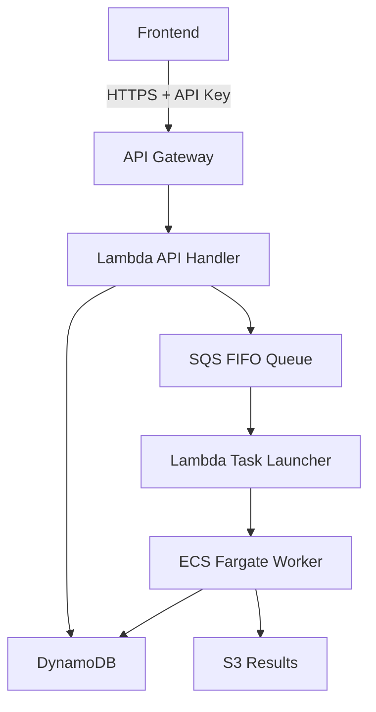

## 개요

AI 시스템을 운영 환경에 배포할 때 가장 큰 고민 중 하나는 <strong>인프라 비용</strong>입니다. 특히 배치 처리 특성의 AI 워크로드는 상시 서버가 필요 없지만, 작업 실행 시에는 충분한 컴퓨팅 리소스가 필요합니다.

이 글에서는 실제 프로젝트에서 구축한 <strong>서버리스 AI 배치 시스템</strong>의 아키텍처를 분석하고, Terraform을 활용한 인프라 관리의 장점을 살펴봅니다.

## 아키텍처 설계

### 전체 구조



### 핵심 컴포넌트

| 컴포넌트 | 역할 | 비용 특성 |
|---------|------|----------|
| API Gateway | REST API 엔드포인트 | 요청당 과금 |
| Lambda | 작업 생성/실행 트리거 | 실행 시간당 과금 |
| SQS FIFO | 작업 대기열 관리 | 거의 무료 |
| ECS Fargate | AI 워커 실행 | 실행 시간당 과금 |
| DynamoDB | 상태 관리 | On-Demand 과금 |
| S3 | 결과 저장 | 저장 용량당 과금 |

## Terraform의 장점

### 1. LLM과의 뛰어난 친화성

Terraform의 HCL(HashiCorp Configuration Language)은 <strong>선언적이고 구조화된 문법</strong>을 가지고 있어 LLM이 코드를 생성하고 이해하기 매우 쉽습니다.

```hcl
# LLM이 생성하기 쉬운 명확한 구조
resource "aws_lambda_function" "api_handler" {
  function_name = "ai-batch-api-handler"
  runtime       = "python3.11"
  handler       = "main.lambda_handler"
  memory_size   = 256
  timeout       = 30

  environment {
    variables = {
      DYNAMODB_TABLE = aws_dynamodb_table.jobs.name
      SQS_QUEUE_URL  = aws_sqs_queue.tasks.url
    }
  }
}
```

2025년 현재, Claude나 GPT-4 같은 LLM들은 Terraform 코드 생성에서 <strong>거의 프로덕션 수준</strong>의 결과물을 만들어냅니다. 자연어로 요구사항을 설명하면 완성도 높은 IaC 설정을 얻을 수 있습니다.

### 2. 인프라 상태 관리

Terraform의 State 파일은 실제 인프라와 코드 사이의 <strong>정합성을 보장</strong>합니다.

```bash
# 현재 인프라 상태 확인
terraform show

# 변경 사항 미리보기
terraform plan

# 안전한 적용
terraform apply
```

### 3. 재현 가능한 환경

동일한 Terraform 코드로 <strong>개발/스테이징/프로덕션</strong> 환경을 일관되게 구축할 수 있습니다.

```hcl
# variables.tf
variable "environment" {
  description = "배포 환경"
  type        = string
  default     = "dev"
}

variable "allowed_ips" {
  description = "허용할 IP 주소 목록"
  type        = list(string)
  default     = []
}
```

## 쉘 스크립트 기반 운영

### 배포 자동화

복잡한 배포 과정을 단일 스크립트로 추상화합니다.

```bash
#!/bin/bash
# deploy.sh
set -e

echo "=== AI System Deployment ==="

# 환경변수 로드
source .env

# 1. Docker 이미지 빌드 & 푸시
cd workers/image_alt_generator
docker build -t ai-batch-worker:latest .
aws ecr get-login-password --region ${AWS_REGION} | \
    docker login --username AWS --password-stdin ${ECR_REGISTRY}
docker push ${ECR_REGISTRY}/ai-batch-worker:latest

# 2. Terraform 인프라 배포
cd ../../terraform
terraform apply -auto-approve \
    -var="allowed_ips=${ALLOWED_IPS}" \
    -var="environment=prod"

# 3. 결과 출력
echo "API Endpoint: $(terraform output -raw api_endpoint)"
echo "API Key: $(terraform output -raw api_key)"
```

### 모니터링 스크립트

```bash
#!/bin/bash
# monitor.sh

# 실행 중인 ECS Task 확인
aws ecs list-tasks --cluster ai-batch-cluster

# CloudWatch 로그 실시간 확인
aws logs tail /ecs/ai-batch/worker --follow

# DynamoDB 작업 상태 조회
aws dynamodb scan --table-name ai-batch-jobs \
    --filter-expression "#s = :status" \
    --expression-attribute-names '{"#s": "status"}' \
    --expression-attribute-values '{":status": {"S": "RUNNING"}}'
```

## 비용 최적화 전략

### 서버리스 아키텍처의 비용 이점

| 시나리오 | EC2 상시 운영 | 서버리스 |
|---------|-------------|---------|
| 월 10,000 작업 | ~$150 | ~$21 |
| 월 1,000 작업 | ~$150 | ~$5 |
| 월 100 작업 | ~$150 | ~$1 |

배치 작업 특성상 <strong>사용한 만큼만 과금</strong>되는 서버리스 모델이 압도적으로 유리합니다.

### Fargate Spot 활용

```hcl
resource "aws_ecs_service" "worker" {
  # ...

  capacity_provider_strategy {
    capacity_provider = "FARGATE_SPOT"
    weight           = 1
    base             = 0
  }
}
```

Fargate Spot을 사용하면 <strong>최대 70% 비용 절감</strong>이 가능합니다. AI 배치 작업은 대부분 재시도가 가능하므로 Spot 인스턴스에 적합합니다.

## 알림 및 Notion 연계

### Slack 알림 통합

```python
# lambda/notifier/main.py
import boto3
import requests

def notify_job_completion(job_id, status, result_url=None):
    webhook_url = os.environ['SLACK_WEBHOOK_URL']

    message = {
        "blocks": [
            {
                "type": "section",
                "text": {
                    "type": "mrkdwn",
                    "text": f"*작업 완료 알림*\n"
                           f"Job ID: `{job_id}`\n"
                           f"Status: {status}"
                }
            }
        ]
    }

    if result_url:
        message["blocks"].append({
            "type": "actions",
            "elements": [{
                "type": "button",
                "text": {"type": "plain_text", "text": "결과 다운로드"},
                "url": result_url
            }]
        })

    requests.post(webhook_url, json=message)
```

### Notion 데이터베이스 연동

작업 결과를 Notion 데이터베이스에 자동 기록하여 <strong>프로젝트 관리와 통합</strong>합니다.

```python
from notion_client import Client

def log_to_notion(job_data):
    notion = Client(auth=os.environ["NOTION_TOKEN"])

    notion.pages.create(
        parent={"database_id": os.environ["NOTION_DATABASE_ID"]},
        properties={
            "작업 ID": {"title": [{"text": {"content": job_data["job_id"]}}]},
            "상태": {"select": {"name": job_data["status"]}},
            "처리 시간": {"number": job_data["duration_seconds"]},
            "완료 시각": {"date": {"start": job_data["completed_at"]}}
        }
    )
```

## 확장성 고려

### 새로운 AI Worker 추가

```
workers/
├── image_alt_generator/    # 이미지 Alt Text 생성
├── meta_desc_generator/    # 메타 설명 생성
└── content_analyzer/       # 콘텐츠 분석
```

새로운 Worker 추가 시:

1. Worker 디렉토리 생성 및 코드 작성
2. `terraform/ecs.tf`에 Task Definition 추가
3. `terraform/sqs.tf`에 전용 큐 추가
4. Lambda 큐 매핑 업데이트
5. `./deploy.sh` 실행

Terraform의 모듈화 덕분에 <strong>새로운 서비스 추가가 매우 간단</strong>합니다.

## 실전 적용 결과

### 운영 지표

- <strong>배포 시간</strong>: 수동 30분 → 자동 5분
- <strong>인프라 비용</strong>: EC2 기준 대비 85% 절감
- <strong>장애 복구</strong>: State 파일 기반 즉시 재구축 가능
- <strong>코드 리뷰</strong>: IaC로 인프라 변경 사항 PR 리뷰 가능

### 교훈

1. <strong>HCL은 학습 곡선이 낮다</strong>: JSON/YAML 대비 가독성이 뛰어남
2. <strong>LLM 활용이 핵심</strong>: 복잡한 리소스 설정도 자연어로 요청 가능
3. <strong>쉘 스크립트로 추상화</strong>: 복잡한 명령어를 단순화
4. <strong>State 관리 중요</strong>: S3 + DynamoDB Lock 필수

## 결론

Terraform을 활용한 서버리스 AI 배치 시스템은 다음과 같은 이점을 제공합니다:

- <strong>비용 효율성</strong>: 사용량 기반 과금으로 배치 작업에 최적
- <strong>LLM 친화적</strong>: AI 도구로 인프라 코드 생성 및 관리 용이
- <strong>운영 편의성</strong>: 쉘 스크립트로 복잡한 작업 자동화
- <strong>확장성</strong>: 모듈화된 구조로 새로운 서비스 추가 간편

AI 시스템 구축 시 초기부터 IaC를 도입하면 <strong>장기적인 운영 효율성</strong>을 크게 높일 수 있습니다.

## 참고 자료

- [AWS Fargate Terraform 배포 가이드](https://aws.amazon.com/blogs/developer/provision-aws-infrastructure-using-terraform-by-hashicorp-an-example-of-running-amazon-ecs-tasks-on-aws-fargate/)
- [HashiCorp - Deploying Serverless AI Agents](https://www.hashicorp.com/en/resources/deploying-serverless-ai-agents-on-aws-with-terraform-and-securing-them-with-hcp-v)
- [LLM을 활용한 Terraform 코드 생성](https://terrateam.io/blog/using-llms-to-generate-terraform-code)
