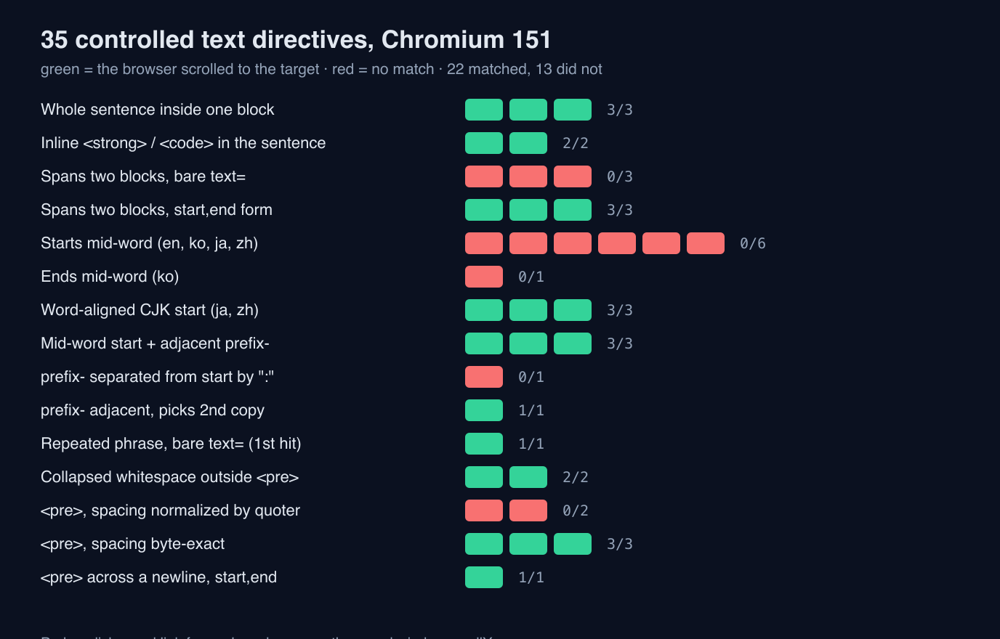

당신 글의 한 문장이 어딘가에서 인용됐다고 하자. 인용문 옆에는 출처 링크가 붙는다. 그 링크를 누른 독자는 어디에 도착하는가. 페이지 맨 위에 떨어져 3,000자 중에서 그 문장을 눈으로 찾아야 한다면, 인용은 됐지만 되돌아오는 길은 없는 셈이다.

브라우저에는 이 간극을 메우는 장치가 이미 들어와 있다. URL 끝에 `#:~:text=` 를 붙이면 브라우저가 그 문자열을 페이지에서 찾아 스크롤하고 하이라이트한다. 나는 이 장치가 내 사이트에서 얼마나 통하는지 몰랐다. 그래서 빌드 산출물에서 문장 69개를 뽑아 실제 링크로 만들고, 크로미움에서 하나씩 눌러 도착 여부를 기록했다. 55개가 도착했다. 실패한 14개는 전부 한 군데에 몰려 있었다.

## 문장으로 가는 주소는 어떤 규칙 위에 서 있나

먼저 토대부터 정리한다. 우리가 20년 넘게 써 온 `#section-id` 는 저자가 미리 붙여 둔 앵커에만 걸린다. 저자가 `id` 를 붙이지 않은 문단은 주소가 없다. 텍스트 프래그먼트는 이 전제를 뒤집는다. 저자의 협조 없이도 <strong>본문 문자열 자체를 주소로 삼는다</strong>. 형식은 이렇다.

```text
https://example.com/page#:~:text=prefix-,start,end,-suffix
```

`start` 만 필수다. `end` 를 주면 시작 문자열부터 끝 문자열까지의 범위가 대상이 되고, `prefix-` 와 `-suffix` 는 매칭할 위치를 좁히는 문맥이다. `#:~:` 는 프래그먼트 디렉티브 구분자라 서버로도, 스크립트의 `location.hash` 로도 넘어가지 않는다.

표준화 상태는 정직하게 적어 둔다. 이 기능의 명세는 [URL Fragment Text Directives](https://wicg.github.io/scroll-to-text-fragment/)이고, 문서 스스로 "Draft Community Group Report"이며 W3C 표준도, W3C 표준화 트랙도 아니라고 밝힌다. 다만 죽은 문서는 아니다. WHATWG HTML 표준으로 흡수하려는 [pull request #11895](https://github.com/whatwg/html/pull/11895)가 2025년 11월 9일에 열려 있고, 2026년 7월까지도 커밋이 이어졌다. 아직 draft 상태다. 크로미움이 구현했고, 웹킷은 Safari 18.2 릴리스 노트로 구현을 알렸으며, Gecko의 입장은 논의 중이라고 그 PR에 적혀 있다.

그러니까 이건 "언젠가 올 기능"이 아니라 이미 주요 엔진에 들어와 돌아가는 기능이고, 표준 문서의 자리를 옮기는 중인 기능이다. 내가 관심 있는 부분은 여기다. 이 주소 체계가 있으면, 어떤 도구든 내 글의 문장을 인용하면서 그 문장으로 정확히 되돌려 보내는 링크를 만들 수 있다. 문제는 그 링크가 항상 도착하지는 않는다는 것이다.

## 블록을 넘는 순간 인용은 링크가 되지 못한다

명세가 가장 분명하게 못 박는 제약이 블록 경계다. [매칭 절차 설명](https://wicg.github.io/scroll-to-text-fragment/)에 이렇게 적혀 있다.

> While the matching text and its prefix/suffix can span across block-boundaries, the individual parameters to these steps cannot.

즉 `start` 하나가 두 블록에 걸치면 매칭은 실패한다. 나는 이 문장을 읽고 넘어가지 않고 통제된 페이지를 만들어 확인했다. 4,000픽셀짜리 여백 아래에 대상 블록들을 배치하고, 별도의 발사대 페이지에서 링크를 <strong>실제로 클릭</strong>한 뒤 `window.scrollY` 를 읽는 방식이다. 클릭으로 이동하는 이유는 명세가 텍스트 디렉티브를 사용자 행위에 따른 내비게이션으로 제한하기 때문이다. 스크롤이 0이 아니면 브라우저가 대상을 찾았다는 뜻이다.



결과는 명세대로였고, 실무에 걸리는 지점이 셋 나왔다.

| 인용 형태 | 마크업 | 결과 |
| --- | --- | --- |
| 문단 하나 안의 한 문장 | `<p>` | 매칭 |
| 소제목 + 그 아래 첫 문장 | `<h2>` + `<p>` | 실패 |
| 목록 항목 두 개를 이어 붙임 | `<li>` + `<li>` | 실패 |
| 위 두 경우를 `start,end` 로 나눠 지정 | 같음 | 매칭 |
| 문장 안의 `<strong>`·`<code>` | 인라인 요소 | 매칭 |

인라인 요소가 문제되지 않는다는 점은 안심해도 좋다. 문장 중간에 강조나 인라인 코드가 끼어 있어도 매칭은 그대로 된다. 반면 소제목과 본문을 이어 인용하는 형태는 실패한다. 이건 흔한 형태다. 요약을 만드는 도구는 "제목: 첫 문장"을 한 덩어리로 뽑는 경향이 있는데, 그렇게 뽑힌 문자열은 바로 그 이유로 링크가 되지 못한다. 목록 항목 두 개를 이어 붙인 인용도 마찬가지다.

빠져나갈 길은 있다. `start,end` 형식은 두 파라미터가 각각 자기 블록 안에서만 매칭되면 되므로 블록을 건너뛴다. `text=Measurement setup,probe twelve times` 는 매칭됐다. 이건 링크를 <strong>직접 만드는 쪽</strong>이 쓸 수 있는 방법이고, 인용문을 통째로 붙여 넣는 자동 생성기에는 해당되지 않는다.

## 단어 경계는 언어 문제가 아니라 분절 문제다

두 번째 제약은 단어 경계다. 명세는 `prefix` 가 없을 때 시작 지점이 단어 경계여야 한다고 규정하고, 예시까지 붙여 뒀다. 질의 "range"는 "mountain range"에서는 매칭되지만 "color orange"에서는 매칭되지 않는다는 것이다. 실제로 그랬다. `text=range is wide` 는 "The color orange is wide"에서 실패했다.

여기서 다국어 사이트 운영자가 궁금해할 질문이 나온다. 띄어쓰기가 없는 일본어와 중국어는 어떻게 되는가. 명세는 단어 경계를 [UAX #29](https://www.unicode.org/reports/tr29/)에 위임하고, 로케일에 맞는 더 정교한 알고리즘을 쓰라고 권고하며, 단어를 나누는 문자가 없는 로케일에서는 사전 기반 분절에 주의하라고 일본어를 명시해 경고한다. 규정으로는 여기까지다. 실제 동작은 브라우저 구현에 달려 있어서, 직접 쟀다.

| 인용 시작 지점 | 예 | 결과 |
| --- | --- | --- |
| 한국어 어절 경계 | `구조화 데이터를 서버에서` | 매칭 |
| 한국어 어절 중간 | `화 데이터를 서버에서` | 실패 |
| 한국어 어절 중간에서 끝냄 | `구조화 데이터를 서버에` | 실패 |
| 일본어 분절 경계 | `データを`, `構造化データをサーバー` | 매칭 |
| 일본어 분절 중간 | `造化データを`, `ーバー側で出力` | 실패 |
| 중국어 분절 경계 | `结构化数据` | 매칭 |
| 중국어 분절 중간 | `构化数据在服务` | 실패 |

읽어야 할 결론은 "CJK가 안 된다"가 아니다. 정반대다. 분절 경계에서 시작하면 네 언어 모두 잘 된다. 실패는 언어 종류가 아니라 <strong>인용을 어디서 자르느냐</strong>에서 나온다. 크로미움은 한자·가나 연속체를 한 글자 단위로 흩어 놓지 않고 덩어리로 잡고 있었다. 브라우저 내부 구현을 단정할 생각은 없지만, 관측된 동작은 사전 기반 분절과 일치했다.

이 제약도 빠져나갈 길이 명세 안에 있다. 앞에 `prefix-` 를 붙이면 시작 쪽 단어 경계 요구가 사라진다. `text=구조-,화 데이터를 서버에서` 는 매칭됐고, `text=结-,构化数据在服务` 도 매칭됐다. 단, `prefix` 는 `start` 에 붙어 있어야 한다. 사이에 공백 말고 다른 글자가 끼면 실패한다. 실제 본문이 "Second: the same sentence"일 때 `text=Second-,the same sentence twice` 는 실패했고, 콜론까지 포함한 `text=Second:-,the same sentence twice` 는 매칭됐다.

## 내 사이트 24장을 실제 브라우저로 확인했다

통제된 실험은 규칙을 확인해 줄 뿐, 내 글이 실제로 어떤지는 말해 주지 않는다. 그래서 프로덕션 빌드를 대상으로 감사 스크립트를 만들었다. 절차는 두 단계다.

먼저 정적 판정을 한다. 각 페이지에서 잎 블록(다른 블록을 품지 않는 `p`·`li`·`h1`~`h6`·`td`·`pre` 등)의 텍스트를 뽑아 문장으로 자르고, 각 문장에 대해 세 가지를 본다. 페이지 전체 텍스트에서 몇 번 나오는가, 시작과 끝이 단어 경계에 놓이는가(`Intl.Segmenter` 를 해당 로케일로 돌려 판정), 그리고 블록 하나 안에 온전히 들어가는가.

그다음 브라우저 검증이다. 판정된 문장 중 일부를 실제 URL로 만들어 로컬 서버에 올린 빌드에 클릭으로 접속하고, 앞의 실험과 같은 방식으로 스크롤을 읽는다. 정적 판정이 브라우저 실제 동작과 어긋나는 지점을 잡기 위한 단계다.

표본은 ko/ja/en/zh 각 6장, 총 24장이다. 정렬된 경로에서 일정 간격으로 뽑아 재현 가능하게 했다.

| 언어 | 페이지 | 잎 블록 | 길이 조건을 넘긴 문장 | 페이지 내 중복 문장 | 단어 경계 불일치 |
| --- | --- | --- | --- | --- | --- |
| ko | 6 | 1,163 | 495 | 14 | 0 |
| ja | 6 | 1,196 | 617 | 14 | 0 |
| en | 6 | 1,163 | 378 | 7 | 0 |
| zh | 6 | 1,205 | 476 | 5 | 0 |

단어 경계 불일치가 네 언어 모두 0이라는 결과는 처음엔 김이 빠졌다. 곱씹어 보면 당연하다. 문장 단위로 자르면 시작과 끝이 문장 부호에 붙으므로 경계는 자동으로 맞는다. 앞 절에서 본 실패들은 <strong>문장이 아니라 문장 조각을 인용할 때</strong> 나오는 것이다. 요약 도구가 문장 중간에서 잘라 인용하는 습관이 있다면 그 인용은 링크가 되기 어렵다. 반대로 문장을 통째로 인용하는 도구라면 이 축은 걱정하지 않아도 된다.

브라우저 검증은 69개 디렉티브를 돌렸고 55개가 도착했다.

| 인용 대상 | 개수 | 도착 |
| --- | --- | --- |
| 페이지에 한 번만 나오는 산문 문장 | 48 | 48 |
| 페이지에 두 번 이상 나오는 산문 문장 | 6 | 6 |
| 코드 블록(`pre`) 안의 텍스트 | 15 | 1 |

## 코드 블록만 통째로 끊겼다

실패 14개가 전부 코드 블록이다. 산문에서는 한 건도 실패하지 않았다. 이 편중이 이 감사에서 건진 가장 쓸모 있는 결과다.

원인은 공백이다. 통제된 실험으로 분리해 확인했다. 일반 문단에서는 매칭 시 공백이 접힌다. 원본이 `two  spaces here`(공백 두 칸)여도 `text=two spaces here`(한 칸)로 매칭됐고, 마크업 안의 줄바꿈도 문제가 되지 않았다. `pre` 안에서는 접히지 않는다. 원본이 `label     value`일 때 `text=label value` 는 실패했고, 공백 개수를 그대로 맞춘 `text=label     value` 는 매칭됐다. 줄바꿈도 마찬가지여서, 두 줄에 걸친 인용은 바 형식으로는 실패하고 `start,end` 로 나누면 매칭됐다.

문제는 인용문을 만드는 쪽이 거의 예외 없이 공백을 정규화한다는 데 있다. 실제로 실패한 사례들을 보면 정렬용 공백이 들어간 출력 로그, 여러 줄에 걸친 JSON 설정, 박스 드로잉 문자로 그린 다이어그램이었다. 도착한 코드 블록은 딱 하나였는데, 한 줄짜리에 공백이 전부 한 칸인 명령어였다. 규칙이 그대로 드러난다. <strong>여러 줄이거나 정렬 공백이 있는 코드는 인용 링크의 대상이 되지 못한다.</strong>

그래서 나는 코드 블록을 인용 가능하게 만들려는 시도를 접었다. 대신 다른 결론을 택했다. <strong>인용의 단위는 산문이다.</strong> 코드가 무엇을 증명하는지는 코드 옆의 한 문장이 말해야 한다. 그 문장은 블록 하나 안에 온전히 들어가고, 문장 부호로 시작과 끝이 정리되며, 공백이 접히는 영역에 있다. 세 조건이 자동으로 충족된다. 마크업으로 무언가를 더 하는 것보다 이쪽이 확실하다. [표를 텍스트로 환원할 때 행이 사라지는 문제](/ko/blog/ko/table-markup-a11y-llm-extraction-2026)를 쟀을 때도 결론의 형태는 비슷했다. 기계가 평문으로 접는 경로를 통과하지 못하는 정보는 그 경로 밖에 사본을 두어야 한다.

## 같은 문장이 두 번 있으면 링크는 첫 번째로 간다

중복 문장 6개는 전부 도착했다. 그런데 이건 좋은 소식이 아니다. `prefix` 없는 바 디렉티브는 <strong>첫 번째 일치 지점</strong>으로 간다. 통제된 실험에서도 같은 문장을 두 번 넣은 페이지는 항상 앞의 것으로 스크롤했다. 도착은 하지만 인용자가 가리킨 곳이 아닐 수 있다.

그 중복 문장들의 정체를 확인하고 조금 부끄러웠다. 내 사이트의 관련 글 추천 문구였다.

```text
2회  ko  자동화, AI/ML, 아키텍처 분야에서 유사한 주제를 다루며 비슷한 난이도입니다.
3회  en  Covers similar topics in automation with comparable difficulty.
2회  ja  自動化、AI/ML、アーキテクチャ分野で類似したトピックを扱い、同程度の難易度です。
```

추천 이유를 글마다 고유하게 쓰라는 규칙을 나 자신이 몇 해 전 글들에서 지키지 않은 결과다. 같은 문장이 한 페이지에 세 번 있으면 그 문장은 주소로서 쓸모가 없다. 접근성이나 SEO 관점의 지적이 아니라, 문자열이 주소가 되는 세계에서는 <strong>중복 문장이 곧 모호한 주소</strong>라는 새로운 이유가 하나 더 붙은 것이다. 정형 문구는 페이지 안에서 반복될수록 값이 떨어진다.

## 여기까지가 내가 잰 범위다

한계를 분명히 해 둔다.

매칭 여부는 `window.scrollY` 로 판정했다. 하이라이트 자체를 읽은 것이 아니라 스크롤이 일어났는지를 본 것이므로, 대상이 이미 화면 안에 있는 경우는 판정할 수 없다. 그래서 모든 대상을 4,000픽셀 아래에 두었다.

엔진은 크로미움 151.0.7922.34 하나다. 웹킷과 Gecko의 구현은 재지 않았다. 단어 경계 판정에 쓴 `Intl.Segmenter` 가 크로미움 내부 분절기와 같다는 보장도 없다. 두 결과가 어긋나지 않았다는 것까지가 내가 확인한 전부다.

그리고 가장 중요한 한계. <strong>GPTBot이나 Google이 실제로 이 형식의 링크를 만들어 내보내는지는 나는 모른다.</strong> 공개된 문서도 없고 관측도 하지 않았다. [AI 크롤러가 자바스크립트를 실행하지 않는다는 것](/ko/blog/ko/ai-crawlers-dont-render-javascript-csr-2026)은 요청을 직접 보내 확인할 수 있었지만, 인용 링크의 생성 규칙은 그렇게 관측할 대상이 아니다. 이 글이 답한 질문은 "그런 링크가 만들어진다면 내 사이트에서 도착하는가"이지 "그런 링크가 만들어지는가"가 아니다. 인용 가능성이 순위에 영향을 준다는 주장도 하지 않는다. 텍스트 프래그먼트는 내비게이션 장치이고 랭킹 신호로 발표된 적이 없다.

## 정리: 인용 단위를 블록 하나에 담아라

문서를 쓰는 쪽에서 할 일은 다섯 가지다.

- <strong>주장 한 개를 문장 한 개에, 그 문장을 블록 한 개에 담는다.</strong> 소제목과 본문 첫 문장에 주장을 쪼개 놓으면 그 주장은 인용은 되어도 주소를 갖지 못한다.
- <strong>코드가 말하는 바를 코드 옆 산문으로 한 번 더 적는다.</strong> `pre` 안은 공백이 접히지 않아 인용 링크의 사각지대다.
- <strong>페이지 안에서 같은 문장을 반복하지 않는다.</strong> 관련 글 문구, 안내 문구 같은 정형 텍스트가 특히 위험하다. 바 디렉티브는 첫 번째 일치로 간다.
- <strong>본문 페이지에 `force-load-at-top` 문서 정책을 켜지 않는다.</strong> 명세상 이 정책은 프래그먼트 스크롤 자체를 막는다.
- <strong>링크를 직접 생성한다면 `prefix-` 와 `start,end` 를 쓴다.</strong> 앞의 두 제약을 명세 범위 안에서 우회하는 정식 수단이다.

감사 스크립트는 `scripts/audit-text-fragments.mjs` 로 저장소에 넣어 뒀다. `npm run build` 뒤에 `node scripts/audit-text-fragments.mjs` 로 돌리면 언어별 집계와 브라우저 검증 결과가 나온다. 표본 수와 프로브 수는 인자로 조절할 수 있다.

문서를 기계가 인용하고 되짚어 갈 수 있는 형태로 설계하는 일은 내가 업으로 다루는 영역이다. 물어볼 것이 있으면 [문의 페이지](/ko/contact/)로 편하게 적어 보내도 좋다.

---

*출처: WICG의 [URL Fragment Text Directives](https://wicg.github.io/scroll-to-text-fragment/)(Draft Community Group Report, W3C 표준 아님), WHATWG HTML의 [pull request #11895](https://github.com/whatwg/html/pull/11895)(2025년 11월 9일 개설, draft 상태), Unicode의 [UAX #29](https://www.unicode.org/reports/tr29/)(모두 공식). 블록 경계 규칙은 명세 원문을 축자로 옮겼고, 나머지 규정 내용은 요약해 옮긴 뒤 링크로 대신했다. 측정 환경: jangwook.net 프로덕션 빌드(HTML 1,362장) 중 표본 24장(언어별 6장), Playwright 1.57 + Chromium 151.0.7922.34 헤드리스, Node 22.22, 뷰포트 1280×800, 로컬 정적 서버, 2026년 8월 8일 측정. 통제 실험은 별도 픽스처 35건. 스크립트는 `scripts/audit-text-fragments.mjs`. 모든 수치는 이 브라우저 엔진·이 표본에서 나온 값이며, 다른 엔진의 매칭 동작이나 특정 AI 크롤러의 링크 생성 동작에 대한 진술이 아니다.*
