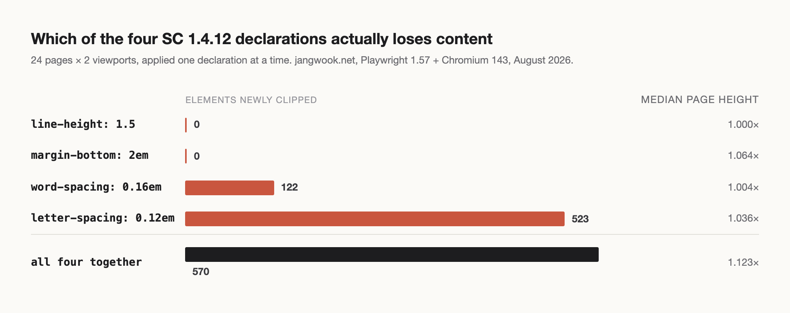
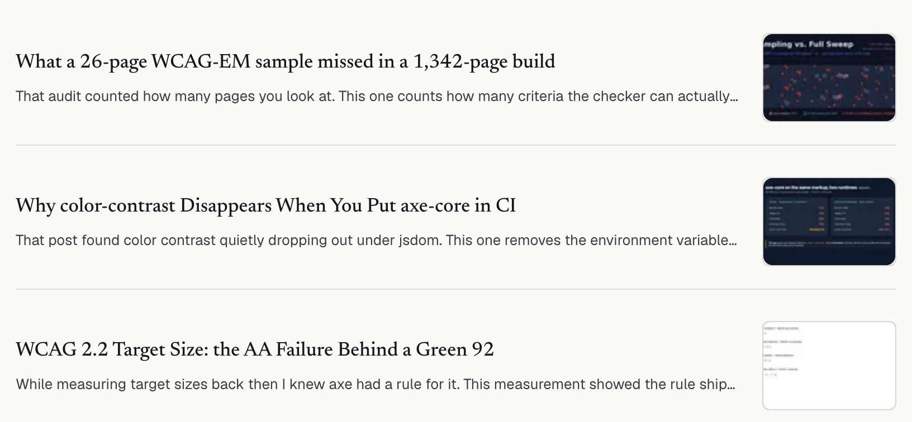

브라우저 콘솔에 한 줄을 붙여 넣었다.

```js
document.body.style.setProperty('letter-spacing', '0.12em', 'important')
```

내 블로그 목록 페이지에서 카드 세 장의 발췌문 끝이 그 자리에서 사라졌다. 말줄임표가 한 칸 앞으로 당겨졌고, 문장은 서술어를 잃은 채 끊겼다. 10분 전에 같은 페이지에 접근성 검사기를 돌렸고, 이 성공기준에 대해 위반 0건을 받았다.

두 결과 모두 맞다. 그게 이 글의 출발점이다.

## 검사기가 읽는 것과 기준이 요구하는 것

WCAG 2.2의 성공기준 1.4.12 Text Spacing은 레벨 AA다. 요구사항은 네 개의 값으로 되어 있다. 줄 높이는 글꼴 크기의 1.5배 이상, 문단 뒤 간격은 2배 이상, 자간은 0.12배 이상, 단어 간격은 0.16배 이상. 사용자가 이 네 값을 직접 설정했을 때 <strong>콘텐츠나 기능의 손실이 없어야 한다</strong>는 것이 기준의 본문이다.

여기서 "손실"이 무엇인지가 중요하다. [W3C의 Understanding 문서](https://www.w3.org/WAI/WCAG22/Understanding/text-spacing.html)는 실패 유형을 그림으로 보여준다. 텍스트가 세로로 잘리는 경우, 가로로 잘리는 경우, 다음 문장과 겹쳐서 읽을 수 없게 되는 경우. 반대로 말줄임 처리 자체는 실패가 아니라고 명시한다. 잘린 텍스트를 드러낼 수단이 제공되면 허용된다. 이 단서 하나가 뒤에서 이 글의 결론을 가른다.

왜 이 기준이 존재하는지도 짚어둘 만하다. 난독증이나 저시력, 일부 인지 장애가 있는 독자는 줄이 빽빽하면 다음 줄을 찾는 데 실패한다. 방금 읽은 줄로 눈이 되돌아간다. 그래서 이들은 브라우저 확장이나 사용자 스타일시트로 간격을 강제로 벌려 읽는다. 1.4.12는 "간격을 벌려주라"는 요구가 아니다. <strong>독자가 스스로 벌렸을 때 네 사이트가 버티느냐</strong>를 묻는 기준이다. 저자가 할 일은 간격 설정이 아니라 여백 확보다.

그럼 자동 검사기는 이걸 어떻게 판정할까. axe-core에서 1.4.12에 대응하는 규칙은 `avoid-inline-spacing` 하나다. Deque가 공개한 규칙 설명은 이렇다. "Ensure that text spacing set through style attributes can be adjusted with custom stylesheets." 인라인 `style` 속성으로 지정한 간격을 사용자 스타일시트가 덮어쓸 수 있는지 확인한다는 뜻이다. 실제로 이 규칙은 `style="line-height: 1.2 !important"` 같은 인라인 선언을 찾는다.

그 이상은 하지 않는다. 간격을 적용해보지 않고, 적용한 뒤의 레이아웃도 보지 않는다.

내 사이트에 이 규칙만 돌린 결과다.

```
axe-core 4.13.0  ·  runOnly: avoid-inline-spacing
24 pages
violations: 0   passes: 24   incomplete: 0   inapplicable: 0
```

24장 전부 통과다. 인라인 style로 간격을 고정한 적이 없으니 당연하다. 규칙은 제 일을 정확히 했다.

[어제 글에서 W3C의 ACT 테스트 케이스 1,213장으로 axe의 사정거리를 쟀을 때](/ko/blog/ko/act-rules-axe-coverage-wcag-sc-2026), 1.4.12는 14건 중 13건이 잡혀 오히려 커버리지가 좋은 쪽에 있었다. 그 숫자는 정직했다. 다만 그 13건은 전부 인라인 style 예제였다. 정답지가 묻는 것과 실제 사이트가 겪는 것이 다른 종류의 문제였다는 뜻이다.

## 네 줄을 한 줄씩 따로 걸었다

그래서 규칙 대신 기준을 그대로 적용하는 스크립트를 짰다. `scripts/audit-text-spacing.mjs`다. 하는 일은 단순하다. Playwright로 페이지를 열고, 기준선 상태에서 모든 요소의 기하 정보를 기록하고, 네 값을 `!important`로 주입한 뒤 다시 기록해서 차이를 본다.

손실 판정은 세 갈래로 했다.

- `overflow: hidden` 또는 `clip`인 상자에서 `scrollHeight`가 `clientHeight`를 넘어선 요소
- `-webkit-line-clamp`가 걸린 상자에서 숨겨진 줄 수가 늘어난 요소
- 문서 전체에 가로 스크롤이 새로 생긴 페이지

표본은 24개 URL이다. 네 언어의 홈, 글 목록, 정적 페이지, 본문 페이지, 404를 섞었다. 뷰포트는 데스크톱 1280×800과 모바일 390×844 두 가지, 합쳐서 48개 화면이다.

네 값을 전부 걸었을 때 결과는 이렇다.

| 지표 | 값 |
|---|---|
| 새로 잘린 요소 | 570개 |
| 클램프에서 줄을 더 잃은 요소 | 1,438개 |
| 손실이 발생한 화면 | 48개 중 29개 |
| 가로 스크롤이 새로 생긴 페이지 | 0개 |
| 페이지 높이 증가 | 최소 1.006배, 중앙값 1.123배, 최대 1.487배 |

가로 스크롤 0은 반가운 숫자였다. 유동 레이아웃이라 자간이 벌어져도 문서 폭은 버텼다. 문제는 전부 상자 안쪽에서 일어났다.

그런데 570라는 총계만으로는 무엇을 고쳐야 할지 알 수 없다. 네 값 중 어느 것이 범인인지 모르기 때문이다. 그래서 한 번에 하나씩만 걸고 네 번 더 돌렸다.



| 선언 | 새로 잘린 요소 | 잃은 클램프 줄 | 페이지 높이 중앙값 |
|---|---|---|---|
| `line-height: 1.5` | 0 | 0 | 1.000배 |
| `margin-bottom: 2em` (문단 뒤) | 0 | 0 | 1.064배 |
| `word-spacing: 0.16em` | 122 | 225 | 1.004배 |
| `letter-spacing: 0.12em` | 523 | 1,316 | 1.036배 |
| 네 개 전부 | 570 | 1,438 | 1.123배 |

숫자가 한쪽으로 완전히 쏠렸다. 세로 방향 선언 두 개는 <strong>단 한 건의 손실도 만들지 않았다</strong>. 손실은 전부 가로 방향 선언 두 개에서 나왔고, 그중 자간 하나가 523건으로 전체의 92%를 차지했다.

## 늘어나는 축과 잘리는 축이 다르다

이 결과를 처음 봤을 때 순서를 잘못 짚고 있었다는 걸 알았다.

1.4.12를 설명하는 글은 대부분 줄 높이 1.5부터 시작한다. 나도 그렇게 이해하고 있었다. 그런데 줄 높이를 1.5로 올리면 무슨 일이 일어나는가. 줄 사이가 벌어지고, 그만큼 문단이 길어지고, 페이지가 아래로 늘어난다. `-webkit-line-clamp`가 걸린 상자도 함께 늘어난다. 클램프 상자의 높이는 줄 수 곱하기 줄 높이로 계산되기 때문이다. 세 줄은 여전히 세 줄이다. 보이는 글자 수는 그대로다.

문단 뒤 간격도 같다. 페이지 높이 중앙값을 1.064배로 밀어 올렸지만 손실은 0건이다. 세로로 밀리는 것은 스크롤이 흡수한다.

자간은 다르다. 0.12em은 글자 하나당 폭이 늘어난다는 뜻이고, 한 줄에 들어가는 글자 수가 줄어든다는 뜻이다. 세 줄짜리 클램프 상자는 여전히 세 줄이지만, 그 세 줄이 담는 내용이 줄어든다. 상자는 그대로인데 내용물이 부풀어서 넘친다.

정리하면 이렇다. <strong>눈에 띄는 축과 콘텐츠를 잃는 축이 서로 다르다.</strong> 사용자 스타일시트를 켠 독자가 체감하는 건 "페이지가 길어졌다"이고, 실제로 사라지는 건 가로로 밀려난 문장의 끝부분이다. 그리고 QA에서 눈으로 훑을 때 알아채기 쉬운 쪽은 전자다.

여기서 측정 방법 하나를 더 확인해봐야 했다. 널리 쓰이는 텍스트 간격 북마클릿들은 `line-height: 1.5`를 그대로 쓴다. 그런데 내 본문은 이미 1.58로 잡혀 있다. 1.5를 강제로 덮어쓰면 그건 <strong>줄이는</strong> 동작이다. 실제로 줄 높이만 걸었을 때 페이지 높이 최솟값이 0.926배로 나왔다. 어떤 페이지는 7% 짧아졌다.

그래서 "1.5 미만인 요소만 1.5로 올린다"는 두 번째 방식으로 48개 화면을 다시 돌렸다. 결과는 새로 잘린 요소 570건, 잃은 줄 1,438건. 첫 번째 방식과 <strong>완전히 동일했다</strong>. 페이지 높이 중앙값만 1.123배에서 1.168배로 올라갔다. 줄 높이를 어떻게 해석하든 손실 수치는 움직이지 않았다. 줄 높이가 원인이 아니라는 증거가 하나 더 늘었다.

## 띄어쓰기가 있는 언어와 없는 언어

`word-spacing`만 걸었을 때의 122건을 언어별로 갈라 보니 예상하지 못한 그림이 나왔다.

| 언어 | 새로 잘린 요소 (데스크톱 / 모바일) |
|---|---|
| 일본어 | 1 / 1 |
| 중국어 | 3 / 4 |
| 한국어 | 40 / 15 |
| 영어 | 0 / 55 |

일본어와 중국어는 사실상 0이다. 이유는 명확하다. 두 언어는 단어 사이에 공백을 넣지 않으므로 `word-spacing`이 적용될 자리가 거의 없다. W3C의 Understanding 문서도 이 점을 짚어두었다. 해당 속성을 사용하지 않는 문자 체계는 존재하는 속성만으로 적합성을 만족할 수 있다는 예외가 있다.

한국어가 40건이다. 한국어는 CJK로 묶이지만 <strong>띄어쓰기를 쓴다</strong>. 단어 사이 공백이 실재하므로 `word-spacing`이 그대로 먹는다. W3C의 예외 조항은 일본어와 중국어에는 걸리고 한국어에는 걸리지 않는다.

다국어 사이트를 다루는 입장에서 이건 실무적으로 중요한 구분이다. "CJK는 word-spacing 영향 없음"이라고 한 덩어리로 처리하면 한국어 페이지에서 조용히 틀린다. 내가 그렇게 생각하고 있었다는 걸 이 표를 보고 알았다.

영어의 모바일 55건은 다른 사정이다. 영어 발췌문은 평균 168자로 네 언어 중 가장 길다. 390px 폭에서는 그 길이가 세 줄 클램프의 경계에 정확히 걸려 있었고, 단어 간격이 조금만 벌어져도 넘어간다. 데스크톱에서 0건이었던 것도 같은 이유다. 폭이 넓으면 여유가 있다.

`letter-spacing`은 언어를 가리지 않는다. 글자마다 붙기 때문이다. 한국어 데스크톱이 164건으로 가장 크게 맞았다.

## 잘라도 되는 문장과 안 되는 문장

여기까지는 기준 이야기다. 실제로 무엇을 고칠지는 다른 질문이었다.

측정 데이터에서 클램프가 걸린 컴포넌트는 세 종류였다. 각각에 대해 "상자가 자기 내용의 몇 퍼센트를 보여주고 있는가"를 기준선과 간격 적용 후로 나눠 봤다.

| 컴포넌트 | 관측 수 | 기준선 | 간격 적용 후 |
|---|---|---|---|
| 글 카드 발췌문 (`line-clamp: 3`) | 2,688 | 86.2% | 76.6% |
| 홈 최신글 발췌문 (`line-clamp: 2`) | 24 | 49.4% | 40.8% |
| 추천 사유 (`line-clamp: 1`) | 42 | <strong>35.1%</strong> | 30.7% |

세 번째 줄에서 멈췄다.

`.item-reason`은 관련 글 목록에 붙는 한 문장이다. "이 글을 읽었다면 저 글도 볼 만하다"를 매번 손으로 쓴다. 네 언어 각각에 대해 따로 쓴다. 평균 108자다. 그리고 이 문장은 <strong>사이트 어디에도 다시 나오지 않는다</strong>. 그 자리에만 있다.

한 줄 클램프가 그중 35%만 보여주고 있었다. 간격을 적용하기 전부터 그랬다.



이 발견은 1.4.12와 직접 관계가 없다. 텍스트 간격을 적용해서 생긴 문제가 아니라 처음부터 있던 문제다. 접근성 기준을 재려고 만든 계측기가 콘텐츠 버그를 물고 나왔다. 이런 일이 종종 있다. [표본 26장으로는 안 잡히던 위반을 전수 검사에서 찾았을 때](/ko/blog/ko/wcag-em-2-sampling-vs-full-sweep-audit-2026)도 비슷했다.

그리고 여기서 앞에서 미뤄둔 단서가 돌아온다. Understanding 문서는 말줄임을 실패로 보지 않되, <strong>잘린 텍스트를 드러낼 수단이 있을 때</strong>라는 조건을 붙였다. 이 조건으로 세 컴포넌트를 다시 보면 판정이 갈린다.

글 카드 발췌문은 클릭하면 원문이 나온다. 수단이 있다. 76.6%까지 떨어져도 이건 설계된 요약이지 손실이 아니다. 홈 발췌문도 같다.

추천 사유는 수단이 없다. 펼치는 버튼도 없고, 같은 문장이 실린 다른 페이지도 없다. 잘린 65%는 아무도 볼 수 없다. 이건 간격을 적용하기 전에도 손실이었다.

그래서 클램프를 늘리는 대신 없앴다.

```css
.item-reason {
  margin: 0;
  font-size: 0.8125rem;
  color: var(--ink-2);
  line-height: 1.5;
  /* 이 문장은 추천마다 따로 쓰고 다른 곳에 다시 나오지 않는다.
     여기서 자르면 드러낼 수단이 없으므로 자르지 않는다. */
}
```

`line-height`도 1.4에서 1.5로 올렸다. 이유는 앞의 분해 결과에서 나온다. <strong>저자가 잡은 줄 높이가 이미 기준의 1.5를 만족하면 사용자의 줄 높이 재정의가 상자를 줄일 수 없다.</strong> 1.4로 두면 1.5를 강제하는 사용자 앞에서 상자가 커지고 레이아웃이 흔들린다. 1.5로 잡아두면 그 축에서는 아무 일도 일어나지 않는다. 클램프를 쓰는 모든 텍스트에 적용할 만한 규칙이라고 본다.

홈의 최신글 발췌문은 두 줄에서 세 줄로 늘렸다. 이쪽은 원문으로 가는 링크가 있으니 자르는 것 자체는 유지했다.


## 고쳤는데 지표가 나빠졌다

다시 빌드하고 48개 화면을 재측정했다. 그리고 이 숫자를 봤다.

```
수정 전:  새로 잘린 요소 570
수정 후:  새로 잘린 요소 574
```

네 개 늘었다.

처음엔 회귀를 의심했는데 아니었다. 지표 자체의 성질 문제다. "새로 잘렸다"는 <strong>기준선에서는 안 잘렸는데 간격 적용 후 잘린</strong> 요소를 센다. 임계값을 넘어가는 순간만 잡는 지표다. `.item-reason`은 수정 전에 기준선에서 이미 잘려 있었다. 항상 잘려 있는 상자는 "새로" 잘릴 수 없다. 그래서 이 지표의 시야 밖에 있었다.

클램프를 없애자 그 자리가 비었고, 대신 홈 발췌문이 두 줄에서 세 줄이 되면서 기준선에서 여유가 생겼다가 간격 적용 후에 넘치는 요소 네 개가 새로 관측 범위에 들어왔다.

같은 데이터를 다른 지표로 보면 방향이 반대다.

| | 수정 전 | 수정 후 |
|---|---|---|
| 손실이 발생한 화면 | 48개 중 29개 | 48개 중 <strong>18개</strong> |
| 홈 발췌문이 보여주는 비율 (기준선) | 49.4% | <strong>74.2%</strong> |
| 추천 사유가 보여주는 비율 (기준선) | 35.1% | <strong>100%</strong> |

이걸 굳이 적는 이유가 있다. 접근성 게이트를 CI에 걸 때 우리는 보통 위반 건수 하나를 지표로 삼는다. 그 숫자는 임계값 통과 여부만 센다. <strong>영구적으로 실패하고 있는 요소는 그 숫자에 나타나지 않는다.</strong> 늘 잘려 있는 상자는 오늘도 잘려 있을 뿐이므로 변화가 없다. 건수를 0으로 만드는 데 집중하면 이런 종류의 실패를 구조적으로 놓친다.

비율 지표를 같이 남겨야 하는 이유가 여기 있다. [스티키 헤더가 포커스를 가리는지 잴 때](/ko/blog/ko/focus-not-obscured-sticky-header-scroll-padding-2026) 방향에 따라 결과가 갈렸던 것과 같은 종류의 함정이다. 무엇을 세느냐가 무엇을 보느냐를 결정한다.

## 이 측정이 말하지 않는 것

정직하게 범위를 좁혀둔다.

Chromium 한 종류, 맥 한 대, URL 24개다. 1,356장 전체가 아니다. Firefox와 WebKit은 `letter-spacing`의 서브픽셀 처리와 `-webkit-line-clamp` 구현이 다르므로 숫자가 달라질 수 있다. 확인하지 않았다.

겹침은 아예 재지 않았다. 내 판정은 `overflow: hidden` 상자의 넘침과 클램프 줄 수 두 가지뿐이다. 잘리는 조상 없이 다음 요소 위로 글자가 올라타는 실패 유형은 이 스크립트가 못 잡는다. Understanding 문서가 실패로 명시한 세 유형 중 하나를 통째로 빼놓은 셈이다.

"가로 스크롤 0건"은 문서 수준의 이야기다. 페이지가 가로로 안 밀렸다는 뜻이지 모든 요소가 무사하다는 뜻이 아니다.

그리고 axe는 틀리지 않았다. `avoid-inline-spacing`은 규칙 설명에 적힌 일을 정확히 했고, 내 사이트에는 그 규칙이 찾는 인라인 선언이 없다. 통과가 옳다. 이 글은 검사기 비판이 아니라 <strong>규칙의 사정거리와 기준의 사정거리가 다르다는 사실을 숫자로 확인한 기록</strong>이다.

## 정리: 자를 수 있는 문장인지부터 정하라

이번 측정에서 실제로 쓸 만한 것만 남긴다.

- <strong>클램프를 쓰기 전에 질문 하나를 통과시켜라.</strong> "잘린 뒤쪽을 볼 수 있는 경로가 있는가." 발췌문에서 원문으로 가는 링크는 경로다. 그 자리에만 있는 문장에는 경로가 없다. 후자는 자르면 안 된다.
- <strong>클램프가 걸린 텍스트의 `line-height`는 1.5 이상으로 저자가 먼저 잡아라.</strong> 기준이 요구하는 하한을 이미 만족시켜 두면 사용자의 재정의가 그 축에서 아무것도 바꾸지 못한다.
- <strong>손실을 걱정할 선언은 `letter-spacing`이다.</strong> 523 대 0이다. 줄 높이와 문단 간격은 페이지를 길게 만들 뿐이다. 검토 시간을 가로 방향에 써라.
- <strong>다국어 사이트에서 "CJK"를 한 덩어리로 처리하지 마라.</strong> `word-spacing`은 일본어·중국어에 거의 무해하지만 한국어에는 그대로 먹는다. 띄어쓰기의 유무가 기준이다.
- <strong>위반 건수 옆에 비율 지표를 같이 남겨라.</strong> 건수는 임계값을 넘는 순간만 센다. 늘 실패하고 있는 요소는 건수에 나타나지 않는다.

재현 절차는 그대로 두었다. `scripts/audit-text-spacing.mjs`에 URL 목록을 물리고 `--mode` 로 네 선언을 하나씩 갈라 돌리면, 자기 사이트에서 어느 선언이 어디를 자르는지 30초 안에 나온다.

검사기가 통과시킨 기준을 실제로 적용해서 재보는 작업은 내가 업으로 하는 일의 상당 부분이다. 어디부터 손대야 할지 감이 안 잡히는 상태라도 괜찮으니, 궁금하면 [문의 페이지](/ko/contact/)에 그냥 물어봐도 된다.

---

*출처: W3C의 [WCAG 2.2 성공기준 1.4.12 Text Spacing](https://www.w3.org/TR/WCAG22/#text-spacing)(W3C 권고안), [Understanding SC 1.4.12](https://www.w3.org/WAI/WCAG22/Understanding/text-spacing.html), Deque의 [avoid-inline-spacing 규칙 문서](https://dequeuniversity.com/rules/axe/4.10/avoid-inline-spacing)(모두 공식). 네 값의 배수와 "콘텐츠 손실 없음" 요구는 W3C 원문을 확인한 것이고, 이 글은 원문을 축자로 옮기지 않고 요약해 옮긴 뒤 링크로 대신했다. 측정 환경: jangwook.net 프로덕션 빌드(1,356장) 중 표본 24개 URL, 뷰포트 1280×800 및 390×844, Playwright 1.57 + Chromium 143.0.7499.4 헤드리스, Node 22.22, axe-core 4.13.0, 로컬 정적 서버, 2026년 8월 7일 측정. 스크립트는 `scripts/audit-text-spacing.mjs`. 모든 수치는 이 브라우저 엔진·이 표본에서 나온 값이며, 다른 사이트의 위반율이나 다른 렌더링 엔진의 동작에 대한 진술이 아니다. 겹침(overlap) 유형의 실패는 측정하지 않았다.*
