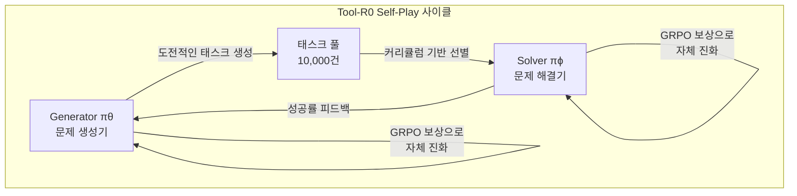
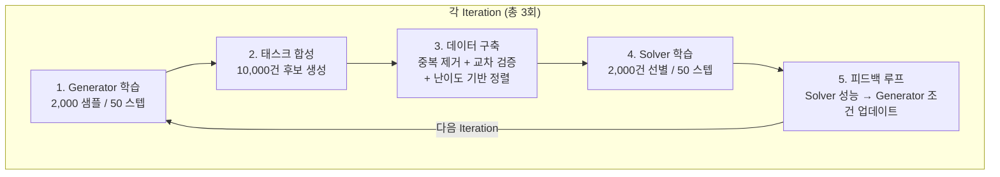
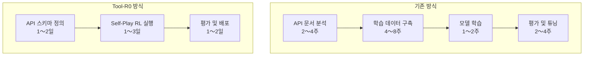

AI 에이전트의 핵심 역량은 <strong>"외부 도구를 정확하게 호출하는 능력"</strong>이다. API를 부르고, 데이터베이스를 검색하고, 코드를 실행하는 이 능력이 없다면 에이전트는 단순한 챗봇에 머문다. 그런데 이 도구 호출 능력을 학습시키려면 지금까지는 수만〜수십만 건의 라벨링된 데이터가 필요했다.

2026년 2월 arXiv에 공개된 <strong>Tool-R0</strong>(Acikgoz et al., arXiv 2602.21320)는 이 상식을 뒤집는다. <strong>학습 데이터 제로(zero-data)</strong> 상태에서 Self-Play 강화학습만으로 도구 호출 에이전트를 처음부터 훈련하며, 기존 지도학습 방식을 능가하는 성능을 달성했다.

## 왜 지금 이 논문이 중요한가

현재 AI 에이전트 시장은 도구 호출(Function Calling / Tool Use) 역량을 중심으로 급성장하고 있다. OpenAI의 Function Calling, Anthropic의 Tool Use, Google의 Gemini Function Calling — 프론티어 모델들은 모두 이 능력을 핵심으로 탑재하고 있다.

그러나 오픈소스 모델이나 도메인 특화 모델에서 이 능력을 확보하려면 <strong>고비용의 학습 데이터 구축</strong>이 불가피했다:

- xLAM 데이터셋: 60,000건의 도구 호출 예시
- Hammer 데이터셋: 210,000건
- ToolACE 데이터셋: 12,000건

이 데이터들은 도메인이 바뀔 때마다 새로 구축해야 하며, 기업 내부 API에 맞춤화하기는 더욱 어렵다. Tool-R0는 이 병목을 Self-Play RL로 완전히 제거한다.

## Tool-R0의 핵심 아이디어: Generator-Solver 공진화

Tool-R0의 아키텍처는 놀랍도록 우아하다. 하나의 기반 LLM에서 두 개의 독립적인 에이전트를 초기화한다:

<strong>Generator(πθ)</strong>는 도구 호출 태스크를 생성한다. 구체적으로 (사용자 질의, 도구 메뉴, 정답 도구 호출) 세 쌍을 만들어낸다.

<strong>Solver(πϕ)</strong>는 주어진 질의와 도구 목록으로부터 올바른 도구 호출을 예측하는 법을 학습한다.

핵심은 <strong>보완적 보상 신호(complementary rewards)</strong>로 연결된다는 점이다:

- Generator는 Solver가 <strong>적당히 어려워하는</strong> 수준의 문제를 만들 때 높은 보상을 받는다
- Solver는 정확한 도구 호출을 수행할 때 높은 보상을 받는다

이 상호작용이 반복되면서 Generator는 점점 더 정교한 문제를 만들고, Solver는 점점 더 어려운 문제를 풀 수 있게 된다 — 데이터 없이.

## 보상 설계의 정교함

Tool-R0의 성능이 뛰어난 이유는 보상 함수 설계에 있다.

### Generator 보상: 3단계 품질 관리

| 보상 구성 요소 | 역할 | 설명 |
|:---|:---|:---|
| Format Reward (r_fmt) | 구조적 준수 | XML 태그, JSON 파싱 유효성 검사 |
| Validity Reward (r_valid) | 내부 일관성 | 정답 도구가 메뉴에 존재, 필수 파라미터 포함, 인자 값이 질문에 근거 |
| Curriculum Reward (r_curr) | 난이도 조절 | Solver 성공률 p̂_succ ∈ [0.25, 0.75] 범위를 목표 |

특히 <strong>Curriculum Reward</strong>가 핵심이다. Solver의 성공률이 25%〜75% 사이에 있는 문제를 생성할 때 가장 높은 보상을 부여한다. 너무 쉬운 문제(성공률 > 75%)나 너무 어려운 문제(성공률 < 25%)는 학습에 도움이 되지 않기 때문이다. 이는 교육학의 <strong>"최근접 발달 영역(Zone of Proximal Development)"</strong> 개념과 정확히 일치한다.

### Solver 보상: 세분화된 정확도 측정

Solver의 정확도 보상은 단순한 정답/오답 이진 판정이 아니라 세 가지 차원으로 분해된다:

1. <strong>도구 이름 매칭</strong> (이진): 올바른 도구를 선택했는가?
2. <strong>키 오버랩</strong> (F1 스코어): 필수 파라미터를 빠뜨리지 않았는가?
3. <strong>값 매칭</strong> (유연한 비교): 인자 값이 정확한가?

추가 도구 호출을 생성한 경우에는 곱셈적 페널티(multiplicative penalty)를 적용한다. 이런 세분화된 보상이 부분 학점을 가능하게 해, 학습 초기 단계에서도 유의미한 그래디언트를 제공한다.

## 학습 파이프라인: 3회 반복의 위력

전체 학습은 3번의 반복(iteration)으로 구성된다:

주목할 점은 각 반복에서 고작 <strong>2,000건의 자체 생성 데이터</strong>만 사용한다는 것이다. 기존 지도학습 방식이 수만〜수십만 건을 요구하는 것과 극명한 대비를 이룬다.

## 벤치마크 결과: 지도학습을 능가하다

### Qwen2.5-1.5B 기반 주요 결과

| 벤치마크 | 베이스라인 | Tool-R0 | 상대 향상 |
|:---|---:|---:|---:|
| ToolAlpaca | 35.96% | 47.36% | +31.7% |
| SealTools | 47.27% | 83.00% | +75.6% |
| NexusRaven | 17.61% | 34.59% | +86.4% |
| API-Bank | 19.13% | 50.62% | +164.6% |
| SNIPS | 4.29% | 20.86% | +386.3% |
| <strong>평균</strong> | <strong>24.85%</strong> | <strong>47.84%</strong> | <strong>+92.5%</strong> |

특히 API-Bank와 SNIPS에서의 극적인 향상이 눈에 띈다. 이 벤치마크들은 실제 API 호출 시나리오를 시뮬레이션하는데, 제로 데이터 접근법이 이 정도의 성능을 보인다는 것은 놀라운 결과다.

### 지도학습 데이터셋과의 비교

가장 인상적인 결과는 <strong>실제 학습 데이터로 훈련된 모델들을 능가</strong>한다는 점이다:

| 학습 방법 | 데이터 규모 | 평균 정확도 |
|:---|---:|---:|
| xLAM 데이터셋 | 60,000건 | 43.60% |
| Hammer 데이터셋 | 210,000건 | 43.74% |
| ToolACE 데이터셋 | 12,000건 | 44.71% |
| ToolRL 데이터셋 | 4,000건 | 46.06% |
| <strong>Tool-R0 (제로 데이터)</strong> | <strong>0건</strong> | <strong>47.84%</strong> |

21만 건의 학습 데이터를 사용한 Hammer보다, 데이터 없이 학습한 Tool-R0가 4%p 이상 높은 성능을 기록했다.

### 다양한 모델에서의 검증

Tool-R0는 특정 모델에 종속되지 않는다:

| 모델 | 베이스라인 | Tool-R0 | 향상 |
|:---|---:|---:|---:|
| Qwen2.5-0.5B | 15.47% | 30.57% | +101.0% |
| Qwen2.5-1.5B | 24.85% | 47.84% | +92.5% |
| Qwen2.5-3B | 43.97% | 48.50% | +10.3% |
| Llama-3.2-3B | 36.12% | 40.47% | +12.0% |

작은 모델(0.5B)에서 2배 이상의 향상을, 큰 모델(3B)에서도 10% 이상의 향상을 달성했다. 이미 도구 호출 능력이 일정 수준인 큰 모델에서는 향상 폭이 줄어들지만, 일관되게 개선이 이루어진다.

## 핵심 발견: 왜 파라미터 분리가 중요한가

Ablation 실험에서 가장 중요한 발견은 <strong>Generator와 Solver의 파라미터를 반드시 분리</strong>해야 한다는 것이다:

| 설정 | 정확도 | 성능 하락 |
|:---|---:|---:|
| Full Tool-R0 (분리) | 47.84% | — |
| 공유 가중치 | 30.42% | -36.4% |
| Generator 고정 | 41.65% | -12.9% |
| 난이도 보상 제거 | 43.54% | -9.0% |

공유 가중치를 사용하면 성능이 36.4%나 하락한다. 연구팀은 이를 <strong>"그래디언트 간섭(gradient interference)"</strong>으로 설명한다 — 탐색(Generator)과 실행(Solver)이라는 상반된 목표를 하나의 파라미터 공간에서 최적화하면 두 목표가 서로를 방해한다.

이는 조직론적으로도 시사하는 바가 크다. <strong>문제를 정의하는 팀과 문제를 해결하는 팀을 분리</strong>하되, 피드백 루프로 연결하는 구조가 최적이라는 연구적 근거를 제공한다.

## EM/CTO 관점의 실무 시사점

### 1. 기업 내부 API 도구 호출 에이전트 구축 비용 절감

기존 접근법에서 가장 큰 비용은 학습 데이터 구축이었다. 기업 내부 API에 맞는 도구 호출 예시를 수만 건 만드는 것은 수개월의 작업이 필요하다. Tool-R0는 이 단계를 완전히 제거한다.

### 2. 소형 모델의 재평가

Tool-R0는 0.5B 모델에서도 2배의 성능 향상을 달성했다. 이는 <strong>에지 디바이스나 비용 민감 환경에서도 유효한 도구 호출 에이전트를 구축</strong>할 수 있음을 의미한다. GPU 비용이 제한된 스타트업이나 프라이빗 클라우드 환경에서 특히 유의미하다.

### 3. 커리큘럼 러닝의 자동화

가장 인상적인 측면은 <strong>학습 커리큘럼이 자동으로 생성</strong>된다는 점이다. 기존에는 인간이 "쉬운 예시부터 어려운 예시 순"으로 데이터를 정렬해야 했지만, Tool-R0의 Generator는 Solver의 현재 능력 수준을 자동으로 감지하고 적절한 난이도의 문제를 생성한다.

이는 <strong>AI 시스템의 학습 파이프라인을 자율적으로 운영</strong>할 수 있는 가능성을 열어준다.

## ICLR 2026 에이전트 연구 동향과의 맥락

Tool-R0는 2026년 AI 에이전트 연구의 큰 흐름인 <strong>"자기 진화(Self-Evolving) 에이전트"</strong> 패러다임의 일부다:

- <strong>EvolveR</strong> (ICLR 2026 under review): 경험 기반 라이프사이클로 에이전트 자기 개선
- <strong>Agent0</strong>: 도구 통합 추론으로 제로 데이터에서 에이전트 구축
- <strong>EvoAgentX</strong> (GitHub 오픈소스): 자기 진화 에이전트 생태계
- <strong>ICLR 2026 Workshop</strong>: "Lifelong Agents: Learning, Aligning, Evolving"

이 연구들의 공통 메시지는 명확하다: <strong>인간이 만든 데이터에 의존하지 않고, 에이전트가 스스로 학습 데이터를 생성하고 스스로 진화하는 시대</strong>가 도래하고 있다.

## 결론

Tool-R0는 "데이터 없이도 강력한 AI 에이전트를 만들 수 있다"는 것을 실증한 중요한 연구다. 핵심 교훈을 요약하면:

1. <strong>Self-Play RL만으로 지도학습을 능가</strong>할 수 있다 (92.5% 향상, 21만 건 데이터셋 대비 우위)
2. <strong>Generator-Solver 분리</strong>가 필수적이다 (공유 시 36.4% 성능 하락)
3. <strong>커리큘럼 자동 생성</strong>이 학습 효율의 핵심이다 (ZPD 범위 [0.25, 0.75])
4. <strong>소형 모델에서도 유효</strong>하다 (0.5B에서 2배 향상)

EM과 CTO에게 가장 중요한 시사점은, 기업 내부 API용 AI 에이전트를 구축할 때 <strong>학습 데이터 구축이라는 최대 병목을 우회</strong>할 수 있는 방법론이 등장했다는 것이다. 아직 프로덕션 레벨의 검증이 필요하지만, 이 방향성은 2026년 AI 에이전트 개발의 중요한 전환점이 될 것이다.

## 참고 자료

- [Tool-R0 논문 (arXiv 2602.21320)](https://arxiv.org/abs/2602.21320)
- [EvolveR: Self-Evolving LLM Agents (ICLR 2026)](https://openreview.net/forum?id=sooLoD9VSf)
- [EvoAgentX GitHub](https://github.com/EvoAgentX/EvoAgentX)
- [ICLR 2026 Lifelong Agents Workshop](https://lifelongagent.github.io/)
