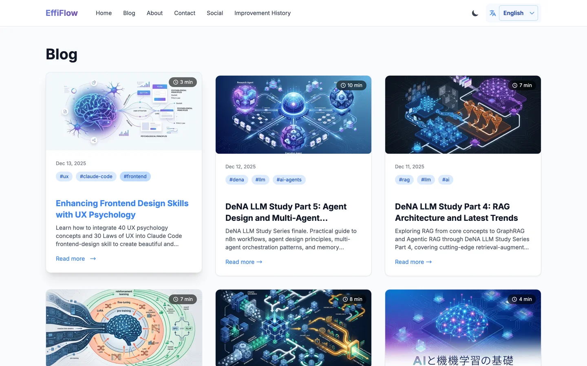
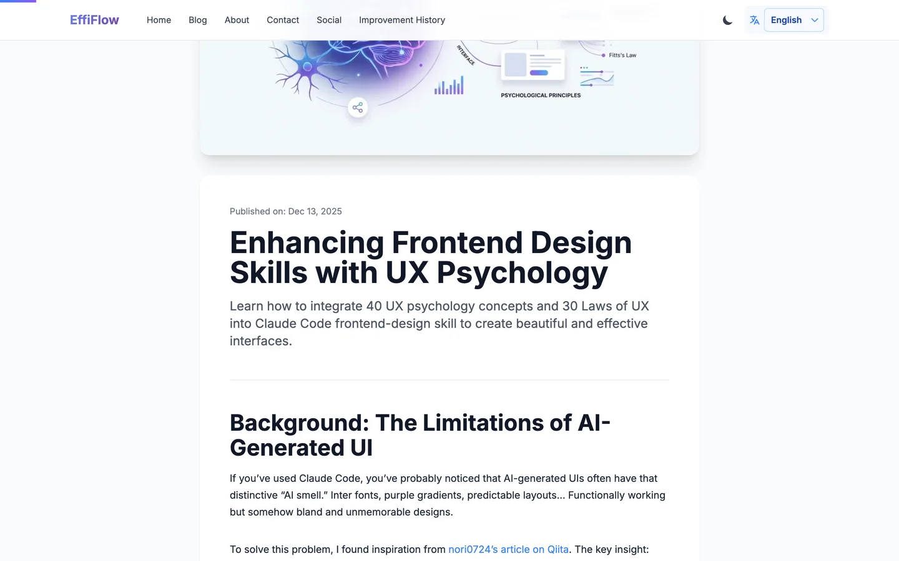
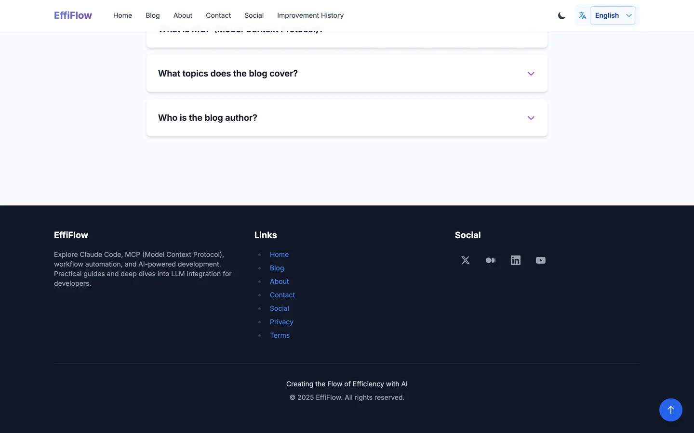
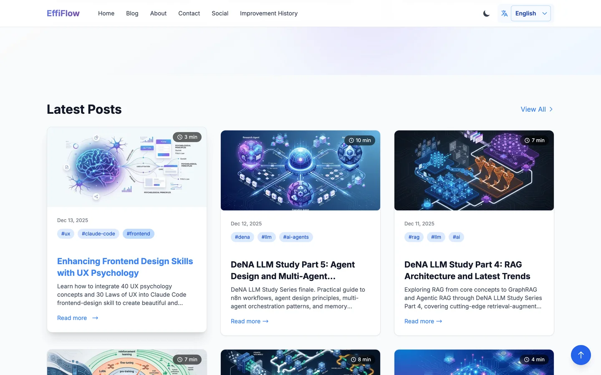
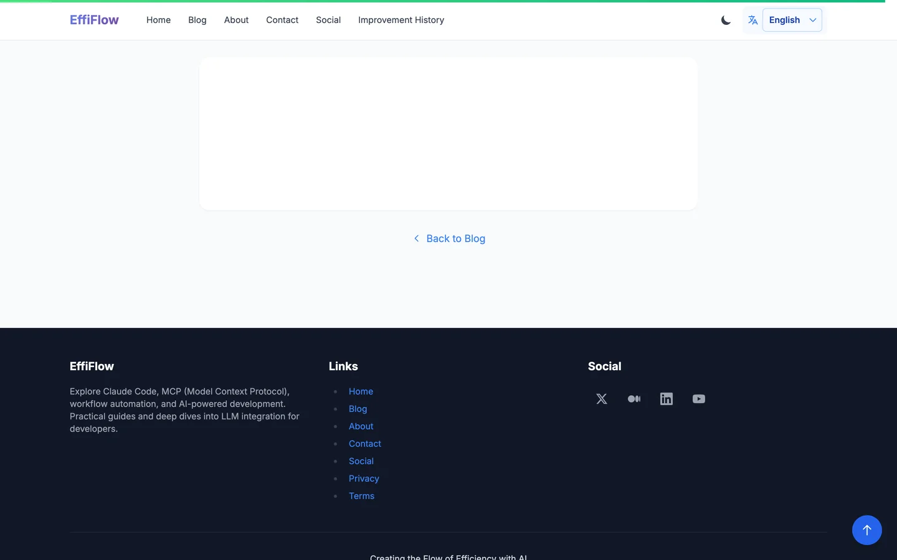

## 개요

UX 심리학 원칙을 실제 웹사이트에 적용하여 사용자 경험을 개선한 사례를 소개합니다. 이번 개선에서는 <strong>Goal Gradient Effect</strong>, <strong>Von Restorff Effect</strong>, <strong>Fitts's Law</strong>, <strong>Doherty Threshold</strong> 등 10가지 핵심 UX 심리학 원칙을 기반으로 컴포넌트를 개선했습니다.

## 구현된 UX 개선 사항

### 1. BlogCard 읽기 시간 계산 개선

기존에는 description 텍스트 길이를 기반으로 읽기 시간을 추정했으나, 이번 개선에서는 <strong>실제 포스트 본문의 단어 수를 빌드 타임에 계산</strong>하여 정확한 읽기 시간을 표시합니다.

```typescript
// src/lib/content.ts
export function calculateReadingTime(content: string): number {
  if (!content) return 1;

  // 코드 블록 제거
  let cleanContent = content.replace(/```[\s\S]*?```/g, "");

  // 인라인 코드 제거
  cleanContent = cleanContent.replace(/`[^`]+`/g, "");

  // HTML 태그 제거
  cleanContent = cleanContent.replace(/<[^>]+>/g, "");

  // CJK 문자 카운트 (한중일)
  const cjkRegex = /[\u4e00-\u9fff\u3040-\u309f\u30a0-\u30ff\uac00-\ud7af]/g;
  const cjkCount = (cleanContent.match(cjkRegex) || []).length;

  // 비CJK 단어 카운트
  const nonCjkContent = cleanContent.replace(cjkRegex, " ");
  const wordCount = nonCjkContent.split(/\s+/).filter(w => w.length > 0).length;

  // 읽기 시간 계산: 영어 200 WPM, CJK 400 CPM
  const englishMinutes = wordCount / 200;
  const cjkMinutes = cjkCount / 400;

  return Math.max(1, Math.ceil(englishMinutes + cjkMinutes));
}
```

<strong>적용된 UX 원칙</strong>: Cognitive Load Reduction - 사용자가 콘텐츠 소비에 필요한 시간을 미리 파악하여 의사결정을 돕습니다.



### 2. 카드 호버 효과 (Card Lift)

BlogCard에 호버 시 <strong>살짝 떠오르는 효과</strong>를 적용하여 현재 상호작용 중인 요소를 명확히 합니다.

```css
/* src/styles/global.css */
.card-lift {
  transition: transform 0.3s ease, box-shadow 0.3s ease;
}

.card-lift:hover {
  transform: translateY(-8px);
  box-shadow: 0 20px 25px -5px rgba(0, 0, 0, 0.1),
              0 10px 10px -5px rgba(0, 0, 0, 0.04);
}
```

<strong>적용된 UX 원칙</strong>: Von Restorff Effect - 호버된 카드가 다른 카드들 사이에서 시각적으로 두드러지게 표시됩니다.

### 3. 태그 필 (Tag Pills)

블로그 카드의 태그를 시각적으로 그룹화하여 표시합니다.

```css
.tag-pill {
  @apply inline-flex items-center px-2.5 py-0.5 rounded-full text-xs font-medium;
  @apply bg-blue-100 text-blue-800 dark:bg-blue-900/30 dark:text-blue-300;
  transition: all 0.2s ease;
}

.tag-pill:hover {
  @apply bg-blue-200 dark:bg-blue-800/50;
}
```

<strong>적용된 UX 원칙</strong>: Law of Similarity - 유사한 스타일의 태그들이 시각적으로 그룹화되어 인식됩니다.

### 4. 읽기 진행 표시줄 (Reading Progress)

블로그 포스트 상단에 고정된 진행 표시줄로 현재 읽기 진행률을 표시합니다.

```astro
<!-- src/components/ReadingProgress.astro -->
<div class="reading-progress-container">
  <div id="reading-progress" class="reading-progress"></div>
</div>

<script>
  const progressBar = document.getElementById('reading-progress');

  function updateProgress() {
    const scrollTop = window.scrollY;
    const docHeight = document.documentElement.scrollHeight - window.innerHeight;
    const progress = (scrollTop / docHeight) * 100;

    progressBar.style.width = `${progress}%`;

    // 80% 이상 읽으면 색상 변경 (Goal Gradient)
    if (progress >= 80) {
      progressBar.classList.add('near-complete');
    }
  }

  window.addEventListener('scroll', updateProgress, { passive: true });
</script>
```



<strong>적용된 UX 원칙</strong>:
- <strong>Goal Gradient Effect</strong>: 목표(완독)에 가까워질수록 동기 부여 증가
- <strong>Peak-End Rule</strong>: 100% 도달 시 축하 메시지로 긍정적인 기억 형성

### 5. Back to Top 버튼

긴 페이지에서 빠르게 상단으로 이동할 수 있는 버튼입니다.

```astro
<!-- src/components/BackToTop.astro -->
<button
  id="back-to-top"
  class="back-to-top touch-target"
  aria-label="맨 위로 이동"
>
  <svg class="w-6 h-6" fill="none" stroke="currentColor" viewBox="0 0 24 24">
    <path stroke-linecap="round" stroke-linejoin="round" stroke-width="2"
          d="M5 10l7-7m0 0l7 7m-7-7v18"/>
  </svg>
</button>

<script>
  const btn = document.getElementById('back-to-top');

  window.addEventListener('scroll', () => {
    if (window.scrollY > 300) {
      btn.classList.add('visible');
    } else {
      btn.classList.remove('visible');
    }
  }, { passive: true });

  btn.addEventListener('click', () => {
    window.scrollTo({ top: 0, behavior: 'smooth' });
  });
</script>
```



<strong>적용된 UX 원칙</strong>:
- <strong>Tesler's Law</strong>: 복잡성을 줄여 빠른 네비게이션 제공
- <strong>Fitts's Law</strong>: 48x48px 크기로 쉬운 터치/클릭

### 6. 터치 타겟 최적화

모바일 사용자를 위해 모든 인터랙티브 요소의 터치 영역을 최소 44x44px로 확보했습니다.

```css
.touch-target {
  @apply min-w-[44px] min-h-[44px];
  @apply flex items-center justify-center;
}
```

<strong>적용된 UX 원칙</strong>: Fitts's Law - 큰 타겟은 더 빠르고 정확하게 클릭/터치할 수 있습니다.

## 구현 결과 스크린샷

### 홈페이지 (Latest Posts 섹션)



BlogCard에 읽기 시간 뱃지와 태그 필이 적용된 모습입니다. 카드 호버 시 lift 효과가 나타납니다.

### 블로그 포스트 페이지


상단에 읽기 진행 표시줄이 고정되어 있으며, 스크롤에 따라 진행률이 업데이트됩니다.

### 포스트 하단 영역



포스트를 끝까지 읽으면 읽기 진행 표시줄이 녹색으로 변하고, Back to Top 버튼이 나타납니다.

## 적용된 UX 심리학 원칙 요약

| 원칙 | 적용 컴포넌트 | 효과 |
|------|-------------|------|
| <strong>Goal Gradient Effect</strong> | ReadingProgress | 완독률 증가 |
| <strong>Von Restorff Effect</strong> | BlogCard (card-lift) | 포커스 명확화 |
| <strong>Fitts's Law</strong> | TouchTarget, BackToTop | 터치 정확도 향상 |
| <strong>Doherty Threshold</strong> | 애니메이션 (<400ms) | 반응성 체감 |
| <strong>Peak-End Rule</strong> | 완독 축하 메시지 | 긍정적 기억 |
| <strong>Tesler's Law</strong> | BackToTop | 네비게이션 단순화 |
| <strong>Cognitive Load</strong> | 읽기 시간 뱃지 | 의사결정 지원 |
| <strong>Law of Similarity</strong> | Tag Pills | 시각적 그룹화 |
| <strong>WCAG AA</strong> | focus-visible | 접근성 보장 |
| <strong>Progressive Disclosure</strong> | Stagger Animation | 순차적 정보 노출 |

## 빌드 검증

```bash
npm run build
# Result: 1153 page(s) built in 29.99s
# Status: Complete - No errors
```

## 결론

UX 심리학 원칙을 실제 코드로 구현함으로써 사용자 경험을 체계적으로 개선할 수 있습니다. 특히 <strong>읽기 시간 정확도 개선</strong>, <strong>카드 호버 효과</strong>, <strong>진행 표시줄</strong> 등은 비교적 간단한 구현으로 큰 UX 향상을 가져옵니다.

다음 단계로는 실제 사용자 데이터(체류 시간, 완독률, 클릭률)를 분석하여 개선 효과를 정량적으로 측정할 예정입니다.

## 참고 자료

- [Laws of UX](https://lawsofux.com/)
- [research/ux-psychology/](https://github.com/kimjangwook/www.jangwook.net/tree/main/research/ux-psychology) - 프로젝트 UX 심리학 연구 문서
