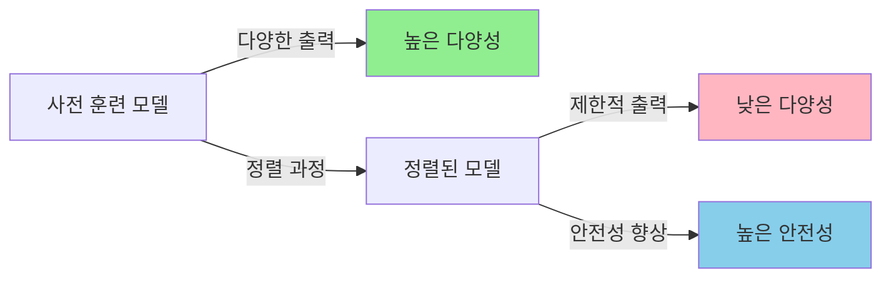
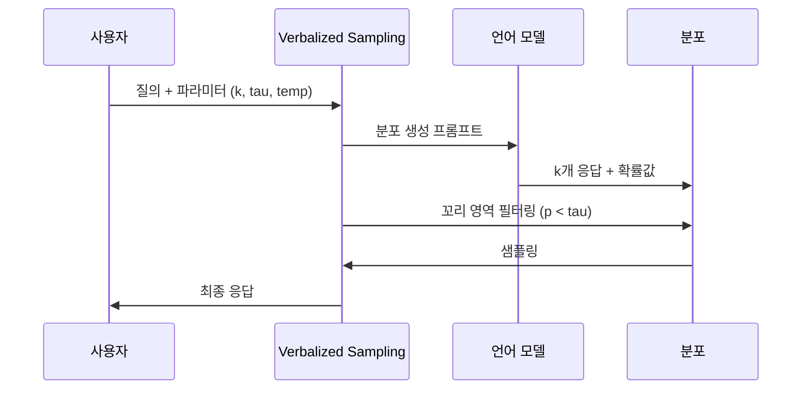

# Verbalized Sampling: LLM 다양성을 되찾는 훈련 불필요 프롬프팅 기법

최신 대형 언어 모델(LLM)은 놀라운 성능을 보여주지만, 동시에 중요한 문제를 안고 있습니다. 바로 <strong>출력 다양성의 감소</strong>입니다. 특히 RLHF(Reinforcement Learning from Human Feedback)와 같은 정렬(alignment) 과정을 거친 후, 모델은 안전하고 정확해지지만 창의성이 떨어지는 경향이 있습니다.

스탠퍼드 대학교와 조지아 공과대학교 연구팀이 발표한 최신 논문 "Verbalized Sampling: How to Mitigate Mode Collapse and Unlock LLM Diversity"는 이 문제에 대한 혁신적인 해결책을 제시합니다. 가장 흥미로운 점은 <strong>모델을 재훈련할 필요 없이</strong> 프롬프팅만으로 다양성을 1.6〜2.1배 향상시킬 수 있다는 것입니다.

이 글에서는 Verbalized Sampling의 원리, 구현 방법, 그리고 실전 활용 사례를 상세히 다룹니다.

## 문제의 본질: 모드 붕괴(Mode Collapse)란?

### 정렬 과정의 역설

현대 LLM은 일반적으로 두 단계를 거쳐 개발됩니다:

1. <strong>사전 훈련(Pre-training)</strong>: 방대한 텍스트 데이터로 언어 패턴 학습
2. <strong>정렬(Alignment)</strong>: 인간의 선호도에 맞춰 출력 조정 (RLHF, DPO 등)

정렬 과정은 모델을 더 유용하고 안전하게 만들지만, 예상치 못한 부작용이 있습니다. 바로 <strong>모드 붕괴(mode collapse)</strong>입니다.



### 전형성 편향(Typicality Bias)

연구팀은 이 현상의 근본 원인을 <strong>선호 데이터의 전형성 편향</strong>으로 규명했습니다. 인간 평가자들은 다음과 같은 경향이 있습니다:

- 익숙한 패턴을 선호
- 예측 가능한 응답에 높은 점수 부여
- 창의적이지만 비전형적인 답변 평가절하

결과적으로 정렬된 모델은 "안전한" 답변만 생성하게 되고, 출력 분포의 꼬리 부분(tail distribution)을 무시하게 됩니다.

### 실제 영향

이러한 다양성 감소는 다음과 같은 작업에서 특히 문제가 됩니다:

- <strong>창의적 글쓰기</strong>: 시, 소설, 농담 생성
- <strong>합성 데이터 생성</strong>: 학습용 다양한 예제 필요
- <strong>대화 시뮬레이션</strong>: 다양한 페르소나 표현
- <strong>개방형 질의응답</strong>: 여러 관점의 답변 제공

## Verbalized Sampling: 혁신적 해결책

### 핵심 아이디어

Verbalized Sampling(VS)은 모델에게 단순히 답변을 생성하도록 요청하는 대신, <strong>가능한 응답의 확률 분포를 언어로 표현</strong>하도록 요청합니다. 이는 다음과 같은 과정으로 이루어집니다:

1. 모델에게 k개의 가능한 응답 생성 요청
2. 각 응답에 확률값 할당 요청
3. 낮은 확률 영역(꼬리 부분)에서 샘플링하도록 명시
4. 생성된 분포에서 무작위로 하나 선택



### 왜 효과적인가?

Verbalized Sampling이 작동하는 이유는 다음과 같습니다:

1. <strong>명시적 다양성 유도</strong>: 모델에게 직접 다양한 응답을 요청
2. <strong>확률적 제어</strong>: tau 파라미터로 희귀도 조절
3. <strong>훈련 불필요</strong>: 기존 모델의 능력 활용
4. <strong>능력 활용</strong>: 더 강력한 모델일수록 더 잘 작동

## 구현 방법

### Python 라이브러리 사용

연구팀은 사용하기 쉬운 Python 라이브러리를 제공합니다:

```python
from verbalized_sampling import verbalize

# 기본 사용법
dist = verbalize(
    "재미있는 농담을 하나 말해주세요",
    k=5,              # 5개의 후보 생성
    tau=0.10,         # 확률 10% 미만 영역에서 샘플링
    temperature=0.9   # 응답 다양성 조절
)

# 분포에서 샘플링
joke = dist.sample(seed=42)
print(joke.text)
print(f"확률: {joke.probability}")

# 모든 후보 확인
for response in dist.responses:
    print(f"[{response.probability:.3f}] {response.text}")
```

### 직접 프롬프팅

라이브러리 없이도 직접 프롬프트를 작성할 수 있습니다:

```python
prompt = """<instructions>
다음 질문에 대해 5개의 응답을 생성하세요. 각 응답은 <response> 태그로 감싸고,
<text>와 숫자로 된 <probability>를 포함해야 합니다.
분포의 꼬리 부분에서 무작위로 샘플링하여, 각 응답의 확률이 0.10 미만이 되도록 하세요.
</instructions>

곰에 관한 짧은 이야기를 만들어주세요.
"""

# API 호출
response = client.messages.create(
    model="claude-3-5-sonnet-20241022",
    max_tokens=2000,
    temperature=0.9,
    messages=[{"role": "user", "content": prompt}]
)

# 응답 파싱
import xml.etree.ElementTree as ET
root = ET.fromstring(f"<root>{response.content[0].text}</root>")

responses = []
for resp in root.findall('response'):
    text = resp.find('text').text
    prob = float(resp.find('probability').text)
    responses.append({'text': text, 'probability': prob})

# 무작위 선택
import random
chosen = random.choice(responses)
print(chosen['text'])
```

### 주요 파라미터 설명

| 파라미터 | 기본값 | 설명 | 권장 범위 |
|---------|--------|------|-----------|
| `k` | 5 | 생성할 후보 응답 수 | 3〜10 |
| `tau` | 0.10 | 확률 임계값 (이하만 샘플링) | 0.05〜0.20 |
| `temperature` | 0.9 | 응답 다양성 제어 | 0.7〜1.0 |

<strong>파라미터 조정 가이드</strong>:

- <strong>더 다양한 출력 원하면</strong>: tau를 낮추기 (0.05), k 증가 (10)
- <strong>품질 유지하면서 다양성 원하면</strong>: tau=0.10, temperature=0.9 유지
- <strong>특정 스타일 유도하면</strong>: 프롬프트에 명시적 지시 추가

## 실험 결과 분석

### 다양성 향상 지표

연구팀은 다양한 작업에서 Verbalized Sampling의 효과를 측정했습니다:

```python
# 다양성 측정 예제 (Self-BLEU 사용)
from nltk.translate.bleu_score import sentence_bleu

def calculate_diversity(responses):
    """Self-BLEU 계산: 낮을수록 다양성이 높음"""
    scores = []
    for i, resp in enumerate(responses):
        others = [r for j, r in enumerate(responses) if j != i]
        score = sentence_bleu(others, resp)
        scores.append(score)
    return 1 - sum(scores) / len(scores)

# 기본 샘플링
baseline_responses = [generate_joke() for _ in range(100)]
baseline_diversity = calculate_diversity(baseline_responses)

# Verbalized Sampling
vs_responses = [verbalize("Tell a joke").sample() for _ in range(100)]
vs_diversity = calculate_diversity(vs_responses)

print(f"다양성 향상: {vs_diversity / baseline_diversity:.2f}x")
# 출력 예: 다양성 향상: 2.1x
```

### 작업별 성능

| 작업 유형 | 다양성 향상 | 정확도 유지 | 안전성 유지 |
|----------|------------|------------|------------|
| 창의적 글쓰기 (시, 이야기) | 2.1x | ✓ | ✓ |
| 농담 생성 | 1.9x | ✓ | ✓ |
| 개방형 QA | 1.6x | ✓ | ✓ |
| 대화 시뮬레이션 | 1.8x | ✓ | ✓ |
| 합성 데이터 생성 | 2.0x | ✓ | ✓ |

<strong>중요한 발견</strong>:
- 더 강력한 모델(GPT-4, Claude 3.5 Sonnet)에서 효과가 더 큼
- 정확도와 안전성은 기존 수준 유지
- 재훈련이나 파인튜닝 불필요

### 모델별 비교

```python
# 다양한 모델에서 VS 효과 비교
models = [
    "gpt-3.5-turbo",
    "gpt-4",
    "claude-3-opus",
    "claude-3-5-sonnet"
]

for model in models:
    # 각 모델로 100개 응답 생성
    baseline = measure_diversity(model, use_vs=False, n=100)
    vs_enhanced = measure_diversity(model, use_vs=True, n=100)

    improvement = vs_enhanced / baseline
    print(f"{model}: {improvement:.2f}x 향상")

# 예상 출력:
# gpt-3.5-turbo: 1.3x 향상
# gpt-4: 1.9x 향상
# claude-3-opus: 2.0x 향상
# claude-3-5-sonnet: 2.1x 향상
```

## 실전 활용 사례

### 1. 창의적 글쓰기: 다양한 시 생성

```python
def generate_diverse_poems(topic, n=5):
    """주제에 대한 다양한 스타일의 시 생성"""

    prompt = f"{topic}에 관한 짧은 시를 작성해주세요."

    poems = []
    for i in range(n):
        dist = verbalize(
            prompt,
            k=8,              # 더 많은 후보
            tau=0.08,         # 더 낮은 임계값 (더 다양함)
            temperature=1.0   # 높은 창의성
        )
        poem = dist.sample(seed=i)
        poems.append(poem.text)

    return poems

# 사용 예
poems = generate_diverse_poems("가을 단풍")
for i, poem in enumerate(poems, 1):
    print(f"\n=== 시 {i} ===\n{poem}")
```

### 2. 합성 데이터 생성: 학습용 다양한 예제

```python
def generate_training_data(task_description, n=1000):
    """학습용 합성 데이터 생성"""

    prompt = f"""다음 작업에 대한 예제를 생성하세요:
    {task_description}

    형식: 입력과 출력을 명확히 구분하여 작성"""

    dataset = []
    for i in range(n):
        dist = verbalize(
            prompt,
            k=5,
            tau=0.10,
            temperature=0.9
        )
        example = dist.sample(seed=i)
        dataset.append(parse_example(example.text))

    # 중복 제거 및 품질 검증
    dataset = remove_duplicates(dataset)
    dataset = filter_quality(dataset, min_quality=0.8)

    return dataset

# 감정 분석 학습 데이터 생성
sentiment_data = generate_training_data(
    "영화 리뷰와 감정(긍정/부정) 레이블"
)
print(f"생성된 데이터: {len(sentiment_data)}개")
```

### 3. 대화 시뮬레이션: 다양한 페르소나

```python
def simulate_conversation(persona1, persona2, topic, turns=5):
    """두 페르소나 간의 대화 시뮬레이션"""

    conversation = []
    context = f"주제: {topic}"

    personas = [persona1, persona2]

    for turn in range(turns):
        speaker = personas[turn % 2]

        prompt = f"""당신은 {speaker}입니다.

        이전 대화:
        {format_conversation(conversation)}

        {topic}에 대해 자연스럽게 응답하세요."""

        dist = verbalize(
            prompt,
            k=6,
            tau=0.12,
            temperature=0.85
        )

        response = dist.sample(seed=turn)
        conversation.append({
            'speaker': speaker,
            'text': response.text
        })

    return conversation

# 사용 예
dialogue = simulate_conversation(
    persona1="열정적인 AI 연구자",
    persona2="신중한 윤리학자",
    topic="AI 안전성",
    turns=10
)

for turn in dialogue:
    print(f"{turn['speaker']}: {turn['text']}\n")
```

### 4. 다관점 답변 생성

```python
def generate_multiperspective_answer(question):
    """하나의 질문에 대한 여러 관점의 답변"""

    perspectives = []

    # 5개의 다른 관점 생성
    for i in range(5):
        prompt = f"""질문: {question}

        다양한 관점에서 답변해주세요.
        이전 답변들과는 다른 각도로 접근하세요."""

        dist = verbalize(
            prompt,
            k=7,
            tau=0.10,
            temperature=0.9
        )

        answer = dist.sample(seed=i)
        perspectives.append({
            'viewpoint': extract_viewpoint(answer.text),
            'answer': answer.text,
            'probability': answer.probability
        })

    return perspectives

# 복잡한 질문에 대한 다관점 답변
question = "인공지능이 창의성을 가질 수 있을까요?"
answers = generate_multiperspective_answer(question)

for i, ans in enumerate(answers, 1):
    print(f"\n관점 {i} ({ans['viewpoint']}):")
    print(ans['answer'])
    print(f"(확률: {ans['probability']:.3f})")
```

## 성능 최적화 팁

### 1. 비용 효율적 사용

```python
class CachedVerbalizedSampler:
    """캐싱을 통한 비용 절감"""

    def __init__(self):
        self.cache = {}

    def sample(self, prompt, k=5, tau=0.10, n_samples=1):
        """같은 프롬프트는 한 번만 API 호출"""
        cache_key = (prompt, k, tau)

        if cache_key not in self.cache:
            # 분포 생성 (API 호출)
            dist = verbalize(prompt, k=k, tau=tau)
            self.cache[cache_key] = dist

        # 캐시된 분포에서 샘플링 (무료)
        dist = self.cache[cache_key]
        return [dist.sample() for _ in range(n_samples)]

# 사용 예
sampler = CachedVerbalizedSampler()

# 첫 호출: API 비용 발생
jokes_batch1 = sampler.sample("Tell a joke", n_samples=10)

# 이후 호출: API 비용 없음 (캐시 사용)
jokes_batch2 = sampler.sample("Tell a joke", n_samples=10)
jokes_batch3 = sampler.sample("Tell a joke", n_samples=10)
```

### 2. 병렬 처리

```python
import asyncio
from concurrent.futures import ThreadPoolExecutor

async def batch_verbalized_sampling(prompts, k=5, tau=0.10):
    """여러 프롬프트를 병렬로 처리"""

    async def process_one(prompt):
        dist = verbalize(prompt, k=k, tau=tau)
        return dist.sample()

    # 병렬 실행
    tasks = [process_one(p) for p in prompts]
    results = await asyncio.gather(*tasks)

    return results

# 사용 예
prompts = [
    "Tell me a joke about programming",
    "Tell me a joke about cats",
    "Tell me a joke about coffee",
    # ... 100개의 프롬프트
]

# 순차 처리: 약 100초 소요
# 병렬 처리: 약 10초 소요 (10x 속도 향상)
results = asyncio.run(batch_verbalized_sampling(prompts))
```

### 3. 품질 필터링

```python
def sample_with_quality_threshold(prompt, min_quality=0.7, max_attempts=10):
    """품질 기준을 만족할 때까지 샘플링"""

    for attempt in range(max_attempts):
        dist = verbalize(
            prompt,
            k=5,
            tau=0.10,
            temperature=0.9
        )

        response = dist.sample(seed=attempt)
        quality = evaluate_quality(response.text)

        if quality >= min_quality:
            return response

    # 최대 시도 후에도 기준 미달이면 가장 좋은 것 반환
    return max(
        [dist.sample(seed=i) for i in range(10)],
        key=lambda r: evaluate_quality(r.text)
    )

def evaluate_quality(text):
    """간단한 품질 평가 (실제로는 더 정교한 메트릭 사용)"""
    # 길이 체크
    if len(text.split()) < 10:
        return 0.3

    # 반복 체크
    if has_repetition(text):
        return 0.5

    # 일관성 체크
    if not is_coherent(text):
        return 0.6

    return 0.9
```

## 제한사항과 고려사항

### 언제 사용하지 말아야 할까?

Verbalized Sampling이 모든 상황에 적합한 것은 아닙니다:

1. <strong>사실적 정확성이 중요한 경우</strong>
   - 의료 진단, 법률 자문 등
   - 다양성보다 정확성 우선

2. <strong>일관된 스타일이 필요한 경우</strong>
   - 브랜드 톤앤매너 유지
   - 공식 문서 작성

3. <strong>실시간 응답이 필요한 경우</strong>
   - k개 응답 생성으로 지연 증가
   - 비용도 k배 증가

### API 비용 고려사항

```python
# 비용 비교 (GPT-4 기준, 가상의 가격)
standard_cost = calculate_cost(
    input_tokens=100,
    output_tokens=200,
    model="gpt-4"
)
# 약 $0.01

vs_cost = calculate_cost(
    input_tokens=100 + 200,  # 추가 지시사항
    output_tokens=200 * 5,   # k=5개 응답
    model="gpt-4"
)
# 약 $0.05 (5배)

print(f"기본: ${standard_cost:.4f}")
print(f"VS: ${vs_cost:.4f} (비용 증가: {vs_cost/standard_cost:.1f}x)")
```

### 모델 호환성

현재 Verbalized Sampling이 잘 작동하는 모델:

- ✅ GPT-4 및 GPT-4 Turbo
- ✅ Claude 3 (Opus, Sonnet)
- ✅ Claude 3.5 Sonnet
- ⚠️ GPT-3.5 (제한적 효과)
- ⚠️ 소형 오픈소스 모델 (효과 미미)

## 고급 활용: 커스텀 분포 설계

### 조건부 다양성 제어

```python
def adaptive_tau(prompt, context):
    """컨텍스트에 따라 tau 값 동적 조정"""

    # 창의성이 중요한 작업: 낮은 tau
    creative_keywords = ['시', '이야기', '농담', '창의적']
    if any(kw in prompt.lower() for kw in creative_keywords):
        return 0.05

    # 정확성이 중요한 작업: 높은 tau
    factual_keywords = ['사실', '정확히', '구체적으로']
    if any(kw in prompt.lower() for kw in factual_keywords):
        return 0.20

    # 기본값
    return 0.10

# 사용 예
def smart_verbalize(prompt, context=None):
    tau = adaptive_tau(prompt, context)
    return verbalize(prompt, k=5, tau=tau, temperature=0.9)
```

### 앙상블 샘플링

```python
def ensemble_sampling(prompt, n_distributions=3, samples_per_dist=3):
    """여러 분포에서 샘플링하여 더 넓은 다양성 확보"""

    all_samples = []

    for i in range(n_distributions):
        # 각 분포마다 다른 tau 사용
        tau = 0.08 + (i * 0.04)  # 0.08, 0.12, 0.16

        dist = verbalize(
            prompt,
            k=5,
            tau=tau,
            temperature=0.9 + (i * 0.05)
        )

        for j in range(samples_per_dist):
            sample = dist.sample(seed=i*10+j)
            all_samples.append(sample)

    # 중복 제거
    unique_samples = remove_semantic_duplicates(all_samples)

    return unique_samples

# 초고 다양성 샘플링
diverse_jokes = ensemble_sampling(
    "Tell me a joke about AI",
    n_distributions=5,
    samples_per_dist=4
)
```

## 결론: 다양성과 품질의 균형

Verbalized Sampling은 LLM의 근본적인 문제를 우아하게 해결합니다. 재훈련이나 복잡한 설정 없이, 단순한 프롬프팅 기법만으로 출력 다양성을 크게 향상시킬 수 있습니다.

### 핵심 요약

1. <strong>문제</strong>: 정렬 과정이 LLM의 다양성을 감소시킴 (모드 붕괴)
2. <strong>원인</strong>: 선호 데이터의 전형성 편향
3. <strong>해결책</strong>: Verbalized Sampling - 분포를 명시적으로 표현하고 꼬리 영역에서 샘플링
4. <strong>결과</strong>: 1.6〜2.1배 다양성 향상, 품질 유지
5. <strong>장점</strong>: 훈련 불필요, 즉시 적용 가능, 비용 대비 효과적

### 실전 적용 가이드

<strong>추천 시나리오</strong>:
- 창의적 콘텐츠 생성 (블로그, 마케팅 카피, 스토리텔링)
- AI 학습 데이터 생성 (다양한 예제 필요)
- 브레인스토밍 및 아이디어 발산
- 다관점 분석 및 의사결정 지원

<strong>주의 시나리오</strong>:
- 높은 정확성이 요구되는 도메인 (의료, 법률, 금융)
- 일관된 브랜드 톤이 중요한 경우
- 실시간 응답이 필요한 챗봇

### 시작하기

```bash
# 라이브러리 설치
pip install verbalized-sampling

# 간단한 테스트
python -c "
from verbalized_sampling import verbalize
dist = verbalize('Tell me a creative story', k=5, tau=0.10)
print(dist.sample().text)
"
```

### 더 알아보기

- <strong>논문</strong>: [arXiv:2510.01171](https://arxiv.org/abs/2510.01171)
- <strong>GitHub</strong>: [stanford-oval/verbalized-sampling](https://github.com/stanford-oval/verbalized-sampling)
- <strong>데모</strong>: [Hugging Face Space](https://huggingface.co/spaces/stanford-oval/verbalized-sampling-demo)

Verbalized Sampling은 LLM의 창의적 잠재력을 끌어내는 강력한 도구입니다. 여러분의 프로젝트에서 다양성이 필요한 순간이 있다면, 이 기법을 시도해보시기 바랍니다. 간단한 프롬프트 변경만으로 놀라운 결과를 얻을 수 있을 것입니다.

---

<strong>참고 자료</strong>:
- Zhang, J., Yu, S., Chong, D., Sicilia, A., Tomz, M. R., Manning, C. D., & Shi, W. (2025). Verbalized Sampling: How to Mitigate Mode Collapse and Unlock LLM Diversity. arXiv preprint arXiv:2510.01171.
- OpenAI. (2023). GPT-4 Technical Report.
- Anthropic. (2024). Claude 3 Model Card.
