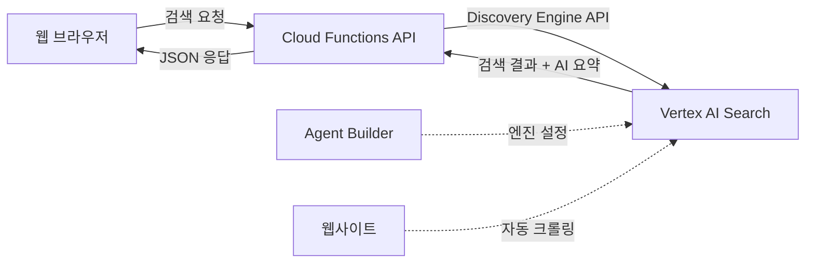

## 개요

웹사이트에 검색 기능을 추가하는 것은 사용자 경험을 크게 향상시키지만, 전통적인 검색 엔진을 직접 구축하는 것은 많은 노력이 필요합니다. Google의 <strong>Vertex AI Search</strong>는 이러한 문제를 해결하는 관리형 검색 솔루션입니다. 단순한 키워드 매칭을 넘어 <strong>의미론적 검색(Semantic Search)</strong>과 <strong>AI 요약 기능</strong>을 제공하여, 사용자가 원하는 정보를 더 빠르고 정확하게 찾을 수 있도록 도와줍니다.

### 기존 검색 솔루션과의 차별점

전통적인 검색 엔진은 키워드 기반 검색에 의존하지만, Vertex AI Search는 다음과 같은 차별화된 기능을 제공합니다:

- 🧠 <strong>세맨틱 검색</strong>: 키워드 매칭이 아닌 의미 기반 검색
- 📝 <strong>AI 요약</strong>: 검색 결과를 자동으로 요약하여 제공
- 🔍 <strong>자동 인덱싱</strong>: 웹사이트 크롤링 및 콘텐츠 자동 수집
- 📊 <strong>검색 분석</strong>: 사용자 검색 패턴 및 성능 지표 제공
- 🚀 <strong>완전 관리형</strong>: 인프라 관리 불필요

### 아키텍처 개요

이 글에서 구현할 시스템의 전체 아키텍처는 다음과 같습니다:



<strong>주요 구성 요소</strong>:

1. <strong>Vertex AI Search Engine</strong>: Google Cloud의 Agent Builder에서 생성한 검색 엔진
2. <strong>Cloud Functions</strong>: 검색 API를 제공하는 서버리스 함수
3. <strong>웹 프론트엔드</strong>: 검색 UI를 제공하는 웹페이지

## 사전 준비

### Google Cloud 프로젝트 설정

먼저 Google Cloud Console에서 새 프로젝트를 생성하거나 기존 프로젝트를 선택합니다:

```bash
# gcloud CLI 설치 (아직 없다면)
# macOS
brew install google-cloud-sdk

# 프로젝트 ID 확인
gcloud projects list

# 프로젝트 설정
gcloud config set project YOUR_PROJECT_ID
```

### Vertex AI Search 엔진 생성

Google Cloud Console에서 <strong>Agent Builder</strong>를 통해 검색 엔진을 생성합니다:

1. <strong>Agent Builder 접속</strong>
   - Google Cloud Console → "Vertex AI" → "Agent Builder" 메뉴
   - 또는 직접 URL: `https://console.cloud.google.com/gen-app-builder`

2. <strong>새 앱 생성</strong>
   - "Create App" 버튼 클릭
   - App type: "Search" 선택
   - Content: "Website content" 선택

3. <strong>데이터 소스 설정</strong>
   - Data source name 입력 (예: `my-website`)
   - Website URLs 입력 (크롤링할 도메인)
   - Advanced options:
     - Crawling frequency: 매일 또는 매주
     - Max pages: 제한 없음 또는 특정 값

4. <strong>엔진 생성 완료</strong>
   - 생성 후 <strong>Engine ID</strong> 확인 및 기록
   - 초기 크롤링은 몇 시간 소요될 수 있음

### 필요한 API 활성화

다음 API들을 활성화해야 합니다:

```bash
# Discovery Engine API (Vertex AI Search)
gcloud services enable discoveryengine.googleapis.com

# Cloud Functions API
gcloud services enable cloudfunctions.googleapis.com

# Cloud Build API (배포에 필요)
gcloud services enable cloudbuild.googleapis.com

# Cloud Run API (Cloud Functions Gen2 사용 시)
gcloud services enable run.googleapis.com
```

또는 Google Cloud Console에서 직접 활성화할 수 있습니다:
- APIs & Services → Library → 각 API 검색 후 "Enable"

## Cloud Functions API 서버 구현

### 프로젝트 구조

```
vertex-ai-search-api/
├── index.js           # Cloud Functions 메인 코드
├── package.json       # Node.js 의존성
├── .env              # 환경변수 (로컬 테스트용)
├── .env.example      # 환경변수 템플릿
└── deploy.sh         # 자동화 배포 스크립트
```

### package.json

먼저 필요한 의존성을 정의합니다:

```json
{
  "name": "vertex-ai-search-api",
  "version": "1.0.0",
  "description": "Vertex AI Search API with Cloud Functions",
  "main": "index.js",
  "engines": {
    "node": "20"
  },
  "dependencies": {
    "@google-cloud/discoveryengine": "^2.0.0",
    "cors": "^2.8.5"
  },
  "devDependencies": {
    "dotenv": "^16.0.0"
  }
}
```

<strong>주요 의존성</strong>:
- `@google-cloud/discoveryengine`: Vertex AI Search API 클라이언트
- `cors`: Cross-Origin 요청 처리
- `dotenv`: 로컬 테스트용 환경변수 관리

### index.js - 핵심 코드

Cloud Functions의 메인 로직입니다:

```javascript
const { SearchServiceClient } = require('@google-cloud/discoveryengine').v1alpha;
const cors = require('cors');

// CORS 설정
const allowedDomains = (process.env.ALLOWED_DOMAINS || '').split(',').filter(Boolean);
const corsHandler = cors({
  origin: (origin, callback) => {
    // 도메인 제한이 없거나, 허용된 도메인에 포함된 경우
    if (allowedDomains.length === 0 || !origin || allowedDomains.some(domain => origin.includes(domain))) {
      callback(null, true);
    } else {
      callback(new Error('Not allowed by CORS'));
    }
  },
  credentials: true
});

// 환경변수 읽기
const PROJECT_ID = process.env.PROJECT_ID;
const PROJECT_NUMBER = process.env.PROJECT_NUMBER;
const ENGINE_ID = process.env.ENGINE_ID;
const LOCATION = process.env.LOCATION || 'global';

// Discovery Engine 클라이언트 초기화
const client = new SearchServiceClient();

/**
 * Cloud Functions 진입점
 * HTTP 요청을 받아 Vertex AI Search 쿼리를 실행합니다.
 */
exports.search = async (req, res) => {
  // CORS 처리
  await new Promise((resolve, reject) => {
    corsHandler(req, res, (err) => {
      if (err) reject(err);
      else resolve();
    });
  });

  // OPTIONS 요청 처리 (CORS preflight)
  if (req.method === 'OPTIONS') {
    res.status(204).send('');
    return;
  }

  // GET 또는 POST 요청만 허용
  if (req.method !== 'GET' && req.method !== 'POST') {
    res.status(405).json({ error: 'Method not allowed' });
    return;
  }

  try {
    // 검색어 추출
    const query = req.method === 'GET' ? req.query.q : req.body.query;

    if (!query || query.trim() === '') {
      res.status(400).json({ error: 'Query parameter is required' });
      return;
    }

    console.log('Search query:', query);

    // Vertex AI Search 요청 구성
    const servingConfig = `projects/${PROJECT_NUMBER}/locations/${LOCATION}/collections/default_collection/engines/${ENGINE_ID}/servingConfigs/default_config`;

    const request = {
      servingConfig,
      query,
      pageSize: 10, // 결과 개수
      contentSearchSpec: {
        // AI 요약 활성화
        summarySpec: {
          summaryResultCount: 5, // 요약에 사용할 결과 수
          includeCitations: true, // 출처 포함
          ignoreAdversarialQuery: true, // 악의적 쿼리 무시
          ignoreNonSummarySeekingQuery: true, // 요약 불필요 쿼리 무시
        },
        // 스니펫 설정
        snippetSpec: {
          returnSnippet: true, // 스니펫 반환
          maxSnippetCount: 3, // 최대 스니펫 수
        },
        // 썸네일 설정
        extractiveContentSpec: {
          maxExtractiveSegmentCount: 3,
          maxExtractiveAnswerCount: 1,
        }
      }
    };

    // API 호출
    const [response] = await client.search(request);

    // 결과 정제
    const results = response.results?.map(result => ({
      id: result.id,
      title: result.document?.structData?.title || 'Untitled',
      link: result.document?.derivedStructData?.link || result.document?.uri || '#',
      snippet: result.document?.derivedStructData?.snippets?.[0]?.snippet ||
               result.document?.derivedStructData?.extractive_segments?.[0]?.content || '',
      thumbnail: result.document?.derivedStructData?.thumbnailUri || null,
      pubDate: result.document?.structData?.pubDate || null,
      tags: result.document?.structData?.tags || []
    })) || [];

    // AI 요약 추출
    const summary = response.summary?.summaryText || null;
    const citations = response.summary?.summaryWithMetadata?.references?.map(ref => ({
      title: ref.title || '',
      link: ref.uri || '',
      chunkId: ref.chunkContents?.[0]?.chunkId || ''
    })) || [];

    // 응답 구성
    const searchResponse = {
      query,
      totalResults: response.totalSize || results.length,
      results,
      summary: summary ? {
        text: summary,
        citations
      } : null,
      attribution: response.attributionToken || null
    };

    console.log(`Found ${results.length} results`);
    res.status(200).json(searchResponse);

  } catch (error) {
    console.error('Search error:', error);

    // 쿼터 초과 에러 처리
    if (error.code === 8 || error.message?.includes('Quota exceeded')) {
      res.status(429).json({
        error: 'Quota exceeded',
        message: '검색 할당량을 초과했습니다. 잠시 후 다시 시도해주세요.',
        fallback: true
      });
      return;
    }

    // 기타 에러
    res.status(500).json({
      error: 'Internal server error',
      message: error.message || '검색 중 오류가 발생했습니다.'
    });
  }
};
```

<strong>핵심 기능 설명</strong>:

1. <strong>CORS 설정</strong>
   - 환경변수로 허용 도메인 제한 가능
   - 도메인 제한이 없으면 모든 도메인 허용 (개발 환경용)

2. <strong>Discovery Engine API 연동</strong>
   - `SearchServiceClient`를 통한 검색 요청
   - `servingConfig` 경로 구성: `projects/{number}/locations/{location}/collections/default_collection/engines/{engine_id}/servingConfigs/default_config`

3. <strong>AI 요약 기능</strong>
   - `summarySpec`을 통해 검색 결과 자동 요약
   - 요약에 사용할 결과 수 지정 (`summaryResultCount`)
   - 출처 인용 포함 (`includeCitations`)

4. <strong>검색 결과 정제</strong>
   - 제목, 링크, 스니펫, 썸네일 추출
   - 메타데이터 (pubDate, tags) 포함

5. <strong>에러 처리</strong>
   - 쿼터 초과 시 429 상태 코드 반환
   - Fallback 플래그로 클라이언트에서 대체 검색 가능

## 환경변수 설정

### .env.example

환경변수 템플릿을 작성합니다:

```bash
# === 필수 설정 ===
# Google Cloud 프로젝트 ID (예: my-project)
PROJECT_ID=your-project-id

# Google Cloud 프로젝트 번호 (숫자)
# Console에서 확인: Home → Dashboard → Project Info
PROJECT_NUMBER=123456789012

# Vertex AI Search Engine ID
# Agent Builder에서 생성한 엔진의 ID
ENGINE_ID=your-engine-id

# === 선택 설정 ===
# 검색 엔진 위치 (기본값: global)
LOCATION=global

# CORS 허용 도메인 (쉼표로 구분, 비어있으면 모든 도메인 허용)
ALLOWED_DOMAINS=yourdomain.com,www.yourdomain.com

# === 배포 설정 ===
# Cloud Functions 배포 리전
REGION=asia-northeast1

# 메모리 할당 (MB)
MEMORY=256MB

# 타임아웃 (초)
TIMEOUT=60

# 최대 인스턴스 수
MAX_INSTANCES=10
```

### 환경변수 확인 방법

<strong>프로젝트 번호 확인</strong>:

```bash
# gcloud 명령어로 확인
gcloud projects describe YOUR_PROJECT_ID --format="value(projectNumber)"

# 또는 Cloud Console에서:
# Home → Dashboard → Project Info → Project number
```

<strong>Engine ID 확인</strong>:

```bash
# Agent Builder 콘솔에서:
# Agent Builder → Apps → 생성한 앱 선택 → Details 탭 → ID 확인

# 또는 gcloud 명령어로 확인
gcloud discovery-engine engines list \
  --project=YOUR_PROJECT_ID \
  --location=global
```

## 자동화된 배포 스크립트 (deploy.sh)

이 프로젝트의 핵심은 <strong>배포 자동화</strong>입니다. 셸 스크립트를 사용하여 복잡한 배포 과정을 단순화합니다.

### deploy.sh 전체 코드

```bash
#!/bin/bash

# 색상 정의
RED='\033[0;31m'
GREEN='\033[0;32m'
YELLOW='\033[1;33m'
BLUE='\033[0;34m'
NC='\033[0m' # No Color

# 기본값
ENV_FILE=".env"
DRY_RUN=false

# 도움말 출력
show_help() {
  cat << EOF
Vertex AI Search Cloud Functions 배포 스크립트

사용법:
  ./deploy.sh [옵션]

옵션:
  --env-file FILE    환경변수 파일 경로 (기본값: .env)
  --dry-run          실제 배포하지 않고 명령어만 출력
  -h, --help         도움말 표시

예시:
  ./deploy.sh                          # .env 파일 사용하여 배포
  ./deploy.sh --env-file .env.prod     # 프로덕션 환경 배포
  ./deploy.sh --dry-run                # 배포 명령어 확인만
EOF
}

# 인자 파싱
while [[ $# -gt 0 ]]; do
  case $1 in
    --env-file)
      ENV_FILE="$2"
      shift 2
      ;;
    --dry-run)
      DRY_RUN=true
      shift
      ;;
    -h|--help)
      show_help
      exit 0
      ;;
    *)
      echo -e "${RED}알 수 없는 옵션: $1${NC}"
      show_help
      exit 1
      ;;
  esac
done

# 환경변수 파일 확인
if [ ! -f "$ENV_FILE" ]; then
  echo -e "${RED}환경변수 파일을 찾을 수 없습니다: $ENV_FILE${NC}"
  echo ""
  echo "다음 명령어로 템플릿을 생성하세요:"
  echo "  cp .env.example $ENV_FILE"
  exit 1
fi

echo -e "${BLUE}=== Vertex AI Search Cloud Functions 배포 ===${NC}"
echo ""

# .env 파일 읽기 및 파싱
echo -e "${YELLOW}환경변수 로드 중... ($ENV_FILE)${NC}"
set -a
source "$ENV_FILE"
set +a

# 필수 환경변수 확인
REQUIRED_VARS=("PROJECT_ID" "PROJECT_NUMBER" "ENGINE_ID")
MISSING_VARS=()

for var in "${REQUIRED_VARS[@]}"; do
  if [ -z "${!var}" ]; then
    MISSING_VARS+=("$var")
  fi
done

if [ ${#MISSING_VARS[@]} -gt 0 ]; then
  echo -e "${RED}필수 환경변수가 설정되지 않았습니다:${NC}"
  for var in "${MISSING_VARS[@]}"; do
    echo "  - $var"
  done
  exit 1
fi

# 기본값 설정
LOCATION=${LOCATION:-global}
REGION=${REGION:-asia-northeast1}
MEMORY=${MEMORY:-256MB}
TIMEOUT=${TIMEOUT:-60}
MAX_INSTANCES=${MAX_INSTANCES:-10}
FUNCTION_NAME=${FUNCTION_NAME:-vertex-ai-search}

echo -e "${GREEN}✓ 환경변수 로드 완료${NC}"
echo ""

# 현재 설정 출력
echo -e "${BLUE}배포 설정:${NC}"
echo "  Project ID: $PROJECT_ID"
echo "  Project Number: $PROJECT_NUMBER"
echo "  Engine ID: $ENGINE_ID"
echo "  Location: $LOCATION"
echo "  Region: $REGION"
echo "  Function Name: $FUNCTION_NAME"
echo "  Memory: $MEMORY"
echo "  Timeout: ${TIMEOUT}s"
echo "  Max Instances: $MAX_INSTANCES"
echo ""

# gcloud 프로젝트 확인
CURRENT_PROJECT=$(gcloud config get-value project 2>/dev/null)

if [ "$CURRENT_PROJECT" != "$PROJECT_ID" ]; then
  echo -e "${YELLOW}현재 gcloud 프로젝트: $CURRENT_PROJECT${NC}"
  echo -e "${YELLOW}배포 대상 프로젝트: $PROJECT_ID${NC}"
  echo ""

  if [ "$DRY_RUN" = false ]; then
    read -p "프로젝트를 전환하시겠습니까? (y/N): " -n 1 -r
    echo

    if [[ $REPLY =~ ^[Yy]$ ]]; then
      echo -e "${YELLOW}프로젝트 전환 중...${NC}"
      gcloud config set project "$PROJECT_ID"
      echo -e "${GREEN}✓ 프로젝트 전환 완료${NC}"
    else
      echo -e "${RED}배포를 취소합니다.${NC}"
      exit 1
    fi
  else
    echo -e "${BLUE}[DRY RUN] gcloud config set project $PROJECT_ID${NC}"
  fi
fi

# 필요한 API 활성화 확인
echo ""
echo -e "${YELLOW}필요한 API 활성화 확인 중...${NC}"

REQUIRED_APIS=(
  "discoveryengine.googleapis.com"
  "cloudfunctions.googleapis.com"
  "cloudbuild.googleapis.com"
  "run.googleapis.com"
)

for api in "${REQUIRED_APIS[@]}"; do
  if gcloud services list --enabled --filter="name:$api" --format="value(name)" | grep -q "$api"; then
    echo -e "${GREEN}✓ $api${NC}"
  else
    echo -e "${YELLOW}⚠ $api (비활성화)${NC}"

    if [ "$DRY_RUN" = false ]; then
      echo "  활성화 중..."
      gcloud services enable "$api"
      echo -e "${GREEN}  ✓ 활성화 완료${NC}"
    else
      echo -e "${BLUE}  [DRY RUN] gcloud services enable $api${NC}"
    fi
  fi
done

# Cloud Functions 배포
echo ""
echo -e "${YELLOW}Cloud Functions 배포 중...${NC}"

DEPLOY_CMD="gcloud functions deploy $FUNCTION_NAME \
  --gen2 \
  --runtime=nodejs20 \
  --region=$REGION \
  --source=. \
  --entry-point=search \
  --trigger-http \
  --allow-unauthenticated \
  --memory=$MEMORY \
  --timeout=$TIMEOUT \
  --max-instances=$MAX_INSTANCES \
  --set-env-vars=PROJECT_ID=$PROJECT_ID,PROJECT_NUMBER=$PROJECT_NUMBER,ENGINE_ID=$ENGINE_ID,LOCATION=$LOCATION,ALLOWED_DOMAINS=$ALLOWED_DOMAINS"

if [ "$DRY_RUN" = true ]; then
  echo -e "${BLUE}[DRY RUN] 배포 명령어:${NC}"
  echo "$DEPLOY_CMD"
else
  eval "$DEPLOY_CMD"

  if [ $? -eq 0 ]; then
    echo ""
    echo -e "${GREEN}✓ 배포 완료!${NC}"
    echo ""

    # 엔드포인트 URL 조회 및 저장
    FUNCTION_URL=$(gcloud functions describe $FUNCTION_NAME \
      --gen2 \
      --region=$REGION \
      --format="value(serviceConfig.uri)")

    echo -e "${GREEN}함수 URL:${NC}"
    echo "  $FUNCTION_URL"

    # .env.deployed 파일에 URL 저장
    echo "FUNCTION_URL=$FUNCTION_URL" > .env.deployed
    echo ""
    echo -e "${GREEN}URL이 .env.deployed 파일에 저장되었습니다.${NC}"

    # 테스트 HTML 생성
    echo ""
    echo -e "${YELLOW}테스트 HTML 파일 생성 중...${NC}"

    cat > test.html << EOF
<!DOCTYPE html>
<html lang="ko">
<head>
    <meta charset="UTF-8">
    <meta name="viewport" content="width=device-width, initial-scale=1.0">
    <title>Vertex AI Search Test</title>
    <style>
        body {
            font-family: -apple-system, BlinkMacSystemFont, 'Segoe UI', Roboto, sans-serif;
            max-width: 800px;
            margin: 50px auto;
            padding: 20px;
            background: #f5f5f5;
        }
        .container {
            background: white;
            padding: 30px;
            border-radius: 8px;
            box-shadow: 0 2px 8px rgba(0,0,0,0.1);
        }
        h1 {
            color: #1a73e8;
            margin-bottom: 20px;
        }
        .search-box {
            display: flex;
            gap: 10px;
            margin-bottom: 30px;
        }
        input[type="text"] {
            flex: 1;
            padding: 12px;
            border: 2px solid #e0e0e0;
            border-radius: 4px;
            font-size: 16px;
        }
        button {
            padding: 12px 24px;
            background: #1a73e8;
            color: white;
            border: none;
            border-radius: 4px;
            cursor: pointer;
            font-size: 16px;
        }
        button:hover {
            background: #1557b0;
        }
        .loading {
            text-align: center;
            color: #666;
            padding: 20px;
        }
        .error {
            background: #fee;
            color: #c00;
            padding: 15px;
            border-radius: 4px;
            margin-bottom: 20px;
        }
        .summary {
            background: #e8f0fe;
            padding: 15px;
            border-radius: 4px;
            margin-bottom: 20px;
            border-left: 4px solid #1a73e8;
        }
        .summary h3 {
            margin-top: 0;
            color: #1a73e8;
        }
        .result {
            border-bottom: 1px solid #e0e0e0;
            padding: 15px 0;
        }
        .result:last-child {
            border-bottom: none;
        }
        .result h3 {
            margin: 0 0 8px 0;
        }
        .result a {
            color: #1a73e8;
            text-decoration: none;
        }
        .result a:hover {
            text-decoration: underline;
        }
        .snippet {
            color: #666;
            line-height: 1.6;
        }
        .tags {
            margin-top: 8px;
        }
        .tag {
            display: inline-block;
            background: #e8f0fe;
            color: #1a73e8;
            padding: 4px 12px;
            border-radius: 12px;
            font-size: 12px;
            margin-right: 8px;
        }
    </style>
</head>
<body>
    <div class="container">
        <h1>🔍 Vertex AI Search Test</h1>

        <div class="search-box">
            <input type="text" id="searchInput" placeholder="검색어를 입력하세요...">
            <button onclick="search()">검색</button>
        </div>

        <div id="results"></div>
    </div>

    <script>
        const API_URL = '$FUNCTION_URL';

        async function search() {
            const query = document.getElementById('searchInput').value.trim();
            const resultsDiv = document.getElementById('results');

            if (!query) {
                resultsDiv.innerHTML = '<div class="error">검색어를 입력해주세요.</div>';
                return;
            }

            resultsDiv.innerHTML = '<div class="loading">검색 중...</div>';

            try {
                const response = await fetch(\`\${API_URL}?q=\${encodeURIComponent(query)}\`);
                const data = await response.json();

                if (!response.ok) {
                    throw new Error(data.message || '검색 중 오류가 발생했습니다.');
                }

                displayResults(data);
            } catch (error) {
                resultsDiv.innerHTML = \`<div class="error">\${error.message}</div>\`;
            }
        }

        function displayResults(data) {
            const resultsDiv = document.getElementById('results');
            let html = '';

            // AI 요약 표시
            if (data.summary) {
                html += \`
                    <div class="summary">
                        <h3>📝 AI 요약</h3>
                        <p>\${data.summary.text}</p>
                    </div>
                \`;
            }

            // 검색 결과 표시
            if (data.results && data.results.length > 0) {
                html += \`<p><strong>총 \${data.totalResults}개의 결과</strong></p>\`;

                data.results.forEach(result => {
                    html += \`
                        <div class="result">
                            <h3><a href="\${result.link}" target="_blank">\${result.title}</a></h3>
                            <p class="snippet">\${result.snippet}</p>
                            \${result.tags && result.tags.length > 0 ? \`
                                <div class="tags">
                                    \${result.tags.map(tag => \`<span class="tag">\${tag}</span>\`).join('')}
                                </div>
                            \` : ''}
                        </div>
                    \`;
                });
            } else {
                html += '<p>검색 결과가 없습니다.</p>';
            }

            resultsDiv.innerHTML = html;
        }

        // 엔터키로 검색
        document.getElementById('searchInput').addEventListener('keypress', (e) => {
            if (e.key === 'Enter') {
                search();
            }
        });
    </script>
</body>
</html>
EOF

    echo -e "${GREEN}✓ test.html 파일이 생성되었습니다.${NC}"
    echo ""
    echo -e "${BLUE}테스트 방법:${NC}"
    echo "  1. test.html 파일을 브라우저로 열기"
    echo "  2. 검색어 입력 후 검색 버튼 클릭"
    echo ""

  else
    echo ""
    echo -e "${RED}✗ 배포 실패${NC}"
    exit 1
  fi
fi
```

### 스크립트의 주요 기능

1. <strong>.env 파일 읽기 및 파싱</strong>
   - `source` 명령어로 환경변수 로드
   - 필수 변수 누락 시 에러 메시지 출력

2. <strong>gcloud 프로젝트 자동 확인/전환</strong>
   - 현재 설정된 프로젝트와 배포 대상 프로젝트 비교
   - 다르면 사용자에게 확인 후 자동 전환

3. <strong>필요한 API 자동 활성화</strong>
   - Discovery Engine, Cloud Functions, Cloud Build, Cloud Run API
   - 비활성화 상태면 자동으로 활성화

4. <strong>Cloud Functions 배포</strong>
   - Gen2 함수 사용 (더 빠르고 강력함)
   - 환경변수 자동 설정
   - 인증 없이 접근 가능하도록 설정 (`--allow-unauthenticated`)

5. <strong>엔드포인트 URL 자동 저장</strong>
   - 배포 완료 후 함수 URL 조회
   - `.env.deployed` 파일에 저장하여 재사용 가능

6. <strong>테스트 HTML 자동 생성</strong>
   - 배포된 API를 바로 테스트할 수 있는 HTML 파일 생성
   - API URL이 자동으로 포함됨

### 사용법

<strong>기본 배포</strong>:

```bash
# .env 파일 생성
cp .env.example .env
# .env 파일 수정 (PROJECT_ID, PROJECT_NUMBER, ENGINE_ID 설정)

# 배포 스크립트 실행 권한 부여
chmod +x deploy.sh

# 배포 실행
./deploy.sh
```

<strong>다양한 옵션</strong>:

```bash
# 프로덕션 환경 배포
./deploy.sh --env-file .env.production

# Staging 환경 배포
./deploy.sh --env-file .env.staging

# 배포 명령어만 확인 (실제 배포 안 함)
./deploy.sh --dry-run

# 도움말 확인
./deploy.sh --help
```

### 다중 환경 관리

여러 환경을 관리하기 위해 환경별 .env 파일을 생성할 수 있습니다:

```
.env.development   # 개발 환경
.env.staging       # 스테이징 환경
.env.production    # 프로덕션 환경
```

각 환경별로 다른 설정을 사용할 수 있습니다:

```bash
# .env.development
PROJECT_ID=my-project-dev
ENGINE_ID=dev-engine-id
ALLOWED_DOMAINS=localhost,127.0.0.1
REGION=asia-northeast1
MAX_INSTANCES=2

# .env.production
PROJECT_ID=my-project-prod
ENGINE_ID=prod-engine-id
ALLOWED_DOMAINS=yourdomain.com,www.yourdomain.com
REGION=asia-northeast1
MAX_INSTANCES=10
```

## 프론트엔드 연동

### 기본 검색 구현

Cloud Functions API를 호출하는 JavaScript 코드입니다:

```javascript
// 검색 함수
async function searchSite(query) {
  const API_URL = 'https://YOUR_REGION-YOUR_PROJECT_ID.cloudfunctions.net/vertex-ai-search';

  try {
    const response = await fetch(`${API_URL}?q=${encodeURIComponent(query)}`);

    if (!response.ok) {
      throw new Error('검색 실패');
    }

    const data = await response.json();
    return data;

  } catch (error) {
    console.error('검색 오류:', error);
    throw error;
  }
}

// 사용 예시
searchSite('Vertex AI')
  .then(data => {
    console.log('검색 결과:', data);
    displayResults(data);
  })
  .catch(error => {
    console.error('오류:', error);
  });
```

### 검색 UI 컴포넌트

React/Vue/Vanilla JS 등에서 사용할 수 있는 검색 UI 예시입니다:

```javascript
// 검색 결과 렌더링
function displayResults(data) {
  const container = document.getElementById('search-results');

  // 결과가 없는 경우
  if (!data.results || data.results.length === 0) {
    container.innerHTML = '<p>검색 결과가 없습니다.</p>';
    return;
  }

  let html = '';

  // AI 요약 표시 (있는 경우)
  if (data.summary) {
    html += `
      <div class="search-summary">
        <h3>📝 AI 요약</h3>
        <p>${data.summary.text}</p>

        ${data.summary.citations.length > 0 ? `
          <div class="citations">
            <strong>출처:</strong>
            <ul>
              ${data.summary.citations.map(citation => `
                <li><a href="${citation.link}" target="_blank">${citation.title}</a></li>
              `).join('')}
            </ul>
          </div>
        ` : ''}
      </div>
    `;
  }

  // 검색 결과 목록
  html += `<p class="total-results">총 ${data.totalResults}개의 결과</p>`;

  data.results.forEach(result => {
    html += `
      <article class="search-result">
        <h3>
          <a href="${result.link}" target="_blank">${result.title}</a>
        </h3>

        ${result.snippet ? `
          <p class="snippet">${result.snippet}</p>
        ` : ''}

        ${result.tags && result.tags.length > 0 ? `
          <div class="tags">
            ${result.tags.map(tag => `<span class="tag">${tag}</span>`).join('')}
          </div>
        ` : ''}

        ${result.pubDate ? `
          <time class="pub-date">${new Date(result.pubDate).toLocaleDateString('ko-KR')}</time>
        ` : ''}
      </article>
    `;
  });

  container.innerHTML = html;
}
```

### Astro 통합 예시

Astro 프레임워크에서 사용하는 예시입니다:

```astro
---
// src/components/Search.astro
---

<div class="search-container">
  <input
    type="text"
    id="search-input"
    placeholder="검색어를 입력하세요..."
    aria-label="사이트 검색"
  />
  <button id="search-button">검색</button>

  <div id="search-results"></div>
</div>

<style>
  .search-container {
    max-width: 800px;
    margin: 0 auto;
    padding: 20px;
  }

  #search-input {
    width: 100%;
    padding: 12px;
    font-size: 16px;
    border: 2px solid #e0e0e0;
    border-radius: 4px;
  }

  #search-button {
    margin-top: 10px;
    padding: 12px 24px;
    background: #1a73e8;
    color: white;
    border: none;
    border-radius: 4px;
    cursor: pointer;
  }

  .search-summary {
    background: #e8f0fe;
    padding: 20px;
    border-radius: 8px;
    margin: 20px 0;
    border-left: 4px solid #1a73e8;
  }

  .search-result {
    border-bottom: 1px solid #e0e0e0;
    padding: 20px 0;
  }

  .search-result h3 {
    margin: 0 0 10px 0;
  }

  .search-result a {
    color: #1a73e8;
    text-decoration: none;
  }

  .snippet {
    color: #666;
    line-height: 1.6;
  }

  .tags {
    margin-top: 10px;
  }

  .tag {
    display: inline-block;
    background: #e8f0fe;
    color: #1a73e8;
    padding: 4px 12px;
    border-radius: 12px;
    font-size: 12px;
    margin-right: 8px;
  }
</style>

<script>
  const API_URL = import.meta.env.PUBLIC_SEARCH_API_URL;

  const searchInput = document.getElementById('search-input') as HTMLInputElement;
  const searchButton = document.getElementById('search-button') as HTMLButtonElement;
  const resultsContainer = document.getElementById('search-results') as HTMLDivElement;

  async function performSearch() {
    const query = searchInput.value.trim();

    if (!query) {
      resultsContainer.innerHTML = '<p>검색어를 입력해주세요.</p>';
      return;
    }

    resultsContainer.innerHTML = '<p>검색 중...</p>';

    try {
      const response = await fetch(`${API_URL}?q=${encodeURIComponent(query)}`);
      const data = await response.json();

      if (!response.ok) {
        throw new Error(data.message || '검색 실패');
      }

      displayResults(data);

    } catch (error) {
      resultsContainer.innerHTML = `<p class="error">검색 중 오류가 발생했습니다: ${error.message}</p>`;
    }
  }

  function displayResults(data: any) {
    // 위의 displayResults 함수 내용과 동일
  }

  // 이벤트 리스너
  searchButton?.addEventListener('click', performSearch);
  searchInput?.addEventListener('keypress', (e) => {
    if (e.key === 'Enter') {
      performSearch();
    }
  });
</script>
```

### 환경변수 설정 (.env)

Astro 프로젝트의 `.env` 파일에 API URL을 추가합니다:

```bash
# Public variables (클라이언트에서 접근 가능)
PUBLIC_SEARCH_API_URL=https://YOUR_REGION-YOUR_PROJECT_ID.cloudfunctions.net/vertex-ai-search
```

## 검색 성능 최적화

### 디바운싱 (Debouncing)

사용자가 입력할 때마다 검색하는 것을 방지하여 API 호출 횟수를 줄입니다:

```javascript
// 디바운스 함수
function debounce(func, wait) {
  let timeout;
  return function executedFunction(...args) {
    const later = () => {
      clearTimeout(timeout);
      func(...args);
    };
    clearTimeout(timeout);
    timeout = setTimeout(later, wait);
  };
}

// 사용 예시
const debouncedSearch = debounce(performSearch, 300);

searchInput.addEventListener('input', () => {
  debouncedSearch();
});
```

### 결과 캐싱

동일한 검색어에 대해 반복 요청을 방지합니다:

```javascript
// 간단한 인메모리 캐시
const searchCache = new Map();
const CACHE_TTL = 5 * 60 * 1000; // 5분

async function searchWithCache(query) {
  const cached = searchCache.get(query);

  // 캐시가 있고 유효기간 내라면 캐시 반환
  if (cached && Date.now() - cached.timestamp < CACHE_TTL) {
    console.log('캐시에서 결과 반환:', query);
    return cached.data;
  }

  // API 호출
  const data = await searchSite(query);

  // 캐시 저장
  searchCache.set(query, {
    data,
    timestamp: Date.now()
  });

  // 캐시 크기 제한 (최대 50개)
  if (searchCache.size > 50) {
    const firstKey = searchCache.keys().next().value;
    searchCache.delete(firstKey);
  }

  return data;
}
```

### 로딩 상태 관리

사용자 경험 향상을 위한 로딩 인디케이터:

```javascript
function showLoading() {
  resultsContainer.innerHTML = `
    <div class="loading">
      <div class="spinner"></div>
      <p>검색 중...</p>
    </div>
  `;
}

function hideLoading() {
  const loading = resultsContainer.querySelector('.loading');
  if (loading) {
    loading.remove();
  }
}

async function performSearch() {
  showLoading();

  try {
    const data = await searchWithCache(query);
    displayResults(data);
  } catch (error) {
    // 에러 처리
  } finally {
    hideLoading();
  }
}
```

CSS 스피너:

```css
.loading {
  text-align: center;
  padding: 40px;
}

.spinner {
  border: 4px solid #f3f3f3;
  border-top: 4px solid #1a73e8;
  border-radius: 50%;
  width: 40px;
  height: 40px;
  animation: spin 1s linear infinite;
  margin: 0 auto 20px;
}

@keyframes spin {
  0% { transform: rotate(0deg); }
  100% { transform: rotate(360deg); }
}
```

## 비용 최적화

### 비용 구조 이해

Vertex AI Search의 주요 비용 요소:

1. <strong>인덱싱 비용</strong>
   - 웹사이트 크롤링 및 인덱싱
   - 문서 개수와 크기에 비례

2. <strong>쿼리 비용</strong>
   - 검색 요청당 과금
   - AI 요약 사용 시 추가 비용

3. <strong>Cloud Functions 비용</strong>
   - 함수 호출 횟수
   - 실행 시간 및 메모리 사용량

### 비용 절감 전략

<strong>1. 검색 쿼리 최소화</strong>

```javascript
// 너무 짧은 검색어는 막기 (노이즈 방지)
function performSearch() {
  const query = searchInput.value.trim();

  if (query.length < 2) {
    resultsContainer.innerHTML = '<p>최소 2자 이상 입력해주세요.</p>';
    return;
  }

  // 검색 실행...
}
```

<strong>2. 캐싱 적극 활용</strong>

```javascript
// LocalStorage를 이용한 영구 캐시
const CACHE_KEY = 'search_cache';
const CACHE_VERSION = 'v1';

function getCachedResults(query) {
  try {
    const cache = JSON.parse(localStorage.getItem(CACHE_KEY) || '{}');

    if (cache.version !== CACHE_VERSION) {
      localStorage.removeItem(CACHE_KEY);
      return null;
    }

    const cached = cache.data?.[query];

    if (cached && Date.now() - cached.timestamp < CACHE_TTL) {
      return cached.results;
    }

  } catch (e) {
    console.error('캐시 읽기 실패:', e);
  }

  return null;
}

function setCachedResults(query, results) {
  try {
    const cache = JSON.parse(localStorage.getItem(CACHE_KEY) || '{}');

    cache.version = CACHE_VERSION;
    cache.data = cache.data || {};
    cache.data[query] = {
      results,
      timestamp: Date.now()
    };

    localStorage.setItem(CACHE_KEY, JSON.stringify(cache));

  } catch (e) {
    console.error('캐시 저장 실패:', e);
  }
}
```

<strong>3. Cloud Functions 메모리 최적화</strong>

```bash
# .env 파일에서 메모리 조정
MEMORY=256MB    # 기본값 (대부분의 경우 충분)
MEMORY=128MB    # 최소값 (비용 절감, 트래픽 적을 때)
MEMORY=512MB    # 높은 트래픽 시 성능 향상
```

<strong>4. 요약 기능 선택적 사용</strong>

```javascript
// 요약이 필요한 경우에만 요청
async function searchSite(query, includeSummary = false) {
  const url = new URL(API_URL);
  url.searchParams.set('q', query);

  if (includeSummary) {
    url.searchParams.set('summary', 'true');
  }

  const response = await fetch(url);
  return response.json();
}

// 사용
searchSite('Vertex AI', true);  // 요약 포함
searchSite('Vertex AI', false); // 요약 제외 (비용 절감)
```

## 모니터링 및 디버깅

### Cloud Functions 로그 확인

```bash
# 최근 로그 확인
gcloud functions logs read vertex-ai-search \
  --gen2 \
  --region=asia-northeast1 \
  --limit=50

# 실시간 로그 스트리밍
gcloud functions logs read vertex-ai-search \
  --gen2 \
  --region=asia-northeast1 \
  --limit=50 \
  --format="table(time, message)"
```

### 에러 추적

Cloud Functions 코드에 상세한 로깅 추가:

```javascript
exports.search = async (req, res) => {
  const startTime = Date.now();

  try {
    const query = req.query.q || req.body.query;

    console.log('Search request:', {
      query,
      method: req.method,
      userAgent: req.get('user-agent'),
      referer: req.get('referer')
    });

    // 검색 실행...
    const [response] = await client.search(request);

    console.log('Search completed:', {
      query,
      resultsCount: response.results?.length || 0,
      duration: Date.now() - startTime,
      hasSummary: !!response.summary
    });

    res.status(200).json(searchResponse);

  } catch (error) {
    console.error('Search error:', {
      query: req.query.q || req.body.query,
      error: error.message,
      code: error.code,
      stack: error.stack,
      duration: Date.now() - startTime
    });

    res.status(500).json({ error: error.message });
  }
};
```

### 성능 메트릭 모니터링

Google Cloud Console에서 확인할 수 있는 메트릭:

- <strong>Cloud Functions</strong>:
  - 호출 횟수
  - 평균 실행 시간
  - 메모리 사용량
  - 오류율

- <strong>Vertex AI Search</strong>:
  - 검색 쿼리 수
  - 평균 응답 시간
  - 인덱싱된 문서 수
  - AI 요약 사용 횟수

### 알림 설정

Cloud Monitoring을 통한 알림 설정:

```bash
# 오류율이 5%를 초과하면 알림
gcloud alpha monitoring policies create \
  --notification-channels=CHANNEL_ID \
  --display-name="Search Function Error Rate" \
  --condition-display-name="Error rate > 5%" \
  --condition-threshold-value=0.05 \
  --condition-threshold-duration=300s
```

## 트러블슈팅

### 자주 발생하는 문제

<strong>1. CORS 오류</strong>

```
Access to fetch at 'https://...' from origin 'https://yourdomain.com'
has been blocked by CORS policy
```

해결:

```bash
# .env 파일에서 도메인 추가
ALLOWED_DOMAINS=yourdomain.com,www.yourdomain.com,localhost

# 재배포
./deploy.sh
```

<strong>2. 검색 결과가 비어있음</strong>

원인:
- 크롤링이 아직 완료되지 않음
- 웹사이트에 robots.txt로 크롤링 차단

해결:

```bash
# Agent Builder 콘솔에서 크롤링 상태 확인
# Console → Agent Builder → 앱 선택 → Data → Status

# robots.txt 확인
curl https://yourdomain.com/robots.txt

# 수동으로 재크롤링 트리거
# Console → Agent Builder → 앱 선택 → Data → Refresh
```

<strong>3. API 쿼터 초과</strong>

```json
{
  "error": "Quota exceeded",
  "message": "검색 할당량을 초과했습니다."
}
```

해결:

```bash
# 현재 쿼터 확인
gcloud services quota list \
  --service=discoveryengine.googleapis.com \
  --consumer=projects/YOUR_PROJECT_ID

# 쿼터 증가 요청
# Console → IAM & Admin → Quotas → Discovery Engine API → Edit Quotas
```

<strong>4. Cloud Functions 배포 실패</strong>

```
ERROR: (gcloud.functions.deploy) OperationError: code=3, message=Build failed
```

해결:

```bash
# package.json의 Node.js 버전 확인
# "engines": { "node": "20" }

# 로컬에서 의존성 테스트
npm install
npm test

# 빌드 로그 확인
gcloud functions logs read vertex-ai-search \
  --gen2 \
  --region=asia-northeast1 \
  --limit=100
```

## 결론 및 다음 단계

### 핵심 요약

이 글에서 구현한 시스템의 주요 장점:

✅ <strong>완전 관리형</strong>: 인프라 관리 불필요, Google이 모든 것을 처리
✅ <strong>자동화된 배포</strong>: 셸 스크립트로 원클릭 배포
✅ <strong>AI 기반 검색</strong>: 키워드 매칭을 넘어선 의미론적 검색
✅ <strong>AI 요약 기능</strong>: 검색 결과를 자동으로 요약
✅ <strong>비용 효율적</strong>: 사용한 만큼만 과금, 캐싱으로 비용 최소화

### 개선 아이디어

<strong>1. 검색 필터링 추가</strong>

날짜 범위, 태그, 카테고리별 필터링 기능:

```javascript
async function searchWithFilters(query, filters = {}) {
  const url = new URL(API_URL);
  url.searchParams.set('q', query);

  if (filters.startDate) {
    url.searchParams.set('start_date', filters.startDate);
  }

  if (filters.tags) {
    url.searchParams.set('tags', filters.tags.join(','));
  }

  const response = await fetch(url);
  return response.json();
}
```

<strong>2. 검색어 자동완성</strong>

사용자가 입력하는 동안 검색어 제안:

```javascript
async function getAutocompleteSuggestions(query) {
  // Vertex AI Search의 Autocomplete API 활용
  const response = await fetch(`${API_URL}/autocomplete?q=${query}`);
  return response.json();
}
```

<strong>3. 검색 분석 대시보드</strong>

Google Analytics와 통합하여 검색 패턴 분석:

```javascript
// Google Analytics 이벤트 트래킹
function trackSearchEvent(query, resultsCount) {
  gtag('event', 'search', {
    'search_term': query,
    'results_count': resultsCount
  });
}
```

<strong>4. 다국어 검색 지원</strong>

여러 언어로 검색 결과 제공:

```javascript
async function searchSite(query, language = 'ko') {
  const url = new URL(API_URL);
  url.searchParams.set('q', query);
  url.searchParams.set('lang', language);

  const response = await fetch(url);
  return response.json();
}
```

### 다음 단계

1. <strong>프로덕션 배포</strong>
   - `.env.production` 파일 생성
   - 도메인 제한 활성화
   - 모니터링 알림 설정

2. <strong>성능 최적화</strong>
   - CDN을 통한 API 응답 캐싱
   - 검색 결과 페이지네이션
   - 레이지 로딩 구현

3. <strong>사용자 경험 개선</strong>
   - 검색어 하이라이팅
   - 검색 히스토리 저장
   - 즐겨찾기 기능

4. <strong>보안 강화</strong>
   - API 키 기반 인증 추가
   - Rate limiting 구현
   - HTTPS 강제

### 참고 자료

<strong>공식 문서</strong>:
- [Vertex AI Search 개요](https://cloud.google.com/generative-ai-app-builder/docs/introduction)
- [Discovery Engine API 레퍼런스](https://cloud.google.com/generative-ai-app-builder/docs/reference/rest)
- [Cloud Functions 가이드](https://cloud.google.com/functions/docs)

<strong>관련 기술</strong>:
- [Agent Builder 사용법](https://cloud.google.com/generative-ai-app-builder/docs/create-engine-es)
- [세맨틱 검색 이해](https://en.wikipedia.org/wiki/Semantic_search)
- [Shell Script 작성 가이드](https://www.shellscript.sh/)

<strong>커뮤니티 리소스</strong>:
- [Google Cloud 커뮤니티](https://www.googlecloudcommunity.com/)
- [Stack Overflow - Vertex AI](https://stackoverflow.com/questions/tagged/vertex-ai)

---

<strong>이제 웹사이트에 강력한 AI 검색 기능을 추가해보세요! 🚀</strong>
