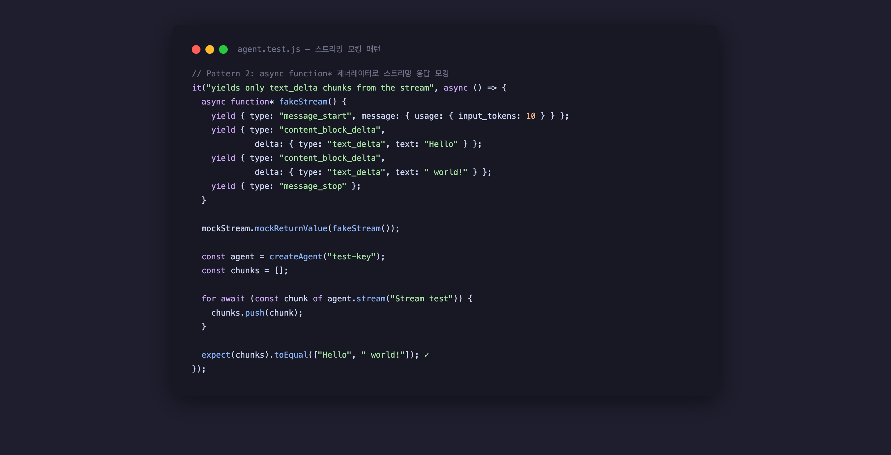

AI 에이전트 코드를 쓰다 보면 어느 순간 테스트가 멈춘다. `ANTHROPIC_API_KEY`가 없으면 실행 자체가 안 되고, 있으면 API 요금이 나간다. 스트리밍 응답은 어떻게 테스트하지? 이런 생각이 드는 순간 테스트 작성을 포기하게 된다.

이 글은 그 지점을 해결하는 실전 패턴을 담았다. Vitest 4.1.7과 `@anthropic-ai/sdk 0.100.1`을 기준으로, 직접 샌드박스에서 코드를 돌려가며 확인한 내용이다. 결론부터: 9개 테스트가 **API 호출 없이, 142ms** 안에 통과한다.

## 왜 AI 에이전트 테스트가 까다로운가

LLM을 호출하는 코드는 일반적인 함수와 다른 몇 가지 특성이 있다.

첫째, **외부 상태에 의존한다.** 동일한 입력에도 응답이 달라질 수 있다. 단위 테스트의 가장 기본 전제인 "같은 입력 → 같은 출력"이 성립하지 않는다. 둘째, **스트리밍 응답은 `AsyncIterable`이다.** `for await...of`로 소비하는 객체를 Vitest로 모킹하려면 일반 `mockResolvedValue()`로는 부족하다. 셋째, **SDK의 기본 export가 클래스다.** `new Anthropic()`으로 인스턴스를 만드는데, 이걸 `vi.mock()`으로 가로채려면 한 가지 함정이 있다.

이 세 가지 문제를 순서대로 해결한다.

## 프로젝트 구조

샌드박스에서 확인한 최소 구조다.

```
my-agent/
├── package.json          # "type": "module" 필수
├── src/
│   ├── agent.js          # 테스트 대상: Anthropic SDK를 감싸는 에이전트
│   └── __tests__/
│       └── agent.test.js # Vitest 테스트 파일
└── node_modules/
```

`"type": "module"` 없으면 `vi.mock()` 호이스팅이 예상대로 동작하지 않는 경우가 있으니 주의.

```bash
npm install vitest@4 @anthropic-ai/sdk --save-dev
# Vitest 4.1.7, @anthropic-ai/sdk 0.100.1 설치됨
```

## 패턴 1 — 클래스 생성자를 모킹하는 올바른 방법

이게 가장 흔히 막히는 지점이다. `vi.mock()`으로 Anthropic 클래스를 모킹할 때 **반드시 `function` 키워드를 써야 한다.** 화살표 함수로 쓰면 아래와 같은 에러가 난다.

```
TypeError: () => ({ ... }) is not a constructor
```

왜냐면 JavaScript에서 화살표 함수는 prototype이 없어 `new`로 호출할 수 없다. `vi.fn().mockImplementation()` 안에 화살표 함수를 넣으면 `new Anthropic()`을 호출하는 순간 런타임 에러가 발생한다.

```javascript
// ❌ 이렇게 하면 TypeError
vi.mock("@anthropic-ai/sdk", () => {
  const MockAnthropic = vi.fn().mockImplementation(() => ({
    messages: { create: mockCreate }
  }));
  return { default: MockAnthropic };
});

// ✅ function 키워드를 써야 new로 호출 가능
const mockCreate = vi.fn();
const mockStream = vi.fn();

vi.mock("@anthropic-ai/sdk", () => {
  const MockAnthropic = vi.fn().mockImplementation(function () {
    this.messages = {
      create: mockCreate,
      stream: mockStream,
    };
  });
  return { default: MockAnthropic };
});
```

`mockCreate`와 `mockStream`을 `vi.mock()` 바깥에 선언하면 각 테스트에서 `beforeEach(() => vi.clearAllMocks())`로 초기화하면서 재사용할 수 있다.

## 패턴 2 — 단순 API 호출 테스트

`messages.create()`를 테스트하는 가장 기본 패턴이다.

```javascript
it("returns content and token counts from the API", async () => {
  mockCreate.mockResolvedValue({
    content: [{ type: "text", text: "Hello, I am an AI assistant." }],
    usage: { input_tokens: 15, output_tokens: 8 },
  });

  const agent = createAgent("test-key");
  const result = await agent.chat("Say hello");

  expect(result.content).toBe("Hello, I am an AI assistant.");
  expect(result.inputTokens).toBe(15);
  expect(result.outputTokens).toBe(8);
  expect(mockCreate).toHaveBeenCalledOnce();
});
```

`mockResolvedValue()`는 `Promise.resolve(value)`를 반환하는 것과 같다. API 응답 구조를 그대로 흉내내면 된다. 인자 검증도 추가할 수 있다.

```javascript
it("passes the system prompt correctly to the API", async () => {
  mockCreate.mockResolvedValue({
    content: [{ type: "text", text: "Arrr, I be a pirate!" }],
    usage: { input_tokens: 20, output_tokens: 6 },
  });

  const agent = createAgent("test-key");
  await agent.chat("Who are you?", "You are a pirate. Respond in pirate speak.");

  const callArgs = mockCreate.mock.calls[0][0];
  expect(callArgs.system).toBe("You are a pirate. Respond in pirate speak.");
  expect(callArgs.messages[0].content).toBe("Who are you?");
  expect(callArgs.model).toBe("claude-haiku-4-5-20251001");
});
```

`mockCreate.mock.calls[0][0]`이 첫 번째 호출의 첫 번째 인자다. API에 정확한 모델과 시스템 프롬프트가 전달되는지 명시적으로 검증할 수 있다.

## 패턴 3 — async function* 제너레이터로 스트리밍 응답 모킹

이게 이 글의 핵심이다. Anthropic SDK의 `messages.stream()`은 `AsyncIterable<MessageStreamEvent>`를 반환한다. 이걸 `mockResolvedValue()`로는 흉내낼 수 없다.



해결책은 `async function*` 제너레이터 함수다. `mockReturnValue(fakeStream())`으로 제너레이터 인스턴스를 반환하면, `for await...of`가 정확히 원하는 이벤트를 소비한다.

```javascript
it("yields only text_delta chunks from the stream", async () => {
  // Anthropic SSE 스트림을 정확히 재현하는 async generator
  async function* fakeStream() {
    yield { type: "message_start", message: { usage: { input_tokens: 10 } } };
    yield { type: "content_block_start", content_block: { type: "text", text: "" } };
    yield { type: "content_block_delta", delta: { type: "text_delta", text: "Hello" } };
    yield { type: "content_block_delta", delta: { type: "text_delta", text: " world" } };
    yield { type: "content_block_delta", delta: { type: "text_delta", text: "!" } };
    yield { type: "message_delta", delta: { stop_reason: "end_turn" } };
    yield { type: "message_stop" };
  }

  mockStream.mockReturnValue(fakeStream());  // mockResolved가 아닌 mockReturn

  const agent = createAgent("test-key");
  const chunks = [];

  for await (const chunk of agent.stream("Stream test")) {
    chunks.push(chunk);
  }

  expect(chunks).toEqual(["Hello", " world", "!"]);
  expect(chunks.join("")).toBe("Hello world!");
});
```

주의할 점: `mockReturnValue(fakeStream())`을 써야 한다. `mockResolvedValue()`를 쓰면 `for await...of`가 Promise를 소비하려다 타입 에러가 난다.

필터링도 테스트할 수 있다. 실제 Anthropic 스트림에는 `text_delta` 외의 이벤트(이미지, 도구 호출 등)도 섞여 있는데, 에이전트가 이걸 제대로 걸러내는지 검증하는 것이 중요하다.

```javascript
it("filters out non-text-delta events from the stream", async () => {
  async function* fakeStream() {
    yield { type: "content_block_delta", delta: { type: "text_delta", text: "Text only" } };
    yield { type: "content_block_delta", delta: { type: "image_delta", data: "base64..." } };
    yield { type: "message_stop" };
  }

  mockStream.mockReturnValue(fakeStream());

  const agent = createAgent("test-key");
  const chunks = [];

  for await (const chunk of agent.stream("Non-text events test")) {
    chunks.push(chunk);
  }

  expect(chunks).toEqual(["Text only"]); // image_delta는 필터링됨
});
```

## 패턴 4 — LLM 기반 분류기(Classifier) 테스트

LLM을 분류기로 쓰는 패턴은 흔하다. "이 사용자 메시지가 질문인지, 명령인지" 같은 판단을 모델에 맡기는 방식인데, 이게 테스트하기 가장 까다롭다. LLM 출력이 항상 예측 가능하지 않기 때문이다.

[Vercel AI SDK로 스트리밍 에이전트를 구현하는 과정](/ko/blog/ko/vercel-ai-sdk-claude-streaming-agent-2026)에서도 비슷한 문제를 다뤘는데, 핵심은 분류기 로직을 LLM 호출과 분리해서 각각 테스트하는 것이다.

```javascript
// 에이전트 코드: LLM 출력을 대문자로 변환하고 유효값만 허용
async function classifyIntent(text) {
  const result = await chat(
    `Classify: "${text}". Return only: QUESTION, COMMAND, FEEDBACK, OTHER.`,
    "You are an intent classifier."
  );

  const category = result.content.trim().toUpperCase();
  const validCategories = ["QUESTION", "COMMAND", "FEEDBACK", "OTHER"];
  return validCategories.includes(category) ? category : "OTHER";
}
```

이렇게 구현하면 세 가지 경우를 독립적으로 테스트할 수 있다.

```javascript
// 케이스 1: 정상 분류
it("returns QUESTION for a question-type intent", async () => {
  mockCreate.mockResolvedValue({
    content: [{ type: "text", text: "QUESTION" }],
    usage: { input_tokens: 30, output_tokens: 1 },
  });

  const agent = createAgent("test-key");
  const category = await agent.classifyIntent("What is the weather today?");

  expect(category).toBe("QUESTION");
});

// 케이스 2: 소문자 정규화
it("normalizes lowercase classifier output to uppercase", async () => {
  mockCreate.mockResolvedValue({
    content: [{ type: "text", text: "command" }],  // LLM이 소문자로 답할 수도 있다
    usage: { input_tokens: 25, output_tokens: 1 },
  });

  const agent = createAgent("test-key");
  const category = await agent.classifyIntent("Run the tests");

  expect(category).toBe("COMMAND");
});

// 케이스 3: 예상 외 출력 폴백
it("falls back to OTHER for unrecognized classifier output", async () => {
  mockCreate.mockResolvedValue({
    content: [{ type: "text", text: "I cannot determine the category." }],
    usage: { input_tokens: 30, output_tokens: 8 },
  });

  const agent = createAgent("test-key");
  const category = await agent.classifyIntent("some ambiguous text");

  expect(category).toBe("OTHER");
});
```

솔직히 이 패턴이 마음에 드는 이유는, **LLM이 예상치 못한 포맷으로 응답해도 시스템이 망가지지 않도록** 방어 로직을 강제로 쓰게 만들기 때문이다. 테스트가 없었다면 폴백 케이스를 빠뜨렸을 가능성이 높다.

## 실행 결과

샌드박스에서 직접 돌린 결과다.

```bash
$ npx vitest run --reporter=verbose

 RUN  v4.1.7 /tmp/jangwook-blog-lab

 ✓ Agent.chat() › returns content and token counts from the API        1ms
 ✓ Agent.chat() › passes the system prompt correctly to the API        0ms
 ✓ Agent.chat() › handles empty content array gracefully               0ms
 ✓ Agent.stream() › yields only text_delta chunks from the stream      1ms
 ✓ Agent.stream() › filters out non-text-delta events from the stream  0ms
 ✓ Agent.stream() › handles an empty stream                            0ms
 ✓ Agent.classifyIntent() › returns QUESTION for question intent       0ms
 ✓ Agent.classifyIntent() › normalizes lowercase to uppercase          0ms
 ✓ Agent.classifyIntent() › falls back to OTHER for unknown output     0ms

 Test Files  1 passed (1)
      Tests  9 passed (9)
   Start at  15:25:23
   Duration  142ms
```

API 호출 없이, 환경 변수 없이, 142ms. 실제 Claude API 호출은 네트워크 레이턴시 포함 최소 수백 ms에서 수 초가 걸리는데, 단위 테스트 단계에서는 이게 불필요하다.

## 이 방식의 한계

이 모킹 접근법이 가진 한계도 정직하게 말해야 한다.

**실제 API 동작과 괴리가 생길 수 있다.** SDK의 내부 구현이 바뀌면 `fakeStream()`이 재현하는 이벤트 구조도 업데이트해야 한다. 실제로 [Claude Agent SDK의 Tool Use 실전 가이드](/ko/blog/ko/claude-agent-sdk-tool-use-complete-guide-2026)에서 확인했듯, SDK 버전이 올라가면 스트림 이벤트 포맷이 조금씩 달라진다.

**엣지 케이스는 E2E 테스트로 보완해야 한다.** Rate limit, 네트워크 타임아웃, 토큰 초과 같은 케이스는 모킹으로는 완전히 재현하기 어렵다. 단위 테스트는 비즈니스 로직 검증에 집중하고, 실제 API를 쓰는 통합 테스트를 별도로 두는 것이 현실적이다.

**`vi.mock()` 호이스팅 순서를 항상 의식해야 한다.** Vitest는 `vi.mock()`을 파일 최상단으로 끌어올린다. 모킹 변수를 선언한 위치와 `vi.mock()` 호출 순서가 어긋나면 예상치 못한 `undefined` 참조가 발생한다.

## TypeScript 프로젝트에서의 추가 설정

TypeScript를 쓰는 경우 `vitest.config.ts`를 명시적으로 만들어두는 것이 안정적이다. 특히 `vi.mock()` 경로 해석이 `tsconfig.json`의 path alias와 충돌할 때 이 설정이 중요하다.

```typescript
// vitest.config.ts
import { defineConfig } from 'vitest/config';

export default defineConfig({
  test: {
    globals: true,      // describe, it, expect, vi를 import 없이 사용
    environment: 'node',
    coverage: {
      provider: 'v8',
      include: ['src/**/*.ts'],
      exclude: ['src/**/*.test.ts', 'src/**/__tests__/**'],
    },
  },
});
```

`globals: true`를 설정하면 각 테스트 파일에서 `import { describe, it, expect, vi } from 'vitest'`를 생략할 수 있다. 다만 TypeScript 타입 체킹이 깨질 수 있으므로 `tsconfig.json`에도 추가해야 한다.

```json
// tsconfig.json
{
  "compilerOptions": {
    "types": ["vitest/globals"]
  }
}
```

TypeScript 타입 관점에서는, `mockCreate`를 `vi.fn()`으로만 선언하면 타입 추론이 약해진다. `vi.fn<Parameters, ReturnType>()` 형태로 명시하면 IDE 자동완성이 더 잘 작동한다.

```typescript
import type { Message } from '@anthropic-ai/sdk/resources/messages';

// 타입이 명시된 mock
const mockCreate = vi.fn<
  [Parameters<typeof client.messages.create>[0]],
  Promise<Message>
>();
```

솔직히 이 정도까지 타입을 맞추는 건 처음엔 과할 수 있다. 나는 보통 `vi.fn()`으로 시작해서 타입 에러가 거슬릴 때 점진적으로 타입을 추가하는 방식을 선호한다.

## vi.spyOn으로 부분 모킹하기

전체 모듈이 아니라 특정 메서드만 감시하거나 대체해야 할 때는 `vi.spyOn()`이 유용하다. 예를 들어 에이전트가 이미 인스턴스화된 상태에서 특정 메서드의 호출 횟수만 추적하고 싶을 때:

```javascript
import { createAgent } from '../agent.js';

it("classifyIntent calls chat() internally exactly once", async () => {
  const agent = createAgent("test-key");

  // chat 메서드를 스파이로 감싸기 (원본 구현 유지)
  const chatSpy = vi.spyOn(agent, 'chat').mockResolvedValue({
    content: "QUESTION",
    inputTokens: 10,
    outputTokens: 1,
  });

  await agent.classifyIntent("What time is it?");

  expect(chatSpy).toHaveBeenCalledOnce();
  expect(chatSpy).toHaveBeenCalledWith(
    expect.stringContaining("What time is it?"),
    expect.any(String)
  );
});
```

`vi.spyOn()`은 원본 메서드를 감싸는 래퍼를 만들기 때문에, `mockResolvedValue()`를 체이닝하지 않으면 실제 메서드가 실행된다. AI 에이전트처럼 외부 API 의존성이 있는 코드에선 거의 항상 `.mockResolvedValue()` 또는 `.mockImplementation()`을 함께 써야 한다.

## 정리

Vitest 4로 Anthropic SDK를 모킹할 때 기억해야 할 핵심 세 가지다.

1. **`vi.fn().mockImplementation(function() {...})`** — `new`로 호출되는 클래스 모킹은 반드시 `function` 키워드
2. **`async function*` 제너레이터** — 스트리밍 응답 모킹은 `mockReturnValue(fakeStream())`
3. **`beforeEach(() => vi.clearAllMocks())`** — 테스트 간 상태 오염 방지 필수

프로젝트에 TypeScript를 쓰고 있다면 [MCP 서버 TypeScript 실전 튜토리얼](/ko/blog/ko/mcp-server-typescript-sdk-step-by-step-2026)과 이 글의 패턴을 조합하면, MCP 도구 핸들러를 포함한 AI 에이전트 전체를 단위 테스트 아래 둘 수 있다.

AI 에이전트 코드에 테스트가 없는 가장 큰 이유가 "어떻게 모킹하는지 몰라서"인 경우가 많다. 위 패턴들이 그 진입장벽을 낮춰줬으면 좋겠다.
