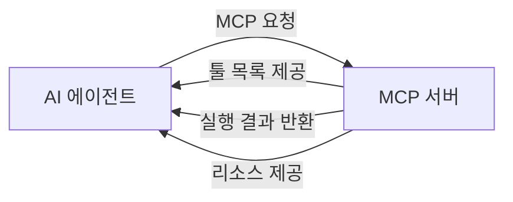
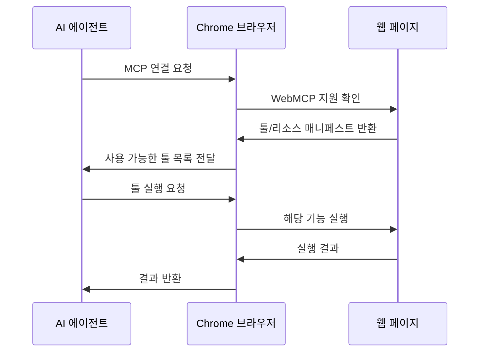
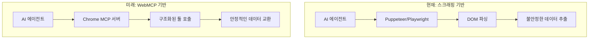

## 개요

Google Chrome 146에서 <strong>WebMCP</strong>가 도입됩니다. 이것은 브라우저 자체가 MCP(Model Context Protocol) 서버로 동작하여, AI 에이전트가 브라우저를 직접 툴 서버로 활용할 수 있게 하는 혁신적인 기능입니다.

기존에는 AI 에이전트가 웹 페이지와 상호작용하려면 Puppeteer, Playwright 같은 별도의 자동화 도구가 필요했습니다. WebMCP는 이 패러다임을 완전히 바꿉니다. 브라우저가 스스로 <strong>MCP 서버</strong>가 되어, AI 에이전트에게 구조화된 툴과 데이터를 직접 제공하는 것입니다.

## MCP(Model Context Protocol)란?

MCP는 Anthropic이 제안한 오픈 프로토콜로, AI 모델과 외부 도구·데이터 소스 간의 표준화된 통신 규격입니다.



MCP의 핵심 구성 요소는 다음과 같습니다:

- <strong>Tools</strong>: AI가 호출할 수 있는 함수 (검색, 폼 입력, 페이지 조작 등)
- <strong>Resources</strong>: AI가 읽을 수 있는 구조화된 데이터
- <strong>Prompts</strong>: 사전 정의된 프롬프트 템플릿

## WebMCP의 작동 원리

WebMCP는 웹 페이지가 자신의 기능을 MCP 서버로 노출할 수 있게 합니다. 웹 개발자는 자신의 사이트에서 AI 에이전트가 사용할 수 있는 툴과 데이터를 선언적으로 정의합니다.

### 아키텍처



### 핵심 변화

| 구분 | 기존 방식 | WebMCP |
|------|----------|--------|
| 브라우저 제어 | Puppeteer/Playwright | 네이티브 MCP |
| 페이지 이해 | DOM 파싱/스크래핑 | 구조화된 리소스 |
| 상호작용 | CSS 셀렉터 기반 | 선언적 툴 호출 |
| 인증/권한 | 수동 설정 | 브라우저 내장 |
| 안정성 | UI 변경 시 깨짐 | API 수준 안정성 |

## 웹 개발자를 위한 WebMCP 구현

웹 개발자는 자신의 사이트에 WebMCP를 구현하여 AI 에이전트가 활용할 수 있는 기능을 노출할 수 있습니다.

### 예시: 전자상거래 사이트

```javascript
// WebMCP 툴 정의 예시
navigator.mcp.registerTool({
  name: "search_products",
  description: "상품을 검색합니다",
  inputSchema: {
    type: "object",
    properties: {
      query: { type: "string", description: "검색 키워드" },
      category: { type: "string", description: "카테고리 필터" },
      maxPrice: { type: "number", description: "최대 가격" }
    },
    required: ["query"]
  },
  handler: async (params) => {
    const results = await searchAPI(params);
    return { products: results };
  }
});

// 리소스 등록
navigator.mcp.registerResource({
  uri: "cart://current",
  name: "현재 장바구니",
  description: "현재 사용자의 장바구니 내용",
  handler: async () => {
    return { items: await getCartItems() };
  }
});
```

### 예시: SaaS 대시보드

```javascript
// 대시보드 데이터를 AI 에이전트에 제공
navigator.mcp.registerTool({
  name: "generate_report",
  description: "지정된 기간의 분석 리포트를 생성합니다",
  inputSchema: {
    type: "object",
    properties: {
      startDate: { type: "string", format: "date" },
      endDate: { type: "string", format: "date" },
      metrics: {
        type: "array",
        items: { type: "string" }
      }
    }
  },
  handler: async (params) => {
    return await dashboardAPI.generateReport(params);
  }
});
```

## AI 에이전트 생태계에 미치는 영향

WebMCP는 AI 에이전트의 웹 활용 방식을 근본적으로 변화시킵니다.



### 1. 스크래핑의 종말

웹 사이트가 직접 구조화된 인터페이스를 제공하므로, 불안정한 DOM 스크래핑이 필요 없어집니다. 사이트 UI가 변경되어도 MCP 인터페이스는 유지됩니다.

### 2. 에이전트 개발 간소화

AI 에이전트 개발자는 각 사이트별 커스텀 스크래핑 로직을 작성할 필요 없이, 표준화된 MCP 프로토콜로 모든 WebMCP 지원 사이트와 통신할 수 있습니다.

### 3. 보안과 권한 관리

브라우저가 중간 레이어로 동작하므로, 사용자의 동의 하에 안전하게 AI 에이전트의 접근을 제어할 수 있습니다. 기존 브라우저 보안 모델(CORS, CSP 등)이 그대로 적용됩니다.

### 4. 새로운 비즈니스 모델

웹 서비스가 AI 에이전트를 위한 <strong>MCP 엔드포인트</strong>를 제공하는 것이 SEO만큼 중요한 전략이 될 수 있습니다. "AI 에이전트 최적화(AEO)"라는 새로운 영역이 등장할 것입니다.

## 다른 브라우저와 표준화 전망

현재 WebMCP는 Chrome 146에서 먼저 도입되지만, 웹 표준화를 통해 다른 브라우저로 확산될 가능성이 높습니다.

- <strong>Firefox</strong>: Mozilla의 AI 전략과 맞물려 도입 검토 가능성
- <strong>Safari</strong>: Apple Intelligence와의 통합 관점에서 주목
- <strong>Edge</strong>: Copilot과의 자연스러운 연동이 예상됨

MCP가 이미 오픈 프로토콜로 설계되어 있어, 브라우저 간 호환성 확보가 비교적 용이할 것으로 보입니다.

## 개발자가 준비해야 할 것

### 단기 (3-6개월)

1. MCP 프로토콜 스펙 학습
2. 자사 서비스의 AI 에이전트 활용 시나리오 도출
3. Chrome 146 베타에서 WebMCP 실험

### 중기 (6-12개월)

1. WebMCP 인터페이스 설계 및 구현
2. AI 에이전트 호환 테스트
3. 보안 및 권한 모델 수립

### 장기 (1년 이상)

1. AEO(AI Engine Optimization) 전략 수립
2. 에이전트 전용 분석·모니터링 도입
3. 멀티 에이전트 시나리오 대응

## 결론

WebMCP는 웹의 다음 진화 단계입니다. 웹 페이지가 단순히 사람이 보는 UI에서, <strong>AI 에이전트가 활용하는 구조화된 서비스</strong>로 변모합니다.

Chrome 146의 WebMCP 도입은 시작에 불과합니다. 앞으로 모든 웹 서비스가 "사람을 위한 UI"와 "AI를 위한 MCP 인터페이스"를 동시에 제공하는 시대가 올 것입니다.

웹 개발자에게 이것은 단순한 새 기능이 아닌, <strong>웹의 존재 목적 자체를 재정의하는 전환점</strong>입니다.

## 참고 자료

- [MCP 공식 사이트](https://modelcontextprotocol.io/)
- [Chrome 146 릴리스 노트](https://developer.chrome.com/blog)
- [@firt의 WebMCP 소개 트윗](https://x.com/firt/status/2020903127428313461)
- [Anthropic MCP 발표](https://www.anthropic.com/news/model-context-protocol)
