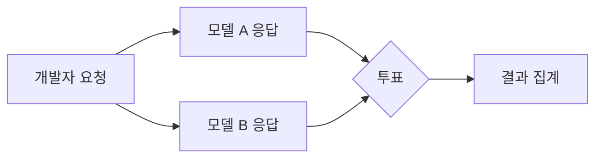
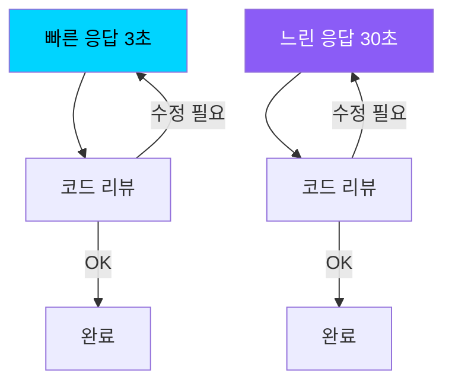

## 개요

Windsurf가 자사 AI 코딩 어시스턴트에 도입한 <strong>Arena Mode</strong>에서 흥미로운 투표 결과가 나왔습니다. 4만 표 이상이 모인 이 대규모 실험에서, 개발자들은 <strong>정확도보다 속도를 압도적으로 우선시</strong>한다는 결론이 도출되었습니다.

이 결과는 AI 코딩 도구 시장의 방향성에 중요한 시사점을 던집니다. 완벽한 코드를 느리게 생성하는 것보다, 빠르게 생성하고 빠르게 수정하는 워크플로우를 개발자들이 선호한다는 것입니다.

## Arena Mode란?

Windsurf의 Arena Mode는 두 가지 AI 모델의 응답을 나란히 보여주고, 개발자가 더 나은 응답을 투표하는 <strong>블라인드 테스트</strong> 방식입니다.

이 방식은 Chatbot Arena(LMSYS)와 유사하지만, <strong>실제 코딩 작업</strong>에 특화되어 있다는 점이 차별화됩니다. 개발자들은 코드 완성, 리팩토링, 디버깅 등 실전 작업에서 두 모델을 비교 평가합니다.

## 핵심 발견: 속도가 정확도를 이긴다

4만 표 이상의 투표 데이터에서 도출된 핵심 인사이트는 명확합니다:

- <strong>빠른 응답을 제공하는 모델이 일관되게 높은 선호도</strong>를 받았습니다
- 약간의 정확도 차이는 속도 우위 앞에서 무시되는 경향이 나타났습니다
- 특히 <strong>반복적인 코드 작성과 수정 작업</strong>에서 이 경향이 두드러졌습니다

### 왜 속도인가?

개발자의 실제 워크플로우를 생각하면 이 결과는 자연스럽습니다:

1. <strong>빠른 피드백 루프</strong>: 코드를 빠르게 받아 실행하고, 문제가 있으면 바로 수정 요청
2. <strong>컨텍스트 유지</strong>: 응답이 늦으면 개발자의 사고 흐름이 끊어짐
3. <strong>반복 가능성</strong>: 첫 응답이 완벽하지 않아도 빠르게 2~3회 반복하면 원하는 결과에 도달
4. <strong>완벽보다 충분</strong>: 80% 정확한 코드를 빠르게 받는 것이 100% 정확한 코드를 오래 기다리는 것보다 효율적

빠른 모델은 3초 × 3회 = 9초에 완료할 수 있는 반면, 느린 모델은 30초 × 1회라도 절대 시간에서 불리합니다.

## AI 코딩 도구 시장에 주는 시사점

### 1. 모델 선택 전략의 변화

이 결과는 AI 코딩 도구 제공업체들의 모델 선택 전략에 직접적인 영향을 미칩니다. 가장 정확한 최신 모델보다, <strong>속도와 정확도의 균형이 좋은 모델</strong>이 사용자 만족도에서 우위를 점할 수 있습니다.

### 2. 스트리밍과 점진적 생성의 중요성

체감 속도를 높이는 기술이 핵심 경쟁력이 됩니다:

- <strong>토큰 스트리밍</strong>: 전체 응답 완료 전에 부분 결과를 먼저 표시
- <strong>추론형 생성</strong>: 먼저 골격을 생성하고 세부사항을 점진적으로 채움
- <strong>캐싱 전략</strong>: 유사 요청에 대한 응답 시간 단축

### 3. "좋은 코드"의 재정의

개발자들에게 "좋은 AI 코드"란 <strong>완벽한 코드가 아니라 빠르게 작업할 수 있는 출발점</strong>입니다. 이는 AI 코딩 도구의 평가 기준 자체를 변화시킵니다:

| 전통적 평가 기준 | Arena Mode가 보여준 현실 |
|---|---|
| 코드 정확도 | 응답 속도 |
| 첫 시도 성공률 | 반복 수정 효율 |
| 벤치마크 점수 | 체감 생산성 |

## 다른 벤치마크와의 비교

SWE-bench나 HumanEval 같은 기존 벤치마크는 <strong>정확도 중심</strong>으로 모델을 평가합니다. Arena Mode의 결과는 이러한 벤치마크가 실제 개발자 선호도와 괴리가 있을 수 있음을 시사합니다.

실제 개발 환경에서는:

- 벤치마크 1위 모델이 반드시 가장 선호되는 모델이 아님
- <strong>체감 속도(perceived speed)</strong>가 실제 정확도보다 만족도에 큰 영향
- 개발자들은 "느리지만 정확한" 것보다 "빠르고 대충 맞는" 것을 선택

## 결론

Windsurf Arena Mode의 4만 표 투표 결과는 AI 코딩 도구 업계에 명확한 메시지를 전달합니다: <strong>개발자가 원하는 것은 완벽함이 아니라 속도입니다.</strong>

이는 단순히 "빠르면 좋다"는 이야기가 아닙니다. 현대 소프트웨어 개발이 <strong>반복적이고 점진적인 프로세스</strong>로 진화했기 때문입니다. AI 코딩 도구는 완벽한 한 방이 아니라, 빠른 피드백 루프를 가능하게 하는 도구로 자리매김해야 합니다.

AI 코딩 도구를 평가할 때, 벤치마크 점수뿐 아니라 <strong>실제 작업에서의 체감 속도</strong>를 함께 고려해 보세요.

## 참고 자료

- [Windsurf Arena Mode 투표 결과 (X/Twitter)](https://x.com/windsurf/status/2021693447099273530)
- [Windsurf 공식 사이트](https://windsurf.com)
- [Chatbot Arena (LMSYS)](https://chat.lmsys.org/)
