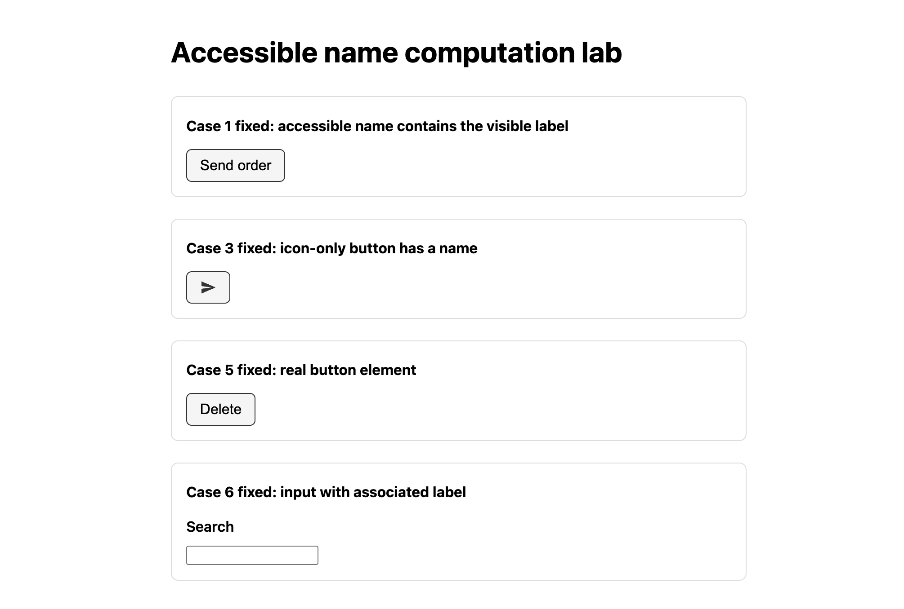

我给一个按钮加了 `aria-label="Submit order"`。出于好意。屏幕上只写着「Send」，我想让读屏软件用户听到更清楚的说法，比如「提交订单」。可当我打开这个按钮的无障碍树，看到的是：

```text
button "Submit order"
```

眼睛看到的字是「Send」，机器读出的名字是「Submit order」。两者对不上。就这一处错位，语音控制用户说「点 Send」就毫无反应。做过一点无障碍的人都懂到这里为止。新东西是第三个受害者。我跑了一遍 Lighthouse 13.3.0，评分表上多了一个陌生的类别 `Agentic Browsing`，我那个图标按钮在这里拿了个<strong>零分</strong>。因为无障碍树如今是AI智能体读页面的接口。

所以我没停在嘴上说。我在沙盒里把它复现了：六个常见按钮，各自用不同方式写标记，然后读无障碍树，把无障碍分和 Agentic Browsing 分并排测出来。下面的每一段日志、每一个数字，都是那次运行的真实输出。

## 什么是无障碍名称，为什么三方会同时受损

先打地基。<strong>无障碍名称(accessible name)</strong>是机器称呼某个UI元素时用的名字。按钮、链接、输入框这类可交互元素，每一个都会计算出一个这样的名字。计算规则由W3C的另一份标准[Accessible Name and Description Computation](https://www.w3.org/TR/accname-1.2/)定义。大致优先级如下：

1. `aria-labelledby` 指向元素的文本
2. `aria-label` 的值
3. 元素本身的名字来源(`<label for>` 关联的标签、图片的 `alt`、按钮里的文本等)
4. `title` 属性(最后的兜底)

要记住的关键是：<strong>上面的会覆盖下面的</strong>。一加 `aria-label`，按钮里那些看得见的字就被排除出名字计算了。这正是开头那个坑。出于好意加的 `aria-label`，反倒把屏幕上的「Send」抹掉了。

这些名字汇到一起，构成<strong>无障碍树(accessibility tree)</strong>。浏览器不会把DOM原样交出去。它剥掉视觉信息，只留下角色(role)、名字和状态，另建一棵树交给辅助技术。这里有个改变全局的事实：现在读这棵树的，一下子变成了三方。

- <strong>读屏软件</strong>:视障用户听到的名字，就是这棵树里的名字。
- <strong>语音控制</strong>:用户说「点确定」，软件就去找无障碍名称为「确定」的控件。
- <strong>AI智能体</strong>:在浏览器里操作页面的智能体，读的不是像素而是这棵树，据此列出「我能点的东西」。

所以一旦标记让名字出错，三方同时崩。在我看来，这标志着无障碍从一件善事，变成了一项实打实的功能需求。以前是「为读屏用户着想」才去理名字；现在还要因为「语音接口和AI智能体按不了这个按钮」而去理。活儿一样，理由多了。

我之前写过[AI爬虫不执行你的JavaScript、只读raw HTML](/zh/blog/zh/ai-crawlers-dont-render-javascript-csr-2026/)。智能体在这之上更进一步。爬虫抓的是文本，智能体则从树里挑出「可点击的控件」，真的去尝试操作。两者归根结底一样：你服务器发出的标记，就是它们能拿到的全部。

## 同一个按钮，两个名字 — 我亲手打开了这棵树

理论到此为止。我在临时沙盒里做了一页静态HTML，故意把六个常见控件写成不同的标记，再快照Chrome的无障碍树。真实输出如下：

```text
button "Submit order"          ← 屏幕文本是 "Send"（不一致）
button "Send order to warehouse"  ← 包含屏幕文本 "Send order"（通过）
button                         ← 只有图标的按钮，没有名字
button "Send message"          ← 给图标按钮加了名字（通过）
StaticText "Delete"            ← 用div做的按钮：根本不是控件
textbox "Search"               ← 名字取自placeholder（脆弱）
```

一行行拆开看，全是你每周都会撞上的错误。

<strong>第一行</strong>就是开头那个 Label in Name 违规。`aria-label` 覆盖了屏幕文本，于是「看到的」和「读出的」裂开了。

<strong>第三行</strong>名字整个是空的。这是个只有图标的按钮，SVG上加了 `aria-hidden="true"` 当装饰处理，按钮本体就一个名字来源都不剩。读屏软件只会念一句「按钮」。哪个按钮？没人知道。

最扎眼的是<strong>第五行</strong>。用 `<div class="btn">Delete</div>` 做的删除按钮，在树里显示为 `StaticText`，而不是 `button`。也就是说它作为控件<strong>根本不存在</strong>。看着像按钮，但对读屏软件、对语音控制、对AI智能体来说，它只是一段文字。键盘焦点也落不上去。这个删除按钮，只有用鼠标的人能按。

第六行的 `textbox "Search"` 看着通过，其实是陷阱。名字取自 `placeholder`。placeholder 不是标签。一开始输入它就消失，有些辅助技术不认它当名字。一个屏幕上没有可见标签的搜索框，从无障碍角度看，跟没名字的输入框没什么两样。

这六行为什么重要？因为浏览器开发者工具的无障碍面板和树快照，给你看的是<strong>实际名字，而不是分数</strong>。这正是 Lighthouse 满分不该让你松劲的原因。分数只是概括通过与否；「这个按钮到底被读成什么」，只有直接看树才知道。

## WCAG 2.5.3 Label in Name — 当 aria-label 盖住可见文字

第一行的不一致不是凭感觉，而是白纸黑字的失败。W3C的[Understanding SC 2.5.3: Label in Name](https://www.w3.org/WAI/WCAG22/Understanding/label-in-name)把它定为<strong>A级</strong>，也就是最基础的等级。官方原话是：

> 要满足 2.5.3，构成可见标签的文本串必须<strong>完整无缺地</strong>出现在无障碍名称之中。

W3C给的理由很实在。语音输入用户靠念出屏幕上看到的字来操作控件。要按写着「Send」的按钮，就说「Send」；可要是无障碍名称是「Submit order」，软件就匹配失败。用户看到并念出的那个词，压根不在名字里。

这里要纠正一个常见误解。`aria-label` 不是用来「加一句更贴心的说明」的工具。它是一道<strong>替换</strong>名字的命令。所以只要控件已经有可见文本，稳妥的做法就是别随手给它套 `aria-label`。真需要扩展，就照W3C建议的来:<strong>把可见标签放在最前</strong>，再往后接。第二行的「Send order to warehouse」就是这个写法——它原封不动地含着屏幕上的「Send order」，所以过 2.5.3。

我在实际项目里见到这类违规，最大的来源是「图标+文字」按钮。设计系统组件把 `aria-label` 当prop接收，开发者往里塞的文案跟可见文本不一样。或者标签和 aria-label 分放在不同翻译文件里，只改了一边。用眼睛绝对抓不到。你得打开树，或者跑自动检查。

## Lighthouse 现在会给 Agentic Browsing 打分

接下来是这次实验真正让我意外的地方。同一页跑 Lighthouse 13.3.0，在熟悉的 Accessibility 旁边，多出一个新类别 `Agentic Browsing`。里面的审计项叫 `agent-accessibility-tree`，描述写着：

> 结构良好的无障碍树能帮助AI智能体导航并与页面交互。

Google 的 Lighthouse 团队，把「无障碍树 = AI智能体的接口」这个命题，直接做成了一条审计项。我打算在这篇文章里论证的东西，工具已经先替我打了分。把坏页面和修好的页面并排测，结果是这样：

| 类别 | 坏的版本 | 修好的版本 |
|---|---|---|
| Accessibility | 90 | 100 |
| Agentic Browsing | 0 | 100 |
| SEO | 75 | 100 |
| Best Practices | 100 | 100 |



无障碍分只从90升到100，涨了十分；Agentic Browsing 则从<strong>0跳到100</strong>。自动检查判为失败的无障碍项有三条：

- `label-content-name-mismatch` — 第一行的 2.5.3 违规。它把失败节点精准指向 `<button aria-label="Submit order">`。
- `button-name` — 没名字的图标按钮。
- `landmark-one-main` — 缺 `<main>` 地标。

修好的版本里我做的事一点都不高明。把 `aria-label` 改成含可见文本的文案，给图标按钮加名字，把 `<div class="btn">` 换成真正的 `<button>`，给输入框接上 `<label for>`，再用 `<main>` 包住正文。几行标记而已。可就这几行，把页面向三类消费者都打开了。[用Lighthouse抓取并修复无障碍违规的完整流程](/zh/blog/zh/a11y-lighthouse-audit-fix-2026/)我另外整理过，这篇只咬住「名字」这一件事。

说实话，对这个 Agentic Browsing 类别，我既高兴又谨慎。高兴是因为「把无障碍做好，AI时代也占便宜」这句话，终于有工具撑腰了。谨慎的部分，下一段说。

## 诚实的边界 — 100分不等于「无障碍」

先说最重要的边界。<strong>Lighthouse 无障碍100分，并不能证明这个页面无障碍。</strong>这是 axe 和 Lighthouse 官方文档自己承认的。自动检查只抓得住能用规则判定的违规。用读屏软件真正走一遍流程说不说得通、焦点顺序自不自然、名字在<strong>上下文里</strong>能不能被理解——这些还得靠人来确认。100分意味着你越过了地板，不代表你摸到了天花板。

第二，Agentic Browsing 类别是<strong>全新而实验性的</strong>。它的评分方式和权重，往后随时可能变。所以别把这个分数读成「AI智能体一定能操作我的页面」的保证。它只是一个信号。跟这个类别相关的具体数值，应当当作<strong>参考值(并非官方保证)</strong>来看。

第三，修好无障碍名称，并不保证搜索排名或AI引用上升。这种保证哪儿都没有。无障碍不是买排名的小把戏，而是让已经到访(或正打算操作)的用户和智能体真正用得上页面的地基。一旦把它换算成排名分去卖，它就不再是无障碍，而成了一句口号。

第四，像第六行那样拿 placeholder 当名字，Lighthouse 可能显示为通过。但如前所述，placeholder 不是标签，各家辅助技术处理不一。这又是一个例子:「工具放行了」不等于「安全了」。自动检查和真实无障碍之间的落差，在CI里同样咬人——[axe-core 跑在真实浏览器还是 jsdom 里会左右结果](/zh/blog/zh/axe-core-ci-a11y-jsdom-vs-browser-2026/)，说的是同一条脉络。

## 今天就能落地的清单

话说到这儿，下面是代码里真正要改的东西。毁掉无障碍名称的错误，其实就那么几类。

<strong>1. 屏幕上有文字，就别用 aria-label 盖住它。</strong>非扩展不可，就把可见标签放最前。

```html
<!-- 避免:可见文字和名字对不上（2.5.3违规） -->
<button aria-label="Submit order">Send</button>

<!-- 该这么写:不必显式给名字，按钮文本就是名字 -->
<button type="button">Send order</button>

<!-- 要扩展就把可见标签放在最前 -->
<button aria-label="Send order to warehouse">Send order</button>
```

<strong>2. 只有图标的控件，一定要给名字。</strong>装饰性SVG用 `aria-hidden` 藏起来，名字加在按钮上。

```html
<button aria-label="Send message">
  <svg aria-hidden="true" viewBox="0 0 24 24"><path d="…" /></svg>
</button>
```

<strong>3. 别给 div/span 挂 onclick，用真正的 button/a。</strong>这是控件从树里整个消失的头号原因。键盘焦点、Enter/Space 行为、角色，全都白送给你。

<strong>4. 给输入框接上 `<label for>`。</strong>placeholder 不是标签。

```html
<label for="q">搜索</label>
<input id="q" type="text">
```

<strong>5. 加地标。</strong>正文用 `<main>` 包住。读屏用户和智能体都靠这套结构扫页面。

<strong>6. 看树，别看分。</strong>在 Chrome 开发者工具的 Accessibility 面板里，直接看每个控件计算出的无障碍名称(Computed name)。把屏幕上看到的字，跟实际被读出的名字，用眼睛对一遍——这30秒，比 Lighthouse 满分告诉你的多得多。

这六条都算不上什么高深技术。可只要错一条，读屏用户、语音控制用户、如今再加上AI智能体，三方就会同时卡在同一个按钮前。所谓AI时代的Web开发，并不是要你突然去学什么新东西。只是一条老的无障碍原则，因为多了一个消费者，分量变重了。

如果你想把结构化数据稳稳地从服务端输出，或者想给现有站点的无障碍树、GEO/AIO对应做一次体检，我个人接咨询和实现委托，可以通过我资料页上的联系入口找我。比起漂亮的品牌重塑，我更愿意先跟你一起看:一个按钮，是不是对三类消费者都读得对。
