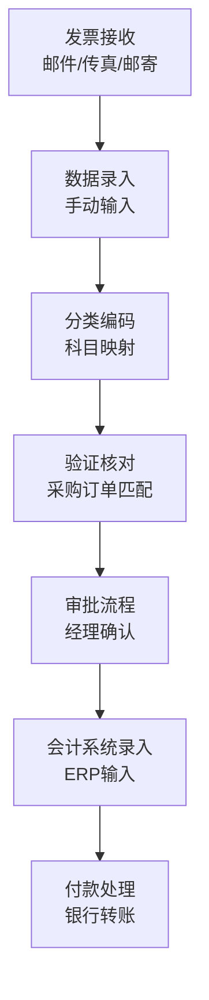
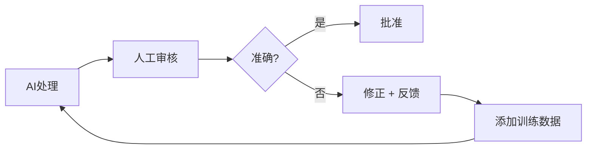
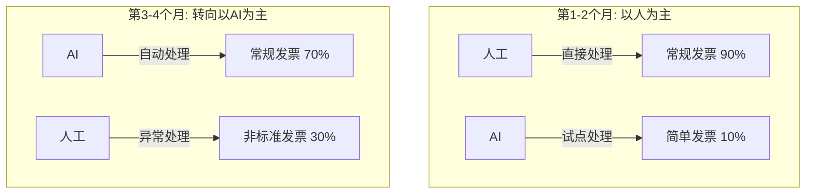
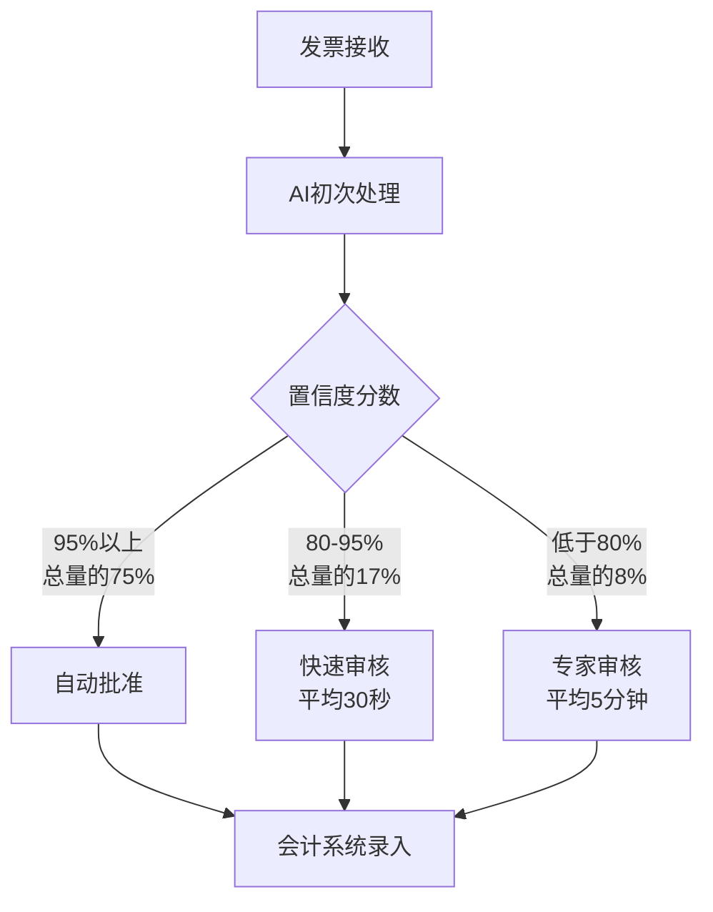

## 概述

"引入AI，成本降低97%。"

大多数工程管理者看到这样的标题，第一反应都是怀疑。我也不例外。但当我分析了一家会计事务所实际运营AI代理6个月的数据后发现，数字本身并非虚假。只是达到这些数字的过程，是任何供应商演示都不会展示的。

本文基于一家中型会计事务所（约50名员工）在发票处理业务中引入AI代理的6个月真实数据，不仅分析成本削减，还深入探讨准确率变化、人类角色转变以及导入过程中面临的现实问题。

## 导入前状态——手工发票处理的成本结构

### 现有流程

会计事务所的发票处理比想象中更加复杂。不仅仅是输入数字，还需要经过以下步骤：



### 基准成本数据

| 项目 | 数值 |
|------|------|
| 月处理发票数 | 约3,000件 |
| 每件平均处理时间 | 12分钟 |
| 每件平均成本 | $7.00 |
| 月度总处理成本 | $21,000 |
| 错误率 | 约20%（需返工） |
| 返工成本 | 每件额外$15 |

这里需要关注的是**20%的错误率**。这在行业中并不罕见，包括简单的输入错误、科目分类失误、采购订单匹配遗漏等各类错误。

## 6个月的导入过程——逐月数据分析

### 第1个月：试点导入与第一次冲击

将AI代理试点应用于全部发票的10%，约300件。

| 指标 | 手动处理 | AI处理 | 差异 |
|------|----------|--------|------|
| 每件成本 | $7.00 | $2.50 | -64% |
| 准确率 | 80% | 72% | **-8%** |
| 处理时间 | 12分钟 | 3分钟 | -75% |

**第一个月的准确率反而下降了。**这正是大多数AI导入案例中被隐藏的部分。AI模型无法适应该事务所特有的发票格式、供应商特定模式和内部科目体系。

### 第2个月：训练数据精炼与反馈循环构建



第2个月，我们构建了将人工审核员的修正数据反馈给AI模型的循环。

| 指标 | 第1个月 | 第2个月 | 变化 |
|------|---------|---------|------|
| AI处理比例 | 10% | 25% | +15% |
| 每件成本 | $2.50 | $1.80 | -28% |
| 准确率 | 72% | 81% | **+9%** |
| 人工审核时间 | 8分钟/件 | 5分钟/件 | -37% |

### 第3-4个月：转折点——人与AI的角色重新定义

第3个月发生了关键转变：AI的准确率**超过了人工单独处理的准确率（80%）**。

| 指标 | 第3个月 | 第4个月 |
|------|---------|---------|
| AI处理比例 | 50% | 70% |
| 每件成本 | $0.90 | $0.55 |
| 准确率 | 88% | 93% |
| 异常处理件数 | 450件 | 210件 |

此时人类的角色发生了根本性变化：

**之前**：数据录入员 → 直接处理所有发票
**之后**：异常处理专家 → 仅处理AI无法处理的非标准案例



### 第5-6个月：稳定化与最终数据

| 指标 | 第5个月 | 第6个月 | 与导入前对比 |
|------|---------|---------|-------------|
| AI处理比例 | 85% | 92% | — |
| 每件成本 | $0.30 | **$0.20** | **-97%** |
| 准确率 | 96% | **98%** | **+18%p** |
| 月度总成本 | $900 | $600 | -97% |
| 处理时间 | 45秒 | 30秒 | -96% |

## 数字背后的真相——隐性成本与注意事项

### 导入成本分析

标题数字"每件$7→$0.20"中未包含以下成本：

| 项目 | 成本 |
|------|------|
| AI平台许可证（年度） | $24,000 |
| 初期集成开发（3个月） | $45,000 |
| 训练数据精炼人工成本 | $18,000 |
| 员工再培训费用 | $8,000 |
| **初期投资总额** | **$95,000** |

### ROI计算

```
月度节省额：$21,000 - $600 - $2,000（许可证）= $18,400
初期投资回收期：$95,000 / $18,400 ≈ 5.2个月
年度净节省额：$18,400 × 12 - $95,000 = $125,800（第一年）
第二年起年度节省额：$18,400 × 12 = $220,800
```

**5个月即可收回投资**。这是非常有吸引力的数字，但有一个前提：在导入过程中，现有员工需要在不大量流失的情况下成功完成角色转换。

## 准确率提升机制——为什么AI比人更准确

### 人类错误 vs AI错误的差异

人类和AI的错误模式有根本区别：

| 错误类型 | 人类频率 | AI频率 |
|----------|----------|--------|
| 简单输入错误 | 高 | 几乎为零 |
| 科目分类错误 | 中等 | 低（训练后） |
| 采购订单匹配遗漏 | 高 | 非常低 |
| 非标准格式处理 | 低 | **高** |
| 金额计算错误 | 中等 | 几乎为零 |
| 上下文判断失误 | 非常低 | **中等** |

AI在**重复性、模式化的任务**中表现出压倒性优势，但在**需要上下文理解的非标准案例**中仍然需要人类参与。

### 98%准确率的构成

最终98%的准确率不是"AI单独"的结果，而是**AI + 人类混合系统**的成果：



## 人类角色的变化——最困难的部分

### 员工构成变化

| 角色 | 导入前 | 导入后 | 变化 |
|------|--------|--------|------|
| 数据录入人员 | 8人 | 0人 | -100% |
| 验证核对人员 | 4人 | 2人 | -50% |
| AI运维监控 | 0人 | 2人 | 新增 |
| 异常处理专家 | 0人 | 3人 | 新增 |
| 客户咨询顾问 | 3人 | 8人 | +167% |

总人数从15人到15人，没有变化。但**角色构成完全改变了**。原本从事简单录入工作的员工转型为直接与客户沟通的高附加值咨询岗位。

### 转型过程中的阻力与解决

坦率地说，这个过程并不顺利：

1. **第一阶段——否认（第1个月）**："AI要抢我们的工作"的认知弥漫整个团队。
2. **第二阶段——实验（第2-3个月）**：在人工修正AI错误的过程中，员工开始理解AI的局限性。
3. **第三阶段——协作（第4-5个月）**：员工体会到AI处理常规任务后，自己可以专注于更有意义的工作。
4. **第四阶段——主导（第6个月）**：员工开始主动提出AI改进建议。

## 作为工程管理者的经验教训

### 1. 准确率在初期一定会下降

任何AI系统在导入初期都可能表现不如现有系统。我称之为**"J曲线效应"**。向管理层提前说明这一J曲线，并就3个月的学习期达成共识至关重要。

### 2. 反馈循环是核心

提升AI模型性能的不是模型本身，而是**反馈循环的质量**。应该将最多的时间投入到构建人工审核员准确分类和反馈AI错误的体系中。

### 3. 人的问题比技术问题更难

技术实现3个月就足够了，但组织文化转型在6个月后仍未完全完成。作为工程管理者，最重要的角色不是写代码，而是化解团队成员的焦虑，为新角色描绘愿景。

### 4. 渐进式导入是唯一正确答案

从10% → 25% → 50% → 70% → 92%逐步提高AI处理比例，是成功的关键。如果试图一次性切换到100%，初期准确率下降就会导致项目中止。

## 向其他业务领域的扩展潜力

在发票处理取得成功后，我们正在评估将AI引入其他会计业务：

| 业务领域 | 自动化可能性 | 预期成本削减 | 难度 |
|----------|-------------|-------------|------|
| 费用报销 | 高 | 85-90% | 低 |
| 薪资处理 | 中等 | 60-70% | 中等 |
| 税务申报 | 低-中等 | 30-40% | 高 |
| 审计准备 | 中等 | 50-60% | 高 |
| 财务报告 | 中等-高 | 70-80% | 中等 |

## 结论

会计事务所的AI转型不是"魔法按钮"。从$7到$0.20的成本削减确实可以实现，但过程中必须面对初期准确率下降、员工抵触、反馈系统构建和角色重新定义等现实挑战。

作为工程管理者，我想强调三点：

1. **做好J曲线的心理准备**：前3个月是投资期。
2. **投资于人**：变革管理比技术更重要。
3. **用数据说话**：透明地分享月度指标是建立信任的基础。

AI导入的"理想"与"现实"之间的差距确实存在。但弥合这一差距的不是更好的AI模型，而是**更好的流程和更好的团队**。

## 参考资料

- [Gartner - AI in Finance and Accounting 2025](https://www.gartner.com/en/finance/topics/artificial-intelligence-in-finance)
- [McKinsey - The State of AI in 2025](https://www.mckinsey.com/capabilities/quantumblack/our-insights/the-state-of-ai)
- [ACCA - Digital Transformation in Accounting](https://www.accaglobal.com/gb/en/professional-insights/technology/digital-transformation.html)
- [IEEE - Intelligent Document Processing](https://ieeexplore.ieee.org/document/9782342)
