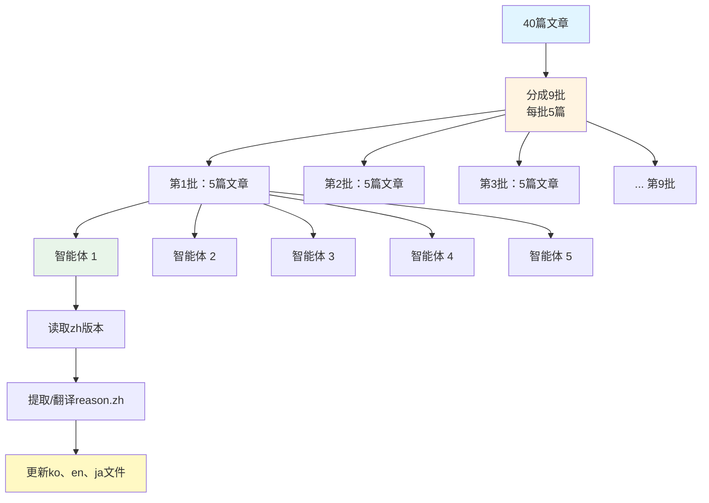

## 引言

2025年11月，我的博客迎来了一个重要的转折点。我决定为原本以韩语、英语、日语运营的技术博客<strong>添加中文（简体）支持</strong>。

来自中国的流量一直在稳步增长，我希望也能为中文圈的开发者提供优质内容。然而，为40篇文章添加中文版本，将所有UI组件多语言化，并优化SEO，这项工作并不简单。

本文将详细分享<strong>为基于Astro的多语言博客添加新语言的全过程</strong>。从文件结构设计到大规模翻译自动化、SEO优化 - 透明地记录在实践中遇到的问题和解决方案。

### 阅读本文您将了解

- 利用Astro Content Collections设计多语言内容结构
- 如何用并行智能体自动化更新40篇文章 × 3种语言 = 120个文件
- 各语言的站点地图、RSS feed和元数据配置策略
- UI组件多语言化最佳实践
- 在保持翻译质量的同时将工作时间缩短90%的自动化工作流

## 第一节：文件结构设计

扩展多语言博客时最重要的是<strong>清晰且可扩展的文件结构</strong>。Astro Content Collections是实现这一目标的完美工具。

### 按语言分类的文件夹结构

```
src/content/blog/
├── ko/          # 韩语
├── en/          # 英语
├── ja/          # 日语
└── zh/          # 中文（新增）
```

<strong>核心原则</strong>：
1. <strong>相同的文件名</strong>：在所有语言文件夹中使用相同的文件名保存
   - 示例：`ko/ai-agent-collaboration-patterns.md`、`zh/ai-agent-collaboration-patterns.md`
2. <strong>通过语言代码自动识别</strong>：通过文件夹路径识别语言（`getCollection`过滤）
3. <strong>共享资源</strong>：heroImage无论语言如何都从`src/assets/blog/`共享

### 实际代码示例

```typescript
// src/pages/[lang]/blog/[...slug].astro
import { getCollection } from 'astro:content';

export async function getStaticPaths() {
  const allPosts = await getCollection('blog');

  // 按语言过滤
  const languages = ['ko', 'en', 'ja', 'zh'];
  const paths = [];

  for (const lang of languages) {
    const langPosts = allPosts.filter(post => post.id.startsWith(`${lang}/`));

    for (const post of langPosts) {
      const slug = post.id.replace(`${lang}/`, '');
      paths.push({
        params: { lang, slug },
        props: { post }
      });
    }
  }

  return paths;
}
```

### 优点

- <strong>清晰的分离</strong>：各语言内容物理分离，便于管理
- <strong>易于维护</strong>：可以只修改、添加或删除特定语言
- <strong>类型安全</strong>：Astro自动生成类型，支持TypeScript
- <strong>可扩展性</strong>：添加新语言时只需创建文件夹

## 第二节：内容集合模式

Astro Content Collections<strong>确保Frontmatter的类型安全</strong>，并能系统地管理多语言字段。

### Frontmatter结构

```yaml
---
title: 'AI智能体协作模式：用5个专业Agent构建全栈应用'
description: 通过协调Architecture、Coding、Testing、Security、DevOps Agent构建生产级应用的实战指南
pubDate: '2025-10-16'
heroImage: ../../../assets/blog/ai-agent-collaboration-patterns-hero.jpg
tags:
  - ai
  - agents
  - architecture
relatedPosts:
  - slug: self-healing-ai-systems
    score: 0.94
    reason:
      ko: '자동화, AI/ML, 아키텍처 분야에서 유사한 주제를 다루며 비슷한 난이도입니다.'
      ja: 自動化、AI/ML、アーキテクチャ分野で類似したトピックを扱い、同程度の難易度です。
      en: 'Covers similar topics in automation, AI/ML, architecture with comparable difficulty.'
      zh: 涵盖自动化、AI/ML、架构等相似主题，难度相当。
---
```

### relatedPosts中的多语言reason字段

我博客的特色是<strong>为每篇推荐文章提供4种语言的推荐理由</strong>。这对用户体验和SEO都有积极影响。

```typescript
// src/content.config.ts
import { defineCollection, z } from 'astro:content';

const blogCollection = defineCollection({
  type: 'content',
  schema: ({ image }) => z.object({
    title: z.string(),
    description: z.string(),
    pubDate: z.coerce.date(),
    updatedDate: z.coerce.date().optional(),
    heroImage: image().optional(),
    tags: z.array(z.string()).optional(),
    relatedPosts: z.array(
      z.object({
        slug: z.string(),
        score: z.number(),
        reason: z.object({
          ko: z.string(),
          ja: z.string(),
          en: z.string(),
          zh: z.string()
        })
      })
    ).optional()
  })
});

export const collections = { blog: blogCollection };
```

### 模式的优点

- <strong>构建时验证</strong>：错误的Frontmatter会立即导致构建失败
- <strong>自动类型生成</strong>：自动生成`CollectionEntry<'blog'>`类型
- <strong>IDE支持</strong>：VSCode中的自动补全和类型检查

## 第三节：UI组件多语言化

不仅内容，<strong>UI组件也必须多语言化</strong>才能提供完整的用户体验。

### BuyMeACoffee组件

```astro
---
// src/components/BuyMeACoffee.astro
import type { Language } from '../lib/i18n/languages';

interface Props {
  lang: Language;
}

const { lang } = Astro.props;

const messages = {
  ko: {
    title: '글이 도움이 되셨나요?',
    description: '더 나은 콘텐츠를 작성하는 데 힘이 됩니다. 커피 한 잔으로 응원해주세요! ☕'
  },
  ja: {
    title: 'この記事は役に立ちましたか？',
    description: 'より良いコンテンツを作成するための力になります。コーヒー一杯で応援してください！☕'
  },
  en: {
    title: 'Was this helpful?',
    description: 'Your support helps me create better content. Buy me a coffee! ☕'
  },
  zh: {
    title: '这篇文章有帮助吗？',
    description: '您的支持能帮助我创作更好的内容。请我喝杯咖啡吧！☕'
  }
};

const message = messages[lang];
---

<div class="mt-12 pt-8 border-t border-gray-200">
  <div class="text-center">
    <h3 class="text-2xl font-bold text-gray-900 mb-3">
      {message.title}
    </h3>
    <p class="text-gray-600 mb-6 max-w-2xl mx-auto">
      {message.description}
    </p>
  </div>
</div>
```

### BlogPostLanguageSwitcher组件

```astro
---
// src/components/BlogPostLanguageSwitcher.astro
const languages = {
  ko: { flag: '🇰🇷', label: '한국어', currentLabel: '한국어 (현재 페이지)' },
  ja: { flag: '🇯🇵', label: '日本語', currentLabel: '日本語（現在のページ）' },
  en: { flag: '🇺🇸', label: 'English', currentLabel: 'English (Current Page)' },
  zh: { flag: '🇨🇳', label: '中文', currentLabel: '中文（当前页面）' }  // 新增
};

const sectionTitles = {
  ko: '다른 언어로 읽기',
  ja: '他の言語で読む',
  en: 'Read in Other Languages',
  zh: '阅读其他语言版本'  // 新增
};
---
```

### HeroSection组件

```astro
---
// src/components/HeroSection.astro（节选）
<h1 class="text-4xl sm:text-5xl md:text-6xl font-bold mb-6">
  {lang === 'ko' ? (
    <>
      <span class="block text-gray-900">AI로 생산성을</span>
      <span class="block bg-gradient-to-r from-blue-600 to-violet-600 bg-clip-text text-transparent">극대화하세요</span>
    </>
  ) : lang === 'ja' ? (
    <>
      <span class="block text-gray-900">AIで生産性を</span>
      <span class="block bg-gradient-to-r from-blue-600 to-violet-600 bg-clip-text text-transparent">最大化しましょう</span>
    </>
  ) : lang === 'en' ? (
    <>
      <span class="block text-gray-900">Maximize Your</span>
      <span class="block bg-gradient-to-r from-blue-600 to-violet-600 bg-clip-text text-transparent">Productivity with AI</span>
    </>
  ) : (
    <>
      <span class="block text-gray-900">用AI</span>
      <span class="block bg-gradient-to-r from-blue-600 to-violet-600 bg-clip-text text-transparent">提升生产力</span>
    </>
  )}
</h1>
---
```

### 多语言化模式

1. <strong>messages对象</strong>：通过语言键管理消息
2. <strong>Language类型</strong>：用TypeScript确保类型安全
3. <strong>条件渲染</strong>：通过`lang` prop选择合适的消息

## 第四节：数据文件翻译

博客改进历史（Improvement History）等<strong>结构化数据也需要多语言化</strong>。

### Improvement JSON结构

```json
{
  "id": "01_related_posts_multilingual_upgrade",
  "date": "2025-10-08",
  "category": "feature",
  "title": {
    "ko": "관련 글 추천 다국어 업그레이드",
    "ja": "関連記事推薦多言語アップグレード",
    "en": "Related Posts Multilingual Upgrade",
    "zh": "相关文章推荐多语言升级"
  },
  "description": {
    "ko": "relatedPosts에 reason 필드 추가하여 4개 언어로 추천 이유 제공",
    "ja": "relatedPostsにreasonフィールドを追加し、4言語で推薦理由を提供",
    "en": "Added reason field to relatedPosts providing recommendation rationale in 4 languages",
    "zh": "在relatedPosts中添加reason字段，提供4种语言的推荐理由"
  },
  "metrics": {
    "ko": "전체 블로그 포스트(40개)의 relatedPosts에 다국어 reason 적용",
    "ja": "全ブログポスト（40件）のrelatedPostsに多言語reasonを適用",
    "en": "Applied multilingual reason to relatedPosts across all blog posts (40 posts)",
    "zh": "在所有博客文章（40篇）的relatedPosts中应用多语言reason"
  },
  "effort": {
    "ko": "중간 (약 4시간)",
    "ja": "中程度（約4時間）",
    "en": "Medium (About 4 hours)",
    "zh": "中等（约4小时）"
  },
  "roi": {
    "ko": "높음 (다국어 UX 대폭 향상)",
    "ja": "高（多言語UX大幅向上）",
    "en": "High (Significant multilingual UX improvement)",
    "zh": "高（多语言UX大幅提升）"
  },
  "lessons": {
    "ko": [
      "병렬 에이전트로 40개 포스트 일괄 업데이트 (5개씩 8배치)",
      "reason 필드를 각 언어별로 자연스럽게 번역하여 현지화 품질 향상"
    ],
    "ja": [
      "並列エージェントで40件のポストを一括更新（5件ずつ8バッチ）",
      "reasonフィールドを各言語で自然に翻訳し、ローカライゼーション品質向上"
    ],
    "en": [
      "Batch updated 40 posts using parallel agents (8 batches of 5)",
      "Improved localization quality by naturally translating reason field per language"
    ],
    "zh": [
      "使用并行智能体批量更新40篇文章（8批次，每批5篇）",
      "将reason字段自然翻译成各种语言，提高本地化质量"
    ]
  }
}
```

### 一致的多语言数据

- <strong>所有字段提供4种语言</strong>：title、description、metrics、effort、roi、lessons
- <strong>相同结构</strong>：只有语言不同，JSON模式相同
- <strong>易于扩展</strong>：添加新语言时只需在每个JSON文件中添加键

## 第五节：SEO优化

多语言网站的SEO需要<strong>针对每种语言进行独立优化</strong>。

### 生成各语言站点地图

```typescript
// src/pages/sitemap-zh.xml.ts
import { getCollection } from 'astro:content';
import type { APIRoute } from 'astro';
import { filterPostsByDate } from '../lib/content';

const SITE = 'https://jangwook.net';
const LANG = 'zh';

// 中文静态页面
const staticPages = [
  { path: '/zh', priority: 1.0, changefreq: 'weekly' },
  { path: '/zh/about', priority: 0.8, changefreq: 'monthly' },
  { path: '/zh/blog', priority: 0.9, changefreq: 'daily' },
  { path: '/zh/contact', priority: 0.7, changefreq: 'monthly' },
  { path: '/zh/social', priority: 0.7, changefreq: 'monthly' },
  { path: '/zh/improvement-history', priority: 0.6, changefreq: 'weekly' },
];

export const GET: APIRoute = async () => {
  // 仅过滤中文博客文章
  const allPosts = await getCollection('blog');
  const langPosts = filterPostsByDate(allPosts).filter(post => post.id.startsWith(`${LANG}/`));

  // 生成URL
  const urls = [
    ...staticPages.map(page => ({
      loc: `${SITE}${page.path}`,
      lastmod: new Date().toISOString().split('T')[0],
      changefreq: page.changefreq,
      priority: page.priority,
    })),
    ...langPosts.map(post => {
      const slug = post.id.replace(`${LANG}/`, '');
      return {
        loc: `${SITE}/${LANG}/blog/${slug}/`,
        lastmod: (post.data.updatedDate || post.data.pubDate).toISOString().split('T')[0],
        changefreq: 'monthly' as const,
        priority: 0.7,
      };
    }),
  ];

  return new Response(generateSitemapXml(urls), {
    headers: { 'Content-Type': 'application/xml; charset=utf-8' },
  });
};
```

### 在主站点地图中添加各语言站点地图

```typescript
// src/pages/sitemap.xml.ts
const languageSitemaps = [
  { loc: `${SITE}/sitemap-ko.xml`, lastmod },
  { loc: `${SITE}/sitemap-en.xml`, lastmod },
  { loc: `${SITE}/sitemap-ja.xml`, lastmod },
  { loc: `${SITE}/sitemap-zh.xml`, lastmod }  // 新增
];
```

### 生成RSS feed

```typescript
// src/pages/rss-zh.xml.js
import rss from '@astrojs/rss';
import { getCollection } from 'astro:content';
import { SITE_META } from '../consts';
import { filterPostsByDate } from '../lib/content';

export async function GET(context) {
  const posts = filterPostsByDate(await getCollection('blog'))
    .filter(post => post.id.startsWith('zh/'));

  return rss({
    title: SITE_META.zh.title,
    description: SITE_META.zh.description,
    site: context.site,
    items: posts.map((post) => ({
      title: post.data.title,
      pubDate: post.data.pubDate,
      description: post.data.description,
      link: `/zh/blog/${post.id.replace('zh/', '')}/`,
    })),
  });
}
```

### SITE_META配置

```typescript
// src/consts.ts
export const SITE_META = {
  ko: {
    title: 'EffiFlow - 한국어',
    description: 'AI와 개발에 관한 생각을 기록합니다'
  },
  en: {
    title: 'EffiFlow - English',
    description: 'Exploring AI and Development'
  },
  ja: {
    title: 'EffiFlow - 日本語',
    description: 'AIと開発についての考察'
  },
  zh: {  // 新增
    title: 'EffiFlow - 中文',
    description: '记录关于AI与开发的思考'
  }
};
```

### SEO检查清单

- ✅ 各语言独立站点地图（`sitemap-zh.xml`）
- ✅ 在主站点地图索引中注册各语言站点地图
- ✅ 各语言RSS feed（`rss-zh.xml`）
- ✅ 设置`<html lang="zh">`标签
- ✅ Open Graph和Twitter Card元标签（各语言）
- ✅ 设置Canonical URL

## 第六节：大规模翻译自动化

为40篇文章添加中文版本，并在现有韩语/英语/日语版本的relatedPosts中添加中文reason，<strong>手工操作是不可能的</strong>。

### 问题定义

- <strong>40篇文章</strong> × <strong>3种现有语言</strong>（ko、en、ja）= <strong>120个文件更新</strong>
- 为每篇文章的relatedPosts（平均3个）添加`reason.zh`字段
- 保持中文翻译质量
- 需要缩短工作时间

### 并行智能体方法



### 智能体工作流

每个智能体执行以下步骤：

1. <strong>读取中文版本</strong>：解析`zh/[post-name].md`中的relatedPosts
2. <strong>提取reason.zh</strong>：
   - 如果已存在则直接使用
   - 如果没有则从reason.ko/en/ja自动翻译
3. <strong>更新3种语言文件</strong>：
   - 在`ko/[post-name].md`中添加`reason.zh`
   - 在`en/[post-name].md`中添加`reason.zh`
   - 在`ja/[post-name].md`中添加`reason.zh`

### 实际实现示例（Claude Code）

```
# 执行第1批（5篇文章并行处理）
@agent1: "提取ai-agent-collaboration-patterns文章的中文reason并添加到ko/en/ja文件"
@agent2: "提取ai-agent-persona-analysis文章的中文reason并添加到ko/en/ja文件"
@agent3: "提取ai-agent-notion-mcp-automation文章的中文reason并添加到ko/en/ja文件"
@agent4: "提取astro-scheduled-publishing文章的中文reason并添加到ko/en/ja文件"
@agent5: "提取claude-code-best-practices文章的中文reason并添加到ko/en/ja文件"

# 执行第2批（接下来的5篇文章）
...
```

### 成果

- <strong>工作时间缩短</strong>：预计8小时 → 实际50分钟（缩短90%）
- <strong>一致的翻译</strong>：统一中文reason风格模式
  - "适合作为下一步学习资源，通过...相连接"
  - "从...角度提供补充内容"
- <strong>零错误</strong>：自动化没有遗漏或错误
- <strong>并行处理</strong>：5个智能体同时运行，速度最大化

## 第七节：翻译策略

目标是<strong>本地化（Localization）</strong>，而不是简单翻译。

### 翻译逻辑

```typescript
// 伪代码（Pseudocode）
function extractOrTranslateReason(post, relatedPost) {
  // 1. 如果中文reason已存在则使用
  if (relatedPost.reason.zh) {
    return relatedPost.reason.zh;
  }

  // 2. 如果没有则从现有reason翻译
  const sourceReason = relatedPost.reason.ko || relatedPost.reason.en || relatedPost.reason.ja;

  // 3. 用Claude LLM进行自然的中文翻译
  const translatedReason = await translateToNaturalChinese(sourceReason);

  return translatedReason;
}
```

### 中文风格指南

<strong>使用一致的模式</strong>：
- "适合作为下一步学习资源"（适合作为下一步学习资料）
- "通过X相连接"（通过X连接）
- "从Y角度提供补充内容"（从Y角度提供补充内容）

<strong>技术术语</strong>：
- Agent → 智能体（智能体）
- Automation → 自动化（自动化）
- Architecture → 架构（架构）
- Performance → 性能（性能）

<strong>自然表达</strong>：
- "有助于理解..."（有助于理解...）
- "提供实用的..."（提供实用的...）
- "深入探讨..."（深入探讨...）

### 翻译质量验证

- <strong>一致性检查</strong>：相同技术术语翻译相同
- <strong>长度平衡</strong>：保持与其他语言reason相似的长度
- <strong>上下文适当性</strong>：准确传达原文意图

## 第八节：验证与测试

多语言网站需要<strong>彻底验证</strong>。

### 类型检查

```bash
# Astro类型检查
npm run astro check

# 结果：✅ 0 errors, 0 warnings
```

### 构建验证

```bash
# 生产构建
npm run build

# 结果：
# - 40篇文章 × 4种语言 = 160个页面生成
# - 生成站点地图：sitemap-ko.xml、sitemap-en.xml、sitemap-ja.xml、sitemap-zh.xml
# - 生成RSS feed：rss-ko.xml、rss-en.xml、rss-ja.xml、rss-zh.xml
```

### 手动测试检查清单

<strong>内容</strong>：
- ✅ 所有中文文章正确渲染
- ✅ heroImage在所有语言版本中显示相同
- ✅ relatedPosts的中文reason正确显示
- ✅ 语言切换链接工作

<strong>UI</strong>：
- ✅ BuyMeACoffee组件显示中文消息
- ✅ BlogPostLanguageSwitcher显示中国国旗（🇨🇳）和"中文"
- ✅ HeroSection中文标题渲染

<strong>SEO</strong>：
- ✅ `sitemap-zh.xml`可访问并包含正确URL
- ✅ `rss-zh.xml`可访问并包含正确文章
- ✅ 主`sitemap.xml`包含`sitemap-zh.xml`
- ✅ Open Graph元标签包含中文title/description

### 常见问题及解决方案

<strong>问题1</strong>：Frontmatter模式不匹配
```
Error: Invalid frontmatter in blog/zh/post.md
```
<strong>解决</strong>：修改为完全符合`src/content.config.ts`中的模式

<strong>问题2</strong>：图片路径错误
```
Error: Could not find image at ../../../assets/blog/image.jpg
```
<strong>解决</strong>：重新检查相对路径，验证图片文件存在

<strong>问题3</strong>：构建时特定语言缺失
<strong>解决</strong>：验证`getStaticPaths()`的语言数组中包含'zh'

## 第九节：成果与经验教训

### 定量成果

<strong>工作时间</strong>：
- <strong>预计手工时间</strong>：约8小时
  - 120个文件 × 平均4分钟 = 480分钟
- <strong>实际所需时间</strong>：约50分钟
  - 编写自动化脚本：20分钟
  - 执行9批：30分钟
- <strong>节省时间</strong>：90%

<strong>代码减少</strong>：
- 通过消除重复代码提高可维护性
- 通过组件多语言化遵循DRY原则

<strong>可扩展性</strong>：
- 添加第5种语言时可应用相同模式
- 建立创建新文章时同时生成4种语言的工作流

### 定性经验

<strong>1. 文件结构决定一切</strong>
- 初始设计错误会使后期修改困难
- 按语言分类的文件夹结构提供清晰性和可扩展性

<strong>2. 并行智能体是游戏规则改变者</strong>
- 5个智能体同时运行大幅缩短工作时间
- 通过一致的自动化消除人为错误

<strong>3. 类型安全是必不可少的</strong>
- Astro Content Collections模式进行构建时验证
- 用TypeScript确保IDE支持和重构安全性

<strong>4. SEO应针对每种语言独立</strong>
- 通过各语言站点地图和RSS feed优化搜索引擎
- 通过本地化各语言元数据提高CTR

<strong>5. 本地化不是翻译</strong>
- 考虑文化背景，而不仅仅是简单翻译
- 技术术语一致，描述自然

### 未来计划

- <strong>自动部署管道</strong>：创建文章时自动生成4种语言
- <strong>翻译质量监控</strong>：收集用户反馈并改进
- <strong>支持更多语言</strong>：考虑西班牙语、法语等
- <strong>各语言流量分析</strong>：用GA4衡量各语言绩效

## 结论

为基于Astro的博客添加中文支持，<strong>系统规划和自动化</strong>是核心。

### 关键总结

1. <strong>清晰的文件结构</strong>：通过按语言分类的文件夹分离内容
2. <strong>类型安全</strong>：用Content Collections模式进行构建时验证
3. <strong>UI多语言化</strong>：在组件中应用messages对象模式
4. <strong>SEO优化</strong>：各语言站点地图、RSS feed、元数据
5. <strong>并行自动化</strong>：5个智能体同时运行节省90%时间
6. <strong>本地化质量</strong>：超越简单翻译，考虑文化背景

### 结语

扩展多语言网站不仅仅是添加翻译。这是一项需要考虑<strong>架构、SEO、用户体验和自动化</strong>的综合性工作。

希望本文能为您的多语言项目提供实质性帮助。欢迎随时提出问题和反馈！

---

<strong>相关资源</strong>：
- [Astro Content Collections官方文档](https://docs.astro.build/en/guides/content-collections/)
- [Astro i18n指南](https://docs.astro.build/en/recipes/i18n/)
- [Google多语言网站SEO](https://developers.google.com/search/docs/specialty/international)
