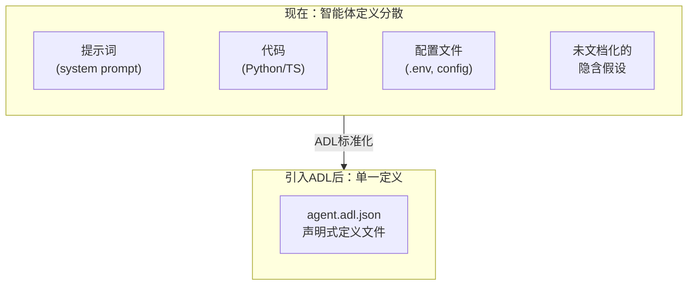
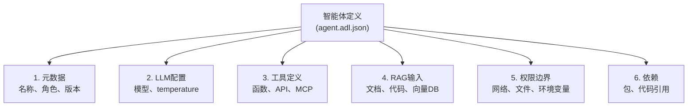
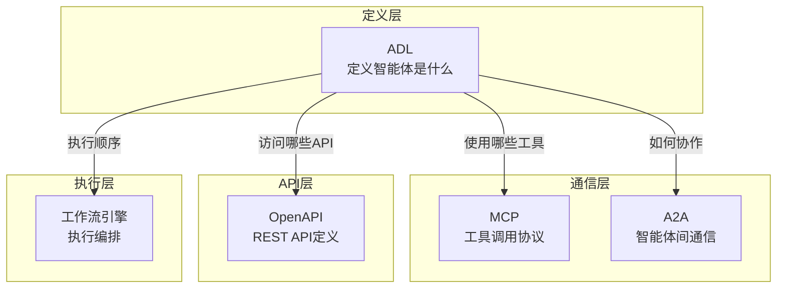
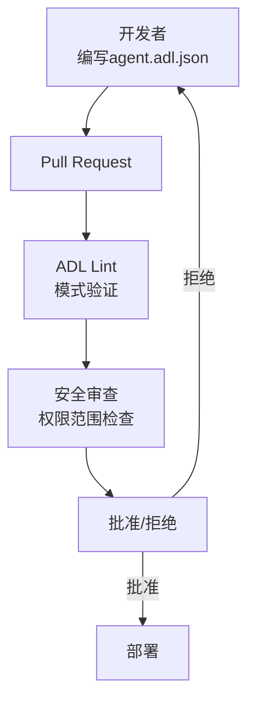
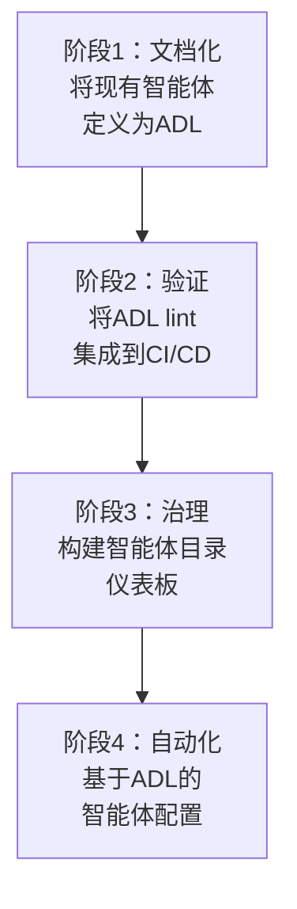

## 概述

2026年AI智能体生态系统蓬勃发展，但存在一个严重问题：<strong>智能体的定义散落在代码、提示词、配置文件中，难以快速判断"这个智能体到底能做什么"</strong>。

Next Moca以Apache 2.0许可证发布的<strong>Agent Definition Language(ADL)</strong>直面解决这个问题。就像OpenAPI(Swagger)在API世界中声明式定义"API能做什么"一样，ADL是一份供应商中立的标准规范，用于定义"AI智能体能做什么"。

本文从实践角度整理了ADL的核心架构、与现有标准(MCP、OpenAPI、A2A)的关系，以及Engineering Manager和CTO应该关注的治理战略。

## ADL解决的问题

目前大多数组织中AI智能体的管理状态如下：



具体来说，ADL解决的问题包括：

- <strong>可见性缺失</strong>：无法一目了然了解智能体接入哪些工具、使用哪些数据
- <strong>治理空白</strong>：安全团队无法事先审查智能体的权限范围
- <strong>可重现性不足</strong>：部署智能体时无法追踪"哪个版本以何种配置被部署"
- <strong>团队间沟通断裂</strong>：开发团队、安全团队、合规团队无法用同一语言讨论智能体

## ADL的核心架构

ADL规范基于JSON Schema，通过声明式方式定义智能体的6个模块：



### 1. 智能体元数据

```json
{
  "name": "code-review-agent",
  "displayName": "Code Review Assistant",
  "description": "对PR进行自动代码审查的智能体",
  "role": "代码质量检查及改进建议",
  "version": "2.1.0",
  "owner": "platform-team@company.com",
  "created": "2026-01-15T09:00:00Z",
  "modified": "2026-02-28T14:30:00Z"
}
```

通过语义版本控制和所有者信息，可以立即了解<strong>"谁在管理这个智能体及哪个版本正在运行"</strong>。

### 2. LLM配置

```json
{
  "llm": {
    "provider": "anthropic",
    "model": "claude-opus-4-6",
    "parameters": {
      "temperature": 0.3,
      "maxTokens": 4096
    }
  }
}
```

通过明确声明LLM提供商和模型，可以在模型更换时追踪变更历史并检测性能回退。

### 3. 工具(Tool)定义

```json
{
  "tools": [
    {
      "name": "github_pr_review",
      "description": "获取GitHub PR的变更并撰写审查评论",
      "invocationType": "mcp",
      "category": "Code Review",
      "parameters": [
        {
          "name": "pr_url",
          "type": "string",
          "description": "待审查的PR URL",
          "required": true
        },
        {
          "name": "review_depth",
          "type": "string",
          "description": "审查深度 (quick|standard|deep)",
          "required": false
        }
      ],
      "returnType": "ReviewResult"
    }
  ]
}
```

通过明确工具的调用方式(Python函数、HTTP、MCP等)和参数，安全团队可以提前审查<strong>智能体能访问的所有外部系统</strong>。

### 4. 权限边界(Permissions)

```json
{
  "permissions": {
    "networkAccess": {
      "allowed": true,
      "domainWhitelist": [
        "api.github.com",
        "api.anthropic.com"
      ]
    },
    "fileAccess": {
      "readPaths": ["/workspace/src/**"],
      "writePaths": ["/workspace/reviews/**"]
    },
    "environmentVariables": {
      "exposed": ["GITHUB_TOKEN", "ANTHROPIC_API_KEY"]
    },
    "sandbox": {
      "enabled": true,
      "constraints": ["no-internet-except-whitelist"]
    }
  }
}
```

这是ADL最强大的部分。通过<strong>将网络访问、文件系统、环境变量暴露范围定义为声明式规范而非代码</strong>，使CI/CD管道中的自动验证成为可能。

## ADL与现有标准的关系

ADL不是为了替代现有标准，而是作为<strong>"定义层(Definition Layer)"</strong>进行补充：



| 标准 | 角色 | 与ADL的关系 |
|------|------|-----------|
| <strong>OpenAPI</strong> | REST API定义 | ADL引用的API工具的规范 |
| <strong>MCP</strong> | 工具调用协议 | ADL声明"使用哪些MCP服务器" |
| <strong>A2A</strong> | 智能体间通信 | ADL定义"与哪些智能体协作" |
| <strong>工作流引擎</strong> | 执行顺序管理 | ADL仅负责静态定义，运行时由单独处理 |

核心差异是<strong>ADL是运行时协议而是静态规范</strong>。它提供智能体的"设计蓝图"，而实际执行由MCP或A2A等运行时协议负责。

## EM/CTO视角：基于ADL的治理战略

### 1. 将ADL验证集成到CI/CD管道



利用ADL的JSON Schema，可以在智能体部署前自动验证以下内容：

- 网络白名单是否符合策略
- 文件访问范围是否遵循最小权限原则
- LLM模型是否在批准的列表中
- 所有必要元数据(所有者、版本)是否完整

### 2. 构建智能体目录

在中央仓库中管理组织内所有智能体的ADL定义，可以自动构建<strong>智能体目录</strong>：

```json
{
  "catalog": [
    {
      "name": "code-review-agent",
      "version": "2.1.0",
      "owner": "platform-team",
      "tools": ["github_pr_review", "jira_comment"],
      "llm": "claude-opus-4-6",
      "riskLevel": "medium"
    },
    {
      "name": "deployment-agent",
      "version": "1.0.3",
      "owner": "devops-team",
      "tools": ["kubectl_apply", "slack_notify"],
      "llm": "gpt-5.3-codex",
      "riskLevel": "high"
    }
  ]
}
```

通过这种方式，CTO可以通过仪表板确认"当前组织运营多少个智能体，每个智能体对哪些系统拥有访问权限"。

### 3. 变更历史和回滚

由于ADL文件由Git进行版本管理：

- <strong>变更历史</strong>：通过diff确认"这个智能体的权限何时扩展"
- <strong>回滚</strong>：问题发生时可立即恢复至先前版本的ADL定义
- <strong>审计追踪</strong>：获取合规需求的证据

## 实战应用场景：代码审查智能体定义

这是组织中用ADL定义代码审查智能体的完整示例：

```json
{
  "name": "code-review-agent",
  "displayName": "代码审查智能体",
  "description": "自动检测PR的代码质量、安全漏洞、性能问题",
  "role": "senior-code-reviewer",
  "version": "2.1.0",
  "owner": "platform-team@company.com",
  "llm": {
    "provider": "anthropic",
    "model": "claude-opus-4-6",
    "parameters": {
      "temperature": 0.2,
      "maxTokens": 8192
    }
  },
  "tools": [
    {
      "name": "github_pr_diff",
      "invocationType": "mcp",
      "category": "Code Review",
      "parameters": [
        {"name": "pr_number", "type": "integer", "required": true}
      ]
    },
    {
      "name": "sonarqube_scan",
      "invocationType": "http",
      "category": "Code Quality",
      "parameters": [
        {"name": "project_key", "type": "string", "required": true}
      ]
    }
  ],
  "rag": [
    {
      "name": "coding-standards",
      "type": "documents",
      "location": "s3://company-docs/coding-standards/",
      "description": "公司内部编码标准文档"
    }
  ],
  "permissions": {
    "networkAccess": {
      "allowed": true,
      "domainWhitelist": [
        "api.github.com",
        "sonarqube.internal.company.com"
      ]
    },
    "fileAccess": {
      "readPaths": ["/workspace/**"],
      "writePaths": []
    },
    "sandbox": {"enabled": true}
  },
  "dependencies": {
    "packages": ["pygithub>=2.0", "requests>=2.31"]
  },
  "governance": {
    "created": "2026-01-15T09:00:00Z",
    "createdBy": "kim.jangwook@company.com",
    "modified": "2026-02-28T14:30:00Z",
    "modifiedBy": "kim.jangwook@company.com",
    "changeLog": "v2.1.0: 增加SonarQube集成，扩展安全扫描范围"
  }
}
```

## 导入路线图

由于ADL仍处于早期阶段(Early-Stage Standard)，分阶段导入更为现实：



- <strong>阶段1</strong> (1〜2周)：将当前运营的智能体文档化为ADL格式
- <strong>阶段2</strong> (2〜4周)：将JSON Schema验证添加到CI管道
- <strong>阶段3</strong> (1〜2个月)：构建智能体目录和权限仪表板
- <strong>阶段4</strong> (3〜6个月)：从ADL定义自动生成智能体脚手架

## 结论

ADL为AI智能体开发增加了<strong>"与代码分离的声明式定义"</strong>这一重要层次。正如OpenAPI标准化了REST API生态一样，ADL拥有解决智能体生态中可见性、治理、可重现性问题的潜力。

特别对Engineering Manager和CTO来说：

- <strong>安全治理</strong>：可以像代码审查一样事先审查智能体的权限范围
- <strong>组织可见性</strong>：通过智能体目录了解全公司AI资产
- <strong>变更管理</strong>：通过基于Git的版本管理支持审计追踪和回滚

虽然仍处于早期阶段，但作为Apache 2.0许可证的开源标准，现在是时候开始关注并考虑试点导入了。

## 参考资料

- [ADL GitHub Repository (Next Moca)](https://github.com/nextmoca/adl)
- [ADL Official Blog — Next Moca](https://www.nextmoca.com/blogs/agent-definition-language-adl-the-open-source-standard-for-defining-ai-agents)
- [InfoQ — Next Moca Releases Agent Definition Language](https://www.infoq.com/news/2026/02/agent-definition-language/)
- [TechCrunch — Guide Labs Debuts Interpretable LLM](https://techcrunch.com/2026/02/23/guide-labs-debuts-a-new-kind-of-interpretable-llm/)
