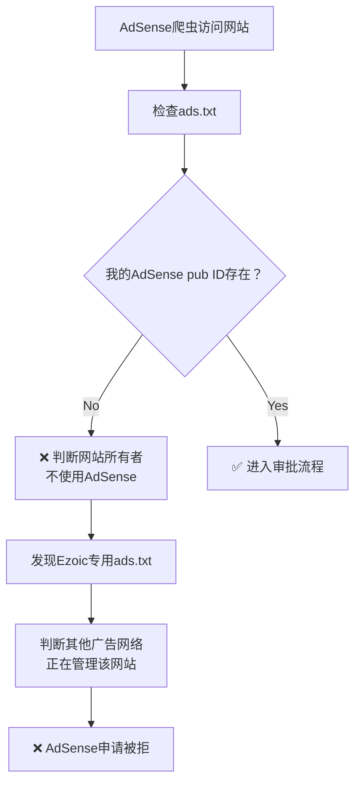
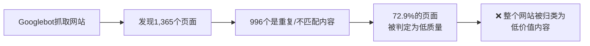
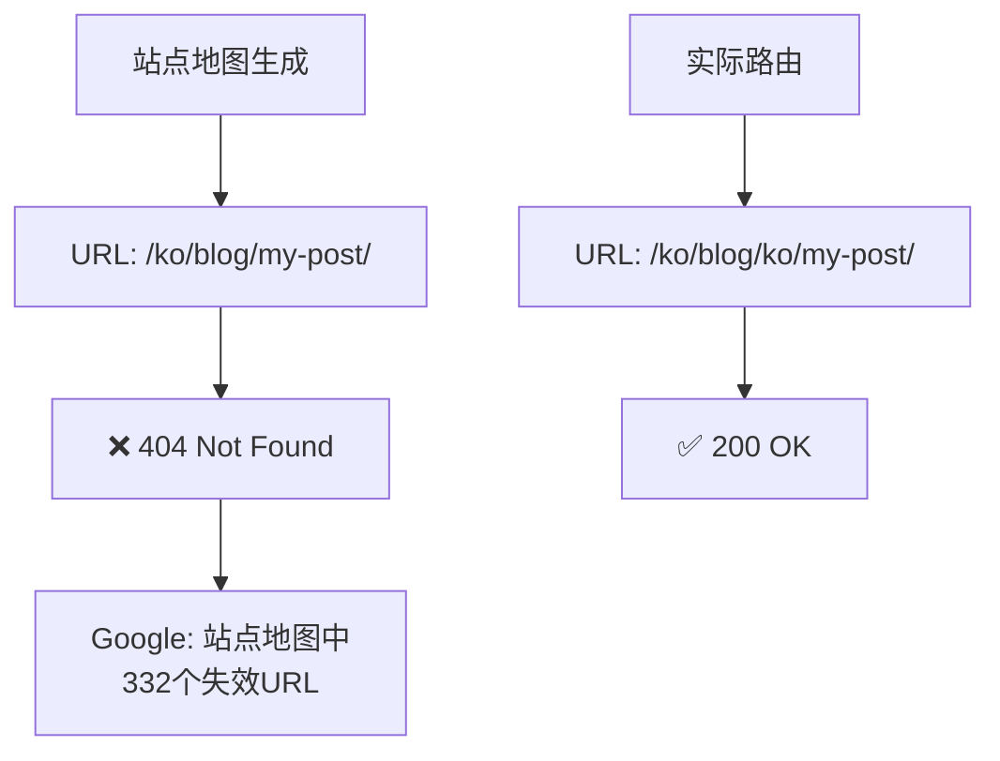
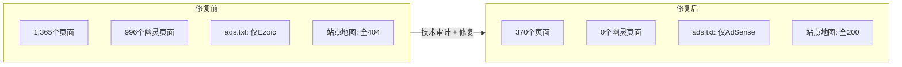

## 概述

你是否曾多次向Google AdSense提交申请，却反复收到<strong>"低价值内容（Low Value Content）"</strong>的拒绝通知？我就是这样。而且这还是一个拥有83篇文章、4种语言（韩语、英语、日语、中文）、总计316+技术文章的博客。

问题不在内容本身。<strong>网站的技术缺陷让Google将其视为"低质量网站"。</strong>本文将分享我实际发现和修复的8个问题。希望能为遇到同样困扰的开发者提供实用指南。

## 背景：为什么被拒绝

本博客是基于[Astro](https://astro.build)框架的多语言技术博客。

- <strong>内容</strong>：83篇文章 × 4种语言 = 316+技术文章
- <strong>必要页面</strong>：隐私政策、使用条款、联系页面一应俱全
- <strong>技术栈</strong>：Astro SSG、Cloudflare Pages、Content Collections

从表面看，完全满足AdSense的审批条件。但每次申请得到的回复都一样：

> <strong>"低价值内容"</strong> — 您的网站没有足够的有用内容。

对整个网站进行技术审计后发现，<strong>根本原因是3个关键技术缺陷</strong>，而非内容质量问题。此外还发现了5个附加问题。

## 关键问题1：Ezoic ads.txt冲突（最直接的原因）

### 发现过程

直接检查线上网站的`ads.txt`时，发现我的AdSense条目完全不存在。取而代之的是80多个Ezoic管理的广告网络条目。

```bash
# 检查线上ads.txt
curl https://jangwook.net/ads.txt | head -5
# → 仅显示80+个Ezoic管理的条目
# → 我的AdSense pub ID不存在
```

### 原因分析

GitHub Actions的`deploy.yml`中有这样一段代码：

```yaml
# deploy.yml（问题代码）
- name: Build
  run: |
    # ... 构建命令 ...
    curl -L https://srv.adstxtmanager.com/19390/jangwook.net > public/ads.txt
```

每次构建时都从Ezoic的`adstxtmanager`下载并覆盖`ads.txt`。本地的`public/ads.txt`中有正确的Google AdSense条目，但在<strong>部署时被完全替换</strong>了。

```
# 本地 public/ads.txt（正确内容）
google.com, pub-7556938384772610, DIRECT, f08c47fec0942fa0

# 线上 ads.txt（部署后 — 被Ezoic覆盖）
# → 80+个广告网络条目
# → pub-7556938384772610条目不存在！
```

<strong>此外</strong>，`BaseHead.astro`中有3个Ezoic CMP（同意管理平台）及广告脚本在所有页面加载：

```astro
<!-- BaseHead.astro（问题脚本） -->
<script src="https://the.gatekeeperconsent.com/cmp.min.js" data-cfasync="false"></script>
<script src="https://cdn.ezoic.net/ezoicplugin.js"></script>
<script src="https://www.ezojs.com/ezoic/sa.min.js"></script>
```

### Google如何看待此问题

从AdSense爬虫的角度整理这一情况：



如果AdSense在网站的`ads.txt`中找不到自己的pub ID，就会判定<strong>该网站无意使用AdSense，或已被其他服务管理</strong>。

### 解决方法

1. 从`deploy.yml`中删除Ezoic `ads.txt`下载行
2. 从`BaseHead.astro`中移除全部3个Ezoic脚本
3. 在`public/ads.txt`中仅保留正确的AdSense条目

```yaml
# deploy.yml（修复后）
- name: Build
  run: |
    npm run build
    # curl行完全删除 — 直接使用本地public/ads.txt
```

```
# public/ads.txt（修复后）
google.com, pub-7556938384772610, DIRECT, f08c47fec0942fa0
```

## 关键问题2：URL路由缺陷产生996个幽灵页面

### 发现过程

分析构建日志发现生成了<strong>1,365个页面</strong>。83篇文章 × 4种语言 = 332页，静态页面数量异常偏高。

### 原因分析

`[...slug].astro`的`getStaticPaths`函数存在问题：

```typescript
// [...slug].astro（问题代码）
export async function getStaticPaths() {
  const posts = await getCollection("blog");
  const languages = ["ko", "en", "ja", "zh"];

  return languages.flatMap((lang) =>
    posts.map((post) => ({
      params: { slug: post.slug }, // post.slug = "ko/my-post-title"
      props: { post, lang },
    }))
  );
}
```

问题在于：这段代码将<strong>所有文章映射到所有语言路由</strong>。由于`post.slug`已经包含语言前缀（如`ko/`、`en/`），将其放入4种语言的路由中就会产生大量<strong>跨语言URL</strong>。

```
# 正常URL（332个）
/ko/blog/ko/my-post/     ← 韩语路由中的韩语内容 ✅
/en/blog/en/my-post/     ← 英语路由中的英语内容 ✅

# 幽灵URL（996个）— 内容语言不匹配
/en/blog/ko/my-post/     ← 英语路由中的韩语内容 ❌
/ja/blog/ko/my-post/     ← 日语路由中的韩语内容 ❌
/zh/blog/en/my-post/     ← 中文路由中的英语内容 ❌
# ... 生成了996个这样的组合
```

### Google如何看待此问题



Google会评估网站整体的内容质量。当全部页面中<strong>约73%是语言不匹配的重复内容</strong>时，整个网站被判定为"低价值内容"是必然结果。

### 解决方法

将每篇文章仅映射到对应的语言路由：

```typescript
// [...slug].astro（修复后）
export async function getStaticPaths() {
  const posts = await getCollection("blog");

  return posts.map((post) => ({
    params: { slug: post.slug }, // "ko/my-post-title"仅映射到对应语言路由
    props: { post },
  }));
}
```

<strong>结果</strong>：构建页面数从<strong>1,365降至370</strong>（消除995个幽灵页面）

## 关键问题3：站点地图全404

### 发现过程

在Google Search Console中提交站点地图后，被索引的页面极少。在浏览器中实际访问站点地图的URL，发现<strong>全部返回404</strong>。

### 原因分析

站点地图生成逻辑与实际路由之间的URL格式不一致：

```
# 站点地图生成的URL
https://jangwook.net/ko/blog/my-post-title/

# 实际页面URL（双语言前缀）
https://jangwook.net/ko/blog/ko/my-post-title/
```

站点地图以`/{lang}/blog/{slug}/`格式生成URL，但由于`slug`中已包含`ko/`等语言前缀，实际URL为`/{lang}/blog/{lang}/{slug}/`。<strong>站点地图中的332个博客URL全部返回404。</strong>



### 解决方法

修改站点地图生成逻辑，考虑slug中的语言前缀：

```typescript
// 站点地图配置（修复后）
// slug已经是"ko/my-post"格式，直接使用
const url = `/${lang}/blog/${post.slug}/`;
// → /ko/blog/ko/my-post/（与实际路径一致）
```

## 附加问题4：机器翻译的结构同一性

### 问题

83篇文章中<strong>39%</strong>（约32篇）在4种语言版本中H2、H3标题数和代码块数完全一致。Google可能将其识别为<strong>通过机器翻译自动生成的内容</strong>。

### 解决方法

与其重写所有内容，不如明确告诉Google<strong>"这些是同一内容的官方翻译版本"</strong>更为有效。

```html
<!-- 正确配置hreflang -->
<link rel="alternate" hreflang="ko" href="https://jangwook.net/ko/blog/ko/my-post/" />
<link rel="alternate" hreflang="en" href="https://jangwook.net/en/blog/en/my-post/" />
<link rel="alternate" hreflang="ja" href="https://jangwook.net/ja/blog/ja/my-post/" />
<link rel="alternate" hreflang="zh" href="https://jangwook.net/zh/blog/zh/my-post/" />
<link rel="alternate" hreflang="x-default" href="https://jangwook.net/en/blog/en/my-post/" />
```

正确设置hreflang后，Google会将各语言页面视为<strong>独立的翻译版本</strong>，从而避免重复内容处罚。

## 附加问题5：联系页面对爬虫不可见

### 问题

联系页面仅由Google Form的`<iframe>`组成。爬虫无法读取iframe内容，因此该页面<strong>实际上是空白页面</strong>。

```html
<!-- 原联系页面（对爬虫为空页面） -->
<iframe
  src="https://docs.google.com/forms/d/e/..."
  width="100%"
  height="800"
></iframe>
```

### 解决方法

添加爬虫可读的结构化内容：

```html
<!-- 修复后的联系页面 -->
<section>
  <h1>联系方式</h1>
  <p>我是技术博客运营者金长旭。请通过以下方式联系我：</p>

  <h2>电子邮件</h2>
  <a href="mailto:contact@jangwook.net">contact@jangwook.net</a>

  <h2>社交媒体</h2>
  <ul>
    <li><a href="https://github.com/...">GitHub</a></li>
    <li><a href="https://twitter.com/...">Twitter</a></li>
  </ul>

  <h2>博客简介</h2>
  <p>分享AI自动化、Web开发、DevOps相关的技术内容。</p>
</section>

<!-- Google Form保留在底部 -->
<iframe src="https://docs.google.com/forms/d/e/..." width="100%" height="800"></iframe>
```

## 附加问题6：hreflang x-default错误

### 问题

博客文章的`x-default`指向了错误的URL。虽然将英语设为默认语言，但URL转换时未转换博客路径内的语言代码，导致<strong>英语URL链接到韩语内容</strong>。

```html
<!-- 错误的x-default -->
<link rel="alternate" hreflang="x-default"
  href="https://jangwook.net/en/blog/ko/my-post/" />
<!-- → 英语路由但指向韩语内容 ❌ -->
```

### 解决方法

修改hreflang生成逻辑，同时转换博客路径内的语言代码：

```typescript
// hreflang URL生成（修复后）
function getAlternateUrl(currentUrl: string, targetLang: string): string {
  // 转换URL路径的语言前缀
  let url = currentUrl.replace(/^\/(ko|en|ja|zh)\//, `/${targetLang}/`);
  // 同时转换博客slug内的语言前缀
  url = url.replace(/\/blog\/(ko|en|ja|zh)\//, `/blog/${targetLang}/`);
  return url;
}
```

## 附加问题7：自我引用的元分析文章

### 问题

存在6篇博客运营报告（周分析、月分析、AdSense拒绝分析等）。这类文章是<strong>对博客自身的分析</strong>，对外部访问者没有价值，可能被归类为"自我引用的低价值内容"。

### 解决方法

为这些文章添加`noindex`元标签，将其从搜索引擎索引中排除：

```html
<!-- 对元分析文章应用noindex -->
<meta name="robots" content="noindex, follow" />
```

这样Google不会索引这些页面，将其排除在网站整体内容质量评估之外。保留内部链接的`follow`以允许抓取本身。

## 附加问题8：其他技术修复

以下是其余发现的问题及解决方法。

### 8-1. 缺少自定义404页面

没有自定义404页面，用户访问无效URL时显示空白页或服务器默认错误。

```astro
---
// src/pages/404.astro — 多语言404页面
const lang = Astro.currentLocale || "en";
const messages = {
  ko: { title: "페이지를 찾을 수 없습니다", back: "홈으로 돌아가기" },
  en: { title: "Page Not Found", back: "Go back home" },
  ja: { title: "ページが見つかりません", back: "ホームに戻る" },
  zh: { title: "页面未找到", back: "返回首页" },
};
---
<h1>{messages[lang].title}</h1>
<a href={`/${lang}/`}>{messages[lang].back}</a>
```

### 8-2. og:type未区分

所有页面的`og:type`都设为`"website"`。博客文章应为`"article"`。

```astro
<!-- 修复后 -->
<meta property="og:type" content={isPost ? "article" : "website"} />
```

### 8-3. sitemap链接不一致

`robots.txt`中引用的站点地图文件名与实际文件名不同。

```
# robots.txt（修复前）
Sitemap: https://jangwook.net/sitemap-index.xml

# 实际文件：/sitemap.xml

# robots.txt（修复后）
Sitemap: https://jangwook.net/sitemap.xml
```

### 8-4. 中文RSS hreflang缺失

韩语、英语、日语的RSS feed都正确设置了hreflang，唯独中文（zh）缺失。

### 8-5. 在robots.txt中添加跨语言URL屏蔽规则

由于幽灵页面修复前可能已被索引，在`robots.txt`中添加了屏蔽规则：

```
# 添加到robots.txt
Disallow: /en/blog/ko/
Disallow: /en/blog/ja/
Disallow: /en/blog/zh/
Disallow: /ko/blog/en/
Disallow: /ko/blog/ja/
Disallow: /ko/blog/zh/
Disallow: /ja/blog/ko/
Disallow: /ja/blog/en/
Disallow: /ja/blog/zh/
Disallow: /zh/blog/ko/
Disallow: /zh/blog/en/
Disallow: /zh/blog/ja/
```

## 修复前后对比

应用所有修复后的结果：

| 项目 | 修复前 | 修复后 |
|------|--------|--------|
| 构建页面数 | 1,365个 | 370个 |
| 幽灵页面 | 996个 | 0个 |
| ads.txt状态 | Ezoic 80+条目 | AdSense 1条目 |
| 站点地图404 URL | 332个 | 0个 |
| hreflang x-default错误 | 全部文章 | 0个 |
| 自我引用文章被索引 | 6个 | 已应用noindex |
| 低质量内容比例 | 约73% | 约0% |



## 多语言博客运营者检查清单

基于这次经验，整理了申请AdSense前应检查的技术清单：

### ads.txt相关
- [ ] 是否直接检查了线上网站的`ads.txt`？
- [ ] CI/CD流水线中是否存在覆盖`ads.txt`的脚本？
- [ ] 之前使用的广告服务脚本是否已清除？

### URL与路由相关
- [ ] 构建的页面数是否与预期一致？
- [ ] 是否不存在跨语言URL（如`/en/blog/ko/...`）？
- [ ] 站点地图中的所有URL是否返回200 OK？

### hreflang相关
- [ ] 所有页面是否正确配置了hreflang？
- [ ] `x-default`是否指向正确的语言页面？
- [ ] 博客路径中的语言代码是否也正确转换？

### 内容质量相关
- [ ] 自我引用内容（运营报告等）是否已添加noindex？
- [ ] `og:type`在文章页面是否设为`"article"`？
- [ ] 联系页面是否有爬虫可读的文本内容？
- [ ] 是否存在自定义404页面？

## 总结

AdSense"低价值内容"拒绝<strong>往往不是内容问题，而是技术缺陷导致的</strong>。多语言网站尤其容易出现此类问题，因为URL路由、站点地图、hreflang配置的复杂度较高。

核心经验总结：

1. <strong>务必在线上网站直接检查ads.txt。</strong> CI/CD流水线可能在静默覆盖它。
2. <strong>定期监控构建页面数。</strong> 如果超出预期，可能正在生成幽灵页面。
3. <strong>实际访问站点地图中的URL。</strong> 站点地图与路由之间的不一致是常见问题。
4. <strong>从Google的角度审视你的网站。</strong> 对开发者来说理所当然的事情，对爬虫来说可能完全不同。

希望本指南能帮助到遇到同样问题的开发者。

## 参考资料

- [Google AdSense计划政策](https://support.google.com/adsense/answer/48182)
- [ads.txt官方规范](https://iabtechlab.com/ads-txt/)
- [Google多语言网站管理指南](https://developers.google.com/search/docs/specialty/international)
- [hreflang实施指南](https://developers.google.com/search/docs/specialty/international/localized-versions)
- [Astro国际化（i18n）文档](https://docs.astro.build/en/guides/internationalization/)
