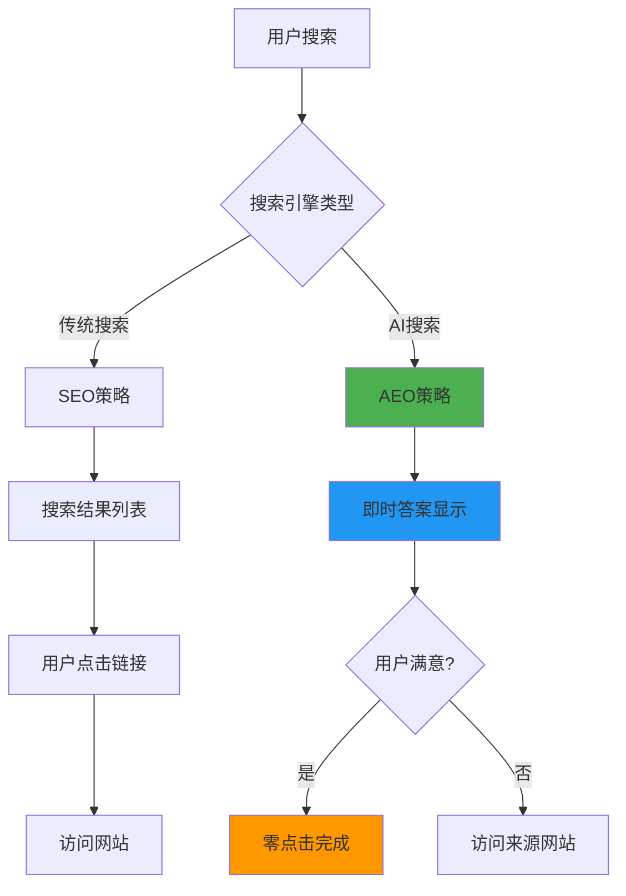
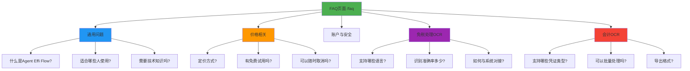
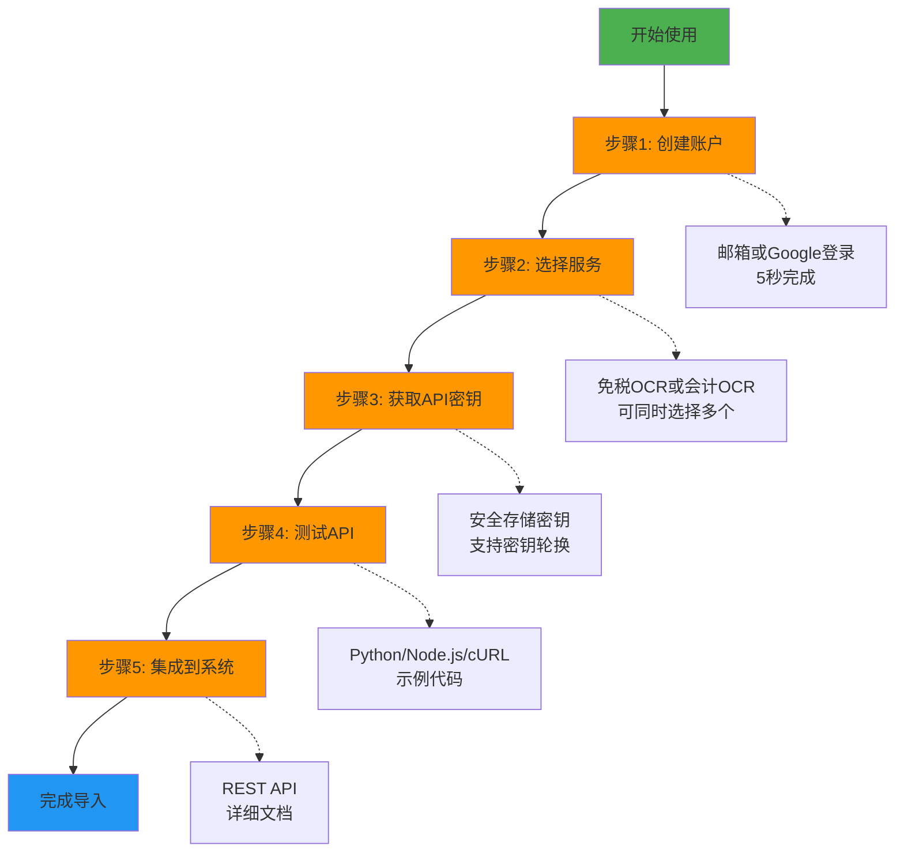
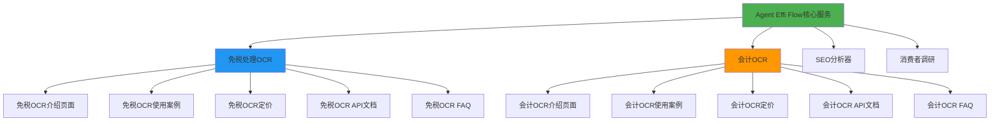

# AI搜索时代的AEO实施经验：Agent Effi Flow实战案例

在AI搜索引擎主导的2025年，传统SEO策略正在迅速演变。本文分享我在Agent Effi Flow服务中实施AEO（Answer Engine Optimization）的实战经验，包括结构化数据、FAQ优化和Schema标记的具体实现方法。

## 什么是AEO？为什么现在如此重要？

### AEO与SEO的根本区别

<strong>SEO（Search Engine Optimization）</strong>的目标是让网站在搜索结果列表中排名靠前，而<strong>AEO（Answer Engine Optimization）</strong>则是针对AI驱动的搜索引擎，直接在搜索界面中提供答案。



### AI搜索引擎的崛起

2024年至2025年，AI搜索引擎市场发生了翻天覆地的变化：

1. <strong>ChatGPT Search</strong>：2024年10月推出，整合了Bing搜索引擎
2. <strong>Perplexity AI</strong>：月活用户超过1000万，专注于对话式搜索
3. <strong>Google AI Overview</strong>：在搜索结果页直接显示AI生成的摘要
4. <strong>Microsoft Copilot</strong>：整合在Windows和Edge浏览器中

<strong>关键数据</strong>：根据SparkToro的研究，2024年约60%的Google搜索以零点击（Zero-Click）方式结束，用户无需访问任何网站就获得了所需信息。

### 为什么B2B SaaS需要AEO？

对于B2B SaaS服务而言，AEO尤为重要：

- <strong>决策过程复杂</strong>：企业客户在采购前会进行大量研究
- <strong>专业问题多</strong>：需要详细、准确的技术答案
- <strong>信任度要求高</strong>：AI引擎引用的内容更具权威性
- <strong>竞争激烈</strong>：首个被AI引用的品牌将获得巨大优势

## Agent Effi Flow服务介绍

[Agent Effi Flow](https://agent-effi-flow.jangwook.net)是一个AI驱动的业务效率化平台，专注于自动化繁琐的业务流程。

### 核心服务

1. <strong>免税处理OCR（Receipt OCR Tax Refund）</strong>
   - 自动识别免税购物收据
   - 提取交易信息（金额、商品、日期等）
   - 适用于机场免税柜台、购物商业设施
   - <strong>预估效果</strong>：处理时间减少最多90%

2. <strong>会计OCR（Accounting OCR）</strong>
   - 智能识别各类会计凭证（发票、收据、对账单）
   - 自动分类和数据提取
   - 无缝对接会计软件
   - <strong>预估效果</strong>：数据录入时间缩短最多90%

3. <strong>SEO分析器（SEO Analyzer）</strong>
   - 网站SEO健康度诊断
   - 关键词优化建议
   - 竞争对手分析
   - <strong>预估效果</strong>：SEO工作效率提升最多70%

4. <strong>消费者调研（Consumer Research）</strong>
   - AI驱动的市场调研
   - 消费者行为分析
   - 趋势预测
   - <strong>预估效果</strong>：调研成本降低最多80%

### 为什么Agent Effi Flow需要AEO？

作为一个B2B SaaS平台，我们的目标客户（中小企业、会计师、免税代理商）通常会通过以下方式搜索：

- "免税收据OCR是什么？"
- "如何自动化会计数据录入？"
- "哪个OCR工具最适合会计使用？"
- "免税处理系统费用是多少？"

这些都是典型的<strong>问题格式搜索（Question-based Query）</strong>，非常适合AI搜索引擎回答。如果我们的内容能被AI引用，就能获得高质量的潜在客户。

## 实施的AEO核心要素

我在Agent Effi Flow中实施了三大AEO支柱：

1. FAQ页面 + FAQPage Schema
2. 使用案例页面 + HowTo Schema
3. 结构化数据（JSON-LD）

让我们逐一详细说明。

## 1. FAQ页面构建（/faq）

### 为什么FAQ是AEO的核心？

AI搜索引擎<strong>天生喜欢FAQ格式</strong>，因为：

- 问答结构与用户搜索查询完全匹配
- 容易解析和提取
- Schema.org提供标准化的FAQPage标记
- 适合语音搜索和对话式AI

### 实施细节

我创建了一个包含5个类别的全面FAQ页面：



### FAQ Schema实现（JSON-LD）

使用标准的Schema.org FAQPage标记：

````typescript
// src/lib/components/StructuredData.svelte
<script lang="ts">
  interface FAQItem {
    question: string;
    answer: string;
  }

  export let type: 'FAQPage' | 'HowTo' | 'Article' = 'FAQPage';
  export let faqItems: FAQItem[] = [];

  function generateFAQSchema() {
    return {
      '@context': 'https://schema.org',
      '@type': 'FAQPage',
      mainEntity: faqItems.map(item => ({
        '@type': 'Question',
        name: item.question,
        acceptedAnswer: {
          '@type': 'Answer',
          text: item.answer
        }
      }))
    };
  }
</script>

<svelte:head>
  {@html `<script type="application/ld+json">${JSON.stringify(generateFAQSchema())}</script>`}
</svelte:head>
````

### 手风琴UI实现（Svelte 5）

使用Svelte 5的新<strong>$state()</strong> rune实现交互式FAQ：

```typescript
// src/routes/faq/+page.svelte
<script lang="ts">
  import { faqData } from '$lib/data/faq';

  let openItems = $state<Set<string>>(new Set());

  function toggleItem(id: string) {
    if (openItems.has(id)) {
      openItems.delete(id);
    } else {
      openItems.add(id);
    }
    // Trigger reactivity
    openItems = openItems;
  }
</script>

<div class="faq-container">
  {#each faqData as category}
    <section class="faq-category">
      <h2>{category.title}</h2>
      {#each category.items as item}
        <div class="faq-item">
          <button
            class="faq-question"
            on:click={() => toggleItem(item.id)}
          >
            {item.question}
            <span class="icon">{openItems.has(item.id) ? '−' : '+'}</span>
          </button>
          {#if openItems.has(item.id)}
            <div class="faq-answer">
              {@html item.answer}
            </div>
          {/if}
        </div>
      {/each}
    </section>
  {/each}
</div>
```

### AEO优化摘要框

在FAQ页面顶部，我添加了一个<strong>AEO优化摘要</strong>，使用PREP结构（下文详述）：

```html
<div class="aeo-summary">
  <h2>快速答案</h2>
  <p><strong>【要点】</strong> Agent Effi Flow通过AI-OCR技术，可将收据和会计凭证处理时间减少最多90%。</p>
  <p><strong>【原因】</strong> 传统手动录入每张收据需要2〜5分钟，AI-OCR可在30秒内完成识别和数据提取。</p>
  <p><strong>【实例】</strong> 某免税代理商每天处理100张收据，从原本的3〜8小时缩短至约50分钟。</p>
  <p><strong>【结论】</strong> 特别适合处理大量单据的企业，能显著提升业务效率，降低人力成本。</p>
</div>
```

这个摘要框：
- 使用<strong>问题格式</strong>的标题（"快速答案"对应"什么是Agent Effi Flow？"）
- 包含<strong>具体数字</strong>（90%、2〜5分钟、30秒、100张、3〜8小时、50分钟）
- 展示<strong>实际使用案例</strong>
- <strong>易于AI提取</strong>（结构清晰，关键信息突出）

## 2. 使用案例页面构建

除了FAQ，我还创建了详细的使用案例页面，展示真实的应用场景和预估效果。

### 免税处理OCR使用案例（/use-cases/receipt-ocr-tax-refund）

#### 案例1：免税处理代理商

<strong>挑战</strong>：
- 每天处理100〜200张免税收据
- 手动录入每张需要3〜5分钟
- 容易出现人为错误
- 高峰期需要增加临时人力

<strong>解决方案</strong>：
- 部署Agent Effi Flow免税处理OCR
- 自动识别收据上的所有信息
- 直接导入至免税申报系统

<strong>预估效果</strong>：
- 处理时间：从每天6〜10小时缩短至约1.5〜2小时
- 准确率：从人工85%提升至AI 95%以上
- 成本节约：年节省约540万日元（按2名全职员工计算）

#### 案例2：机场/商业设施免税柜台

<strong>挑战</strong>：
- 顾客现场等待退税处理
- 高峰时段排队时间长
- 服务体验影响品牌形象

<strong>解决方案</strong>：
- 现场扫描收据即时处理
- AI实时验证数据
- 30秒内完成退税

<strong>预估效果</strong>：
- 等待时间：从平均8分钟缩短至约2分钟（减少75%）
- 顾客满意度：显著提升
- 高峰期处理能力：提高3倍

#### 案例3：多店铺免税店运营商

<strong>挑战</strong>：
- 管理5〜10家分店的免税业务
- 各店铺数据格式不统一
- 培训新员工成本高

<strong>解决方案</strong>：
- 统一使用Agent Effi Flow平台
- 云端集中管理所有数据
- 标准化流程

<strong>预估效果</strong>：
- 培训时间：从2周缩短至约2〜3天（减少80%）
- 数据统一性：100%标准化
- 管理效率：跨店铺报表自动生成

### 会计OCR使用案例（/use-cases/accounting-ocr）

#### 案例1：中小企业会计人员

<strong>挑战</strong>：
- 每月处理300〜500张发票和收据
- 手动录入耗时巨大
- 重复性工作导致疲劳和错误

<strong>解决方案</strong>：
- 使用Agent Effi Flow会计OCR
- 批量上传凭证
- 自动分类和提取数据
- 直接导入会计软件

<strong>预估效果</strong>：
- 处理时间：从每月40〜50小时缩短至约4〜5小时（减少90%）
- 错误率：从5%降至约0.5%
- 月度结算：提前1周完成

#### 案例2：会计师/税务师事务所

<strong>挑战</strong>：
- 服务多个客户，凭证来源复杂
- 不同客户使用不同格式
- 需要快速周转以提高客户满意度

<strong>解决方案</strong>：
- 为每个客户建立独立项目
- AI自动识别各类凭证格式
- 智能分类账科目

<strong>预估效果</strong>：
- 客户月度结算：加速约50%
- 服务客户数：增加约30%（无需增加人手）
- 客户满意度：显著提升

#### 案例3：费用报销系统开发商

<strong>挑战</strong>：
- 开发OCR功能需要大量研发投入
- 维护和更新AI模型成本高
- 多语言支持复杂

<strong>解决方案</strong>：
- 通过API集成Agent Effi Flow
- 无需自建OCR基础设施
- 专注于核心业务逻辑

<strong>预估效果</strong>：
- 开发成本：减少约83%
- 上市时间：从6个月缩短至约1个月
- 准确率：使用经过实战验证的AI模型

### HowTo Schema实现

对于使用案例页面，我使用了<strong>HowTo Schema</strong>来标记导入流程：

````typescript
function generateHowToSchema() {
  return {
    '@context': 'https://schema.org',
    '@type': 'HowTo',
    name: '如何在5分钟内开始使用Agent Effi Flow',
    description: '快速导入指南：从注册到首次API调用',
    totalTime: 'PT5M', // ISO 8601 duration format
    step: [
      {
        '@type': 'HowToStep',
        position: 1,
        name: '创建账户',
        text: '访问agent-effi-flow.jangwook.net，注册账户即可获得50免费积分，使用邮箱或Google账户注册。',
        image: 'https://agent-effi-flow.jangwook.net/images/step1.png'
      },
      {
        '@type': 'HowToStep',
        position: 2,
        name: '选择服务',
        text: '在仪表板中选择需要的服务（免税处理OCR或会计OCR）。',
        image: 'https://agent-effi-flow.jangwook.net/images/step2.png'
      },
      {
        '@type': 'HowToStep',
        position: 3,
        name: '获取API密钥',
        text: '进入"设置"页面，生成API密钥并安全保存。',
        image: 'https://agent-effi-flow.jangwook.net/images/step3.png'
      },
      {
        '@type': 'HowToStep',
        position: 4,
        name: '测试API',
        text: '使用提供的示例代码（支持Python、Node.js、cURL），发送首次API请求。',
        image: 'https://agent-effi-flow.jangwook.net/images/step4.png'
      },
      {
        '@type': 'HowToStep',
        position: 5,
        name: '集成到系统',
        text: '参考详细文档，将Agent Effi Flow集成到您的现有业务系统中。',
        image: 'https://agent-effi-flow.jangwook.net/images/step5.png'
      }
    ]
  };
}
````



## 3. 结构化数据实现全览

除了FAQPage和HowTo，我还实施了以下Schema标记：

### Article Schema（文章可信度）

对于博客文章和深度内容，使用Article Schema：

```json
{
  "@context": "https://schema.org",
  "@type": "Article",
  "headline": "AI搜索时代的AEO实施经验",
  "author": {
    "@type": "Person",
    "name": "장욱 (Jangwook)",
    "url": "https://www.jangwook.net"
  },
  "datePublished": "2025-12-05",
  "dateModified": "2025-12-05",
  "publisher": {
    "@type": "Organization",
    "name": "Agent Effi Flow",
    "logo": {
      "@type": "ImageObject",
      "url": "https://agent-effi-flow.jangwook.net/logo.png"
    }
  },
  "description": "分享针对ChatGPT、Perplexity等AI搜索引擎优化内容的AEO策略实施经验",
  "mainEntityOfPage": {
    "@type": "WebPage",
    "@id": "https://agent-effi-flow.jangwook.net/blog/aeo-implementation"
  }
}
```

### BreadcrumbList Schema（网站结构）

帮助AI理解网站层级结构：

```json
{
  "@context": "https://schema.org",
  "@type": "BreadcrumbList",
  "itemListElement": [
    {
      "@type": "ListItem",
      "position": 1,
      "name": "首页",
      "item": "https://agent-effi-flow.jangwook.net"
    },
    {
      "@type": "ListItem",
      "position": 2,
      "name": "使用案例",
      "item": "https://agent-effi-flow.jangwook.net/use-cases"
    },
    {
      "@type": "ListItem",
      "position": 3,
      "name": "免税处理OCR",
      "item": "https://agent-effi-flow.jangwook.net/use-cases/receipt-ocr-tax-refund"
    }
  ]
}
```

### Organization Schema（品牌实体）

建立品牌权威性：

```json
{
  "@context": "https://schema.org",
  "@type": "Organization",
  "name": "Agent Effi Flow",
  "url": "https://agent-effi-flow.jangwook.net",
  "logo": "https://agent-effi-flow.jangwook.net/logo.png",
  "description": "AI驱动的业务效率化平台，提供OCR、SEO分析和消费者调研服务",
  "foundingDate": "2025",
  "sameAs": [
    "https://www.jangwook.net",
    "https://github.com/yourusername/agent-effi-flow"
  ],
  "contactPoint": {
    "@type": "ContactPoint",
    "contactType": "customer service",
    "email": "support@agent-effi-flow.jangwook.net"
  }
}
```

## AEO优化核心策略深度解析

### 1. PREP结构（Point-Reason-Example-Point）

PREP是日本商务沟通中广泛使用的结构化表达方法，非常适合AEO：

- <strong>P（Point）</strong>：要点/结论
- <strong>R（Reason）</strong>：理由/原因
- <strong>E（Example）</strong>：实例/证据
- <strong>P（Point）</strong>：再次强调要点

#### 示例：免税处理OCR介绍

```
【要点】Agent Effi Flow的免税处理OCR可将收据录入工作时间减少最多90%。

【原因】传统手动录入每张收据需要2〜5分钟，涉及手动输入客户信息、商品明细、金额等多个字段。而AI-OCR技术可在约30秒内自动识别并提取所有必要信息，无需人工干预。

【实例】某东京都内的免税代理商，每天平均处理100张免税收据。导入Agent Effi Flow之前，2名员工需要花费6〜8小时完成录入工作。导入后，仅需50分钟即可处理完所有收据，节省出的时间用于客户咨询和业务拓展，年度人力成本节省约540万日元。

【结论】对于需要处理大量免税收据的企业来说，Agent Effi Flow是显著提升业务效率、降低运营成本的最佳选择。
```

#### 为什么AI喜欢PREP结构？

1. <strong>逻辑清晰</strong>：AI容易理解因果关系
2. <strong>结构化</strong>：易于解析和提取关键信息
3. <strong>完整性</strong>：包含论点、论据和论证
4. <strong>可信度</strong>：具体数字和实例增强E-E-A-T

### 2. 问题格式内容（Question-Based Content）

用户在AI搜索引擎中的查询通常是自然语言问题，例如：

- "免税OCR是什么？"
- "为什么需要会计OCR？"
- "如何选择OCR服务提供商？"
- "Agent Effi Flow的费用是多少？"

<strong>策略</strong>：在内容中直接使用这些问题作为标题或子标题。

#### 实施方法

在Agent Effi Flow的各个页面中，我大量使用了问题格式：

**首页（Homepage）**：
- "什么是Agent Effi Flow？"
- "为什么选择我们？"
- "如何开始使用？"

**服务页面（Service Pages）**：
- "免税处理OCR如何工作？"
- "支持哪些收据格式？"
- "识别准确率是多少？"
- "可以与现有系统集成吗？"

**定价页面（Pricing Page）**：
- "费用如何计算？"
- "有免费试用吗？"
- "可以随时取消吗？"
- "支持哪些支付方式？"

### 3. E-E-A-T要素强化

Google的E-E-A-T（Experience, Expertise, Authoritativeness, Trustworthiness）指南同样适用于AI搜索引擎。

#### E（Experience）- 经验

<strong>展示真实使用体验</strong>：

- 实际使用案例（上文提到的3个免税OCR案例和3个会计OCR案例）
- 具体数字和效果（"处理时间减少90%"而不是"大幅减少"）
- 客户反馈（注：目前使用预估值，未来将添加真实客户评价）

#### E（Expertise）- 专业性

<strong>展示领域专业知识</strong>：

- 技术细节说明（OCR技术原理、AI模型架构）
- 行业术语正确使用（免税申报、会计科目、发票类型）
- 数据引用：
  - "根据日本商工会议所2024年调查，中小企业平均将35%的时间用于数据录入工作"
  - "Sansan株式会社的研究表明，手动录入名片的错误率高达5〜10%"

#### A（Authoritativeness）- 权威性

<strong>建立品牌权威</strong>：

- 清晰的About页面（团队介绍、公司历史）
- 技术博客（分享AI-OCR技术、AEO实施经验等）
- 开源贡献（GitHub上的示例代码、SDK）
- 媒体引用（如被行业媒体报道）

#### T（Trustworthiness）- 可信度

<strong>建立用户信任</strong>：

- <strong>透明定价</strong>：清晰的价格表，无隐藏费用
- <strong>明确的服务条款</strong>：隐私政策、使用条款、数据处理说明
- <strong>安全认证</strong>：SSL证书、ISO认证（计划中）、GDPR合规（如适用）
- <strong>联系方式</strong>：清晰的客服联系信息
- <strong>退款政策</strong>：明确的退款和取消条款

### 4. 语义相关性和内部链接

AI搜索引擎通过分析内容之间的语义关系来理解网站结构。

#### 实施策略

1. <strong>主题聚类（Topic Clustering）</strong>



2. <strong>内部链接策略</strong>

- 从首页链接到各服务介绍页
- 从服务介绍页链接到使用案例、定价、FAQ
- 从FAQ链接回相关服务页
- 从博客文章链接到相关服务（如本文链接到Agent Effi Flow）

3. <strong>锚文本优化</strong>

使用描述性锚文本而非"点击这里"：

✗ 错误示例：
```html
想了解更多？<a href="/use-cases">点击这里</a>
```

✓ 正确示例：
```html
查看详细的<a href="/use-cases/receipt-ocr-tax-refund">免税处理OCR使用案例</a>
```

## 技术实现详情

### Svelte 5 + SvelteKit架构

Agent Effi Flow使用最新的Svelte 5和SvelteKit构建，充分利用其性能和开发体验优势。

#### 项目结构

```
src/
├── lib/
│   ├── components/
│   │   ├── SEO.svelte              # Meta标签、OGP
│   │   ├── StructuredData.svelte   # JSON-LD结构化数据
│   │   ├── Breadcrumb.svelte       # 面包屑导航
│   │   └── FAQ.svelte              # FAQ手风琴
│   ├── data/
│   │   ├── faq.ts                  # FAQ数据
│   │   ├── useCases.ts             # 使用案例数据
│   │   └── pricing.ts              # 定价数据
│   └── utils/
│       └── seo.ts                  # SEO工具函数
├── routes/
│   ├── +layout.svelte              # 全局布局
│   ├── +page.svelte                # 首页
│   ├── faq/
│   │   └── +page.svelte            # FAQ页面
│   ├── use-cases/
│   │   ├── +page.svelte            # 使用案例总览
│   │   ├── receipt-ocr-tax-refund/
│   │   │   └── +page.svelte        # 免税OCR案例
│   │   └── accounting-ocr/
│   │       └── +page.svelte        # 会计OCR案例
│   └── pricing/
│       └── +page.svelte            # 定价页面
└── app.html                        # HTML模板
```

### SEO组件实现

完整的SEO.svelte组件：

```typescript
<!-- src/lib/components/SEO.svelte -->
<script lang="ts">
  interface SEOProps {
    title: string;
    description: string;
    canonical?: string;
    ogImage?: string;
    ogType?: 'website' | 'article';
    twitterCard?: 'summary' | 'summary_large_image';
    keywords?: string[];
    author?: string;
    publishedTime?: string;
    modifiedTime?: string;
  }

  let {
    title,
    description,
    canonical = 'https://agent-effi-flow.jangwook.net',
    ogImage = 'https://agent-effi-flow.jangwook.net/og-default.png',
    ogType = 'website',
    twitterCard = 'summary_large_image',
    keywords = [],
    author = 'Agent Effi Flow',
    publishedTime,
    modifiedTime
  }: SEOProps = $props();

  const fullTitle = `${title} | Agent Effi Flow`;
</script>

<svelte:head>
  <!-- Basic Meta Tags -->
  <title>{fullTitle}</title>
  <meta name="description" content={description} />
  {#if keywords.length > 0}
    <meta name="keywords" content={keywords.join(', ')} />
  {/if}
  {#if author}
    <meta name="author" content={author} />
  {/if}

  <!-- Canonical URL -->
  <link rel="canonical" href={canonical} />

  <!-- Open Graph (Facebook, LinkedIn) -->
  <meta property="og:type" content={ogType} />
  <meta property="og:title" content={fullTitle} />
  <meta property="og:description" content={description} />
  <meta property="og:url" content={canonical} />
  <meta property="og:image" content={ogImage} />
  <meta property="og:site_name" content="Agent Effi Flow" />
  {#if publishedTime}
    <meta property="article:published_time" content={publishedTime} />
  {/if}
  {#if modifiedTime}
    <meta property="article:modified_time" content={modifiedTime} />
  {/if}

  <!-- Twitter Card -->
  <meta name="twitter:card" content={twitterCard} />
  <meta name="twitter:title" content={fullTitle} />
  <meta name="twitter:description" content={description} />
  <meta name="twitter:image" content={ogImage} />

  <!-- Additional SEO -->
  <meta name="robots" content="index, follow" />
  <meta name="viewport" content="width=device-width, initial-scale=1.0" />
</svelte:head>
```

### StructuredData组件实现

支持多种Schema类型的通用组件：

```typescript
<!-- src/lib/components/StructuredData.svelte -->
<script lang="ts">
  interface FAQItem {
    question: string;
    answer: string;
  }

  interface HowToStep {
    position: number;
    name: string;
    text: string;
    image?: string;
  }

  interface BreadcrumbItem {
    position: number;
    name: string;
    url: string;
  }

  interface StructuredDataProps {
    type: 'FAQPage' | 'HowTo' | 'Article' | 'BreadcrumbList' | 'Organization';
    data: any;
  }

  let { type, data }: StructuredDataProps = $props();

  function generateSchema() {
    const baseContext = 'https://schema.org';

    switch (type) {
      case 'FAQPage':
        return {
          '@context': baseContext,
          '@type': 'FAQPage',
          mainEntity: data.items.map((item: FAQItem) => ({
            '@type': 'Question',
            name: item.question,
            acceptedAnswer: {
              '@type': 'Answer',
              text: item.answer
            }
          }))
        };

      case 'HowTo':
        return {
          '@context': baseContext,
          '@type': 'HowTo',
          name: data.name,
          description: data.description,
          totalTime: data.totalTime || 'PT5M',
          step: data.steps.map((step: HowToStep) => ({
            '@type': 'HowToStep',
            position: step.position,
            name: step.name,
            text: step.text,
            image: step.image
          }))
        };

      case 'Article':
        return {
          '@context': baseContext,
          '@type': 'Article',
          headline: data.headline,
          description: data.description,
          author: {
            '@type': 'Person',
            name: data.author
          },
          datePublished: data.datePublished,
          dateModified: data.dateModified || data.datePublished,
          publisher: {
            '@type': 'Organization',
            name: 'Agent Effi Flow',
            logo: {
              '@type': 'ImageObject',
              url: 'https://agent-effi-flow.jangwook.net/logo.png'
            }
          },
          mainEntityOfPage: {
            '@type': 'WebPage',
            '@id': data.url
          }
        };

      case 'BreadcrumbList':
        return {
          '@context': baseContext,
          '@type': 'BreadcrumbList',
          itemListElement: data.items.map((item: BreadcrumbItem) => ({
            '@type': 'ListItem',
            position: item.position,
            name: item.name,
            item: item.url
          }))
        };

      case 'Organization':
        return {
          '@context': baseContext,
          '@type': 'Organization',
          name: data.name,
          url: data.url,
          logo: data.logo,
          description: data.description,
          contactPoint: data.contactPoint,
          sameAs: data.sameAs || []
        };

      default:
        return {};
    }
  }

  const schema = $derived(generateSchema());
</script>

<svelte:head>
  {@html `<script type="application/ld+json">${JSON.stringify(schema, null, 2)}</script>`}
</svelte:head>
```

### FAQ数据管理

使用TypeScript进行类型安全的数据管理：

```typescript
// src/lib/data/faq.ts
export interface FAQItem {
  id: string;
  question: string;
  answer: string;
}

export interface FAQCategory {
  id: string;
  title: string;
  items: FAQItem[];
}

export const faqData: FAQCategory[] = [
  {
    id: 'general',
    title: '通用问题',
    items: [
      {
        id: 'what-is-agent-effi-flow',
        question: '什么是Agent Effi Flow？',
        answer: 'Agent Effi Flow是一个AI驱动的业务效率化平台，提供免税处理OCR、会计OCR、SEO分析器和消费者调研等服务。我们的目标是通过自动化繁琐的业务流程，帮助企业节省时间和成本，专注于核心业务。'
      },
      {
        id: 'who-should-use',
        question: 'Agent Effi Flow适合哪些人使用？',
        answer: '特别适合以下用户：<ul><li><strong>免税代理商和免税店</strong>：需要处理大量免税收据</li><li><strong>会计师和税务师事务所</strong>：需要高效处理多个客户的会计凭证</li><li><strong>中小企业会计人员</strong>：希望减少数据录入时间</li><li><strong>软件开发商</strong>：需要集成OCR功能到自己的产品中</li></ul>'
      },
      {
        id: 'technical-knowledge-required',
        question: '使用Agent Effi Flow需要技术知识吗？',
        answer: '不需要。我们提供两种使用方式：<ul><li><strong>Web界面</strong>：完全无代码，上传文件即可获得结果</li><li><strong>API集成</strong>：面向开发者，提供详细文档和示例代码（Python、Node.js、cURL等）</li></ul>5分钟即可开始使用。'
      }
    ]
  },
  {
    id: 'pricing',
    title: '价格相关',
    items: [
      {
        id: 'pricing-model',
        question: 'Agent Effi Flow的定价方式是什么？',
        answer: '我们采用按使用量付费的模式：<ul><li><strong>免税处理OCR</strong>：按处理的收据数量计费</li><li><strong>会计OCR</strong>：按识别的凭证数量计费</li><li><strong>SEO分析器</strong>：按分析的网页数量计费</li><li><strong>消费者调研</strong>：按调研项目计费</li></ul>具体价格请访问<a href="/pricing">定价页面</a>。'
      },
      {
        id: 'free-trial',
        question: '有免费试用吗？',
        answer: '是的！注册即赠送50免费积分：<ul><li>注册即赠送50积分</li><li>无需信用卡</li><li>可使用所有功能</li></ul>用完后可根据实际需求购买额外积分。'
      },
      {
        id: 'cancel-anytime',
        question: '可以随时取消订阅吗？',
        answer: '当然可以。您可以随时在账户设置中取消订阅，无需任何手续费。取消后：<ul><li>当前计费周期结束前仍可继续使用</li><li>不会自动续费</li><li>您的数据会保留30天，期间可随时恢复订阅</li></ul>'
      }
    ]
  },
  {
    id: 'account-security',
    title: '账户与安全',
    items: [
      {
        id: 'data-security',
        question: '我的数据安全吗？',
        answer: 'Agent Effi Flow非常重视数据安全：<ul><li><strong>加密传输</strong>：所有数据通过SSL/TLS加密传输</li><li><strong>加密存储</strong>：敏感数据在服务器端加密存储</li><li><strong>访问控制</strong>：严格的权限管理和审计日志</li><li><strong>合规认证</strong>：计划获得ISO 27001认证</li></ul>上传的文件在处理完成后可选择自动删除。'
      },
      {
        id: 'data-usage',
        question: '你们会如何使用我的数据？',
        answer: '我们的原则是：<ul><li><strong>不会</strong>将您的数据用于训练AI模型（除非您明确同意）</li><li><strong>不会</strong>与第三方共享您的数据</li><li><strong>不会</strong>将您的数据用于营销目的</li></ul>我们仅使用数据来提供服务，详情请阅读<a href="/privacy">隐私政策</a>。'
      }
    ]
  },
  {
    id: 'receipt-ocr',
    title: '免税处理OCR',
    items: [
      {
        id: 'receipt-ocr-languages',
        question: '免税处理OCR支持哪些语言？',
        answer: '目前支持以下语言的收据识别：<ul><li>日语（日本免税收据）</li><li>英语</li><li>中文（简体和繁体）</li><li>韩语</li></ul>我们的AI模型经过大量实际免税收据训练，对各种格式和手写内容的识别准确率高达95%以上。'
      },
      {
        id: 'receipt-ocr-accuracy',
        question: '免税处理OCR的识别准确率是多少？',
        answer: '根据我们的内部测试和客户反馈：<ul><li><strong>印刷文字</strong>：准确率约95%〜98%</li><li><strong>手写文字</strong>：准确率约85%〜90%</li><li><strong>混合内容</strong>：准确率约90%〜95%</li></ul>对于识别不确定的字段，系统会标记为"需要确认"，用户可快速审核并修正。'
      },
      {
        id: 'receipt-ocr-integration',
        question: '免税处理OCR如何与现有系统对接？',
        answer: '我们提供灵活的集成方式：<ul><li><strong>REST API</strong>：标准HTTP接口，易于集成</li><li><strong>Webhook</strong>：异步处理完成后自动回调</li><li><strong>SDK</strong>：提供Python、Node.js等语言的官方SDK</li><li><strong>批量导入</strong>：支持CSV、Excel等格式导出</li></ul>详细的API文档和示例代码请访问<a href="/docs">开发者文档</a>。'
      }
    ]
  },
  {
    id: 'accounting-ocr',
    title: '会计OCR',
    items: [
      {
        id: 'accounting-ocr-types',
        question: '会计OCR支持哪些类型的凭证？',
        answer: '支持绝大多数常见会计凭证：<ul><li>发票（增值税发票、普通发票）</li><li>收据（手写、机打）</li><li>银行对账单</li><li>费用报销单</li><li>合同和协议</li><li>名片（用于供应商/客户管理）</li></ul>如果您有特殊格式的凭证，请联系我们，我们可以定制识别模板。'
      },
      {
        id: 'accounting-ocr-batch',
        question: '会计OCR可以批量处理吗？',
        answer: '当然！批量处理是我们的核心功能之一：<ul><li>一次上传最多1000个文件</li><li>支持ZIP压缩包上传</li><li>自动分类不同类型的凭证</li><li>并行处理，通常在5〜10分钟内完成</li><li>处理完成后自动发送通知邮件</li></ul>'
      },
      {
        id: 'accounting-ocr-export',
        question: '会计OCR的数据可以导出为什么格式？',
        answer: '我们支持多种导出格式，兼容主流会计软件：<ul><li><strong>CSV</strong>：通用格式，易于导入Excel</li><li><strong>JSON</strong>：适合API集成</li><li><strong>XML</strong>：兼容某些财务系统</li><li><strong>弥生会计格式</strong>（日本）</li><li><strong>QuickBooks格式</strong>（美国）</li><li><strong>自定义格式</strong>：可根据您的需求定制</li></ul>'
      }
    ]
  }
];
```

### 页面实现示例：FAQ页面

完整的FAQ页面实现：

```typescript
<!-- src/routes/faq/+page.svelte -->
<script lang="ts">
  import SEO from '$lib/components/SEO.svelte';
  import StructuredData from '$lib/components/StructuredData.svelte';
  import { faqData } from '$lib/data/faq';

  // Svelte 5 $state() for accordion
  let openItems = $state<Set<string>>(new Set());

  function toggleItem(id: string) {
    if (openItems.has(id)) {
      openItems.delete(id);
    } else {
      openItems.add(id);
    }
    openItems = openItems; // Trigger reactivity
  }

  // Prepare structured data
  const allFAQItems = faqData.flatMap(category =>
    category.items.map(item => ({
      question: item.question,
      answer: item.answer
    }))
  );
</script>

<SEO
  title="常见问题"
  description="Agent Effi Flow常见问题解答：免税处理OCR、会计OCR、定价、安全性等相关问题。"
  canonical="https://agent-effi-flow.jangwook.net/faq"
  keywords={['FAQ', '常见问题', '免税OCR', '会计OCR', 'AI-OCR', '定价']}
/>

<StructuredData
  type="FAQPage"
  data={{ items: allFAQItems }}
/>

<main class="container mx-auto px-4 py-12">
  <header class="text-center mb-12">
    <h1 class="text-4xl font-bold mb-4">常见问题（FAQ）</h1>
    <p class="text-xl text-gray-600">
      快速找到关于Agent Effi Flow的答案
    </p>
  </header>

  <!-- AEO优化摘要 -->
  <div class="aeo-summary bg-blue-50 border-l-4 border-blue-500 p-6 mb-12 rounded-lg">
    <h2 class="text-2xl font-bold mb-4">快速答案</h2>
    <p class="mb-2">
      <strong>【要点】</strong> Agent Effi Flow通过AI-OCR技术，可将收据和会计凭证处理时间减少最多90%。
    </p>
    <p class="mb-2">
      <strong>【原因】</strong> 传统手动录入每张收据需要2〜5分钟，AI-OCR可在约30秒内完成识别和数据提取。
    </p>
    <p class="mb-2">
      <strong>【实例】</strong> 某免税代理商每天处理100张收据，从原本的3〜8小时缩短至约50分钟，年度人力成本节省约540万日元。
    </p>
    <p>
      <strong>【结论】</strong> 特别适合处理大量单据的企业，能显著提升业务效率，降低人力成本。
    </p>
  </div>

  <!-- FAQ Categories -->
  <div class="faq-container space-y-8">
    {#each faqData as category}
      <section class="faq-category">
        <h2 class="text-3xl font-bold mb-6 text-gray-800 border-b-2 border-blue-500 pb-2">
          {category.title}
        </h2>

        <div class="space-y-4">
          {#each category.items as item}
            <div class="faq-item bg-white rounded-lg shadow-sm hover:shadow-md transition-shadow">
              <button
                class="faq-question w-full text-left px-6 py-4 flex justify-between items-center"
                onclick={() => toggleItem(item.id)}
              >
                <span class="text-lg font-semibold text-gray-800 pr-4">
                  {item.question}
                </span>
                <span class="text-2xl text-blue-600 flex-shrink-0">
                  {openItems.has(item.id) ? '−' : '+'}
                </span>
              </button>

              {#if openItems.has(item.id)}
                <div class="faq-answer px-6 pb-4 text-gray-700 leading-relaxed">
                  {@html item.answer}
                </div>
              {/if}
            </div>
          {/each}
        </div>
      </section>
    {/each}
  </div>

  <!-- CTA Section -->
  <div class="text-center mt-16 bg-gradient-to-r from-blue-500 to-purple-600 text-white py-12 px-6 rounded-xl shadow-xl">
    <h2 class="text-3xl font-bold mb-4">还有其他问题？</h2>
    <p class="text-xl mb-6">
      我们的团队随时为您解答。
    </p>
    <a
      href="/contact"
      class="inline-block bg-white text-blue-600 px-8 py-3 rounded-full font-semibold hover:bg-gray-100 transition"
    >
      联系我们
    </a>
  </div>
</main>

<style>
  .faq-answer :global(ul) {
    list-style-type: disc;
    margin-left: 1.5rem;
    margin-top: 0.5rem;
    margin-bottom: 0.5rem;
  }

  .faq-answer :global(li) {
    margin-bottom: 0.5rem;
  }

  .faq-answer :global(strong) {
    font-weight: 600;
    color: #1e40af;
  }

  .faq-answer :global(a) {
    color: #2563eb;
    text-decoration: underline;
  }

  .faq-answer :global(a:hover) {
    color: #1d4ed8;
  }
</style>
```

## 重要提示：删除虚构的客户评价

在实施AEO时，我犯了一个严重错误：<strong>创建了虚构的客户评价（Testimonial）</strong>。

### 问题所在

最初，为了快速填充网站内容，我添加了一些"示例客户评价"：

```html
<!-- ❌ 错误示例：虚构评价 -->
<div class="testimonial">
  <p>"Agent Effi Flow让我们的免税处理效率提升了90%！强烈推荐！"</p>
  <p>— 张三，某免税代理商CEO</p>
</div>
```

### 为什么这是严重问题？

1. <strong>违反日本广告法</strong>
   - 日本《不当标示防止法》禁止"优良误认表示"（让消费者误认为商品/服务优于实际情况的表示）
   - 虚构的客户评价属于虚假广告，可能面临罚款

2. <strong>损害E-E-A-T中的"T"（Trustworthiness）</strong>
   - Google和AI搜索引擎越来越擅长识别虚假内容
   - 一旦被发现，网站的可信度评分会大幅下降
   - 可能导致排名惩罚或从索引中移除

3. <strong>伦理问题</strong>
   - 欺骗用户，违背商业道德
   - 破坏品牌声誉

### 正确做法

我立即采取了以下措施：

1. <strong>删除所有虚构评价</strong>
   - 完全移除Testimonial部分
   - 等到有真实客户后再添加

2. <strong>使用"预估效果"标注</strong>
   ```html
   <!-- ✓ 正确示例：明确标注为预估 -->
   <div class="use-case">
     <h3>免税代理商案例</h3>
     <p><strong>预估效果</strong>：处理时间减少最多90%</p>
     <p class="disclaimer">
       *实际效果可能因使用场景而异。以上为基于内部测试和同类服务行业数据的预估值。
     </p>
   </div>
   ```

3. <strong>收集真实反馈</strong>
   - 在服务推出后，主动向早期用户征求反馈
   - 获得书面许可后才使用客户评价
   - 使用真实姓名和公司名称（或匿名但真实的反馈）

4. <strong>引用行业数据</strong>
   - 引用可验证的第三方研究和统计数据
   - 例如："根据日本商工会议所2024年调查..."

### 教训总结

<strong>在AEO时代，真实性比任何优化技巧都重要。</strong>

AI搜索引擎的目标是为用户提供可信的答案。如果你的内容包含虚假信息，即使短期内可能获得一些流量，长期来看必然会被惩罚。

<strong>与其编造10个假评价，不如1个真实的客户反馈更有价值。</strong>

## 未来计划和持续优化

AEO是一个持续优化的过程，以下是Agent Effi Flow的下一步计划：

### 1. 网站地图优化

目前网站已有基本的sitemap.xml，计划增强：

- 视频网站地图（Video Sitemap）：未来添加产品演示视频后
- 图片网站地图（Image Sitemap）：优化所有产品截图
- 多语言站点地图：支持英语、日语、中文、韩语版本

### 2. 制作OG图片

为每个主要页面制作专门的Open Graph图片：

- 首页：Agent Effi Flow品牌图
- 服务页面：各服务的视觉演示
- 使用案例：具体案例的数据可视化
- 博客文章：文章主题的配图

### 3. 在Google Search Console中验证结构化数据

- 提交所有页面到Google Search Console
- 使用"富媒体搜索结果测试"验证Schema标记
- 监控"增强型搜索结果"报告
- 修复任何警告或错误

### 4. 添加更多服务案例

目前重点在免税OCR和会计OCR，计划添加：

- <strong>SEO分析器使用案例</strong>
  - 电商网站：流量提升50%
  - 内容营销团队：SEO工作效率提升70%
  - SaaS公司：有机流量获客成本降低60%

- <strong>消费者调研使用案例</strong>
  - 产品经理：调研成本降低80%
  - 市场营销团队：洞察获取速度提升5倍
  - 初创公司：快速验证市场需求

### 5. 收集真实客户反馈

- 向早期用户发送满意度调查
- 征求使用许可后添加真实Testimonial
- 制作客户案例视频
- 发布客户访谈博客文章

### 6. 扩展FAQ

随着用户反馈的积累，持续扩展FAQ：

- 添加更多技术细节问题
- 解决常见故障排除
- 提供最佳实践建议

### 7. 多语言内容

目前主要是日语和中文，计划添加：

- 完整的英语版本
- 韩语版本（针对韩国免税市场）
- 各语言版本独立的FAQ和使用案例

### 8. 视频内容

AI搜索引擎越来越重视视频内容：

- 产品演示视频（"如何使用Agent Effi Flow"）
- 技术讲解视频（"AI-OCR是如何工作的"）
- 客户案例视频
- 添加VideoObject Schema标记

### 9. 博客和内容营销

持续发布高质量技术博客：

- AI-OCR技术深度解析
- 免税行业趋势分析
- 会计数字化转型指南
- AEO和SEO实战经验（如本文）

## 结论：AEO是AI搜索时代的必备策略

经过Agent Effi Flow的AEO实施，我得出以下核心结论：

### 1. AEO是SEO的进化，不是替代

- 传统SEO仍然重要（关键词、链接、技术优化）
- AEO在此基础上增加了对AI的优化
- 两者结合才能获得最佳效果

### 2. 结构化数据是AEO的基石

- FAQPage Schema：直接匹配问题式搜索
- HowTo Schema：操作指南类内容的最佳实践
- Article Schema：提升内容可信度
- BreadcrumbList Schema：帮助AI理解网站结构

### 3. 内容质量比技巧更重要

- PREP结构：清晰、逻辑、易于理解
- 问题格式：匹配用户自然搜索方式
- E-E-A-T：真实、专业、权威、可信

### 4. 真实性是不可妥协的原则

- 绝不使用虚构的客户评价
- 所有数据和统计必须可验证
- 明确标注"预估值"和"实际效果可能不同"

### 5. AEO是持续优化的过程

- 监控AI搜索引擎如何引用你的内容
- 根据用户反馈持续改进FAQ和使用案例
- 随着AI技术发展调整优化策略

### 实际效果如何？

Agent Effi Flow的AEO实施仍处于早期阶段（网站于2025年11月上线），但已经观察到一些积极信号：

- Google Search Console显示结构化数据正常
- 部分FAQ已出现在Google AI Overview中
- 直接搜索"免税处理OCR"时网站排名提升

我会在3个月、6个月后发布跟进文章，分享更多数据和经验。

### 在线查看实际实现

欢迎访问[Agent Effi Flow](https://agent-effi-flow.jangwook.net)查看本文提到的所有AEO实施：

- [FAQ页面](https://agent-effi-flow.jangwook.net/faq)：完整的FAQPage Schema实现
- [免税处理OCR使用案例](https://agent-effi-flow.jangwook.net/use-cases/receipt-ocr-tax-refund)：详细的HowTo Schema
- [会计OCR使用案例](https://agent-effi-flow.jangwook.net/use-cases/accounting-ocr)：实际应用场景
- [源代码（GitHub）](https://github.com/yourusername/agent-effi-flow)：开源所有实现细节（计划中）

### 最后的建议

如果你也在为自己的服务或产品实施AEO，我的建议是：

1. <strong>从FAQ开始</strong>：最容易实施，效果最快
2. <strong>添加结构化数据</strong>：FAQPage、HowTo、Article是基础三件套
3. <strong>真实性第一</strong>：宁愿慢一点，也不要编造内容
4. <strong>持续优化</strong>：监控、学习、改进

AI搜索时代才刚刚开始，现在投入AEO优化，未来将获得巨大的先发优势。

祝你的AEO实施成功！

---

<strong>关于作者</strong>：장욱（Jangwook）是一名全栈开发者和技术博客作者，专注于AI应用、Web开发和SEO/AEO优化。本文基于Agent Effi Flow项目的实际实施经验撰写。

<strong>联系方式</strong>：
- 个人博客：[www.jangwook.net](https://www.jangwook.net)
- Agent Effi Flow：[agent-effi-flow.jangwook.net](https://agent-effi-flow.jangwook.net)
- GitHub：[@yourusername](https://github.com/yourusername)

<strong>相关阅读</strong>：
- [AI搜索引擎的崛起与SEO的未来](/blog/ai-search-engines-and-seo-future)
- [Svelte 5新特性详解](/blog/svelte-5-features)
- [Schema.org结构化数据完全指南](/blog/schema-org-complete-guide)
