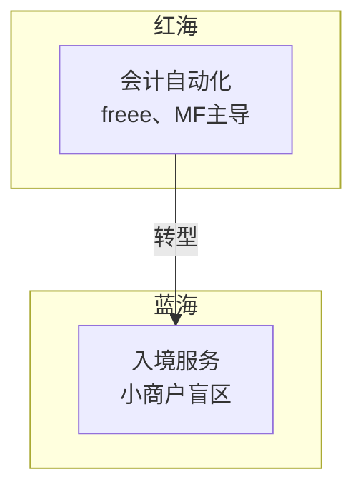
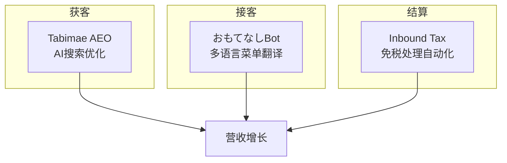
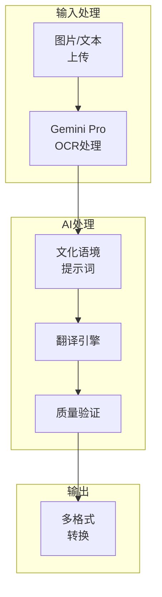

## 起点：AI效率工具的梦想

2025年11月，我以<strong>Agent Effi Flow</strong>的名义推出了一款基于AI的业务效率化SaaS。一切始于一个简单的想法："用收据OCR自动化会计工作"。

技术栈非常扎实：
- <strong>SvelteKit</strong> + <strong>Supabase</strong> + <strong>Vercel</strong>
- 基于<strong>Google Gemini 2.5 Pro</strong>的AI处理
- 积分制支付系统（Stripe集成）
- 5种语言多语言支持

然而上线一周后，我不得不面对冷酷的现实。

---

## 面对现实：红海的壁垒

### 日本会计市场的真相

在调研日本会计自动化市场时，我发现了一个令人震惊的事实：

| 服务 | 市场份额 | MAU | 特点 |
|------|----------|-----|------|
| freee | 33% | 370万+ | 一键报税 |
| Money Forward | 27% | 300万+ | 金融对接最强 |
| 弥生 | 22% | - | 税务师网络 |

<strong>收据OCR</strong>已经是这些巨头的<strong>基础功能</strong>了。作为独立开发者，在这个市场创造差异化几乎是不可能的。

### 危机信号

```
❌ 搜索曝光：几乎没有
❌ 竞争优势：不明确
❌ 价格竞争力：无法与freee的¥1,980/月相比
❌ 信任度：品牌认知度为零
```

我意识到不能再这样下去了。

---

## 转折点：寻找蓝海

### 日本市场的矛盾性机会

日本是世界第三大经济体，但数字竞争力在OECD国家中排名垫底。我在这个<strong>数字悖论</strong>中发现了机会。



### 3000万入境时代

2024年访日外国人数突破<strong>3600万</strong>。然而：

- <strong>72%</strong>的小商户在外语服务方面存在困难
- 大多数菜单翻译服务<strong>忽视文化背景</strong>
- 把"ホルモン"翻译成"Hormone"的错误频发

这正是我能解决的问题。

---

## 新愿景：守护店铺的AI管家

### 三大支柱战略



用AI支持<strong>获客 → 接客 → 结算</strong>这一连贯的客户旅程是新的愿景。

### 核心价值

| 关键词 | 含义 | 服务体现 |
|--------|------|----------|
| <strong>安心</strong> | 无差错运营 | 文化错误自动检测 |
| <strong>おもてなし</strong> | 真诚款待 | 理解语境的翻译 |
| <strong>売上</strong>（营收） | 业务增长 | AI搜索曝光优化 |

---

## おもてなしBot：第一个成果

### 服务概述

2025年12月3日，<strong>おもてなしBot</strong>正式上线。

> "零失误的完美多语言服务"

上传菜单照片，即可获得反映文化背景的<strong>13种语言</strong>翻译。

### 核心功能

#### 1. 文化语境翻译

不是简单的直译，而是理解各文化圈饮食文化的翻译：

```
❌ 以前：ホルモン → "Hormone"（荷尔蒙？）
✅ おもてなしBot：ホルモン → "Beef Offal BBQ"（牛内脏烧烤）

❌ 以前：ガス入りの水 → "Gas water"（气水？）
✅ おもてなしBot：ガス入りの水 → "Sparkling water"（气泡水）
```

#### 2. 行业专用预设

反映各行业特点的翻译优化：

- <strong>居酒屋</strong>：下酒菜文化、饮酒礼仪
- <strong>烤肉</strong>：部位说明、火候指南
- <strong>寿司</strong>：时令鱼类、主厨精选概念
- <strong>拉面</strong>：面条粗细、汤底浓度术语

#### 3. 过敏原自动检测

```
⚠️ 检测到：小麦粉 - Wheat flour
⚠️ 检测到：えび（虾） - Shrimp
⚠️ 检测到：卵（蛋） - Egg
```

#### 4. 多种输出格式

- <strong>文本</strong>：简单复制粘贴用
- <strong>Markdown</strong>：文档化用
- <strong>CSV</strong>：Excel编辑用
- <strong>图片</strong>：实际菜单设计用

---

## 技术实现：提示词架构

### 系统结构



### 提示词设计原则

おもてなしBot的核心是<strong>理解文化语境的提示词</strong>。

#### 语言专属文化指南

为每种目标语言定义了文化特性：

```typescript
// 示例：英语指南
{
  language: 'en',
  cultural_notes: [
    'Avoid literal translations of Japanese onomatopoeia',
    'Include cooking method descriptions for unfamiliar dishes',
    'Add texture/flavor hints for adventurous items'
  ]
}
```

#### 误译防止表

预定义常见误译模式：

| 日语 | 错误翻译 | 正确翻译 |
|------|----------|----------|
| ホルモン | Hormone | Beef/Pork Offal |
| もつ | Motsu | Offal/Giblets |
| ガス入り | Gas in | Sparkling |
| 並 | Normal | Regular size |

#### 严重程度分级验证

翻译结果分三级验证：

```typescript
type Severity = 'high' | 'medium' | 'low';

// high: 过敏原、宗教禁忌相关错误
// medium: 意思曲解、不当表达
// low: 风格、语感改进建议
```

### 积分系统

```typescript
const CREDIT_COSTS = {
  base: 10,        // 基础文本处理
  image_output: 30 // 图片生成额外费用
};
```

设定了小商户可以轻松承担的合理价格。

---

## 会计OCR：战略性暂停

现有的会计OCR功能已<strong>暂时停止</strong>。

### 原因

1. <strong>规避红海</strong>：放弃与freee、Money Forward的直接竞争
2. <strong>资源集中</strong>：将开发力量集中在入境特化功能上
3. <strong>品牌重塑探索</strong>：探索更好服务小商户的方向，计划改版（时间待定）

### 未来计划

会计OCR将不再是简单的收据识别，而是作为<strong>入境营收专用</strong>功能重生：

- 免税/应税自动分类
- Duty-Free、Tax-Free关键词检测
- 弥生、freee CSV格式支持

---

## 经验教训

### 1. 市场选择比技术更重要

再好的技术在红海中也难以发光。寻找<strong>竞争较少的市场</strong>是独立开发者的生存策略。

### 2. 深耕细分市场

"为所有人服务"远不如"解决特定客户的具体问题"有价值。

### 3. 转型不是失败

改变方向不是放弃。接受市场反馈、寻找更好机会是<strong>战略决策</strong>。

### 4. 文化语境是差异化

AI翻译服务很多，但理解<strong>文化语境</strong>的服务很少。这是おもてなしBot的核心竞争力。

---

## 下一步

### Phase 3（2025年1〜2月）

- <strong>Tabimae AEO</strong>：AI搜索引擎优化推广内容生成
- <strong>おもてなしBot升级</strong>：批量处理、接客脚本

### 2026年免税制度变更应对

配合2026年免税处理方式的变化，计划进一步强化面向入境顾客提供免税处理的小商户的免税处理用收据OCR功能。

---

## 总结

在红海中挣扎的会计OCR服务，在入境旅游这片蓝海中发现了新的可能性。

<strong>おもてなしBot</strong>是第一个成果。在"守护店铺的AI管家"这一愿景下，我将继续发展服务，帮助日本小商户迎接来自世界各地的客人。

---

<strong>体验服务</strong>：[Agent Effi Flow](https://agent-effi-flow.jangwook.net/)

如有反馈或问题，随时联系我。期待一起打造更好的服务。
