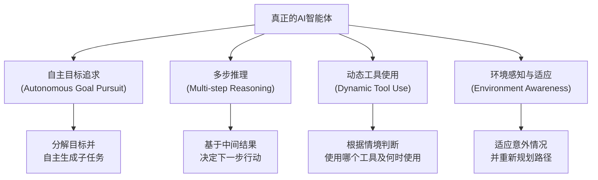
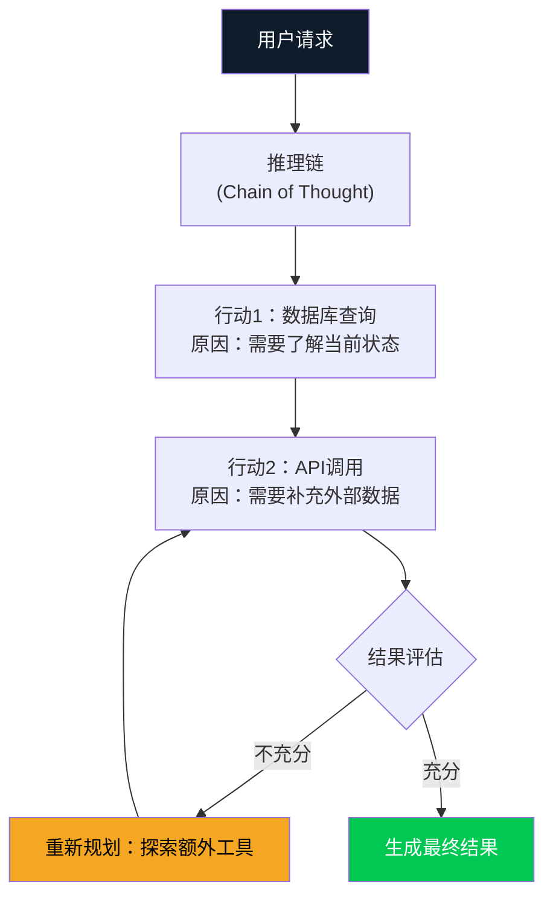
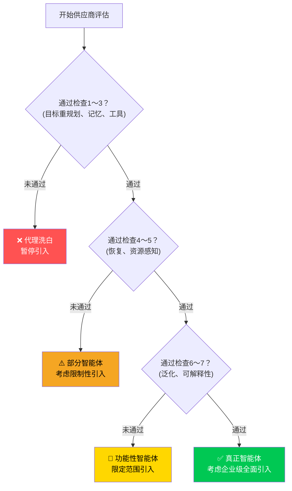

截至2026年3月，"AI智能体"一词已出现在几乎所有IT供应商的营销材料中。Gartner预测，到2026年底，40%的企业应用程序将内置AI智能体。然而，客观调查揭示了令人警醒的现实：在数千家"AI智能体"供应商中，真正构建了智能体系统的<strong>仅约130家</strong>。

其余数千家提供的是什么？是简单的自动化、if-then规则引擎，或是在LLM API调用外层包装后贴上"AI智能体"标签的产品。这种现象被称为<strong>代理洗白（Agent Washing）</strong>。正如绿色洗白将非环保产品包装成环保产品，代理洗白将基础自动化伪装成智能代理。

作为工程经理（EM），识别并规避这一陷阱不仅是技术判断，更是<strong>保护团队时间、预算和信誉</strong>的必要能力。本文通过7项经过实践验证的检查清单，介绍如何识别代理洗白。

## 什么是代理洗白

理解代理洗白，首先需要了解<strong>真正的AI智能体</strong>是什么。

真正的AI智能体具备以下四项核心特性：



相比之下，代理洗白的典型特征包括：

- 执行预定义脚本或流程图
- 有分支逻辑，但<strong>从不生成新计划</strong>
- 失败时立即上报给人工（无自主恢复机制）
- 使用LLM，但仅用于简单文本生成

## 7项识别检查清单

### ✅ 检查1：「目标重规划」测试

<strong>问题：</strong>执行过程中遇到意外障碍时会发生什么？

真正的智能体遇到障碍时<strong>自主生成备选路径</strong>。代理洗白产品则返回"方案A失败，请联系支持团队"类的错误消息。

**实践测试**：在演示中故意输入异常值，观察系统是尝试新方法还是仅仅返回错误。

```python
# 真正智能体的反应示例
# 遇到障碍 → 自主重规划

async def handle_obstacle(self, obstacle: Exception):
    # 智能体自主生成备选方案
    alternative_plans = await self.llm.generate_alternatives(
        original_goal=self.current_goal,
        obstacle=str(obstacle),
        context=self.memory.get_context()
    )
    return await self.execute_best_plan(alternative_plans)

# 代理洗白的反应示例
# 遇到障碍 → 返回错误

def handle_obstacle(self, error):
    raise AgentError(f"Predefined flow failed: {error}")
    # 或者仅返回None
```

### ✅ 检查2：「上下文记忆」测试

<strong>问题：</strong>过去交互的结果在多大程度上影响后续行动？

真正的智能体利用<strong>情节记忆</strong>将过去的失败和成功纳入当前决策。代理洗白则独立处理每个请求，或仅粘贴之前的对话文本。

**实践测试**：请求同一任务两次，第二次指出第一次结果的不足。观察智能体是否根据反馈调整方法。

### ✅ 检查3：「工具选择灵活性」测试

<strong>问题：</strong>当可用工具发生变化时，系统如何响应？

真正的智能体<strong>在运行时判断哪个工具最适合当前情况</strong>。代理洗白产品的工具执行顺序是硬编码的，缺少工具则无法运行。

```python
# 真正智能体：动态工具选择

class GenuineAgent:
    async def select_tool(self, task: str, available_tools: list) -> Tool:
        # 分析当前任务和上下文，动态选择最优工具
        tool_analysis = await self.llm.analyze_tools(
            task=task,
            tools=[t.description for t in available_tools],
            history=self.memory.recent_actions
        )
        return available_tools[tool_analysis.best_tool_index]

# 代理洗白：硬编码工具顺序

class WashedAgent:
    TOOL_SEQUENCE = ["search", "summarize", "format"]  # 不可更改

    def execute(self, task):
        for tool_name in self.TOOL_SEQUENCE:
            result = self.tools[tool_name].run(task)  # 顺序固定
        return result
```

### ✅ 检查4：「故障恢复」测试

<strong>问题：</strong>子任务失败时，整个任务会中断吗？

真正的智能体<strong>即使在部分失败的情况下也能继续推进总体目标</strong>，绕过或重试失败的部分。代理洗白产品在任何步骤失败时整个流程都会停止。

**实践测试**：临时禁用某个API，观察系统如何响应。

### ✅ 检查5：「预算/时间感知」测试

<strong>问题：</strong>存在资源限制时，系统是否能识别权衡取舍？

真正的智能体会在给定的<strong>时间、Token和[API成本](/zh/blog/zh/ai-agent-cost-reality)约束下调整策略</strong>以获得最优结果。代理洗白产品无法感知资源约束，始终以相同方式执行。

```python
# 真正智能体：资源感知

async def run_with_budget(self, task, token_budget=10000):
    estimated_cost = await self.estimate_cost(task)

    if estimated_cost > token_budget:
        # 超出预算时调整策略
        simplified_plan = await self.create_simplified_plan(
            task, max_tokens=token_budget * 0.8
        )
        return await self.execute(simplified_plan)
    return await self.execute_full_plan(task)
```

### ✅ 检查6：「新领域泛化」测试

<strong>问题：</strong>系统能处理训练数据中未见过的新型任务吗？

真正的智能体具备<strong>迁移学习能力</strong>，能利用现有知识处理新领域任务。代理洗白是专为特定使用场景设计的专业化自动化。

**实践测试**：要求供应商处理演示中未展示的边缘案例。"目前不支持此使用场景"是代理洗白的明显信号。

### ✅ 检查7：「可解释推理」测试

<strong>问题：</strong>系统能解释为何选择某一特定行动吗？

真正的智能体提供<strong>[透明的决策过程追踪](/zh/blog/zh/ai-agent-observability-production-guide)</strong>。代理洗白产品作为黑盒运行，或仅返回预先编写的说明。



## 工程经理在供应商评估中应提出的问题

基于以上7项检查清单，以下是可在供应商会议中直接提出的核心问题：

| 问题 | 真正智能体的回答模式 | 代理洗白的回答模式 |
|-----|------------------|----------------|
| "收到非结构化输入时如何处理？" | "我们生成新的计划" | "我们将其转换为预定格式" |
| "失败率是多少？" | 具体数据+恢复方法 | "可靠性很高"（无具体数据） |
| "系统如何学习和改进？" | RLHF、GRPO等具体机制 | "我们定期更新" |
| "能查看推理过程吗？" | 提供详细追踪记录 | "仅提供结果" |
| "添加新工具后会怎样？" | "系统自动学习使用方法" | "开发团队负责集成" |

## 代理洗白的实际成本

无法识别代理洗白的代价远不止于采购失误。

**1. 机会成本**：浪费了本可用于引入真正智能体AI的预算和时间。

**2. 组织信任受损**：积累的"AI项目失败"经验会让团队对未来真正的AI项目也持怀疑态度。

**3. 技术债务**：若以为简单自动化是完整智能体而据此设计架构，日后切换到真正智能体时需要全面重新设计。

**4. 竞争劣势**：引入真正智能体AI的竞争对手实现20〜40%运营成本削减，而使用代理洗白产品的组织无法享受这些收益。

## 实践评估框架

作为工程经理，在评估新AI智能体解决方案时，请使用以下决策框架：



## 2026年智能体市场的现实

根据当前企业AI采用调查（2026年3月）：

- 57.3%的组织已在生产环境中运行智能体
- 然而其中<strong>真正的自主智能体</strong>不足总数的20%
- 其余80%是自动化工作流、LLM增强聊天机器人或基于规则的系统

这一差距正是代理洗白得以盛行的原因。"拥有智能体"与"拥有真正的智能体AI"是完全不同的概念。

## 结论：怀疑的艺术

识别代理洗白是一项技术技能，但更根本上是<strong>提出正确问题的习惯</strong>。

当供应商自信地展示"AI智能体"时，作为工程经理，您应该提出7项检查清单中的问题。大多数真正的智能体AI会欢迎这些问题，并提供具体详尽的回答。代理洗白产品则会给出模糊的答案、转移话题，或回应"这在我们的路线图中"。

在2026年企业AI采用浪潮中，区分真实与虚假的能力成为工程经理的核心竞争力。从数千家供应商中找到那130家真正的智能体，这是2026年赋予每位工程经理的挑战。

## 参考资料

- [AI Journey Report 2026: Generative to Agentic - ResearchAndMarkets](https://www.globenewswire.com/news-release/2026/03/12/3254690/28124/en/AI-Journey-Report-2026-Generative-to-Agentic-Understand-How-Agentic-AI-Can-Help-LLM-Vendors-Achieve-Profitability-and-Identify-the-Likely-Winners-from-the-First-Phase-of-the-AI-Inv.html)
- [State of Agent Engineering 2026 - LangChain](https://www.langchain.com/state-of-agent-engineering)
- [5 Key Trends Shaping Agentic Development in 2026 - The New Stack](https://thenewstack.io/5-key-trends-shaping-agentic-development-in-2026/)
- [Unlocking the value of multi-agent systems in 2026 - Computer Weekly](https://www.computerweekly.com/opinion/Unlocking-the-value-of-multi-agent-systems-in-2026)
- [2026 enterprise AI predictions - InformationWeek](https://www.informationweek.com/machine-learning-ai/2026-enterprise-ai-predictions-fragmentation-commodification-and-the-agent-push-facing-cios)
