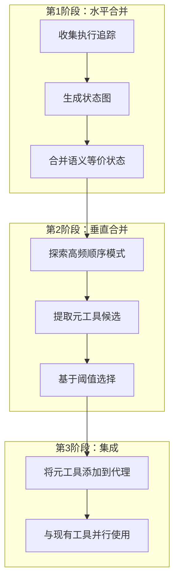
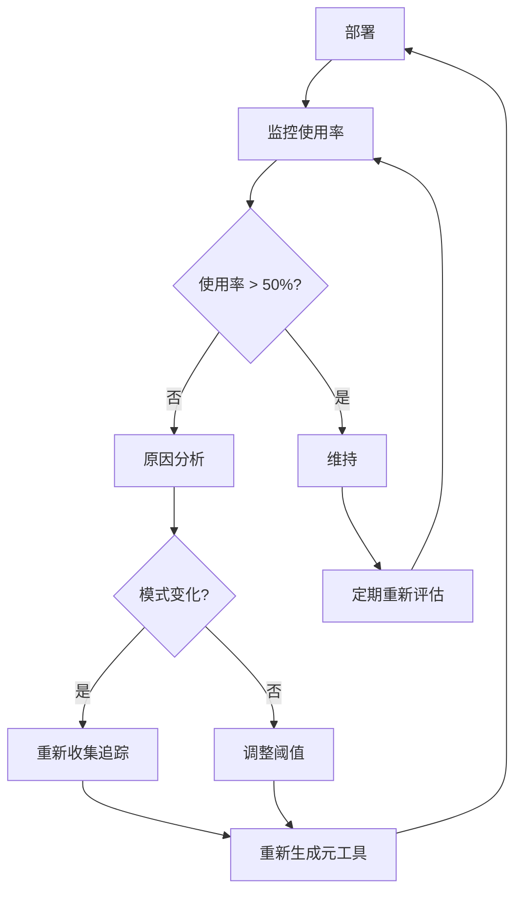

## 概述

在生产环境中部署AI代理系统时，会出现意想不到的成本和延迟。这是因为代理每次都要调用LLM来推理下一步行动。即使是登录、搜索、表单提交这样的重复模式，每次也都要经历新的推理过程。

2026年1月发表在arXiv上的<strong>"Optimizing Agentic Workflows using Meta-tools"</strong>论文为这个问题提供了实用的解决方案。核心理念很简单：分析代理的执行日志，找出反复出现的工具调用模式，将其编译成一个称为<strong>元工具(Meta-tool)</strong>的确定性复合工具。

本文将分析AWO(Agent Workflow Optimization)框架的工作原理，并从工程实践的角度探讨工程团队如何利用它。

## 为什么需要AI代理工作流优化

目前大多数AI代理系统遵循<strong>ReAct(推理+行动)</strong>模式。当代理收到用户请求时，LLM进行推理，调用工具，观察结果，然后再次推理，形成一个反复循环。

问题在于这个过程中的低效率：

- <strong>不必要的推理</strong>：登录、搜索等每次都按照相同模式执行的任务，也要经历LLM推理
- <strong>成本积累</strong>：每次LLM调用都是几美分，大规模部署时会成为巨大的成本
- <strong>延迟增加</strong>：不必要的LLM调用会增加响应时间
- <strong>幻觉风险</strong>：LLM调用越多，发生错误判断的概率就越高

在实际基准测试中，代理对同一任务表现出非常多样的执行路径。有时候本来3步就能完成的任务会走10步以上。

## AWO框架：3阶段优化管道

AWO是一个框架，通过分析代理的执行历史(trace)来自动提取元工具。大体分为3个阶段。



### 第1阶段：水平合并(Horizontal Merging)

第一阶段将多个执行追踪整合为一个状态图。每个执行用工具调用的序列表示：

```
E_i = (Tool_1, Tool_2, ..., Tool_n)
```

关键是认识<strong>语义上等价的状态</strong>。例如：

- 只读操作的顺序改变结果不变(交换律)
- 用户ID或会话令牌这样的参数进行规范化处理，视为相同
- 重复的认证流程缩写为一个

在这个过程中，领域专家定义合并规则。虽然完全自动化还有局限，但规则本身是可重复使用的。

### 第2阶段：垂直合并(Vertical Merging)

从水平合并整合的图中，用贪心(greedy)算法提取<strong>高频顺序模式</strong>：

```python
# AWO元工具提取算法(简化版)
def extract_meta_tools(graph, threshold_T):
    meta_tools = []
    while True:
        # 搜索权重超过阈值的边对
        pairs = find_high_weight_pairs(graph, threshold_T)
        if not pairs:
            break

        # 选择权重最高的对
        best_pair = max(pairs, key=lambda p: p.weight)
        candidate = [best_pair.start, best_pair.end]

        # 向后续节点扩展(如果子节点的权重足够高)
        current = best_pair.end
        while child := select_high_freq_child(current, threshold_T):
            candidate.append(child)
            current = child

        meta_tools.append(candidate)
        graph = compress(graph, candidate)

    return meta_tools
```

选择标准很明确。边的权重`w(n_y, n_z)`要超过该节点所有子边权重和的一半。这意味着只有当该模式<strong>以压倒性的频率</strong>出现时，才会将其作为元工具。

### 第3阶段：元工具集成

提取的元工具被添加到代理的工具集中。它不是替代现有工具，而是<strong>并行</strong>使用。代理可以根据情况选择使用元工具或现有的单个工具。

## 实验结果：基准测试的成果

### VisualWebArena(网页代理基准测试)

在Reddit、Classifieds、Shopping三个网页环境中测试了910个任务。

| 指标 | Reddit | Classifieds | Shopping |
|------|--------|-------------|----------|
| LLM调用减少 | 5.6% | 8.3% | 10.2% |
| 成本减少 | 5.7% | 8.5% | 10.2% |
| 成功率变化 | +2.1%p | +4.2%p | +1.8%p |
| 生成的元工具数 | 2个 | 2个 | 2个 |

Shopping类别效果最明显，因为搜索和撰写评论等重复模式很清晰。

<strong>实际生成的元工具示例</strong>：

```
# Shopping元工具：search
search [query]
  = type(search_box_id, query) → click(search_submit_id)

# Shopping元工具：leave_review
leave_review [rating, title, review]
  = click(review_tab)
  → scroll_down()
  → set_rating(rating)
  → fill(title_field, title)
  → fill(review_field, review)
  → click(post_button)
```

### AppWorld(多应用代理基准测试)

在9个应用程序环境中测试了168个任务。

| 指标 | GPT 5.1 | Claude 4.5 |
|------|---------|------------|
| LLM调用减少 | 11.9% | 7.2% |
| 成本减少 | 15.0% | 4.2% |
| 元工具活用率 | 98.2% | 39.3% |
| 生成的元工具数 | 5个 | 5个 |

有趣的是，GPT 5.1使用元工具的概率为98.2%，而Claude 4.5仅为39.3%。这表明不同模型的<strong>工具利用倾向</strong>各不相同。

## 实务应用指南：工程团队的路线图

### 第1步：收集执行追踪

要应用AWO，首先要系统地收集代理的执行日志。

```python
# 代理执行追踪收集示例
import json
from datetime import datetime

class TraceCollector:
    def __init__(self):
        self.traces = []
        self.current_trace = []

    def log_tool_call(self, tool_name: str, params: dict, result: dict):
        self.current_trace.append({
            "tool": tool_name,
            "params": self._normalize_params(params),
            "timestamp": datetime.now().isoformat(),
            "success": result.get("success", True)
        })

    def _normalize_params(self, params: dict) -> dict:
        """规范化用户ID等，便于模式搜索"""
        normalized = {}
        for k, v in params.items():
            if k in ["user_id", "session_token"]:
                normalized[k] = "<NORMALIZED>"
            else:
                normalized[k] = v
        return normalized

    def end_trace(self):
        if self.current_trace:
            self.traces.append(self.current_trace)
            self.current_trace = []

    def export(self, path: str):
        with open(path, 'w') as f:
            json.dump(self.traces, f, indent=2)
```

### 第2步：模式分析和元工具候选识别

从收集的追踪中查找重复模式。在实务中，<strong>半自动方法</strong>比完全自动化更有效：

```python
from collections import Counter

def find_frequent_sequences(traces, min_length=2, min_freq=5):
    """探索频繁的工具调用序列"""
    sequences = Counter()

    for trace in traces:
        tool_names = [step["tool"] for step in trace]
        # 以n-gram方式提取序列
        for length in range(min_length, min(len(tool_names), 6)):
            for i in range(len(tool_names) - length + 1):
                seq = tuple(tool_names[i:i + length])
                sequences[seq] += 1

    # 按频率筛选
    return {
        seq: count
        for seq, count in sequences.most_common()
        if count >= min_freq
    }
```

### 第3步：元工具实现和部署

将识别的模式实现为确定性函数：

```python
# 元工具实现示例：自动登录+搜索
class MetaTool:
    def __init__(self, name: str, steps: list):
        self.name = name
        self.steps = steps

    async def execute(self, agent_context, **params):
        """不需要LLM推理，确定性地执行"""
        results = []
        for step in self.steps:
            tool_name = step["tool"]
            tool_params = self._resolve_params(step["params"], params)
            result = await agent_context.call_tool(tool_name, tool_params)
            results.append(result)

            if not result.get("success"):
                # 失败时将控制权返回给代理
                return {"success": False, "partial_results": results}

        return {"success": True, "results": results}

    def _resolve_params(self, template: dict, actual: dict) -> dict:
        """将模板参数替换为实际值"""
        resolved = {}
        for k, v in template.items():
            if isinstance(v, str) and v.startswith("$"):
                resolved[k] = actual.get(v[1:], v)
            else:
                resolved[k] = v
        return resolved

# 使用示例
auto_login_search = MetaTool(
    name="auto_login_and_search",
    steps=[
        {"tool": "get_credentials", "params": {"service": "$service"}},
        {"tool": "login", "params": {"username": "$username", "password": "$password"}},
        {"tool": "search", "params": {"query": "$query"}}
    ]
)
```

### 第4步：监控和迭代改进

部署元工具后，要持续监控其使用率和效果：



## EM/VPoE视角：采用时的考虑事项

### 成本效益分析

AWO的ROI与代理使用规模成正比：

- <strong>小规模</strong>(日少于100次)：采用成本相对于效果来说微不足道
- <strong>中规模</strong>(日1,000〜10,000次)：5〜15%的成本节省成为有意义的金额
- <strong>大规模</strong>(日10,000次以上)：必需的优化策略

### 团队能力要求

AWO采用所需的能力：

- <strong>领域专业知识</strong>：能够定义水平合并规则的相关业务领域理解
- <strong>日志基础设施</strong>：系统地收集代理执行追踪的管道
- <strong>测试环境</strong>：验证元工具准确性的基准

### 注意事项

- 水平合并规则需要<strong>手动定义</strong>。完全自动化的尝试中性能陷入停滞
- 不同模型的元工具活用率差异很大(GPT 98% vs Claude 39%)
- 当工作分布改变时，需要<strong>重新生成</strong>元工具

## 与其他优化方法的比较

| 方法 | 方式 | 与AWO的差异 |
|--------|------|--------------|
| LLMCompiler | 并行DAG执行 | 运行时优化 vs AWO是部署前优化 |
| ReAct | 推理-行动交替 | 不消除重复推理 |
| Tree of Thought | 多路推理探索 | 探索 vs AWO是统一 |
| AVATAR | 对比学习基础 | 需要学习，但AWO仅使用执行分析 |

AWO的优势是可以<strong>非侵入性地应用于现有系统</strong>。只需添加工具，无需修改代理的核心逻辑。

## 结论

AWO框架是一种实用的方法来降低AI代理系统的实际运营成本。核心原则很简单："代理不需要每次都推理的模式就应该确定性地执行"。

对于在生产环境中运营AI代理的团队，建议从收集执行追踪开始。一旦积累了数据，哪些模式是元工具候选自然就会变得明显。

## 参考资料

- [Optimizing Agentic Workflows using Meta-tools (arXiv:2601.22037)](https://arxiv.org/abs/2601.22037)
- [A Practical Guide for Production-Grade Agentic AI Workflows (arXiv:2512.08769)](https://arxiv.org/abs/2512.08769)
- [How Agentic AI Will Reshape Engineering Workflows in 2026 (CIO)](https://www.cio.com/article/4134741/how-agentic-ai-will-reshape-engineering-workflows-in-2026.html)
- [7 Agentic AI Trends to Watch in 2026 (MachineLearningMastery)](https://machinelearningmastery.com/7-agentic-ai-trends-to-watch-in-2026/)
