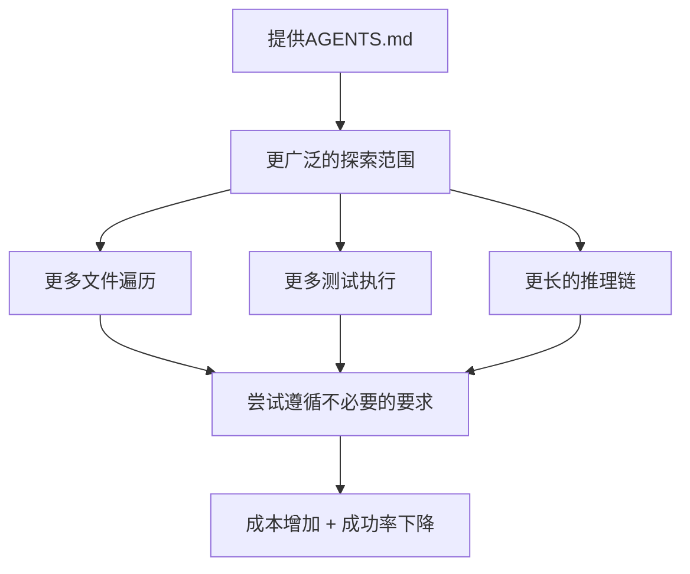

## 概述

随着Cursor、Claude Code、Codex等编码代理的普及，在代码仓库中放置<strong>AGENTS.md</strong>（或CLAUDE.md、CURSOR.md）文件来为代理提供项目上下文的做法正在迅速蔓延。目前仅GitHub上就有超过6万个仓库包含此类文件。

但这个文件<strong>真的</strong>能提高代理的任务成功率吗？ETH Zürich的研究团队发表了对这个问题的<strong>首个实证性回答</strong>。

> 📄 论文：[Evaluating AGENTS.md: Are Repository-Level Context Files Helpful for Coding Agents?](https://arxiv.org/abs/2602.11988)（arXiv 2602.11988，2026年2月）

## 核心发现：出乎意料的结果

### LLM生成的上下文文件反而降低了成功率

研究团队在三种设置下评估了编码代理：

1. <strong>无上下文文件</strong>（基线）
2. <strong>LLM自动生成的上下文文件</strong>（代理开发者推荐方式）
3. <strong>开发者手动编写的上下文文件</strong>

```
┌─────────────────────────────────────────────┐
│         各设置的平均成功率变化                 │
├─────────────────────────────────────────────┤
│  无上下文（基线）          : ████████ 基线    │
│  LLM生成上下文            : ██████▌  -3%     │
│  开发者编写上下文          : ████████▌ +4%    │
└─────────────────────────────────────────────┘
```

关键数据总结：

- <strong>LLM生成文件</strong>：平均成功率<strong>下降3%</strong>
- <strong>开发者编写文件</strong>：平均成功率<strong>提升4%</strong>（改善微弱）
- <strong>推理成本</strong>：两种情况均<strong>增加超过20%</strong>

### 为什么会出现这样的结果？

研究团队详细分析了代理的行为模式：



代理倾向于<strong>忠实遵循</strong>上下文文件中的指示。问题在于，其中许多指示对于当前任务来说是<strong>不必要的要求</strong>。遵循风格指南、使用特定测试模式等指示反而使任务变得更加复杂。

## AGENTbench：新的基准测试

研究团队为此评估构建了一个名为<strong>AGENTbench</strong>的新基准测试。

| 项目 | 内容 |
|------|------|
| 实例数 | 138个 |
| 目标仓库 | 12个（开发者实际使用上下文文件的仓库） |
| 任务类型 | Bug修复 + 功能添加 |
| 补充基准 | SWE-bench Lite（针对知名仓库） |

现有的SWE-bench以知名大型仓库为主，不包含AGENTS.md。AGENTbench是首个从<strong>实际使用上下文文件的仓库</strong>中收集任务的基准测试。

## 实践启示：应该如何使用？

### ❌ 不应该做的事

- 让LLM通过`/init`命令<strong>自动生成</strong>AGENTS.md
- 将项目的所有规则、风格指南、架构说明塞进一个文件
- 期望代理会"全部读完"而提供大量上下文

### ✅ 应该做的事

研究团队的建议很明确：<strong>"只描述最小化的要求"</strong>

有效AGENTS.md的编写原则：

1. 只明确<strong>构建/测试命令</strong>（例如：`npm test`、`pytest`）
2. 只描述<strong>项目特有工具</strong>的使用方法
3. 将风格指南和架构说明<strong>分离到单独文档</strong>
4. 只包含代理完成任务<strong>直接需要的信息</strong>

```markdown
# 好的AGENTS.md示例

## 构建
npm install && npm run build

## 测试
npm test              # 全部测试
npm test -- --grep "模式"  # 特定测试

## 代码检查
npm run lint          # 提交前必须运行
```

```markdown
# 差的AGENTS.md示例（不必要的要求过多）

## 架构
本项目遵循整洁架构...
（冗长说明200行）

## 编码风格
所有函数必须包含JSDoc注释...
变量名必须使用驼峰命名...
（详细规则100行）

## 提交规范
遵循Conventional Commits...
```

## 开发社区的反应

该论文在Hacker News上获得58分，引发了热烈讨论。主要反应包括：

- <strong>"直觉上正确的结果"</strong>：过度指示反而让代理更加混乱的经验共鸣
- <strong>"上下文窗口浪费"</strong>：长篇AGENTS.md挤占了实际代码上下文的担忧
- <strong>"最小化最好"</strong>：仅构建/测试命令就足够的实践经验分享

## 局限性与未来展望

该研究存在一些局限：

- <strong>以Python为主</strong>：AGENTbench仅针对Python项目
- <strong>小众仓库</strong>：使用上下文文件的仓库规模相对较小
- <strong>静态评估</strong>：上下文文件在重复任务中是否有累积效果尚未验证

未来研究方向包括：

1. <strong>自适应上下文</strong>：根据任务类型动态提供所需信息
2. <strong>结构化上下文</strong>：使用机器可解析的格式替代自由文本
3. <strong>多语言扩展</strong>：验证Python以外语言的效果

## 结论

AGENTS.md正在成为编码代理生态系统的事实标准，但这篇论文<strong>挑战了"写得越多越好"的常见认知</strong>。

核心信息很简单：

> <strong>上下文文件要精简，以构建和测试命令为核心。</strong>

按照代理开发者的推荐通过`/init`自动生成，目前来看可能适得其反。手动编写，只包含真正必要的信息，才是最有效的策略。

## 参考资料

- [论文原文（arXiv）](https://arxiv.org/abs/2602.11988)
- [AGENTbench GitHub仓库](https://github.com/eth-sri/agentbench)
- [AGENTS.md官方网站](https://agents.md)
- [Hacker News讨论](https://news.ycombinator.com/item?id=43062692)
