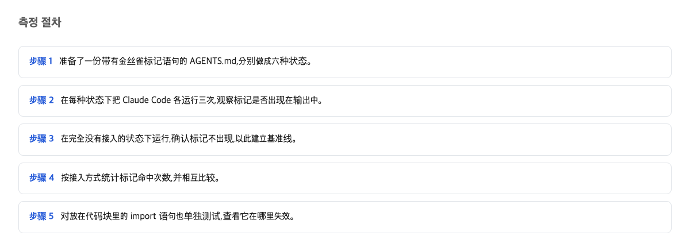
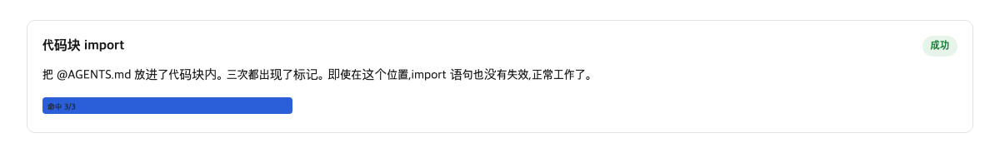

很多人同时用好几个 AI 编程工具。这些工具各自认不同的"规矩文件"名字，于是出现一个问题：同一份规矩，要不要写两遍？

先说结论。把 AGENTS.md 接到 CLAUDE.md 的三种官方方法，实测读到的内容完全一样，费用差距极小。选哪种，看哪种用着方便，不看效果。真正会出事的，是把一行示例文字放错了格式，结果整份规矩文档都没被读进去。

## AGENTS.md 和 CLAUDE.md 各自的角色

AGENTS.md 是一份写给 AI 编程助手的规矩文件。里面写的是这个项目需要注意的事项，比如代码风格、注意事项。可以把它想成贴在冰箱上的家庭便条：谁来家里帮忙，先看一眼便条，就知道碗放哪、垃圾几点收。

CLAUDE.md 是另一张类似的便条，但它是一个叫 Claude Code 的工具唯一肯看的那张。官方文档写得很直白：

> Claude Code reads `CLAUDE.md`, not `AGENTS.md`.
> — [Manage Claude's memory (CLAUDE.md) / Claude Code Docs](https://code.claude.com/docs/en/memory)

这句话对普通人的意思很实际：如果你只写了一份 AGENTS.md，这个工具根本不会去读它。你精心写的规矩，对它来说等于不存在。所以要有人负责"转交"——把冰箱上的便条抄一份、或者捎个信给只认另一种便条的那个助手。

而 AGENTS.md 的定位是给所有 AI 助手通用的补充说明：

> AGENTS.md complements this by containing the extra, sometimes detailed context coding agents need.
> — [AGENTS.md](https://agents.md/)

也就是说，一份便条想给多个助手看，但其中一位只认自己名字的信封。转交方式就是这篇文章的主题。

## 六种设定和测量方法

我们试了六种做法，每种跑 3 次，一共 18 次运行。6 种设定分别是：只放 AGENTS.md 不转交。在 CLAUDE.md 第一行写 @AGENTS.md，这叫导入，意思是告诉工具把另一份文件的内容也一起读进来。建立符号链接，相当于做一个快捷方式。直接复制一份。把 @AGENTS.md 那行用代码块包起来，代码块是文章里用几条线围起来的一段"这只是展示文字"的区域。最后放一份谁都不会去读的 NOTES.md 当对照。

怎么判断文档"被读到了"？我们在那份 9,674 字节的测试文档开头埋了一个暗号。如果助手能说出暗号，说明文档真的进了它的脑子里。每次运行还记录一个叫 token 的数字——token 是 AI 处理文字时的计费和计量单位， 大致相当于几个字母或半个词。文档被读进去越多，这个数字越大。所以 token 数本身就说明了"到底读了多少"。

换句话说，这不是凭感觉说"好像可以"，而是每次运行都有暗号和计费数字两个证据。

## 没有转交、只放 AGENTS.md 的结果

第一个设定最关键：只放 AGENTS.md，不做任何转交。结果暗号 3 次全没出现，记作 0/3。token 数是 14,940，跟那份谁都不读的 NOTES.md 对照组只差 2。

用生活话说：便条写好了贴在冰箱上，但来找的那位只看信箱，一次都没打开看。规矩不是"读得不认真"，是压根没被读。

这里需要留意的是：文件名字起得再好、内容写得再细，如果没接上对方认的入口，就等于零。

## 三种转交方法的实测结果

三种方法都达到了 3/3——暗号三次全部命中。数据是：导入法 3/3，token 17,978；符号链接法 3/3，17,856；复制法 3/3，17,862。

一张表格说明三种方法都把便条送到了：

| 转交方法 | 暗号命中 | token 数 |
|---|---|---|
| 导入 @AGENTS.md | 3/3 | 17,978 |
| 符号链接 | 3/3 | 17,856 |
| 复制一份 | 3/3 | 17,862 |

再算一笔账。那份 9,674 字节的文档，换算成 token 大约是 2,920。复制法比对照组多出的正是这 2,920——说明文档整份被读了进去。导入法只比复制法多 116，说明导入并没有把文档读两次、收两次钱。三种方法之间最大的差距只有 122，不到一份文档的 4%。

还有一个小插曲：六种做法里有四种，各有一次运行恰好少算了 109 token，原因没查明。所以 122 的差距可能本来就没那么可靠。

所以选哪个？答案是：都行，选最省事的。不需要单独维护两份内容、也不怕建立快捷方式的权限问题，就用符号链接。Windows 系统建符号链接需要管理员权限，所以官方文档直接建议：

> On Windows, creating a symlink requires Administrator privileges or Developer Mode, so use the `@AGENTS.md` import instead.
> — [Manage Claude's memory (CLAUDE.md) / Claude Code Docs](https://code.claude.com/docs/en/memory)

## 用代码块包住的 @import 的结果

这是全文最重要的一次实验。同一个 @AGENTS.md，只是外面用代码块包了一层——比如你想在文档里给同事展示"应该这样写"，于是把它当例子放进了代码块。结果：暗号 0/3，token 15,081，跟"完全没转交"的水平差不多，只多 141。

也就是说，那几条线一画，整份文档都没被读进去。而且没有任何报错，没有提示，安静得像什么都没发生过。

官方文档其实写了这条规则：

> Import parsing skips Markdown code spans and fenced code blocks. To mention a path in your CLAUDE.md without importing it, wrap it in backticks: writing `@README` keeps the text literal, while @README outside backticks imports the file.
> — [Manage Claude's memory (CLAUDE.md) / Claude Code Docs](https://code.claude.com/docs/en/memory)

用大白话解释：工具在读取文件时，会把代码块里的内容当作"展示用的文字"跳过。这个规则本身是合理的——但它的代价超出直觉：跳过的不只是那一行，而是那行指向的整份文档。为什么能确定是"读取阶段"断掉的？因为 token 数字停在了"没读"的水平，而不是"读了"的水平。数字在这里给出了证据。

所以要注意的是：写文档时一个完全出于好心的格式动作——把示例代码包起来——就能让所有规矩无声失效，而且你不会收到任何警告。

## 三种方法比较的结论

把结论压缩成一句话：三种转交方法效果相同，选哪种看管理方式；真正的风险不在转交，而在格式。一行放进代码块，代价是 2,920 token 的规矩全部消失。

给两类读者各一句操作建议：

- 如果你不想要两份内容分开维护：不要复制，直接用符号链接把 AGENTS.md 接成 CLAUDE.md，照着命令原样执行即可。
- 如果你需要在 CLAUDE.md 里追加这个工具专属的内容，或者你用的环境建符号链接很麻烦（比如 Windows）：用第一行导入的方式，但写路径示例时千万别把它放进代码块——要么不加任何包裹直接写，要么按官方说的用反引号包住表示"这只是文字"。

## 本文未能核实的部分

这次每个设定只跑了 3 次，偶发的漏读可能没被抓到；另一套叫 Codex 的 AI 编程工具因为没有可用额度，完全没测。接下来要核实的是：更大规模的文档里，代码块这个坑是否以同样的形状出现，以及那个 109 token 波动的原因。

这个判断会在什么条件下出错：如果三种转交方法里有任何一种实测出现文档反复读不进去，或者某种方法被多收了约 2,920 token（等于同一份文档被算了两次钱），这篇文章的结论就是错的。

## 参考资料

1. [Manage Claude's memory (CLAUDE.md) / Claude Code Docs](https://code.claude.com/docs/en/memory) — Anthropic (code.claude.com)
2. [AGENTS.md](https://agents.md/) — agents.md