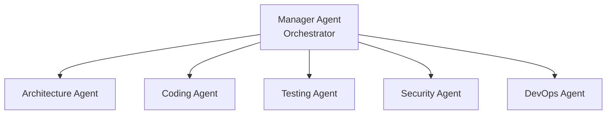
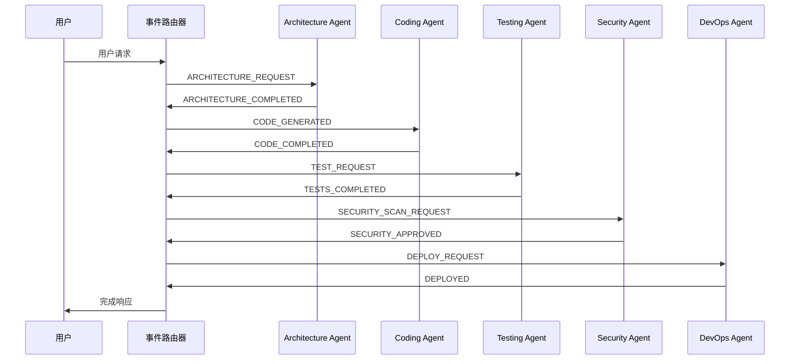
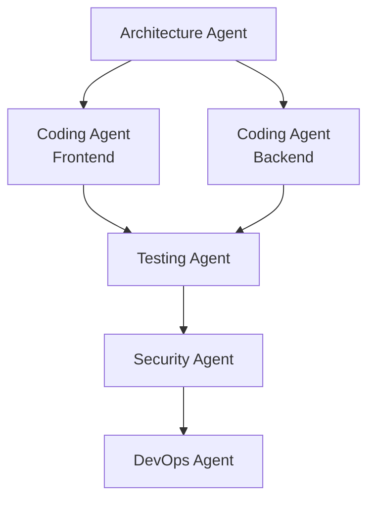
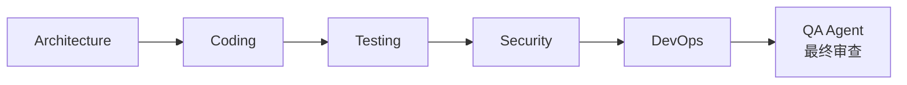

## 多智能体时代的到来

2025年，AI开发迎来了新的转折点。从单一AI智能体（Agent）处理所有任务的时代，正在演进为<strong>多个专业智能体协作的多智能体系统（Multi-Agent System）</strong>。

一名开发者通过协调（orchestration）5个专业智能体来构建全栈应用，这就是如今的现实。

### 为什么选择多智能体？

<strong>单一智能体的局限</strong>：
- 上下文窗口限制（一个AI无法记住所有内容）
- 缺乏专业性（无法精通所有领域）
- 无法并行处理（一次只能执行一个任务）

<strong>多智能体的优势</strong>：
- <strong>分工与专业化</strong>：每个智能体专注于特定领域
- <strong>并行执行</strong>：同时处理多个任务
- <strong>可扩展性</strong>：可通过添加新智能体扩展功能
- <strong>弹性（Resilience）</strong>：单个智能体故障不影响整体系统

实际上，丰田通过多智能体系统<strong>每年节省10,000小时以上</strong>，在电子商务API项目中实现了<strong>bug减少70%、重构时间缩短75%</strong>的成果。

## 5个专业智能体架构

构建全栈应用的理想智能体配置：

### 1. Architecture Agent（架构智能体）

<strong>角色</strong>：系统设计与结构决策

<strong>核心职责</strong>：
- 系统架构设计（微服务、单体、无服务器等）
- 数据库模式（Schema）设计
- 技术栈选型
- 组件间接口定义
- 可扩展性与性能考量

<strong>输出示例</strong>：
````markdown
## System Architecture

### Technology Stack
- Frontend: React 18 + TypeScript
- Backend: Node.js (Express) + TypeScript
- Database: PostgreSQL 15 + Redis (缓存)
- Infrastructure: AWS (ECS Fargate, RDS, ElastiCache)

### Component Structure
```
frontend/
├── components/       # React组件
├── hooks/           # 自定义Hooks
├── services/        # API客户端
└── store/           # 状态管理 (Zustand)

backend/
├── domain/          # 业务逻辑
├── application/     # 用例
├── infrastructure/  # DB、外部API
└── presentation/    # REST控制器
```

### Database Schema
```sql
CREATE TABLE users (
  id UUID PRIMARY KEY,
  email VARCHAR(255) UNIQUE NOT NULL,
  created_at TIMESTAMP DEFAULT NOW()
);

CREATE TABLE posts (
  id UUID PRIMARY KEY,
  user_id UUID REFERENCES users(id),
  title VARCHAR(255) NOT NULL,
  content TEXT,
  published_at TIMESTAMP
);
```
````

### 2. Coding Agent（编码智能体）

<strong>角色</strong>：代码实现与生成

<strong>核心职责</strong>：
- 将Architecture Agent的设计转化为实际代码
- 编写业务逻辑
- 实现API端点
- 开发前端组件
- 代码审查与重构

<strong>实际成果</strong>：
- <strong>实现时间缩短35%</strong>（针对专业开发者的研究）
- <strong>缺陷率降低27%</strong>

<strong>实现示例</strong>：
```typescript
// Architecture Agent设计 → Coding Agent实现

// domain/user.entity.ts
export class User {
  constructor(
    public readonly id: string,
    public readonly email: string,
    public readonly createdAt: Date
  ) {}

  static create(email: string): User {
    return new User(
      crypto.randomUUID(),
      email,
      new Date()
    );
  }
}

// application/user.service.ts
export class UserService {
  constructor(private userRepository: UserRepository) {}

  async createUser(email: string): Promise<User> {
    const existingUser = await this.userRepository.findByEmail(email);
    if (existingUser) {
      throw new Error('User already exists');
    }

    const user = User.create(email);
    await this.userRepository.save(user);
    return user;
  }
}

// presentation/user.controller.ts
export class UserController {
  constructor(private userService: UserService) {}

  async create(req: Request, res: Response) {
    try {
      const { email } = req.body;
      const user = await this.userService.createUser(email);
      res.status(201).json(user);
    } catch (error) {
      res.status(400).json({ error: error.message });
    }
  }
}
```

### 3. Testing Agent（测试智能体）

<strong>角色</strong>：自动化测试编写与质量保证

<strong>核心职责</strong>：
- 生成单元测试
- 编写集成测试
- 实现E2E测试场景
- 分析测试覆盖率
- 检测并报告bug

<strong>测试示例</strong>：
```typescript
// user.service.test.ts
describe('UserService', () => {
  let userService: UserService;
  let mockRepository: jest.Mocked<UserRepository>;

  beforeEach(() => {
    mockRepository = {
      findByEmail: jest.fn(),
      save: jest.fn(),
    } as any;
    userService = new UserService(mockRepository);
  });

  describe('createUser', () => {
    it('should create a new user successfully', async () => {
      const email = 'test@example.com';
      mockRepository.findByEmail.mockResolvedValue(null);
      mockRepository.save.mockResolvedValue(undefined);

      const user = await userService.createUser(email);

      expect(user.email).toBe(email);
      expect(mockRepository.save).toHaveBeenCalledWith(
        expect.objectContaining({ email })
      );
    });

    it('should throw error if user already exists', async () => {
      const email = 'existing@example.com';
      const existingUser = User.create(email);
      mockRepository.findByEmail.mockResolvedValue(existingUser);

      await expect(userService.createUser(email)).rejects.toThrow(
        'User already exists'
      );
    });

    it('should generate valid UUID for user ID', async () => {
      mockRepository.findByEmail.mockResolvedValue(null);
      const user = await userService.createUser('test@example.com');

      expect(user.id).toMatch(
        /^[0-9a-f]{8}-[0-9a-f]{4}-4[0-9a-f]{3}-[89ab][0-9a-f]{3}-[0-9a-f]{12}$/i
      );
    });
  });
});

// 集成测试
describe('User API Integration', () => {
  it('POST /users should create user and return 201', async () => {
    const response = await request(app)
      .post('/users')
      .send({ email: 'integration@test.com' })
      .expect(201);

    expect(response.body).toMatchObject({
      email: 'integration@test.com',
      id: expect.any(String),
      createdAt: expect.any(String)
    });
  });
});
```

### 4. Security Agent（安全智能体）

<strong>角色</strong>：安全漏洞检测与防御

<strong>核心职责</strong>：
- 代码安全扫描
- 漏洞检测（SQL注入、XSS、CSRF等）
- 合规性验证（GDPR、HIPAA）
- 提供安全建议
- 威胁分析与缓解策略

<strong>安全检查清单示例</strong>：
```markdown
## Security Checklist

### Input Validation
- [x] 验证所有用户输入（Joi/Zod模式）
- [x] 防止SQL注入（参数化查询）
- [x] 防止XSS（输入清理）
- [x] 文件上传验证（MIME类型、大小限制）

### Authentication & Authorization
- [x] 密码哈希（bcrypt，成本因子12）
- [x] JWT令牌过期设置（访问15分钟，刷新7天）
- [x] 速率限制（每IP 15分钟100次）
- [x] 强制HTTPS（生产环境）

### Data Protection
- [x] 用环境变量管理密钥
- [x] 数据库加密（静态、传输）
- [x] CORS白名单设置
- [x] 防止敏感信息记录日志

### Compliance
- [x] GDPR：用户数据删除API
- [x] 日志保留策略（90天）
- [x] 更新隐私政策
```

<strong>漏洞报告示例</strong>：
```typescript
// ❌ Security Agent检测到的漏洞
app.get('/user/:id', (req, res) => {
  const query = `SELECT * FROM users WHERE id = '${req.params.id}'`;
  // SQL注入风险！
  db.query(query, (err, result) => {
    res.json(result);
  });
});

// ✅ Security Agent建议的修复
app.get('/user/:id', async (req, res) => {
  const { id } = req.params;

  // 输入验证
  const schema = Joi.object({
    id: Joi.string().uuid().required()
  });
  const { error } = schema.validate({ id });
  if (error) {
    return res.status(400).json({ error: 'Invalid user ID' });
  }

  // 参数化查询
  const result = await db.query(
    'SELECT * FROM users WHERE id = $1',
    [id]
  );
  res.json(result.rows[0]);
});
```

### 5. DevOps Agent（DevOps智能体）

<strong>角色</strong>：CI/CD、部署、监控

<strong>核心职责</strong>：
- CI/CD流水线配置
- 基础设施配置（Terraform、CloudFormation）
- 容器化（Docker、Kubernetes）
- 监控与告警设置
- 性能优化

<strong>实际成果</strong>：化工行业案例中<strong>质量故障减少30%</strong>

<strong>CI/CD流水线示例</strong>：
```yaml
# .github/workflows/deploy.yml
name: Deploy to Production

on:
  push:
    branches: [main]

jobs:
  test:
    runs-on: ubuntu-latest
    steps:
      - uses: actions/checkout@v3
      - name: Run Tests
        run: |
          npm ci
          npm test -- --coverage
          # 执行Testing Agent生成的测试

  security:
    runs-on: ubuntu-latest
    steps:
      - uses: actions/checkout@v3
      - name: Security Scan
        run: |
          npm audit
          # Security Agent定义的安全检查
          npx snyk test

  build:
    needs: [test, security]
    runs-on: ubuntu-latest
    steps:
      - uses: actions/checkout@v3
      - name: Build Docker Image
        run: |
          docker build -t myapp:${{ github.sha }} .
          docker push myapp:${{ github.sha }}

  deploy:
    needs: build
    runs-on: ubuntu-latest
    steps:
      - name: Deploy to ECS
        run: |
          aws ecs update-service \
            --cluster production \
            --service myapp \
            --force-new-deployment

      - name: Health Check
        run: |
          # DevOps Agent定义的健康检查
          for i in {1..30}; do
            if curl -f https://api.example.com/health; then
              echo "Deployment successful"
              exit 0
            fi
            sleep 10
          done
          echo "Deployment failed"
          exit 1
```

## 智能体编排模式

### 1. 分层编排（Hierarchical）

<strong>结构</strong>：Manager智能体协调5个专业智能体



<strong>优点</strong>：
- 清晰的命令结构
- 集中式进度跟踪
- 易于调试

<strong>适用场景</strong>：
- 可清晰分解任务的情况
- 需要中央监控时
- 团队偏好结构化工作流

<strong>实际实现</strong>（使用LangGraph）：
```python
from langgraph.graph import StateGraph, END

# 定义状态
class AppState(TypedDict):
    requirements: str
    architecture: dict
    code: dict
    tests: dict
    security_report: dict
    deployment_config: dict

# 创建图
workflow = StateGraph(AppState)

# 添加节点（每个节点 = 智能体）
workflow.add_node("architect", architecture_agent)
workflow.add_node("coder", coding_agent)
workflow.add_node("tester", testing_agent)
workflow.add_node("security", security_agent)
workflow.add_node("devops", devops_agent)

# 添加边（任务流）
workflow.add_edge("architect", "coder")
workflow.add_edge("coder", "tester")
workflow.add_edge("tester", "security")
workflow.add_edge("security", "devops")
workflow.add_edge("devops", END)

# 设置起点
workflow.set_entry_point("architect")

# 执行
app = workflow.compile()
result = app.invoke({
    "requirements": "Build a REST API for user management"
})
```

### 2. 事件驱动架构（Event-Driven）

<strong>结构</strong>：智能体间异步事件流

<strong>优点</strong>：
- 服务解耦（每个智能体只需知道事件路由器）
- 故障隔离（单个智能体故障不会传播）
- 可扩展的协调
- 实时处理

<strong>事件流示例</strong>：


<strong>Redis Streams实现</strong>：
```typescript
import Redis from 'ioredis';

const redis = new Redis();

// Architecture Agent: 发布事件
async function publishArchitectureComplete(architecture: any) {
  await redis.xadd(
    'agent-events',
    '*',
    'type', 'ARCHITECTURE_COMPLETED',
    'data', JSON.stringify(architecture),
    'timestamp', Date.now().toString()
  );
}

// Coding Agent: 订阅事件
async function listenForArchitecture() {
  const consumer = redis.duplicate();

  // 创建消费者组
  await consumer.xgroup(
    'CREATE', 'agent-events', 'coding-group', '0', 'MKSTREAM'
  ).catch(() => {}); // 已存在则忽略

  while (true) {
    const events = await consumer.xreadgroup(
      'GROUP', 'coding-group', 'coder-1',
      'BLOCK', 5000,
      'STREAMS', 'agent-events', '>'
    );

    if (!events) continue;

    for (const [stream, messages] of events) {
      for (const [id, fields] of messages) {
        const event = parseEvent(fields);

        if (event.type === 'ARCHITECTURE_COMPLETED') {
          await generateCode(event.data);
          await redis.xack('agent-events', 'coding-group', id);
        }
      }
    }
  }
}
```

### 3. 基于图的编排

<strong>结构</strong>：用DAG（有向无环图）表达依赖关系

<strong>优点</strong>：
- 可视化工作流表达
- 可并行执行任务
- 清晰的依赖管理

<strong>并行执行示例</strong>：


## 智能体间通信协议

### Model Context Protocol（MCP）

<strong>开发</strong>：Anthropic（2024开源），OpenAI正式采用（2025年3月）

<strong>目的</strong>：智能体 ↔ 工具/内存间的垂直通信

<strong>特点</strong>：
- JSON-RPC客户端-服务器接口
- 安全上下文注入
- 结构化工具调用
- 资源管理
- 强制访问控制

<strong>使用示例</strong>：
```json
// MCP请求：Coding Agent → 数据库工具
{
  "jsonrpc": "2.0",
  "id": 1,
  "method": "tools/call",
  "params": {
    "name": "database_query",
    "arguments": {
      "query": "SELECT * FROM users WHERE id = $1",
      "params": ["user-123"]
    }
  }
}

// MCP响应
{
  "jsonrpc": "2.0",
  "id": 1,
  "result": {
    "content": [
      {
        "type": "text",
        "text": "{\"id\": \"user-123\", \"email\": \"test@example.com\"}"
      }
    ]
  }
}
```

<strong>全球采用率</strong>：2025年基准<strong>全球78%的组织使用MCP或A2A协议</strong>

### Agent-to-Agent Protocol（A2A）

<strong>目的</strong>：智能体 ↔ 智能体间的水平通信

<strong>区别</strong>：
- MCP：智能体访问工具或内存时
- A2A：智能体间直接通信时

<strong>A2A消息示例</strong>：
```json
// Architecture Agent → Coding Agent
{
  "from": "architecture-agent",
  "to": "coding-agent",
  "type": "TASK_ASSIGNMENT",
  "payload": {
    "task_id": "impl-user-api",
    "architecture": {
      "pattern": "clean-architecture",
      "layers": ["domain", "application", "infrastructure", "presentation"],
      "database": "postgresql"
    },
    "deadline": "2025-10-17T10:00:00Z"
  },
  "metadata": {
    "priority": "high",
    "confidence_score": 0.95
  }
}

// Coding Agent → Architecture Agent（完成通知）
{
  "from": "coding-agent",
  "to": "architecture-agent",
  "type": "TASK_COMPLETED",
  "payload": {
    "task_id": "impl-user-api",
    "files_created": [
      "src/domain/user.entity.ts",
      "src/application/user.service.ts",
      "src/infrastructure/user.repository.ts",
      "src/presentation/user.controller.ts"
    ],
    "status": "success"
  }
}
```

## 错误处理与弹性

### 1. 回退（Fallback）策略

<strong>三级回退</strong>：
```typescript
async function executeWithFallback(task: Task) {
  try {
    // 级别1：主LLM（GPT-4）
    return await primaryAgent.execute(task);
  } catch (error) {
    console.warn('Primary agent failed, trying fallback');

    try {
      // 级别2：备用LLM（Claude）
      return await fallbackAgent.execute(task);
    } catch (fallbackError) {
      // 级别3：人工介入（Human-in-the-Loop）
      return await escalateToHuman(task, [error, fallbackError]);
    }
  }
}
```

### 2. 渐进式发布（Canary Deployment）

<strong>智能体部署策略</strong>：
```yaml
# Canary部署：5% → 50% → 100%
deployment:
  strategy: canary
  steps:
    - percentage: 5
      duration: 1h
      metrics:
        - error_rate < 1%
        - response_time < 200ms

    - percentage: 50
      duration: 2h
      metrics:
        - error_rate < 0.5%
        - user_satisfaction > 4.5/5

    - percentage: 100
      # 仅在所有指标通过时全量发布
```

### 3. 断路器（Circuit Breaker）模式

<strong>防止智能体间故障传播</strong>：
```typescript
class CircuitBreaker {
  private failureCount = 0;
  private lastFailureTime: number | null = null;
  private state: 'CLOSED' | 'OPEN' | 'HALF_OPEN' = 'CLOSED';

  async call(agent: Agent, task: Task) {
    if (this.state === 'OPEN') {
      if (Date.now() - this.lastFailureTime! > 60000) {
        // 1分钟后重试
        this.state = 'HALF_OPEN';
      } else {
        throw new Error('Circuit breaker is OPEN');
      }
    }

    try {
      const result = await agent.execute(task);
      this.onSuccess();
      return result;
    } catch (error) {
      this.onFailure();
      throw error;
    }
  }

  private onSuccess() {
    this.failureCount = 0;
    this.state = 'CLOSED';
  }

  private onFailure() {
    this.failureCount++;
    this.lastFailureTime = Date.now();

    if (this.failureCount >= 5) {
      this.state = 'OPEN';
      console.error('Circuit breaker opened after 5 failures');
    }
  }
}
```

## 实战案例：构建Todo API

让我们用5个智能体实现完整工作流。

### 需求
````markdown
## Todo API需求

- 按用户管理待办事项列表
- CRUD操作（创建、查询、修改、删除）
- 切换完成状态
- 管理截止日期
- RESTful API
````

### Phase 1: Architecture Agent

````markdown
## Architecture Design

### Technology Stack
- Backend: Node.js (Express) + TypeScript
- Database: PostgreSQL
- Cache: Redis（优化查询性能）
- Testing: Jest + Supertest

### Database Schema
CREATE TABLE todos (
  id UUID PRIMARY KEY DEFAULT gen_random_uuid(),
  user_id UUID NOT NULL,
  title VARCHAR(255) NOT NULL,
  description TEXT,
  completed BOOLEAN DEFAULT FALSE,
  due_date TIMESTAMP,
  created_at TIMESTAMP DEFAULT NOW(),
  updated_at TIMESTAMP DEFAULT NOW()
);

CREATE INDEX idx_todos_user_id ON todos(user_id);
CREATE INDEX idx_todos_completed ON todos(completed);

### API Endpoints
- POST   /todos        → 创建待办事项
- GET    /todos        → 列表查询
- GET    /todos/:id    → 单个查询
- PUT    /todos/:id    → 修改
- DELETE /todos/:id    → 删除
- PATCH  /todos/:id/toggle → 切换完成状态
````

### Phase 2: Coding Agent

```typescript
// domain/todo.entity.ts
export class Todo {
  constructor(
    public readonly id: string,
    public readonly userId: string,
    public title: string,
    public description: string,
    public completed: boolean,
    public dueDate: Date | null,
    public readonly createdAt: Date,
    public updatedAt: Date
  ) {}

  static create(userId: string, title: string, description: string = '', dueDate: Date | null = null): Todo {
    return new Todo(
      crypto.randomUUID(),
      userId,
      title,
      description,
      false,
      dueDate,
      new Date(),
      new Date()
    );
  }

  toggle(): void {
    this.completed = !this.completed;
    this.updatedAt = new Date();
  }

  update(title?: string, description?: string, dueDate?: Date | null): void {
    if (title !== undefined) this.title = title;
    if (description !== undefined) this.description = description;
    if (dueDate !== undefined) this.dueDate = dueDate;
    this.updatedAt = new Date();
  }
}

// application/todo.service.ts
export class TodoService {
  constructor(
    private todoRepository: TodoRepository,
    private cache: RedisClient
  ) {}

  async createTodo(userId: string, title: string, description?: string, dueDate?: Date): Promise<Todo> {
    const todo = Todo.create(userId, title, description, dueDate);
    await this.todoRepository.save(todo);
    await this.cache.del(`todos:${userId}`); // 缓存失效
    return todo;
  }

  async getTodos(userId: string): Promise<Todo[]> {
    const cached = await this.cache.get(`todos:${userId}`);
    if (cached) {
      return JSON.parse(cached);
    }

    const todos = await this.todoRepository.findByUserId(userId);
    await this.cache.setex(`todos:${userId}`, 300, JSON.stringify(todos)); // 5分钟缓存
    return todos;
  }

  async toggleTodo(id: string, userId: string): Promise<Todo> {
    const todo = await this.todoRepository.findById(id);
    if (!todo || todo.userId !== userId) {
      throw new Error('Todo not found');
    }

    todo.toggle();
    await this.todoRepository.save(todo);
    await this.cache.del(`todos:${userId}`);
    return todo;
  }
}

// presentation/todo.controller.ts
export class TodoController {
  constructor(private todoService: TodoService) {}

  create = async (req: Request, res: Response) => {
    try {
      const { title, description, dueDate } = req.body;
      const userId = req.user!.id; // 从认证中间件注入

      const todo = await this.todoService.createTodo(
        userId,
        title,
        description,
        dueDate ? new Date(dueDate) : undefined
      );

      res.status(201).json(todo);
    } catch (error) {
      res.status(400).json({ error: error.message });
    }
  };

  list = async (req: Request, res: Response) => {
    const userId = req.user!.id;
    const todos = await this.todoService.getTodos(userId);
    res.json(todos);
  };

  toggle = async (req: Request, res: Response) => {
    try {
      const { id } = req.params;
      const userId = req.user!.id;

      const todo = await this.todoService.toggleTodo(id, userId);
      res.json(todo);
    } catch (error) {
      res.status(404).json({ error: error.message });
    }
  };
}
```

### Phase 3: Testing Agent

```typescript
// todo.service.test.ts
describe('TodoService', () => {
  let service: TodoService;
  let mockRepository: jest.Mocked<TodoRepository>;
  let mockCache: jest.Mocked<RedisClient>;

  beforeEach(() => {
    mockRepository = {
      save: jest.fn(),
      findByUserId: jest.fn(),
      findById: jest.fn(),
    } as any;

    mockCache = {
      get: jest.fn(),
      setex: jest.fn(),
      del: jest.fn(),
    } as any;

    service = new TodoService(mockRepository, mockCache);
  });

  describe('createTodo', () => {
    it('should create todo and invalidate cache', async () => {
      const userId = 'user-123';
      const title = 'Buy groceries';

      const todo = await service.createTodo(userId, title);

      expect(todo.title).toBe(title);
      expect(todo.userId).toBe(userId);
      expect(todo.completed).toBe(false);
      expect(mockRepository.save).toHaveBeenCalled();
      expect(mockCache.del).toHaveBeenCalledWith(`todos:${userId}`);
    });
  });

  describe('getTodos', () => {
    it('should return cached todos if available', async () => {
      const userId = 'user-123';
      const cachedTodos = [{ id: '1', title: 'Test' }];
      mockCache.get.mockResolvedValue(JSON.stringify(cachedTodos));

      const todos = await service.getTodos(userId);

      expect(todos).toEqual(cachedTodos);
      expect(mockRepository.findByUserId).not.toHaveBeenCalled();
    });

    it('should fetch from DB and cache if not cached', async () => {
      const userId = 'user-123';
      const dbTodos = [Todo.create(userId, 'Test')];
      mockCache.get.mockResolvedValue(null);
      mockRepository.findByUserId.mockResolvedValue(dbTodos);

      const todos = await service.getTodos(userId);

      expect(todos).toEqual(dbTodos);
      expect(mockCache.setex).toHaveBeenCalledWith(
        `todos:${userId}`,
        300,
        JSON.stringify(dbTodos)
      );
    });
  });

  describe('toggleTodo', () => {
    it('should toggle todo completion status', async () => {
      const todo = Todo.create('user-123', 'Test');
      mockRepository.findById.mockResolvedValue(todo);

      const result = await service.toggleTodo(todo.id, 'user-123');

      expect(result.completed).toBe(true);
      expect(mockRepository.save).toHaveBeenCalled();
    });

    it('should throw error if todo not found', async () => {
      mockRepository.findById.mockResolvedValue(null);

      await expect(
        service.toggleTodo('invalid-id', 'user-123')
      ).rejects.toThrow('Todo not found');
    });

    it('should throw error if user does not own todo', async () => {
      const todo = Todo.create('other-user', 'Test');
      mockRepository.findById.mockResolvedValue(todo);

      await expect(
        service.toggleTodo(todo.id, 'user-123')
      ).rejects.toThrow('Todo not found');
    });
  });
});

// 集成测试
describe('Todo API Integration', () => {
  it('should create and retrieve todos', async () => {
    const createRes = await request(app)
      .post('/todos')
      .set('Authorization', 'Bearer test-token')
      .send({ title: 'Integration Test', description: 'Test todo' })
      .expect(201);

    expect(createRes.body).toMatchObject({
      title: 'Integration Test',
      completed: false
    });

    const listRes = await request(app)
      .get('/todos')
      .set('Authorization', 'Bearer test-token')
      .expect(200);

    expect(listRes.body).toHaveLength(1);
    expect(listRes.body[0].title).toBe('Integration Test');
  });
});
```

### Phase 4: Security Agent

````markdown
## Security Report

### Vulnerabilities Found: 2

#### 1. Missing Input Validation (HIGH)
<strong>位置</strong>：`todo.controller.ts:create()`
<strong>问题</strong>：处理前未验证用户输入
<strong>建议</strong>：添加Joi/Zod模式验证

#### 2. Cache Poisoning Risk (MEDIUM)
<strong>位置</strong>：`todo.service.ts:getTodos()`
<strong>问题</strong>：缓存键仅基于用户ID，无完整性检查
<strong>建议</strong>：为缓存键添加HMAC签名

### Recommendations Applied:

```typescript
// 修复后的todo.controller.ts
import Joi from 'joi';

const createTodoSchema = Joi.object({
  title: Joi.string().min(1).max(255).required(),
  description: Joi.string().max(5000).optional(),
  dueDate: Joi.date().iso().optional()
});

export class TodoController {
  create = async (req: Request, res: Response) => {
    // 添加输入验证
    const { error, value } = createTodoSchema.validate(req.body);
    if (error) {
      return res.status(400).json({ error: error.details[0].message });
    }

    try {
      const { title, description, dueDate } = value;
      const userId = req.user!.id;

      const todo = await this.todoService.createTodo(
        userId,
        title,
        description,
        dueDate ? new Date(dueDate) : undefined
      );

      res.status(201).json(todo);
    } catch (error) {
      res.status(500).json({ error: 'Internal server error' });
    }
  };
}

// 修复后的todo.service.ts（增强缓存安全）
import crypto from 'crypto';

export class TodoService {
  private generateCacheKey(userId: string): string {
    const hmac = crypto.createHmac('sha256', process.env.CACHE_SECRET!);
    hmac.update(userId);
    const signature = hmac.digest('hex');
    return `todos:${userId}:${signature}`;
  }

  async getTodos(userId: string): Promise<Todo[]> {
    const cacheKey = this.generateCacheKey(userId);
    const cached = await this.cache.get(cacheKey);
    if (cached) {
      return JSON.parse(cached);
    }

    const todos = await this.todoRepository.findByUserId(userId);
    await this.cache.setex(cacheKey, 300, JSON.stringify(todos));
    return todos;
  }
}
```
````

### Phase 5: DevOps Agent

```yaml
# .github/workflows/deploy.yml
name: Deploy Todo API

on:
  push:
    branches: [main]

jobs:
  test:
    runs-on: ubuntu-latest
    steps:
      - uses: actions/checkout@v3

      - name: Setup Node.js
        uses: actions/setup-node@v3
        with:
          node-version: '18'

      - name: Install Dependencies
        run: npm ci

      - name: Run Tests
        run: npm test -- --coverage --coverageThreshold='{"global":{"lines":90}}'

      - name: Upload Coverage
        uses: codecov/codecov-action@v3

  security:
    runs-on: ubuntu-latest
    steps:
      - uses: actions/checkout@v3

      - name: Security Audit
        run: |
          npm audit --audit-level=moderate
          npx snyk test

      - name: SAST Scan
        uses: github/codeql-action/analyze@v2

  build:
    needs: [test, security]
    runs-on: ubuntu-latest
    steps:
      - uses: actions/checkout@v3

      - name: Build Docker Image
        run: |
          docker build -t todo-api:${{ github.sha }} .
          docker tag todo-api:${{ github.sha }} todo-api:latest

      - name: Push to ECR
        run: |
          aws ecr get-login-password | docker login --username AWS --password-stdin $ECR_REGISTRY
          docker push todo-api:${{ github.sha }}
          docker push todo-api:latest

  deploy:
    needs: build
    runs-on: ubuntu-latest
    steps:
      - name: Deploy to ECS
        run: |
          aws ecs update-service \
            --cluster production \
            --service todo-api \
            --force-new-deployment

      - name: Wait for Deployment
        run: |
          aws ecs wait services-stable \
            --cluster production \
            --services todo-api

      - name: Health Check
        run: |
          for i in {1..30}; do
            STATUS=$(curl -s -o /dev/null -w '%{http_code}' https://api.example.com/health)
            if [ "$STATUS" -eq 200 ]; then
              echo "✅ Deployment successful"
              exit 0
            fi
            echo "Waiting for service... (attempt $i/30)"
            sleep 10
          done
          echo "❌ Deployment failed"
          exit 1

      - name: Notify Slack
        if: always()
        run: |
          curl -X POST ${{ secrets.SLACK_WEBHOOK }} \
            -H 'Content-Type: application/json' \
            -d "{\"text\":\"Todo API deployment: ${{ job.status }}\"}"

# Terraform基础设施代码
# infrastructure/main.tf
resource "aws_ecs_service" "todo_api" {
  name            = "todo-api"
  cluster         = aws_ecs_cluster.main.id
  task_definition = aws_ecs_task_definition.todo_api.arn
  desired_count   = 3
  launch_type     = "FARGATE"

  load_balancer {
    target_group_arn = aws_lb_target_group.todo_api.arn
    container_name   = "todo-api"
    container_port   = 3000
  }

  network_configuration {
    subnets          = aws_subnet.private.*.id
    security_groups  = [aws_security_group.todo_api.id]
    assign_public_ip = false
  }

  # Auto-scaling
  lifecycle {
    ignore_changes = [desired_count]
  }
}

resource "aws_appautoscaling_target" "todo_api" {
  max_capacity       = 10
  min_capacity       = 3
  resource_id        = "service/${aws_ecs_cluster.main.name}/${aws_ecs_service.todo_api.name}"
  scalable_dimension = "ecs:service:DesiredCount"
  service_namespace  = "ecs"
}

resource "aws_appautoscaling_policy" "cpu" {
  name               = "todo-api-cpu-scaling"
  policy_type        = "TargetTrackingScaling"
  resource_id        = aws_appautoscaling_target.todo_api.resource_id
  scalable_dimension = aws_appautoscaling_target.todo_api.scalable_dimension
  service_namespace  = aws_appautoscaling_target.todo_api.service_namespace

  target_tracking_scaling_policy_configuration {
    target_value       = 70.0
    predefined_metric_specification {
      predefined_metric_type = "ECSServiceAverageCPUUtilization"
    }
  }
}
```

## Best Practices

### 1. 智能体职责分离

<strong>原则</strong>：每个智能体专注于单一领域

````markdown
✅ 良好示例：
- Architecture Agent：仅负责系统设计
- Coding Agent：仅负责代码实现
- Testing Agent：仅负责测试

❌ 不良示例：
- 万能Agent：设计 + 编码 + 测试 + 部署全部负责
````

<strong>优势</strong>：
- 降低复杂度
- 易于调试
- 防止上下文窗口过载
- 更稳健的系统

### 2. 添加质量保证（QA）阶段

<strong>最终审查阶段</strong>：


<strong>QA Agent职责</strong>：
- 审查所有智能体输出
- 验证一致性
- 确认符合质量标准
- 发现问题时向相应智能体请求返工

### 3. 整合人工介入（Human-in-the-Loop）

<strong>何时需要人工介入？</strong>

| 场景 | 需要HITL | 理由 |
|------|---------|------|
| 简单CRUD API实现 | ❌ | 可完全自动化 |
| 复杂业务逻辑决策 | ✅ | 需要领域专家判断 |
| 修复安全漏洞 | ✅ | 重要的安全决策 |
| 编写通用测试 | ❌ | 可自动化 |
| 批准生产部署 | ✅ | 需要最终审查 |
| 基础设施变更 | ✅ | 需考虑成本与影响 |

<strong>实现示例</strong>：
```typescript
async function deployToProduction(deployment: Deployment) {
  // DevOps Agent生成部署计划
  const plan = await devopsAgent.createDeploymentPlan(deployment);

  // 请求人工批准
  const approval = await requestHumanApproval({
    title: 'Production Deployment Approval',
    plan: plan,
    estimatedDowntime: '0 minutes',
    risks: ['Database migration', 'Config changes'],
    rollbackPlan: plan.rollbackStrategy
  });

  if (!approval.approved) {
    throw new Error(`Deployment rejected: ${approval.reason}`);
  }

  // 批准后进行部署
  return await devopsAgent.execute(plan);
}
```

### 4. 可观测性（Observability）

<strong>5个必备观测领域</strong>（Microsoft Azure推荐）：

1. <strong>全面日志记录</strong>：
```typescript
class AgentLogger {
  log(agent: string, event: string, data: any) {
    console.log(JSON.stringify({
      timestamp: new Date().toISOString(),
      agent: agent,
      event: event,
      data: data,
      trace_id: getTraceId()
    }));
  }
}

// 使用
logger.log('coding-agent', 'task-started', {
  task_id: 'impl-user-api',
  estimated_duration: '5m'
});
```

2. <strong>性能指标</strong>：
```typescript
const metrics = {
  agent_execution_time: new Histogram({
    name: 'agent_execution_seconds',
    help: 'Agent execution time',
    labelNames: ['agent_name', 'task_type']
  }),

  agent_errors: new Counter({
    name: 'agent_errors_total',
    help: 'Total agent errors',
    labelNames: ['agent_name', 'error_type']
  })
};

// 使用
const timer = metrics.agent_execution_time.startTimer({
  agent_name: 'coding-agent',
  task_type: 'generate-code'
});

try {
  await codingAgent.execute(task);
} catch (error) {
  metrics.agent_errors.inc({
    agent_name: 'coding-agent',
    error_type: error.constructor.name
  });
} finally {
  timer();
}
```

3. <strong>质量与安全标准验证</strong>
4. <strong>合规性监控</strong>
5. <strong>用户体验优化</strong>

### 5. 错误模式学习

<strong>参考Microsoft AI Red Team的12种失败模式</strong>：

```typescript
// 检测并学习失败模式
class FailurePatternDetector {
  private patterns: Map<string, FailurePattern> = new Map();

  recordFailure(agent: string, error: Error, context: any) {
    const pattern = this.identifyPattern(error, context);

    if (this.patterns.has(pattern.id)) {
      const existing = this.patterns.get(pattern.id)!;
      existing.occurrences++;
      existing.contexts.push(context);
    } else {
      this.patterns.set(pattern.id, {
        id: pattern.id,
        agent: agent,
        errorType: error.constructor.name,
        occurrences: 1,
        contexts: [context]
      });
    }

    // 模式重复3次以上时告警
    if (this.patterns.get(pattern.id)!.occurrences >= 3) {
      this.alertRecurringPattern(pattern);
    }
  }
}
```

## 未来展望

### 2025年："智能体AI之年"

业界领袖共识：<strong>2025年是智能体AI（Agentic AI）之年</strong>

<strong>主要趋势</strong>：

1. <strong>万亿级市场机遇</strong>
   - AI软件开发栈：万亿美元规模市场
   - 全球3000万开发者使用AI编码助手
   - 通过提升生产力为全球GDP创造万亿级价值

2. <strong>从原型到生产</strong>
   - 2023-2024：生成式AI（GPT、图像生成）
   - 2025+：自主智能体系统（实际业务自动化）

3. <strong>协议标准化</strong>
   - <strong>全球78%的组织</strong>使用MCP或A2A协议
   - 全行业互操作性

4. <strong>主权AI（Sovereign AI）</strong>
   - 数据主权与地缘政治韧性
   - 自主智能体的合规性与可审计性
   - 核心基础设施部署

5. <strong>自我修复系统（Self-Healing）</strong>
   - 自主错误检测与恢复
   - 自适应系统韧性
   - 无需人工介入解决问题

### 开发者角色的重新定义

<strong>Before（传统开发）</strong>：
- 编码70% + 设计20% + 测试10%

<strong>After（智能体编排）</strong>：
- 需求定义30% + 智能体管理40% + 验证20% + 优化10%

<strong>核心技能变化</strong>：

| 传统技能 | 重要度 | 新核心技能 |
|---------|-------|-----------|
| 编码速度 | ↓↓ | 需求明确化 |
| 语法知识 | ↓ | 系统架构 |
| 调试 | → | 智能体提示工程 |
| 算法 | → | 多智能体编排 |
| 代码审查 | ↓ | 智能体输出验证 |

## 开始使用

### 第1周：选择与学习框架

```bash
# 安装LangGraph（推荐：生产系统）
pip install langgraph langchain-openai

# 或CrewAI（推荐：快速原型开发）
pip install crewai langchain-openai

# 设置环境变量
export OPENAI_API_KEY="your-api-key"
```

<strong>学习资料</strong>：
- [LangGraph官方教程](https://blog.langchain.com/langgraph-multi-agent-workflows/)
- [CrewAI GitHub](https://github.com/crewAIInc/crewAI)

### 第2周：实现小型项目

<strong>推荐起步项目</strong>：
- 简单REST API（2-3个端点）
- 仅使用Architecture Agent + Coding Agent
- 手动测试与部署

### 第3周：扩展完整流水线

<strong>集成5个智能体</strong>：
- 添加Testing Agent → 自动化测试
- 添加Security Agent → 安全扫描
- 添加DevOps Agent → CI/CD流水线

### 1个月后：投入生产

<strong>成果测量</strong>：
- 开发速度提升率
- Bug减少率
- 测试覆盖率
- 团队满意度

## 结论

多智能体系统不再是未来，而是<strong>现在就能应用的现实</strong>。

<strong>核心总结</strong>：
1. <strong>5个专业智能体</strong>：Architecture、Coding、Testing、Security、DevOps
2. <strong>编排模式</strong>：分层式、事件驱动、基于图
3. <strong>通信协议</strong>：MCP（工具访问）、A2A（智能体间通信）
4. <strong>弹性</strong>：回退、断路器、金丝雀部署
5. <strong>Best Practices</strong>：职责分离、QA阶段、HITL、可观测性

<strong>实际成果</strong>：
- 丰田：<strong>每年节省10,000小时</strong>
- 电子商务API：<strong>bug减少70%，重构缩短75%</strong>
- 专业开发者：<strong>实现时间缩短35%，缺陷减少27%</strong>

现在轮到你了。通过编排5个AI智能体，独自构建全栈应用的新时代已经开启。

## 参考资料

### 官方文档
- [LangGraph Multi-Agent Workflows](https://blog.langchain.com/langgraph-multi-agent-workflows/)
- [Microsoft Agent Framework](https://azure.microsoft.com/en-us/blog/introducing-microsoft-agent-framework/)
- [AWS Multi-Agent Orchestration](https://aws.amazon.com/solutions/guidance/multi-agent-orchestration-on-aws/)

### 框架对比
- [LangGraph vs AutoGen vs CrewAI对比](https://www.datagrom.com/data-science-machine-learning-ai-blog/langgraph-vs-autogen-vs-crewai-comparison-agentic-ai-frameworks)
- [Nuvi：AI Agent框架对比](https://www.nuvi.dev/blog/ai-agent-framework-comparison-langgraph-crewai-openai-swarm)

### 实战案例
- [Google Cloud：101个Gen AI使用案例](https://cloud.google.com/transform/101-real-world-generative-ai-use-cases-from-industry-leaders)
- [McKinsey：抓住智能体AI优势](https://www.mckinsey.com/capabilities/quantumblack/our-insights/seizing-the-agentic-ai-advantage)

### 学术论文
- [AgentOrchestra：分层多智能体框架](https://arxiv.org/html/2506.12508v1)
- [智能体互操作性协议综述](https://arxiv.org/html/2505.02279v1)
- [多智能体协作机制](https://arxiv.org/html/2501.06322v1)

---

<strong>下一篇</strong>：[自我修复AI系统：构建无需人工介入自动修复bug的智能体](/zh/blog/zh/self-healing-ai-systems)将介绍2025年核心趋势Self-Healing Systems的实现方法，包含实战代码。
