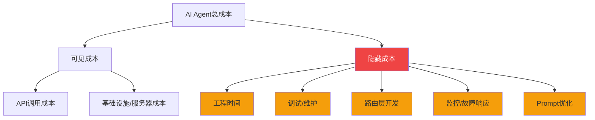
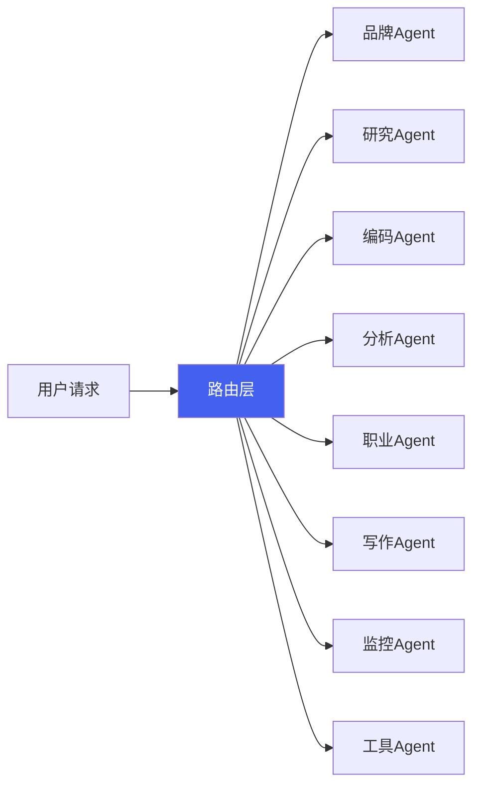
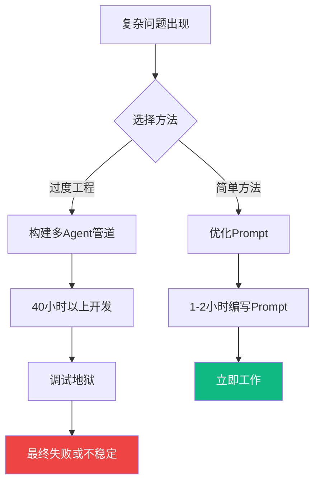

## AI Agent不是魔法

对AI Agent的期望正在爆发式增长。"让Agent来做就能削减人工成本"的说法随处可见。但作为实际运营8体AI Agent的人，<strong>现实远没有那么简单</strong>。

本文将基于数据分析AI Agent的实际运营成本，从"AI Agent不是魔法而是权衡取舍"的角度分享真实经验。

## 令人震惊的数据：AI审核 vs 人工审核

最近英语圈有一个引起热议的分析。它计算了使用AI Agent进行自主审核的成本结构，结果令人惊讶：

| 项目 | AI Agent审核 | 人工审核员 |
|------|------------|-----------|
| <strong>月成本</strong> | $1,350 ~ $2,250 | ~$1,200 |
| <strong>24小时运行</strong> | ✅ 可能 | ❌ 需要轮班 |
| <strong>判断一致性</strong> | 高（依赖Prompt） | 有波动 |
| <strong>上下文理解</strong> | 有限 | 高 |
| <strong>初始构建成本</strong> | 高 | 低 |

核心要点：<strong>仅API调用成本就可能超过人工审核员的工资</strong>。如果需要24小时自主运行、大量处理和复杂判断，成本会更高。

## 8体AI Agent运营的现实：成本结构剖析

我目前实际运营着8体AI Agent。每个Agent负责品牌、研究、编码、分析等专业角色。以下分享我亲身体验的成本结构。

### 1. API成本：冰山一角

```
月度API成本明细（示例）
├── Claude API（主力模型）     : ~$150-300/月
├── GPT-4 API（辅助模型）      : ~$50-100/月
├── 图像生成API                : ~$20-50/月
├── 搜索/爬虫API               : ~$30-60/月
└── 其他（嵌入、TTS等）        : ~$20-40/月
────────────────────────────────────
合计                           : ~$270-550/月
```

只看API成本可能觉得"还挺便宜的"。但这只是冰山一角。

### 2. 隐藏成本：真正花钱的地方



实际成本结构如下：

| 成本项目 | 月估算 | 备注 |
|---------|--------|------|
| API成本 | $270-550 | 随用量增长 |
| 基础设施（服务器、DB） | $50-100 | 固定成本 |
| 工程时间 | <strong>$500-2,000+</strong> | 最大成本 |
| 故障响应/调试 | $200-500 | 不可预测 |
| <strong>合计</strong> | <strong>$1,020-3,150+</strong> | |

<strong>工程时间是压倒性的最大成本。</strong> 忽略这一点，成本计算就会完全偏离。

## 路由层：最大的难关

8体AI Agent运营中最困难、成本最高的部分是<strong>路由层</strong>。



路由层需要解决的问题：

- <strong>意图分类</strong>：用户请求应该发送给哪个Agent？
- <strong>上下文传递</strong>：Agent之间如何共享状态？
- <strong>错误处理</strong>：Agent失败时如何恢复？
- <strong>成本优化</strong>：如何混合使用昂贵和便宜的模型？

构建和稳定这个路由层所花的时间，超过了所有其他成本的总和。

## 过度工程的陷阱：40小时 vs 1个Prompt

AI Agent开发中最痛的教训：

> <strong>花40小时构建复杂的Agent管道但失败了。最终用一个写得好的Prompt解决了。</strong>

这不只是我的经验。这是AI Agent社区反复报告的模式：



### 过度工程检查清单

如果出现这些信号，请退后一步：

- ✅ 正在设计3层以上的"Agent调用Agent"链
- ✅ 正在创建Agent间通信协议
- ✅ 对简单if-else能解决的问题使用LLM
- ✅ 没有用单个Prompt测试就先设计架构

<strong>经验法则</strong>：先用单个Prompt尝试，只有在失败时才拆分为Agent。

## 那么AI Agent何时有用？

只看成本可能觉得"不如直接雇人"。但AI Agent有明确优势的领域：

| AI Agent有优势的场景 | 人类有优势的场景 |
|--------------------|----------------|
| 需要24小时不间断处理 | 需要复杂的上下文判断 |
| 大量定型工作重复 | 需要创意/感性判断 |
| 快速响应是核心 | 需要说服利益相关者 |
| 必须一致应用标准 | 异常情况应对 |
| 个人生产力扩展（单人团队） | 团队协作/沟通 |

特别是<strong>个人开发者或小团队扩展个人生产力</strong>的场景，AI Agent效果显著。我的8体Agent正是为此目的运营的，核心观点不是"替代人"而是"扩大一个人能做的范围"。

## 实战成本优化技巧

分享8体运营经验中获得的成本优化策略：

### 1. 模型分层策略

```
按任务复杂度分配模型：
├── 高复杂度（10%）: Claude Opus / GPT-4 → 架构决策、复杂分析
├── 中复杂度（30%）: Claude Sonnet / GPT-4o → 代码生成、文档编写
└── 低复杂度（60%）: Claude Haiku / GPT-4o-mini → 分类、摘要、格式化
```

仅此策略就能将API成本<strong>降低40-60%</strong>。

### 2. 缓存和批处理

- 缓存相同Prompt模式的结果
- 不需要实时处理的任务批量处理
- 嵌入结果必须缓存（重新计算成本很高）

### 3. 最小化失败成本

- 必须实现超时和重试逻辑
- 调用昂贵模型前用便宜模型预验证
- 设计Agent失败时的优雅降级

## 结论：认识权衡取舍

AI Agent不是魔法。它是<strong>存在明确权衡取舍的工程工具</strong>。

核心教训总结：

1. <strong>API成本只是总成本的一部分。</strong> 必须包括工程时间、维护和故障响应。
2. <strong>路由层是最大的技术难关。</strong> 多Agent系统的真正困难不在于单个Agent，而在于编排。
3. <strong>警惕过度工程。</strong> 一个写得好的Prompt可能比40小时的复杂管道更好。
4. <strong>按用途使用。</strong> 扩展个人生产力效果卓越，但单纯替代人工成本可能反而更高。

给考虑引入AI Agent的人一句话：<strong>先从小Prompt开始，只在需要时才扩展为Agent。</strong> 这是运营8体Agent后获得的最有价值的教训。

## 参考资料

- [AI Content Moderation Cost Analysis](https://www.getrevue.co/) — AI审核成本 $1,350-2,250/月分析
- [Anthropic Claude API Pricing](https://www.anthropic.com/pricing) — Claude模型定价
- [OpenAI API Pricing](https://openai.com/pricing) — GPT模型定价
- [Building Effective Agents - Anthropic](https://docs.anthropic.com/en/docs/build-with-claude/agents) — Agent设计模式指南
