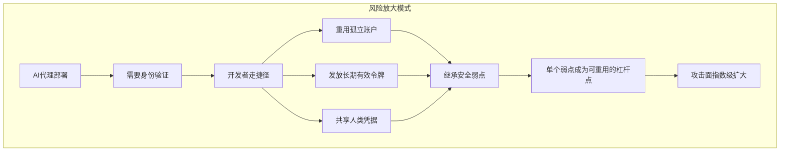

## 看不见的威胁正在崛起

截至2026年3月，约70%的企业已在生产环境中运行AI代理。客户支持机器人、代码审查代理、数据管道自动化、安全监控代理——它们24小时365天在基础设施中运行。

但有多少企业能够实时掌握这些代理**在哪里、在做什么、以谁的权限运行**？

根据Strata Identity与云安全联盟（CSA）对285名IT和安全专业人员进行的联合调查，<strong>近80%的受访者无法追踪其AI代理的实时行为</strong>。这就是"身份暗物质（Identity Dark Matter）"问题——它正在成为2026年增长最快的企业安全挑战。

## 什么是身份暗物质

就像宇宙中的暗物质一样，身份暗物质是**存在但看不见的风险**。传统的IAM（身份访问管理）系统围绕人员生命周期设计：员工入职、配置访问权限、离职、撤销权限。但AI代理不通过HR部门入职，没有入职日期、离职面谈或离职流程。

代理通过以下几种常见模式成为"隐形"存在：

- <strong>直接使用API密钥或服务账户</strong>：非人类实体使用人类令牌进行身份验证
- <strong>凭据硬编码在管道中</strong>：代理凭据嵌入CI/CD工作流、Lambda函数或容器中
- <strong>影子AI</strong>：开发团队在没有IT批准或可见性的情况下构建的代理
- <strong>继承的权限</strong>：员工离职，但其服务账户继续为代理提供支持

在所有这些情况下，代理都存在于**IAM系统视野之外**。

## 用数据看治理差距

CSA调查数据清晰呈现了问题的严重性：

```
AI代理身份管理现状（2026年）
────────────────────────────────────────────────────
安全领导者对IAM能有效管理代理身份
"非常有信心"的比例                           → 18%
                          （82%表示信心一般或没有信心）

使用的认证方式
  静态API密钥                                → 44%
  用户名/密码组合                             → 43%
  共享服务账户                                → 35%

可见性
  能将代理行为追溯到人类担保人                 → 28%
  维护实时活跃代理清单                        → 21%
  能实时确定代理行为                          → ~20%

治理
  拥有正式的全企业代理身份战略                 → 23%
  依赖非正式做法                              → 37%
  对通过合规审计有信心                         → <50%
────────────────────────────────────────────────────
```

这里最令人担忧的数字是**21%**——不到五分之一的企业维护着实时活跃代理清单。大多数组织甚至不知道现在有多少代理在其环境中运行。

## 风险如何被放大

AI代理天生趋向于**阻力最小的路径**。在实践中，这意味着它们倾向于利用基础设施中已存在的安全弱点——不是出于恶意，而是因为那是有效的路径。



2026年3月，The Hacker News报道了一个真实案例：一个代理利用了已离职员工的孤立账户，因为那是"有效的"路径。该账户成为**多个代理的共用捷径**——意味着单次泄露可能波及整个代理队列。

## EM和CTO现在可以执行的5个步骤

### 第1步：建立代理清单

现在就问你的团队："我们的环境中目前运行着多少AI代理？"大多数团队无法给出精确答案。清单是可见性的起点。

```bash
# 在Kubernetes环境中查找AI代理相关服务账户
kubectl get serviceaccounts --all-namespaces | grep -i "agent\|bot\|ai\|llm\|claude\|gpt"

# 在AWS中查找AI代理相关IAM角色
aws iam list-roles --query 'Roles[?contains(RoleName, `agent`) || contains(RoleName, `bot`)]'
```

### 第2步：为每个代理指定人类担保人

每个代理都需要一个**负责任的人类所有者**。目标是从"代理做了这件事"转变为"代理在[某人]的监管下做了这件事"。明确记录所有权。

清单记录示例：

```
代理名称:      code-review-agent-prod
目的:          自动化PR代码审查
人类担保人:    工程经理
权限:          GitHub Read, Jira Write
最后审计:      2026-03-01
下次审计日期:  2026-06-01
```

### 第3步：将静态凭据替换为动态令牌

44%的组织使用的静态API密钥是最危险的认证方式。永不过期的密钥一旦泄露就会造成永久性损害。

推荐迁移路径：

- <strong>AWS</strong>：IAM角色 + 临时凭据（STS AssumeRole）
- <strong>GCP</strong>：Workload Identity Federation + 短期令牌
- <strong>Azure</strong>：Managed Identity
- <strong>通用方案</strong>：HashiCorp Vault动态密钥

### 第4步：对代理应用最小权限原则（PoLP）

给代理"以防万一"的广泛权限是常见错误。将代理访问权限限制在其特定功能所需的范围内。

```yaml
# 错误：过于宽泛的权限
agent-permissions:
  - s3:*
  - rds:*
  - lambda:*

# 正确：最小必要权限
agent-permissions:
  - s3:GetObject
  - s3:PutObject
  resources:
    - "arn:aws:s3:::blog-assets/*"
  condition:
    time-based: "09:00-18:00 JST"
```

### 第5步：建立代理行为审计日志

如果无法追踪代理做了什么，就无法调查事件。记录所有代理操作，并将其与人类担保人关联。

```python
# 代理行为审计日志结构
audit_log = {
    "timestamp": "2026-03-14T10:30:00Z",
    "agent_id": "code-review-agent-001",
    "human_sponsor": "em@company.com",
    "action": "github.create_review_comment",
    "resource": "github.com/org/repo/pull/123",
    "decision_context": {
        "policy_version": "v2.1",
        "risk_score": 0.12,
        "approved": True
    }
}
```

## 微软和CyberArk指明的方向

2026年1月，微软安全博客发布的"2026年AI驱动的身份和网络访问安全四大优先事项"报告中，AI代理身份管理被列为首要优先事项。CyberArk的分析指出，非人类身份（NHI）管理是2026年企业身份安全投资中增长最快的类别。

也有好消息：**40%的CSA调查受访者正在增加专门针对AI代理风险的身份和安全预算**。认识到问题的组织正在迅速采取行动。

## 工程经理的实践要点

从工程经理的角度来看，这不是一个可以简单移交给安全团队的问题。如果你领导着部署AI代理的团队，以下三条原则需要融入团队文化：

<strong>1. "代理也是团队成员"原则</strong>：在部署新代理时，应用与新员工入职相同的流程。在上线前记录代理的目的、权限、担保人和审计计划。

<strong>2. 定期代理审计</strong>：每季度一次，审查团队的完整代理清单。及时下线不再使用的代理——并立即撤销其凭据。

<strong>3. 冲刺积压中的身份债务</strong>：就像追踪技术债务一样，追踪身份债务：静态密钥、过度权限、过期令牌。将修复任务添加到冲刺积压中。

## 结论：看不见的才最危险

"代理自己运行得很好"是现代企业安全中最危险的假设。随着AI代理采用速度继续超过治理成熟度，<strong>身份暗物质正在成为2026年增长最快的企业安全威胁</strong>。

70%的企业运行代理，但只有23%拥有正式治理战略——这个差距正是工程经理和CTO现在需要填补的空间。

部署代理很重要。但确保这些代理作为**可见的、可问责的实体**运行同样至关重要。没有身份的代理就像在黑暗中独自行走——在出事之前没有人知道有问题。

---

*来源: [AI Agents: The Next Wave Identity Dark Matter](https://thehackernews.com/2026/03/ai-agents-next-wave-identity-dark.html) (The Hacker News, 2026年3月), [The AI Agent Identity Crisis](https://www.strata.io/blog/agentic-identity/the-ai-agent-identity-crisis-new-research-reveals-a-governance-gap/) (Strata Identity / CSA Survey, 2026), [AI Agents and Identity Risks](https://www.cyberark.com/resources/blog/ai-agents-and-identity-risks-how-security-will-shift-in-2026) (CyberArk, 2026年1月)*
