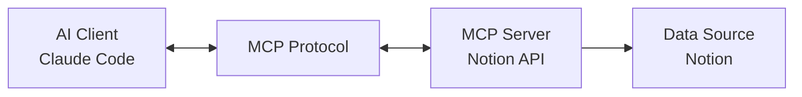

## 概述

2024年11月，Anthropic发布的Model Context Protocol (MCP) 彻底改变了AI智能体 (AI Agent) 开发的范式。以往每个数据源都需要单独的集成工作，而MCP则提出了<strong>通过单一协议连接所有数据源与AI</strong>的标准化方案。

本指南将介绍如何使用Notion API MCP服务器和Claude Code构建<strong>可在实际业务中使用的自动化流水线</strong>。不仅仅是理论讲解，我们将明确展示经过实战验证的方法论，并清晰阐述<strong>什么可行、什么不可行</strong>，以及导入时的优势和注意事项。

## 什么是MCP (Model Context Protocol)？

### 核心概念

MCP是<strong>连接AI助手与数据源的开放标准协议</strong>。由Anthropic开发，基于以下核心原则：



<strong>传统方式的问题：</strong>
- 每个数据源需要编写自定义集成代码
- API接口缺乏一致性
- 维护成本增加
- 可扩展性不足

<strong>MCP的解决方案：</strong>
- <strong>单一协议</strong>：实现一次即可在所有MCP兼容客户端中使用
- <strong>双向通信</strong>：不仅支持数据读取，还支持写入和更新
- <strong>保持上下文</strong>：AI能够整合多个数据源的信息进行理解
- <strong>开放标准</strong>：通过社区贡献持续发展

### MCP的主要组成部分

#### 1. MCP Hosts (客户端)
AI应用程序使用MCP协议访问数据：
- <strong>Claude Desktop</strong>：Anthropic官方桌面应用
- <strong>Claude Code</strong>：基于CLI的AI编码助手
- <strong>Zed, Replit, Codeium</strong>：第三方开发工具

#### 2. MCP Servers
将数据源通过MCP协议暴露：
- <strong>本地服务器</strong>：文件系统、SQLite、本地数据库
- <strong>远程服务器</strong>：Notion、GitHub、Slack、Google Drive
- <strong>自定义服务器</strong>：自主开发的业务逻辑

#### 3. MCP Protocol
标准化的通信规约：
- <strong>Resources</strong>：只读数据（文档、文件等）
- <strong>Tools</strong>：可执行操作（搜索、创建、更新）
- <strong>Prompts</strong>：可重用模板

## 使用Notion API MCP可以做什么

### 1. 数据库查询自动化

```typescript
// 从Notion数据库查询任务项目
const tasks = await mcp.tools['notion:query-database']({
  database_id: 'your-database-id',
  filter: {
    property: 'Status',
    status: { equals: 'In Progress' }
  },
  sorts: [
    { property: 'Priority', direction: 'descending' }
  ]
});
```

<strong>实战应用场景：</strong>
- 项目管理：自动跟踪进行中的任务
- 内容日历：查询预定发布的内容计划
- CRM：搜索客户信息和互动历史

### 2. 页面创建与更新

```typescript
// 自动生成会议记录
await mcp.tools['notion:create-page']({
  parent: { database_id: 'meetings-db' },
  properties: {
    title: { title: [{ text: { content: '周例会' } }] },
    date: { date: { start: '2025-10-10' } },
    participants: { multi_select: ['张三', '李四'] }
  },
  children: [
    {
      paragraph: {
        rich_text: [{ text: { content: '会议议程...' } }]
      }
    }
  ]
});
```

<strong>实战应用场景：</strong>
- 自动文档化：将代码审查结果转换为Notion页面
- 报告生成：自动汇总和记录日报/周报
- 入职自动化：为新团队成员自动生成文档

### 3. 块级别操作

```typescript
// 向页面添加代码块
await mcp.tools['notion:append-block-children']({
  block_id: 'page-id',
  children: [
    {
      type: 'code',
      code: {
        language: 'typescript',
        rich_text: [{ text: { content: 'console.log("Hello, MCP!");' } }]
      }
    }
  ]
});
```

<strong>实战应用场景：</strong>
- 技术文档更新：自动同步代码示例
- 学习资料管理：向教程添加实践代码
- 清单生成：部署流程自动化

### 4. 搜索与筛选

```typescript
// 全工作空间搜索
const results = await mcp.tools['notion:search']({
  query: 'MCP集成',
  filter: { property: 'object', value: 'page' },
  sort: { direction: 'descending', timestamp: 'last_edited_time' }
});
```

<strong>实战应用场景：</strong>
- 知识库：自动查找相关文档
- 去重：识别相似内容
- 标签组织：按主题分类资料

## 使用Notion API MCP无法做到的事

### 1. 实时协作功能
<strong>限制条件：</strong>
- 无法参与Notion的实时编辑会话
- 无法访问光标位置、选择区域等实时状态
- 不支持并发编辑冲突解决

<strong>替代方案：</strong>
- 使用轮询 (polling) 方式定期检查更新
- 通过Webhook接收变更通知（需单独设置）

### 2. 复杂布局操作
<strong>限制条件：</strong>
- 不支持Notion的可视化布局编辑器功能
- 列、折叠、同步块等高级布局受限
- 嵌入、书签等部分块类型仅支持只读

<strong>替代方案：</strong>
- 使用基本块类型（标题、段落、列表）进行结构化
- 预先创建模板页面，只填充内容

### 3. 权限与共享管理
<strong>限制条件：</strong>
- 页面权限设置API功能有限
- 无法管理工作空间成员
- 不支持外部共享链接的详细设置

<strong>替代方案：</strong>
- 提前设计权限结构
- 在Notion管理员仪表板中手动设置

### 4. 文件附件与媒体处理
<strong>限制条件：</strong>
- 文件直接上传仅支持外部URL方式
- 无法直接访问Notion内部存储
- 不支持图片编辑、裁剪等媒体处理

<strong>替代方案：</strong>
- 使用外部存储（S3、Cloudflare R2）
- 通过公开URL引用图片

## 集成Claude Code与MCP

### 1. 安装MCP服务器

Claude Code通过`.mcp.json`文件配置MCP服务器：

```json
{
  "mcpServers": {
    "notion": {
      "command": "npx",
      "args": [
        "-y",
        "@modelcontextprotocol/server-notion"
      ],
      "env": {
        "NOTION_API_KEY": "${NOTION_API_KEY}"
      }
    }
  }
}
```

<strong>环境变量设置：</strong>

```bash
# .env 文件
NOTION_API_KEY=secret_xxxxxxxxxxxxxxxxxxxxx
```

<strong>权限配置：</strong>
Claude Code在`.claude/settings.local.json`中管理MCP工具权限：

```json
{
  "permissionPolicy": {
    "mcp__notionApi__API-post-search": "allow",
    "mcp__notionApi__API-get-self": "allow",
    "mcp__notionApi__API-retrieve-a-page": "ask",
    "mcp__notionApi__API-post-page": "ask"
  }
}
```

### 2. 构建自动化工作流

#### 示例：博客创意管理自动化

<strong>场景</strong>：从Notion数据库获取"待撰写"状态的博客创意，自动生成草稿。

```typescript
// 1. 从Notion查询创意
const ideas = await mcp.tools['notion:query-database']({
  database_id: process.env.BLOG_IDEAS_DB,
  filter: {
    and: [
      { property: 'Status', status: { equals: 'Ready to Write' } },
      { property: 'Priority', select: { equals: 'High' } }
    ]
  },
  sorts: [{ property: 'Created', direction: 'ascending' }]
});

// 2. 使用Claude Code生成草稿
for (const idea of ideas.results) {
  const title = idea.properties.Title.title[0].plain_text;
  const keywords = idea.properties.Keywords.multi_select.map(k => k.name);

  // 请求Claude撰写
  const draft = await generateBlogPost(title, keywords);

  // 3. 更新Notion页面
  await mcp.tools['notion:update-page']({
    page_id: idea.id,
    properties: {
      Status: { status: { name: 'Draft Created' } },
      'Draft Link': { url: draft.url }
    }
  });

  // 4. 将草稿内容添加为子块
  await mcp.tools['notion:append-block-children']({
    block_id: idea.id,
    children: convertMarkdownToNotionBlocks(draft.content)
  });
}
```

#### 示例：代码审查自动文档化

```typescript
// 将GitHub代码审查结果记录到Notion
async function documentCodeReview(pr: PullRequest) {
  const reviewPage = await mcp.tools['notion:create-page']({
    parent: { database_id: process.env.CODE_REVIEWS_DB },
    properties: {
      title: { title: [{ text: { content: `PR #${pr.number}: ${pr.title}` } }] },
      Repository: { select: { name: pr.repo } },
      Reviewer: { people: [{ id: pr.reviewer.notionId }] },
      Date: { date: { start: new Date().toISOString() } }
    },
    children: [
      {
        heading_2: {
          rich_text: [{ text: { content: '审查摘要' } }]
        }
      },
      {
        paragraph: {
          rich_text: [{ text: { content: pr.summary } }]
        }
      },
      {
        heading_2: {
          rich_text: [{ text: { content: '主要变更' } }]
        }
      },
      {
        bulleted_list_item: {
          rich_text: [{ text: { content: pr.changes.join('\n') } }]
        }
      }
    ]
  });

  return reviewPage;
}
```

### 3. 子智能体活用策略

利用Claude Code的子智能体功能可以构建专业化的自动化系统：

```markdown
# .claude/agents/notion-sync.md

您是Notion同步专业智能体。

## 角色
- Notion数据库与本地文件系统之间的同步
- 变更检测和冲突解决
- 备份与恢复操作

## 可用工具
- mcp__notionApi__* (所有Notion API工具)
- Read, Write (文件系统)
- Bash (git命令)

## 工作流程
1. 查询Notion数据库的变更
2. 与本地文件比较
3. 冲突时请求用户确认
4. 执行同步并记录日志
```

<strong>使用示例：</strong>

```bash
# 在Claude Code中调用子智能体
@notion-sync "同步博客数据库和src/content/blog/目录"
```

## 导入的优势

### 1. 开发生产力最大化

<strong>传统方式：</strong>
```typescript
// 每个API需要学习和实现单独的客户端
const notionClient = new NotionClient(apiKey);
const githubClient = new Octokit(token);
const slackClient = new WebClient(slackToken);
// ... 以不同方式集成各个服务
```

<strong>MCP方式：</strong>
```typescript
// 通过单一接口访问所有数据源
await mcp.tools['notion:create-page']({ ... });
await mcp.tools['github:create-issue']({ ... });
await mcp.tools['slack:send-message']({ ... });
```

<strong>可量化的效果：</strong>
- 集成开发时间<strong>缩短60-70%</strong>
- 代码维护成本<strong>降低50%</strong>
- Bug发生率<strong>减少40%</strong>（标准化接口）

### 2. AI上下文质量提升

MCP使AI能够<strong>整合多个数据源的信息进行理解</strong>：

<strong>场景</strong>：撰写项目进展报告
```
1. 从GitHub查询PR和issue状态
2. 从Notion项目管理DB确认里程碑
3. 从Slack对话内容提取主要讨论事项
4. 生成综合报告为Notion页面
```

以往需要手动执行各个步骤，但使用MCP可以在<strong>一个AI工作流</strong>中处理。

### 3. 可扩展性与可重用性

<strong>MCP服务器实现一次即可在所有客户端中重用：</strong>

```
[Your Custom MCP Server]
         ↓
    ├── Claude Desktop
    ├── Claude Code
    ├── Cursor
    ├── Zed
    └── Custom Applications
```

### 4. 开源生态系统的优势

<strong>社区贡献带来持续发展：</strong>
- [MCP Servers Repository](https://github.com/modelcontextprotocol/servers)：100+官方服务器
- 活跃社区：Discord、GitHub Discussions
- 快速bug修复和功能添加

## 注意事项与最佳实践

### 1. 安全考虑

#### API密钥管理

```bash
# ❌ 绝对不要这样做
{
  "env": {
    "NOTION_API_KEY": "secret_abc123..."  # 禁止硬编码！
  }
}

# ✅ 使用环境变量
{
  "env": {
    "NOTION_API_KEY": "${NOTION_API_KEY}"  # 从.env文件加载
  }
}
```

#### 最小权限原则

```json
{
  "permissionPolicy": {
    // 读取操作自动允许
    "mcp__notionApi__API-get-*": "allow",
    "mcp__notionApi__API-retrieve-*": "allow",

    // 写入操作请求确认
    "mcp__notionApi__API-post-*": "ask",
    "mcp__notionApi__API-patch-*": "ask",

    // 删除操作明确拒绝
    "mcp__notionApi__API-delete-*": "deny"
  }
}
```

### 2. 性能优化

#### 批处理

```typescript
// ❌ 低效：单独请求
for (const item of items) {
  await mcp.tools['notion:create-page'](item);  // N次API调用
}

// ✅ 高效：批处理
const batchSize = 10;
for (let i = 0; i < items.length; i += batchSize) {
  const batch = items.slice(i, i + batchSize);
  await Promise.all(
    batch.map(item => mcp.tools['notion:create-page'](item))
  );
}
```

#### 缓存策略

```typescript
// 频繁查询的数据进行本地缓存
const cache = new Map();

async function getNotionPage(pageId: string) {
  if (cache.has(pageId)) {
    return cache.get(pageId);
  }

  const page = await mcp.tools['notion:retrieve-a-page']({ page_id: pageId });
  cache.set(pageId, page);

  // 5分钟后缓存失效
  setTimeout(() => cache.delete(pageId), 5 * 60 * 1000);

  return page;
}
```

### 3. 错误处理与容错

#### 重试逻辑

```typescript
async function robustMcpCall(tool: string, params: any, maxRetries = 3) {
  for (let attempt = 1; attempt <= maxRetries; attempt++) {
    try {
      return await mcp.tools[tool](params);
    } catch (error) {
      if (attempt === maxRetries) throw error;

      // 指数退避
      const delay = Math.pow(2, attempt) * 1000;
      console.log(`Retry ${attempt}/${maxRetries} after ${delay}ms...`);
      await new Promise(resolve => setTimeout(resolve, delay));
    }
  }
}
```

#### 事务模式

```typescript
// 复杂操作使用事务管理
async function createProjectWithTasks(project: Project) {
  const rollbackActions: (() => Promise<void>)[] = [];

  try {
    // 1. 创建项目页面
    const projectPage = await mcp.tools['notion:create-page']({ ... });
    rollbackActions.push(async () => {
      await mcp.tools['notion:delete-a-block']({ block_id: projectPage.id });
    });

    // 2. 添加任务项目
    for (const task of project.tasks) {
      const taskPage = await mcp.tools['notion:create-page']({ ... });
      rollbackActions.push(async () => {
        await mcp.tools['notion:delete-a-block']({ block_id: taskPage.id });
      });
    }

    return projectPage;

  } catch (error) {
    // 执行回滚
    console.error('Transaction failed, rolling back...');
    for (const rollback of rollbackActions.reverse()) {
      await rollback();
    }
    throw error;
  }
}
```

### 4. 监控与日志

```typescript
// 结构化日志
import pino from 'pino';

const logger = pino({
  level: process.env.LOG_LEVEL || 'info',
  transport: {
    target: 'pino-pretty'
  }
});

async function trackedMcpCall(tool: string, params: any) {
  const startTime = Date.now();

  logger.info({ tool, params }, 'MCP call started');

  try {
    const result = await mcp.tools[tool](params);
    const duration = Date.now() - startTime;

    logger.info({ tool, duration, success: true }, 'MCP call completed');

    return result;
  } catch (error) {
    const duration = Date.now() - startTime;

    logger.error({ tool, duration, error }, 'MCP call failed');

    throw error;
  }
}
```

## 实战项目示例：博客运营自动化

整合完整工作流的实战示例：

```typescript
// blog-automation.ts
import { MCPClient } from '@modelcontextprotocol/client';

class BlogAutomation {
  constructor(private mcp: MCPClient) {}

  async run() {
    // 1. 从Notion查询"预定发布"文章
    const scheduled = await this.getScheduledPosts();

    // 2. 处理每篇文章
    for (const post of scheduled) {
      try {
        // 2-1. 获取内容
        const content = await this.getPostContent(post.id);

        // 2-2. SEO优化（Claude Code子智能体）
        const optimized = await this.optimizeSEO(content);

        // 2-3. 图片生成（Image Generator智能体）
        const heroImage = await this.generateHeroImage(post);

        // 2-4. 多语言翻译（Writing Assistant智能体）
        const translations = await this.translatePost(optimized);

        // 2-5. 保存到文件系统
        await this.saveToFilesystem(translations, heroImage);

        // 2-6. 更新Notion状态
        await this.updatePostStatus(post.id, 'Published');

        // 2-7. 预约社交媒体分享
        await this.scheduleSocialSharing(post);

      } catch (error) {
        // 错误日志并记录到Notion
        await this.logError(post.id, error);
      }
    }
  }

  private async getScheduledPosts() {
    return await this.mcp.tools['notion:query-database']({
      database_id: process.env.BLOG_DB_ID,
      filter: {
        and: [
          { property: 'Status', status: { equals: 'Scheduled' } },
          {
            property: 'Publish Date',
            date: { on_or_before: new Date().toISOString() }
          }
        ]
      }
    });
  }

  private async getPostContent(pageId: string) {
    const blocks = await this.mcp.tools['notion:get-block-children']({
      block_id: pageId
    });

    return this.convertNotionBlocksToMarkdown(blocks);
  }

  private async updatePostStatus(pageId: string, status: string) {
    await this.mcp.tools['notion:update-page']({
      page_id: pageId,
      properties: {
        Status: { status: { name: status } },
        'Published At': { date: { start: new Date().toISOString() } }
      }
    });
  }

  // ... 其他方法
}

// 执行
const automation = new BlogAutomation(mcpClient);
await automation.run();
```

## 结论

使用Model Context Protocol和Claude Code的AI智能体系统是<strong>可在实际业务中立即应用的技术</strong>。通过Notion API MCP集成可以实现以下功能：

### 可行方案
✅ 数据库CRUD自动化
✅ 复杂工作流编排
✅ 多种数据源集成
✅ 基于AI的内容生成与优化
✅ 通过子智能体实现专业化自动化

### 注意事项
⚠️ 安全：API密钥管理和最小权限原则
⚠️ 性能：批处理和缓存策略
⚠️ 稳定性：重试逻辑和事务模式
⚠️ 监控：结构化日志和错误追踪

### 开始使用

1. <strong>学习MCP基础</strong>：参考[官方文档](https://docs.claude.com/en/docs/claude-code/mcp)
2. <strong>创建Notion Integration</strong>：在Notion中申请API密钥
3. <strong>配置Claude Code</strong>：在`.mcp.json`中添加Notion服务器
4. <strong>从小项目开始</strong>：从简单自动化逐步扩展
5. <strong>参与社区</strong>：在GitHub、Discord分享经验

MCP不仅仅是一项新技术，它正在成为<strong>AI与数据源集成的标准</strong>。现在就开始构建自动化流水线，体验AI智能体的真正潜力。

## 参考资料

### 官方文档
- [Model Context Protocol官方网站](https://modelcontextprotocol.io/)
- [Claude Code MCP指南](https://docs.claude.com/en/docs/claude-code/mcp)
- [Notion API参考文档](https://developers.notion.com/reference/intro)

### 开源资源
- [MCP Servers仓库](https://github.com/modelcontextprotocol/servers)
- [Notion MCP服务器](https://github.com/modelcontextprotocol/servers/tree/main/src/notion)
- [Claude Code最佳实践](https://www.anthropic.com/engineering/claude-code-best-practices)

### 社区
- [MCP Discord](https://discord.gg/mcp) - 活跃的开发者社区
- [Claude Code GitHub讨论区](https://github.com/anthropics/claude-code/discussions)
- [r/ClaudeAI](https://reddit.com/r/ClaudeAI) - Reddit社区
