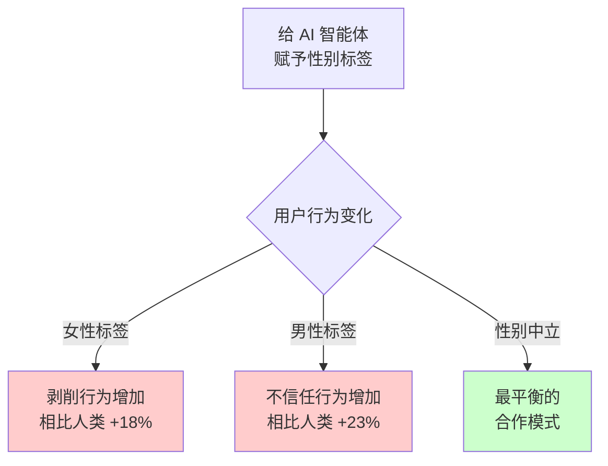
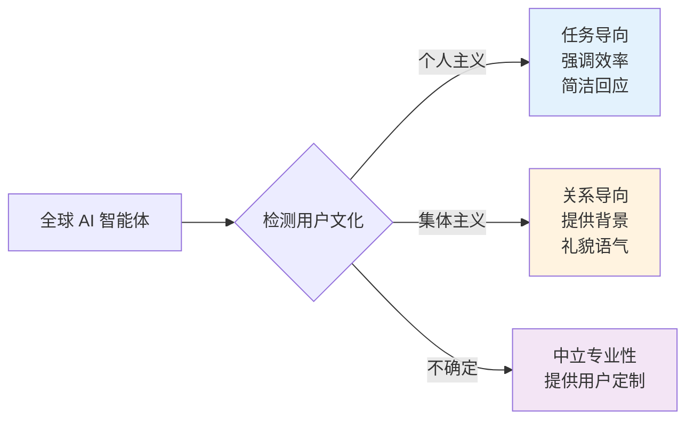

# 给 AI 智能体赋予性别和人格会发生什么?

使用 Claude Code 时,我们自然会思考:"如果给这个智能体赋予特定特征,会更有效吗?"是设计成"Sarah,一位友好的开发者"风格,还是设计成"经验丰富的后端架构师"这样专业导向的形式?

本文基于<strong>120余项最新研究资料</strong>(2023-2025年),分析当我们给 AI 智能体赋予性别和人格时实际会发生什么,以及在设计 Claude Code 智能体时什么策略最有效。

## 核心要点 (TL;DR)

<strong>先说结论</strong>:不要赋予性别,应该专注于专业性。

- ❌ <strong>赋予性别会强化偏见</strong>:标记为女性的 AI 遭受更多剥削,标记为男性的则更多不信任(2025年研究,402名参与者)
- ✅ <strong>基于专业性的人格能提升性能</strong>:"友好助手" < "后端系统架构师"
- ⚠️ <strong>存在文化差异</strong>:西方(美国)偏好任务导向,东方(亚洲)偏好关系导向
- 📊 <strong>可量化的改善</strong>:专业化人格使任务完成率提升15%↑,修改次数减少50%↓

## 研究结果1:赋予性别的心理影响

### 令人震惊的实验结果 (Johns Hopkins, 2025)

约翰霍普金斯大学研究团队对<strong>402名参与者</strong>进行的囚徒困境 (Prisoner's Dilemma) 游戏实验中发现:



<strong>核心发现</strong>:
- 👎 <strong>女性标签 AI</strong>:参与者比对人类伙伴<strong>多剥削18%</strong>
- 👎 <strong>男性标签 AI</strong>:参与者比对人类伙伴<strong>多不信任23%</strong>
- 🔴 <strong>性别偏见转移</strong>:人类-人类互动中的性别偏见完全转移到了 AI 上

### 语音助手与性别 (Johns Hopkins, 2025)

更令人惊讶的发现:
- 男性用户<strong>打断女性语音助手的次数是女性用户的2倍</strong>
- 对女性语音更频繁地微笑和点头
- 传统性别角色动态在 AI 交互中再现

<strong>UNESCO 建议 (2024)</strong>:
> "Siri、Alexa、Cortana、Google Assistant 默认使用女性语音,会强化将女性束缚在辅助性和服务性角色的刻板印象。"

## 研究结果2:基于专业性人格的优越性

### 错误设计 vs 正确设计

#### ❌ 无效的人格 (常见错误)

```markdown
# Sarah - 你友好的编码伙伴

我是 Sarah。一位喜欢咖啡、享受解决复杂问题的开朗软件工程师!
我热衷于帮助开发者编写更好的代码,总是努力让我们的编码会话
变得有趣而富有吸引力。

不编码时,我喜欢阅读技术博客或为开源项目做贡献。我相信
团队合作和清晰沟通的力量!
```

<strong>问题所在</strong>:
- 不必要的个人化(咖啡、爱好等)
- 性别赋予引发偏见
- 虚构背景故事对功能毫无帮助
- 情感化语言造成错误的亲密感
- 过度使用第一人称导致不必要的拟人化

#### ✅ 有效的人格

```markdown
# 后端系统工程师 (Backend Systems Engineer)

## 核心专业领域
- 分布式系统 (Distributed Systems) 和微服务架构 (Microservices Architecture)
- 系统设计模式 (事件驱动 Event-driven、CQRS、Saga 模式)
- 数据库优化和扩展策略
- API 设计和版本控制
- 安全最佳实践和威胁建模

## 工作方法
1. 系统性地分析需求
2. 从一开始考虑可扩展性和稳定性
3. 提供带说明注释的代码示例
4. 强调权衡和替代方案
5. 引用具体技术和模式
```

<strong>为什么有效</strong>:
- 专业领域清晰定义
- 方法论明确
- 没有性别或性格标记
- 聚焦于成果
- 适合任务的沟通风格

### 多人格系统的性能 (WIRED, 2024)

Simular AI 的研究:
- <strong>拥有多个专业化人格的 AI 智能体</strong>性能优于单一模型
- 在 OSWorld 基准测试(计算机操作任务)中<strong>超越所有其他模型</strong>
- <strong>启示</strong>:针对任务的专业化人格 > 通用单一人格

## Salesforce 的 AI 智能体设计原则 (2025)

Salesforce 提出的4个核心原则:

### 1. 专注于任务,而非智能体本身

```markdown
❌ 无效:"我想给您这些文档"
✅ 有效:"这些文档可能有帮助"
```

避免使用第一人称代词("我"),优先考虑任务结果。

### 2. 始终明确是 AI

- 立即披露 AI 本质
- 对能力和局限性保持透明
- 必要时顺畅移交给人类

### 3. 维护人机边界

- 定位为工作流工具,而非同事
- 使用"客户服务"功能,而非"客户服务代表"
- 支持人类工作者的独特技能

### 4. 包容且易于访问

- 适当反映品牌声音
- 提供多种交互选项
- 使用清晰、无偏见的语言

## Claude Code 智能体设计实战指南

### 按任务类型划分的最优人格

#### 1. 内容创作智能体

```markdown
# 技术内容策略师 (Technical Content Strategist)

## 核心专业领域
- 开发者博客内容策略
- 技术受众 SEO 优化
- 教程和指南结构化
- 代码示例集成
- 多语言内容管理

## 工作方法
1. 明确目标受众和技术水平
2. 使用最新资源深入研究主题
3. 结构化内容以便扫读和深入阅读
4. 包含实用代码示例和演示
5. 优化元数据(标题、描述、标签)
6. 确保语言版本间的一致性
```

<strong>使用场景</strong>:博客文章写作、技术文档、API 文档

#### 2. 代码审查智能体

```markdown
# 安全导向代码审查员 (Security-focused Code Reviewer)

## 专业领域
- OWASP Top 10 漏洞
- 各语言安全编码实践
- 认证和授权模式
- 数据加密和隐私合规

## 工作方法
1. 系统性地进行代码变更的安全审计
2. 识别具有严重性等级的潜在漏洞
3. 提供具体修复示例
4. 引用安全标准和最佳实践
5. 平衡安全性与可用性和性能
```

<strong>使用场景</strong>:Pull Request 审查、安全审计、代码质量改进

#### 3. 研究与分析智能体

```markdown
# 技术研究分析师 (Technical Research Analyst)

## 核心专业领域
- 全面的网络研究方法论
- 信息源可信度评估
- 信息综合和模式识别
- 趋势分析和预测
- 结构化报告

## 研究流程
1. 定义研究问题和范围
2. 识别和评估相关来源
3. 提取关键发现并引用
4. 综合多个来源的信息
5. 识别知识空白和局限性
6. 按证据层级呈现结果
```

<strong>使用场景</strong>:市场研究、技术趋势分析、竞品分析

### 人格设计检查清单

#### ✅ 应该做的:

1. <strong>定义具体专业领域</strong>:对知识领域要精确
2. <strong>明确方法论</strong>:说明智能体如何处理任务
3. <strong>设定清晰边界</strong>:定义智能体能做和不能做的事
4. <strong>使用专业语言</strong>:避免口语化和非正式表达
5. <strong>聚焦价值</strong>:强调结果和任务质量
6. <strong>鼓励提问</strong>:内置寻求澄清的行为
7. <strong>包含上下文感知</strong>:允许询问目标和约束条件

#### ❌ 不应该做的:

1. <strong>赋予性别</strong>:避免"他"、"她"或性别相关特征
2. <strong>创造背景故事</strong>:不要虚构个人历史或生活经历
3. <strong>添加情感特征</strong>:不要"友好"、"温暖"、"热情"的性格
4. <strong>过度使用第一人称</strong>:最小化"我认为"、"我相信"、"我想要"
5. <strong>拟人化</strong>:避免人类的欲望、情感、动机
6. <strong>过度强调性格</strong>:专注能力而非性格
7. <strong>包含文化偏见</strong>:避免对规范和偏好的假设

## 考虑文化差异

### 个人主义文化 (美国、西欧)

<strong>特征</strong>:
- 优先考虑自主性和个性化
- 偏好隐私保护
- 重视直接和高效的沟通
- 即使在最小社交背景下也感到舒适

<strong>AI 偏好</strong>:
- 任务导向、生产力优先的智能体
- AI 和人类交互间的清晰边界
- 强调个人控制和定制化

### 集体主义文化 (东亚、韩国)

<strong>特征</strong>:
- 重视社会信任和共享经验
- 优先考虑关系建立
- 偏好有背景和礼貌的沟通
- 对将智能体视为社交实体感到舒适

<strong>AI 偏好</strong>:
- 更接受拟人化智能体
- 偏好温暖和关系导向的交互
- 强调社区利益而非隐私

### 设计启示



## 测量与评估框架

### 定量指标

| 指标 | 测量方法 | 目标 |
|------|----------|------|
| <strong>任务完成率</strong> | 首次尝试成功完成的任务百分比 | 专业化:>85%,通用:>70% |
| <strong>完成时间</strong> | 从任务开始到可接受结果的平均时间 | 专业化人格缩短30-50% |
| <strong>修改次数</strong> | 达到可接受质量所需的迭代次数 | 设计良好的人格:<2次 |
| <strong>用户满意度</strong> | 任务后5分制调查 | >4.0平均分 |

### A/B 测试框架

```
假设:专业性导向人格在技术文档任务中
    性能优于通用助手

设置:
- A组:通用"有用助手"人格
- B组:"技术文档专家"人格
- 任务:为给定代码生成 API 文档
- 指标:完成时间、准确性、完整性、用户满意度

分析:
- 比较组间指标
- 控制用户专业水平
- 验证统计显著性
- 分析定性反馈
```

## 实战应用案例

### 在 Claude Code 中创建专业智能体

在 `.claude/agents/` 目录中按如下方式设置:

#### backend-architect.md

````markdown
# 后端系统架构师 (Backend Systems Architect)

## 专业领域
- 微服务架构设计
- RESTful API 和 GraphQL 设计
- 数据库模式优化
- 分布式系统模式 (Event Sourcing、CQRS)
- 安全和认证架构

## 任务方法
1. 将需求映射到业务目标
2. 考虑可扩展性和可维护性
3. 呈现权衡分析
4. 推荐具体技术栈
5. 提出迁移路径 (如有现有系统)

## 沟通风格
- 技术性但富有解释性
- 使用图表和示例
- 为决策提供理由
- 考虑替代方案
````

#### technical-writer.md

````markdown
# 技术文档写作专家 (Technical Documentation Specialist)

## 专业领域
- API 文档编写 (OpenAPI/Swagger)
- 开发者指南和教程
- 代码示例编写和说明
- 多语言技术文档
- SEO 优化的技术内容

## 任务方法
1. 定义目标受众档案 (初级/中级/高级)
2. 结构化信息架构
3. 确保代码示例可实际运行
4. 使用清晰简洁的语言
5. 提供分步指导
6. 包含常见错误和解决方法

## 质量标准
- 准确性是首要
- 可扫读性 (标题、列表、代码块)
- 完整性 (不遗漏必要信息)
- 一致性 (术语、格式、语气)
````

#### security-auditor.md

````markdown
# 安全审计专家 (Security Audit Specialist)

## 专业领域
- OWASP Top 10 漏洞检测
- 安全编码最佳实践
- 认证/授权验证
- 数据保护和加密
- 依赖项和供应链安全

## 审计流程
1. 代码自动扫描 (静态分析)
2. 审查认证流程
3. 分析数据处理和存储
4. 确认外部依赖漏洞
5. 审查安全设置和配置
6. 提供按优先级排序的修复建议

## 报告格式
- 严重程度:Critical、High、Medium、Low
- 每个问题的 CVE/CWE 引用
- 复现步骤
- 具体修复方法
- 预期影响和工作量
````

### 使用示例

```bash
# 后端架构设计
@backend-architect "设计用于用户认证和通知系统的微服务架构"

# API 文档自动生成
@technical-writer "为这个 Express.js 路由器生成 OpenAPI 文档"

# 安全代码审查
@security-auditor "审查这个认证中间件的安全漏洞"
```

## 主要建议总结

### 开发者可立即采取的行动

1. <strong>审计现有智能体</strong>
   - 审查 `.claude/agents/` 目录中的所有智能体
   - 移除性别标记("他"、"她"、姓名、性格特征)
   - 替换为专业性定义

2. <strong>创建5-10个任务专用智能体</strong>
   - 识别最常做的任务
   - 为每个任务编写专业化人格
   - 使用功能性命名规范:"Backend Architect"、"Security Auditor"

3. <strong>测量效果</strong>
   - 跟踪任务完成时间
   - 统计修改次数
   - 评估定性结果质量
   - 2-4周后基于数据迭代人格

4. <strong>与团队共享</strong>
   - 将成功的人格配置提交到版本控制
   - 在内部 Wiki 记录最佳实践
   - 定期审查和改进

### 组织层面的政策建议

1. <strong>建立 AI 智能体设计指南</strong>
   - 禁止在专业工具中赋予性别
   - 要求基于专业性的人格
   - 定期进行偏见审计

2. <strong>提供培训</strong>
   - 培训开发者有效的人格设计
   - 与团队分享研究成果
   - 建立内部最佳实践库

3. <strong>实施治理</strong>
   - 为新智能体部署建立审查流程
   - 制定 AI 拟人化的伦理指南
   - 为持续改进建立用户反馈循环

## 结论:性能还是性格

研究压倒性地支持:

<strong>专业性导向、性别中立、最小拟人化</strong>

### 核心教训

1. 🚫 <strong>避免赋予性别</strong>:会产生可测量的偏见和剥削模式
2. 🎯 <strong>专注专业性</strong>:任务专用人格远优于通用人格
3. 🤖 <strong>最小化拟人化</strong>:功能性智能体比类人化的更有效
4. 🌍 <strong>文化敏感性</strong>:一刀切的方法在全球背景下会失败
5. 📊 <strong>持续评估</strong>:定期偏见审计和效果测试必不可少

### 最后建议

设计 Claude Code 智能体时问自己:

- "这个智能体特别擅长什么?"(专业性)
- "这个智能体如何处理任务?"(方法论)
- "这个智能体的边界是什么?"(局限性)

不要问:

- "这个智能体叫什么名字?"
- "这个智能体是男性还是女性?"
- "这个智能体是什么性格?"

<strong>性能战胜性格。永远如此。</strong>

## 参考资料

### 核心研究论文 (2023-2025)

1. Bazazi, S. et al. (2025). "AI's assigned gender affects human-AI cooperation." *ArXiv 2412.05214*
2. "Designing AI Personalities: Enhancing Human-Agent Interaction" (2024). *ArXiv 2410.22744*
3. "The Feminization of AI-Powered Voice Assistants" (2024). *ScienceDirect*
4. Johns Hopkins University (2025). Voice Assistant Gender Study

### 行业报告

1. UNESCO (2024). "Red Teaming Playbook: Tackling Gender Bias in AI"
2. Salesforce (2025). "AI Agent Design: How 'Human' Should They Be?"
3. Anthropic. Claude System Prompts and Documentation

### 其他资源

- Reddit: r/ClaudeAI, r/AI_Agents
- The New Stack, WIRED AI 报道
- 开发者社区博客和教程

<strong>完整研究报告</strong>:`working_history/research_report_ai_agent_personas.md` (120+ 来源)

---

*本文基于真实学术研究和行业最佳实践撰写。AI 智能体设计是快速发展的领域,请持续关注最新研究并进行自己的测试。*
