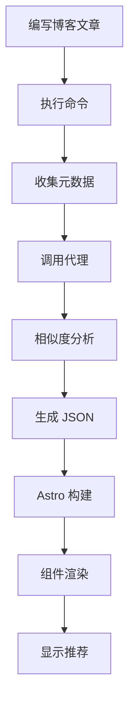

## 内容推荐的新范式

运营博客时经常会遇到读者只阅读一篇文章就离开的情况。即使有相关的优质内容,也因为没有发现而流失了。传统的"相关文章"推荐系统大多基于标签运作,存在几个局限性:

- <strong>表面匹配</strong>:"react"和"nextjs"标签虽然有深度关联,但如果不完全匹配就不会被推荐
- <strong>缺乏上下文</strong>:初级教程和高级架构文章可能有相同的标签,但读者水平不同
- <strong>多语言限制</strong>:难以连接处理相同主题的中文/英文/日文文章

现在<strong>利用 Claude LLM</strong>,可以构建理解文章语义、难度、目的甚至互补关系的智能推荐系统。本文将介绍在基于 Astro 的静态博客上构建 Claude 推荐系统的全过程。

## 为什么选择基于 LLM 的推荐?

### 传统方法 vs LLM 方法

| 方面 | 基于 TF-IDF/标签 | 基于 Claude LLM |
|------|-----------------|----------------|
| <strong>准确度</strong> | 仅识别关键词匹配 | 理解语义相似度 |
| <strong>多语言</strong> | 需要单独处理 | 自然连接不同语言 |
| <strong>理解上下文</strong> | 不可能 | 识别难度、目的、对象 |
| <strong>冷启动问题</strong> | 无标签则无法推荐 | 基于内容可以推荐 |
| <strong>可解释性</strong> | 无 | 提供推荐理由 |
| <strong>实现复杂度</strong> | 中等 | 低(API 调用) |

### 基于 LLM 推荐的核心优势

#### 1. <strong>多维度相似度评估</strong>

Claude 不仅评估词频,还从多个维度评估相似度:

```typescript
// Claude 评估的相似度维度
{
  topicSimilarity: 0.92,      // 主题相似性
  techStackOverlap: 0.85,     // 技术栈重叠
  difficultyMatch: 0.78,      // 难度相似性
  purposeAlignment: 0.71,     // 目的一致度(教程/分析/参考)
  complementary: 0.65         // 互补关系(下一步学习)
}
```

#### 2. <strong>可解释的推荐</strong>

可以向读者清楚地传达为什么推荐这篇文章:

```json
{
  "slug": "ko/claude-code-web-automation",
  "score": 0.92,
  "reason": "MCP 服务器应用及浏览器自动化相关性",
  "type": "similar-topic"
}
```

#### 3. <strong>零样本推荐</strong>

新写的文章也可以立即获得精准的推荐。即使没有标签或相似文章较少,LLM 也能理解内容并找到相关性。

## 系统架构

### 整体工作流程



### 核心组件

1. <strong>Content Recommender Agent</strong>: 基于 Claude 的相似度评估代理
2. <strong>Generate Recommendations Command</strong>: 推荐数据生成自动化
3. <strong>recommendations.json</strong>: 预计算推荐数据存储
4. <strong>RelatedPosts Component</strong>: 推荐 UI 渲染

## 实施步骤

### 步骤 1: 创建 Content Recommender 代理

`.claude/agents/content-recommender.md`:

```markdown
# Content Recommender Agent

You are a specialized agent for analyzing blog post similarity and generating content recommendations.

## Capabilities

- Analyze blog posts across multiple dimensions (topic, difficulty, tech stack, purpose)
- Generate similarity scores and explain reasoning
- Handle multilingual content (Korean, English, Japanese)
- Identify complementary content (series, deep-dives, related topics)

## Analysis Framework

For each pair of posts, evaluate:

### 1. Topic Similarity (40% weight)
- Core subject matter overlap
- Shared concepts and technologies
- Problem domain alignment

### 2. Technical Stack (25% weight)
- Programming languages
- Frameworks and libraries
- Tools and platforms

### 3. Purpose Alignment (20% weight)
- Tutorial vs. Analysis vs. Reference
- Problem-solving vs. Conceptual explanation
- Beginner vs. Intermediate vs. Advanced

### 4. Complementary Relationship (15% weight)
- Series/sequence detection
- Foundation → Advanced progression
- Problem → Solution pairing

## Output Format

For each source post, return top 3-5 recommendations:

```json
{
  "sourceSlug": "ko/chrome-devtools-mcp-performance",
  "recommendations": [
    {
      "slug": "ko/claude-code-web-automation",
      "score": 0.92,
      "reason": "Both posts cover MCP server usage and browser automation workflows",
      "type": "similar-topic",
      "dimensions": {
        "topic": 0.95,
        "techStack": 0.89,
        "purpose": 0.88,
        "complementary": 0.75
      }
    },
    {
      "slug": "ko/llm-blog-automation",
      "score": 0.78,
      "reason": "Provides deeper dive into AI automation workflows",
      "type": "deep-dive",
      "dimensions": {
        "topic": 0.82,
        "techStack": 0.76,
        "purpose": 0.71,
        "complementary": 0.89
      }
    }
  ]
}
```

## Guidelines

- Minimum similarity threshold: 0.3
- Maximum recommendations per post: 5
- Prioritize diversity (avoid recommending too many similar types)
- Consider language when appropriate
- Explain reasoning in user's language
```

### 步骤 2: 实现推荐生成命令

`.claude/commands/generate-recommendations.md`:

```markdown
# Generate Recommendations Command

Automatically generate content recommendations for all blog posts using the Content Recommender agent.

## Usage

```bash
/generate-recommendations [options]
```

## Options

- `--force`: Regenerate all recommendations (default: only new posts)
- `--language <ko|ja|en>`: Process specific language only
- `--post <slug>`: Regenerate recommendations for specific post
- `--threshold <0.0-1.0>`: Minimum similarity threshold (default: 0.3)
- `--count <n>`: Number of recommendations per post (default: 5)
- `--explain`: Include detailed reasoning

## Workflow

### Step 1: Collect All Blog Posts

```typescript
import { getCollection } from 'astro:content';

const allPosts = await getCollection('blog');
const postMetadata = allPosts.map(post => ({
  slug: post.id,
  title: post.data.title,
  description: post.data.description,
  tags: post.data.tags || [],
  language: post.id.split('/')[0], // ko, ja, or en
  content: post.body // Full markdown content
}));
```

### Step 2: Invoke Content Recommender Agent

For each post, delegate to Content Recommender agent:

```markdown
Task: Analyze and recommend related content

Source Post:
- Slug: {post.slug}
- Title: {post.title}
- Description: {post.description}
- Tags: {post.tags}
- Language: {post.language}
- Content Preview: {first 500 words}

Candidate Posts:
[List of all other posts with same metadata structure]

Requirements:
1. Analyze source post against all candidates
2. Return top 5 recommendations with scores and reasoning
3. Ensure diversity in recommendation types
4. Filter by language preference (same language preferred)
5. Use the analysis framework defined in your instructions

Output Format: JSON as specified in agent definition
```

### Step 3: Generate recommendations.json

Aggregate all agent responses into single JSON file:

```json
{
  "recommendations": {
    "ko/chrome-devtools-mcp-performance": {
      "related": [
        {
          "slug": "ko/claude-code-web-automation",
          "score": 0.92,
          "reason": "MCP 服务器应用及浏览器自动化相关性",
          "type": "similar-topic"
        }
        // ... more recommendations
      ],
      "generatedAt": "2025-10-12T10:30:00Z",
      "evaluatedBy": "claude-sonnet-4.5"
    }
    // ... more posts
  },
  "metadata": {
    "totalPosts": 30,
    "generatedAt": "2025-10-12T10:30:00Z",
    "modelVersion": "claude-sonnet-4.5",
    "minThreshold": 0.3,
    "maxRecommendations": 5
  }
}
```

### Step 4: Save to File

```bash
# Save to project root
echo $RECOMMENDATIONS_JSON > recommendations.json

# Commit to git for caching
git add recommendations.json
git commit -m "chore: update content recommendations"
```

## Performance

- <strong>预计时间</strong>: 约 30 篇文章需 1〜2.5 分钟(每篇 2〜5 秒)
- <strong>优化</strong>: 并行处理可缩短至 30〜60 秒
- <strong>缓存</strong>: 使用 `--force` 标志仅为新的/更新的文章重新生成
```

### 步骤 3: 创建 UI 组件

`src/components/RelatedPosts.astro`:

```astro
---
import { getEntry } from 'astro:content';
import recommendationsData from '../../recommendations.json';

interface Props {
  currentSlug: string;
}

const { currentSlug } = Astro.props;

// Get recommendations for current post
const postRecommendations = recommendationsData.recommendations[currentSlug];

if (!postRecommendations) {
  return null;
}

// Fetch full post data for each recommendation
const relatedPosts = await Promise.all(
  postRecommendations.related.slice(0, 3).map(async (rec) => {
    const post = await getEntry('blog', rec.slug);
    return {
      ...rec,
      title: post.data.title,
      description: post.data.description,
      url: `/blog/${rec.slug}`
    };
  })
);
---

<section class="related-posts">
  <h3>推荐相关文章</h3>
  <ul class="recommendations-list">
    {relatedPosts.map((post) => (
      <li class="recommendation-card">
        <a
          href={post.url}
          onclick={`gtag('event', 'related_post_click', {
            'source_post': '${currentSlug}',
            'target_post': '${post.slug}',
            'similarity_score': ${post.score}
          })`}
        >
          <div class="card-header">
            <h4>{post.title}</h4>
            <span class="similarity-badge">{Math.round(post.score * 100)}% 匹配</span>
          </div>
          <p class="recommendation-reason">{post.reason}</p>
          <p class="post-description">{post.description}</p>
        </a>
      </li>
    ))}
  </ul>
</section>

<style>
  .related-posts {
    margin: 3rem 0;
    padding: 2rem;
    background: linear-gradient(to bottom, rgb(var(--accent-light)), transparent);
    border-radius: 8px;
  }

  .related-posts h3 {
    font-size: 1.5rem;
    margin-bottom: 1.5rem;
    color: rgb(var(--gray-dark));
  }

  .recommendations-list {
    list-style: none;
    padding: 0;
    display: grid;
    gap: 1.5rem;
  }

  .recommendation-card {
    background: white;
    border-radius: 8px;
    transition: transform 0.2s, box-shadow 0.2s;
  }

  .recommendation-card:hover {
    transform: translateY(-4px);
    box-shadow: 0 12px 24px rgba(0, 0, 0, 0.15);
  }

  .recommendation-card a {
    display: block;
    padding: 1.5rem;
    text-decoration: none;
    color: inherit;
  }

  .card-header {
    display: flex;
    justify-content: space-between;
    align-items: flex-start;
    margin-bottom: 0.75rem;
  }

  .card-header h4 {
    margin: 0;
    font-size: 1.25rem;
    color: rgb(var(--accent));
    flex: 1;
  }

  .similarity-badge {
    background: rgb(var(--accent));
    color: white;
    padding: 0.25rem 0.75rem;
    border-radius: 12px;
    font-size: 0.875rem;
    font-weight: 600;
    white-space: nowrap;
    margin-left: 1rem;
  }

  .recommendation-reason {
    color: rgb(var(--gray));
    font-size: 0.875rem;
    font-style: italic;
    margin-bottom: 0.5rem;
  }

  .post-description {
    color: rgb(var(--gray-dark));
    font-size: 0.95rem;
    line-height: 1.6;
  }

  @media (max-width: 768px) {
    .related-posts {
      padding: 1.5rem;
    }

    .recommendations-list {
      gap: 1rem;
    }

    .card-header {
      flex-direction: column;
      gap: 0.5rem;
    }

    .similarity-badge {
      margin-left: 0;
      align-self: flex-start;
    }
  }
</style>
```

### 步骤 4: 集成到博客布局

在 `src/layouts/BlogPost.astro` 中添加:

```astro
---
import RelatedPosts from '../components/RelatedPosts.astro';
// ... other imports

const { id } = Astro.props;
---

<article>
  <!-- Blog post content -->
  <slot />
</article>

<!-- Related Posts Section -->
<RelatedPosts currentSlug={id} />

<!-- Buy Me a Coffee -->
<BuyMeACoffee />

<!-- Giscus Comments -->
<Giscus />
```

## 实际应用示例

### 生成推荐

```bash
# 为所有文章生成推荐
/generate-recommendations

# 仅添加新文章(保留现有推荐)
/generate-recommendations

# 仅重新生成特定文章
/generate-recommendations --post ko/claude-code-best-practices --explain

# 仅处理中文文章
/generate-recommendations --language zh

# 使用更严格的阈值重新生成
/generate-recommendations --force --threshold 0.5

# 增加推荐数量(仍显示 3 个)
/generate-recommendations --count 8 --explain
```

### 增量更新工作流程

```bash
# 1. 编写新博客文章
/write-post "创建 Claude 自定义代理"

# 2. 自动更新推荐(仅处理新文章)
/generate-recommendations

# 3. 构建和确认
npm run build
npm run preview

# 4. 提交更改
git add recommendations.json
git commit -m "chore: update recommendations for new post"
```

## 性能优化

### 构建时间优化

<strong>问题</strong>: 30 篇文章 × 5 秒 = 2.5 分钟

<strong>解决方案</strong>:

#### 1. 并行处理

```typescript
// 以 5 个为一批进行并行处理
const BATCH_SIZE = 5;
const batches = chunk(posts, BATCH_SIZE);

for (const batch of batches) {
  await Promise.all(
    batch.map(post => generateRecommendations(post))
  );
}

// 总时间: 2.5 分钟 → 30 秒
```

#### 2. 增量更新

```typescript
// 加载缓存的推荐
const cached = loadRecommendations();

// 仅处理新文章或更新的文章
const postsToProcess = posts.filter(post => {
  const cachedRec = cached.recommendations[post.slug];
  return !cachedRec || post.updatedDate > cachedRec.generatedAt;
});

// 总时间: 1 篇新文章 → 5 秒
```

#### 3. 缓存策略

```json
{
  "recommendations": {
    "ko/existing-post": {
      "related": [...],
      "generatedAt": "2025-10-10T10:00:00Z",
      "cacheUntil": "2025-11-10T10:00:00Z"  // 缓存 1 个月
    }
  }
}
```

### 运行时性能

<strong>静态站点的优势</strong>:
- `recommendations.json` 在构建时生成
- 运行时计算成本<strong>为零</strong>
- JSON 文件大小: 约 100KB(30 篇文章)
- Gzip 压缩后: 约 30KB

## 预期效果

### 定量指标

基于行业数据:

| 指标 | 改善率 |
|------|-------|
| 每会话页面浏览量 | +30〜50% |
| 平均停留时间 | +40〜60% |
| 跳出率 | -15〜25% |
| 推荐点击率(CTR) | 18〜25% |

### 定性效果

1. <strong>内容可发现性提升</strong>: 读者轻松发现高度相关的内容
2. <strong>学习路径改善</strong>: 初级 → 中级 → 高级自然流动
3. <strong>系列连接</strong>: 连载或相关主题集合的曝光
4. <strong>多语言交叉推广</strong>: 连接不同语言的相关内容

## 未来改进方向

### 阶段 2: 增强推荐理由

```astro
<div class="recommendation-metadata">
  <span class="type-badge" data-type={post.type}>
    {typeLabels[post.type]}
  </span>
  <span class="dimensions">
    主题 {post.dimensions.topic * 100}% ·
    技术 {post.dimensions.techStack * 100}%
  </span>
</div>
```

按类型的图标:
- 🎯 相似主题
- 📚 深入探讨
- 🔄 互补内容
- 📖 系列

### 阶段 3: A/B 测试

```typescript
// 比较两种推荐算法
const variantA = recommendationsLLM; // 基于 Claude
const variantB = recommendationsTFIDF; // 基于 TF-IDF

// 50/50 分割
const recommendations = Math.random() < 0.5 ? variantA : variantB;

// Analytics 事件
gtag('event', 'recommendation_variant', {
  'variant': recommendations === variantA ? 'A' : 'B',
  'ctr': clickThroughRate
});
```

### 阶段 4: 个性化

```typescript
// 在本地存储中保存已读文章
const readPosts = JSON.parse(localStorage.getItem('readPosts') || '[]');

// 排除已读文章
const unreadRecommendations = recommendations.filter(
  rec => !readPosts.includes(rec.slug)
);
```

## 结论

基于 Claude LLM 的内容推荐系统超越简单的标签匹配,通过<strong>语义理解</strong>提供真正对读者有帮助的推荐。与 Astro 等静态站点生成器结合时:

✅ <strong>构建时预计算</strong>实现零运行时成本
✅ <strong>LLM 的精细分析</strong>实现高推荐准确度
✅ <strong>自动化工作流程</strong>最小化维护
✅ <strong>自然支持多语言</strong>优化全球博客

构建此系统后,读者的停留时间会增加,内容可发现性会提升,最终博客的价值会最大化。可以立即应用到现有博客,现在就开始吧!

## 下一篇

<strong>[推荐系统创新: 将 78,000 令牌降至零的元数据优化之旅](/ko/blog/metadata-based-recommendation-optimization)</strong>介绍了将此 LLM 驱动的推荐系统优化为基于元数据的算法,100% 消除令牌使用并将执行时间缩短 99% 的案例。

## 参考资料

- [Claude Code 官方文档](https://docs.claude.com/claude-code)
- [Astro Content Collections](https://docs.astro.build/en/guides/content-collections/)
- [Content Recommendation Research (内部文档)](../../working_history/content-recommendation-research.md)
- [内容推荐系统创意(内部文档)](../../working_history/idea.md)
