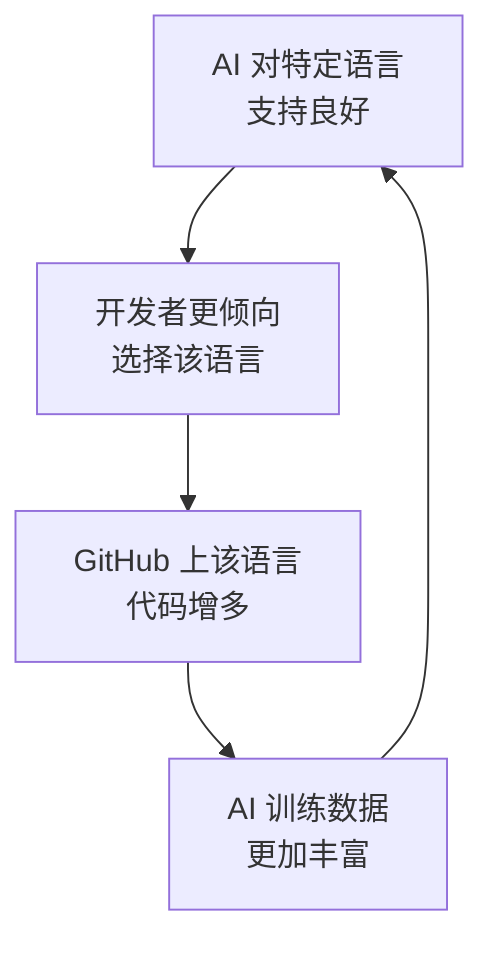
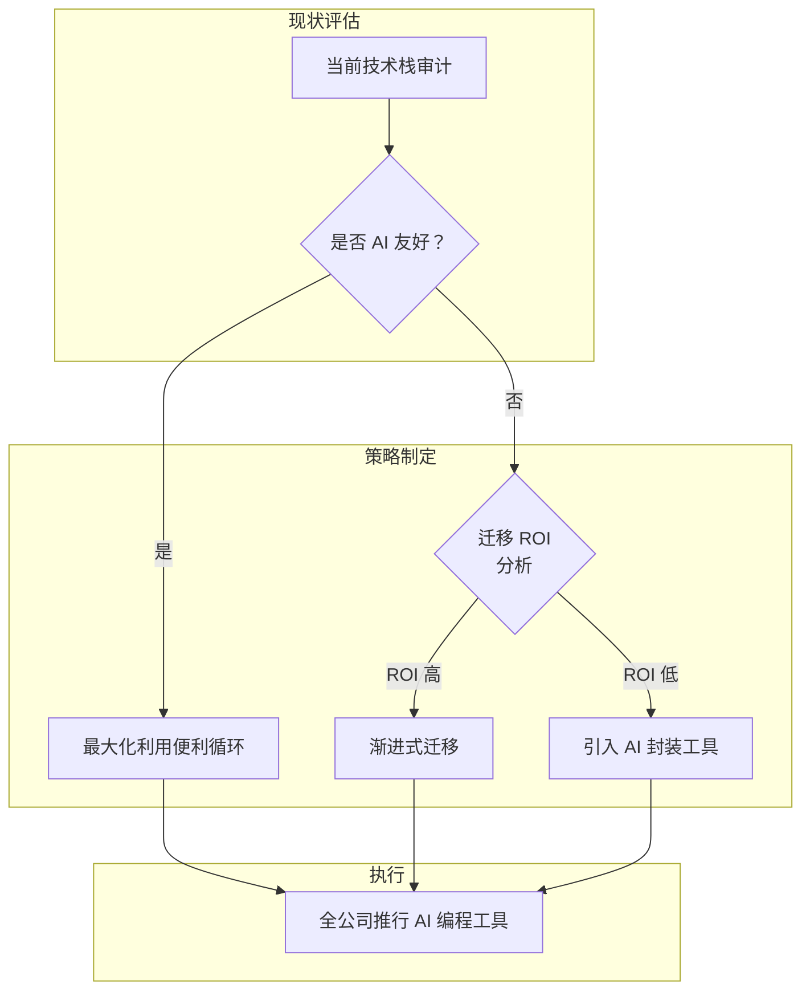

## 概述

AI 编程助手已不再只是"快速写代码的工具"，数据表明它正在<strong>改变开发者选择哪种编程语言</strong>。根据 GitHub Octoverse 2025 报告，TypeScript 同比<strong>暴涨66%</strong>，跃居 GitHub 最常用语言榜首。GitHub 开发者布道师 Andrea Griffiths 将这一现象命名为<strong>"便利循环（Convenience Loop）"</strong>。

本文将分析便利循环的运行机制，并探讨 Engineering Manager 和 CTO 在技术栈决策中需要关注的结构性变化。

## 什么是便利循环

### 自强化反馈机制

便利循环（Convenience Loop）具有如下循环结构：



当 AI 编程工具让某项技术能够无摩擦（frictionless）地使用时，开发者就会向该技术聚集。这会产生更多的训练数据，使 AI 在该技术上变得更加精准，从而形成<strong>自强化循环</strong>。

### 为什么 TypeScript 暴涨了66%

TypeScript 成为便利循环最大受益者的原因在于，<strong>其静态类型系统与 LLM 的工作方式在结构上高度契合</strong>。

<strong>学术研究数据</strong>：2025年的学术研究表明，LLM 生成代码的编译错误中有<strong>94%属于类型检查失败</strong>。这意味着静态类型在 AI 的错误进入生产环境之前充当了"安全护栏"的角色。

```typescript
// TypeScript：AI 通过类型信息立即只建议有效操作
function processUser(user: { name: string; age: number }) {
  // AI 知道 user.name 是 string，精准建议 .toUpperCase()
  // 对 user.age 只建议数值运算
  return `${user.name.toUpperCase()} (${user.age + 1}岁)`;
}

// JavaScript：AI 需要推测运行时类型
function processUser(user) {
  // 无法保证 user.name 是 string、user.age 是 number
  // AI 的建议可能引发运行时错误
  return `${user.name.toUpperCase()} (${user.age + 1}岁)`;
}
```

<strong>关键差异</strong>：一旦声明 `x: string`，AI 就能立即排除所有不适用于 string 的操作。如果没有类型，AI 只能推测"大概是 string"，一旦推测错误就会导致运行时错误。

### 框架生态系统的加速效应

TypeScript 的暴涨并非仅靠语言本身。<strong>Next.js、Astro、Remix</strong> 等主流框架将 TypeScript 作为默认选项，产生了协同效应：

- <strong>Next.js 15+</strong>：`create-next-app` 默认生成 TypeScript 项目
- <strong>Astro 5+</strong>：Content Collections 采用基于 TypeScript 的 Schema 验证
- <strong>Remix/React Router 7</strong>：将类型安全路由作为核心功能

框架 → 默认采用 TypeScript → AI 代码生成质量提升 → 开发者采用率增加，<strong>多层便利循环</strong>正在形成。

## 各语言的 AI 兼容性差距

### AI 友好型语言 vs 非友好型语言

| 语言 | AI 代码生成质量 | 主要原因 |
|------|---------------|---------|
| <strong>Python</strong> | 非常高 | 教育/ML 领域拥有压倒性训练数据 |
| <strong>TypeScript</strong> | 非常高 | 静态类型 + 丰富的生态系统 |
| <strong>Go</strong> | 高 | 简洁语法 + 显式错误处理 |
| <strong>Rust</strong> | 中等 | 强类型但所有权规则复杂 |
| <strong>C++</strong> | 低 | 语法复杂，相对训练数据模式多样 |
| <strong>Perl</strong> | 非常低 | 训练数据不足，语法歧义性强 |

<strong>值得关注的趋势</strong>：随着开发者向 AI 工具支持良好的语言迁移，支持薄弱的语言的学习曲线变得更加陡峭。如果新开发者学习 C++ 时几乎得不到 AI 的帮助，选择 Python 或 TypeScript 的概率就会大大提高。

### GitHub 数据揭示的数字

- <strong>TypeScript</strong>：月活跃贡献者263.6万人（第1位）
- <strong>Python</strong>：在 AI/ML 研究中以25.87%依然领先
- <strong>公共 LLM SDK 仓库</strong>：超过110万个仓库已在使用 LLM SDK

这些数字表明，<strong>AI 工具兼容性已不是"锦上添花"，而是语言选择的核心变量</strong>。

## EM/CTO 视角：技术栈战略的变化

### 1. 招聘战略的重新审视

AI 便利循环也对招聘市场产生了影响：

- <strong>TypeScript/Python 开发者池增长最快</strong>：新开发者优先学习与 AI 契合度高的语言
- <strong>遗留语言专家日益稀缺</strong>：Perl、COBOL 等因 AI 支持不足，新人流入减少
- <strong>AI 运用能力成为新的技术能力标准</strong>：相比语言本身，"能否与 AI 工具协作高效工作"更为重要

### 2. 技术债务应对策略



<strong>实操指南</strong>：

- <strong>Python/TypeScript 为主的技术栈</strong>：积极利用 AI 编程工具，最大化生产力
- <strong>Java/C# 技术栈</strong>：利用静态类型的优势，但需确认 AI 工具覆盖范围
- <strong>动态类型遗留系统（PHP、Ruby）</strong>：考虑添加 TypeScript 类型定义或渐进式迁移
- <strong>系统级语言（C/C++）</strong>：鉴于 AI 支持有限，建议考虑制定向 Rust 转型的路线图

### 3. 开发生产力衡量方式的变化

需要在现有生产力指标中加入<strong>AI 利用效率</strong>：

- <strong>AI 建议采纳率</strong>：团队对 AI 代码建议的利用程度
- <strong>类型覆盖率</strong>：代码库中类型声明的比例（直接影响 AI 性能）
- <strong>AI 引发的 Bug 比率</strong>：追踪 AI 生成代码中产生的缺陷
- <strong>各语言 AI ROI</strong>：哪种语言/框架在 AI 工具投资上获得了更高的生产力提升

## 便利循环的风险

### 多样性减少问题

便利循环的自强化特性既是优势也是风险：

- <strong>新语言进入门槛升高</strong>：AI 训练数据不足的新语言难以吸引开发者
- <strong>特定范式偏向</strong>：存在向 AI 善于生成的代码模式趋同的隐忧
- <strong>创新方法被低估</strong>：AI 偏好"常规"解决方案，非传统方法可能被淘汰

### 安全视角

LLM 生成代码中<strong>94%为类型检查失败</strong>的数据彰显了类型系统的重要性，但同时也是<strong>AI 生成代码质量尚未完善</strong>的信号。即使在拥有类型系统的语言中，安全漏洞审查仍然不可或缺。

## 结论：技术选择的新维度

AI 便利循环为编程语言选择增添了<strong>全新的评判维度</strong>。过去，性能、生态系统、团队能力是主要标准；而现在，<strong>"与 AI 工具的契合度"</strong>已成为不可忽视的变量。

<strong>给 Engineering Manager 和 CTO 的核心启示</strong>：

1. <strong>将 AI 兼容性正式纳入技术栈决策标准</strong>
2. 拥有静态类型系统的语言在 AI 时代具有结构性优势
3. 在最大化便利循环收益的同时，<strong>监控多样性减少和安全风险</strong>
4. 考虑将团队的 AI 利用效率<strong>纳入生产力 KPI</strong>

TypeScript 暴涨66%只是开始。随着 AI 编程工具日益成熟，便利循环的影响力将持续增强，理解并善用这一趋势的组织将在开发生产力上占据先机。

## 参考资料

- [GitHub Data Shows AI Tools Creating "Convenience Loops" That Reshape Developer Language Choices — InfoQ](https://www.infoq.com/news/2026/03/ai-reshapes-language-choice/)
- [Octoverse: AI leads TypeScript to #1 — GitHub Blog](https://github.blog/news-insights/octoverse/octoverse-a-new-developer-joins-github-every-second-as-ai-leads-typescript-to-1/)
- [Is AI Impacting Which Programming Language Projects Use? — Slashdot](https://developers.slashdot.org/story/26/02/23/0732245/is-ai-impacting-which-programming-language-projects-use)
- [Generative coding: Breakthrough Technologies 2026 — MIT Technology Review](https://www.technologyreview.com/2026/01/12/1130027/generative-coding-ai-software-2026-breakthrough-technology/)
