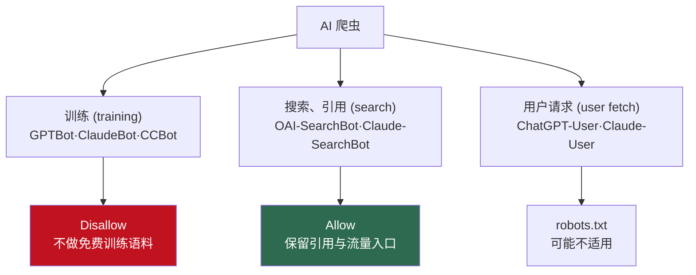

很多站点在 robots.txt 里塞一行 `User-agent: GPTBot` / `Disallow: /`，就以为 AI 的事情搞定了。只对了一半。GPTBot 是 OpenAI 用于<strong>模型训练</strong>的爬虫。可是 OpenAI 不止一个爬虫，你若把另一个也一并屏蔽，就等于亲手关掉了 ChatGPT 搜索引用你页面的机会。反过来，什么都不想直接全放开，你的内容就会被整块吸进训练语料。

所以"挡 AI 还是放 AI"不是一个开关。2026 年的 robots.txt，至少要对三类机器人区别对待。我不想只看文档就算了，于是真的写了一份 robots.txt，用标准解析器跑一遍，看规则是否按我的意图生效。过程中我还发现了一行——标准解析器给出的答案和真实的 Googlebot 不一样。下面按顺序讲清楚。

## AI 爬虫不是一个物种: 训练、搜索、用户请求三层

先按用途给爬虫分类。哪怕是同一家公司的机器人，干的活也完全不同。OpenAI 官方文档（[Overview of OpenAI Crawlers](https://developers.openai.com/api/docs/bots)）就是这样区分自家机器人的：

- <strong>GPTBot</strong>（`GPTBot/1.3`）：用于生成模型<strong>训练</strong>。屏蔽它，就是发出"别拿我的内容去训练"的信号。
- <strong>OAI-SearchBot</strong>（`OAI-SearchBot/1.3`）：为 ChatGPT 的<strong>搜索</strong>功能收集在生成回答时可能引用的页面。屏蔽它，你就从 ChatGPT 搜索回答里消失。
- <strong>ChatGPT-User</strong>（`ChatGPT-User/1.0`）：当用户直接让 ChatGPT"读一下这个 URL"时去抓取该页面。官方文档写明，因为这是用户触发的，"robots.txt 规则可能不适用"。

Anthropic 在其[官方帮助中心](https://support.claude.com/en/articles/8896518-does-anthropic-crawl-data-from-the-web-and-how-can-site-owners-block-the-crawler)里也用同样的结构划分机器人：`ClaudeBot`（训练）、`Claude-User`（用户触发的抓取）、`Claude-SearchBot`（搜索索引）。以前用的 `anthropic-ai`、`Claude-Web` 已经停用（deprecated），现在只屏蔽这两个等于打空拳。

这里出现第一个实务判断。<strong>不能把训练机器人和搜索机器人当成一坨。</strong>一旦你出于"AI 全都讨厌"的反应，把 GPTBot、OAI-SearchBot、ClaudeBot、Claude-SearchBot 全部 `Disallow`，你成功挡住了训练，却也关掉了让自己在 ChatGPT、Claude 搜索回答里被引用的唯一通道。对想要流量的发布者来说，这是亏的。

把三个层次和默认策略画成一张图：



## 2026 年发布者的默认策略：拒绝训练，放行引用

所以我推荐的默认策略很明确。<strong>拒绝训练（training），放行搜索与引用（search）。</strong>不把内容当免费训练语料交出去，但保留一条路：让 AI 回答引用你、让读者点进来。落到 robots.txt 上就是这样：

```text
# --- AI 训练(training)爬虫: 不让内容进入模型训练 ---
User-agent: GPTBot
Disallow: /

User-agent: ClaudeBot
Disallow: /

User-agent: CCBot
Disallow: /

# Google-Extended 不是"爬虫"，而是控制训练数据使用的令牌。
User-agent: Google-Extended
Disallow: /

# --- 搜索/引用(search)爬虫: 放行，让 ChatGPT、Claude 搜索能引用你 ---
User-agent: OAI-SearchBot
Allow: /

User-agent: Claude-SearchBot
Allow: /

User-agent: PerplexityBot
Allow: /

# --- 通用搜索爬虫 ---
User-agent: Googlebot
Allow: /
Disallow: /admin/

User-agent: *
Disallow: /admin/
Disallow: /drafts/

Sitemap: https://example.com/sitemap.xml
```

`CCBot` 是 Common Crawl 的机器人，很多开放数据集把它当作训练来源，所以想拒绝训练的话，把它一起放进屏蔽列表才对。下表把这个策略一目了然地整理出来。

| 爬虫 | 归属 | 用途 | 本策略中 |
|------|------|------|----------|
| GPTBot | OpenAI | 模型训练 | 屏蔽 |
| OAI-SearchBot | OpenAI | ChatGPT 搜索引用 | 放行 |
| ChatGPT-User | OpenAI | 用户直接请求 | robots.txt 可能不适用（官方） |
| ClaudeBot | Anthropic | 模型训练 | 屏蔽 |
| Claude-SearchBot | Anthropic | 搜索索引 | 放行 |
| Google-Extended | Google | 训练数据使用控制令牌 | 屏蔽（注意下面的陷阱） |
| Googlebot | Google | 通用搜索（含 AI Overviews） | 放行 |
| CCBot | Common Crawl | 训练语料收集 | 屏蔽 |
| PerplexityBot | Perplexity | 回答引擎引用 | 放行 |

当然，这是"<strong>想要</strong>引用流量的站点"的默认值。如果你运营的是付费内容或社区档案，连引用都不想要，那把搜索机器人也屏蔽才对。答案不止一个。不过对大多数博客和文档站来说，"拒绝训练＋放行引用"这个组合是个合理的起点。

爬虫到达之后实际读取什么，是另一个层面的问题。那部分我在[把 LocalBusiness 结构化数据从服务端输出](/zh/blog/zh/localbusiness-structured-data-server-side-vs-js-2026)那篇里另作讨论。如果 robots.txt 是"让谁进来"，标记就是"给进来的机器人看什么"。

## 我做了验证: 规则真的按意图生效了吗

robots.txt 难的不是写，而是<strong>确认它是否真按你的意图运作</strong>。这是一个一处笔误就能让整套规则失效的文件，更是如此。于是我把上面的 robots.txt 存到临时目录，用 Python 标准库 `urllib.robotparser`，逐个机器人问它能否抓取某个路径。它是无需额外安装的标准解析器，复现也容易。

```python
import urllib.robotparser as rp

p = rp.RobotFileParser()
p.parse(open("robots.txt").read().splitlines())

cases = [
    ("GPTBot",           "/blog/my-article"),
    ("OAI-SearchBot",    "/blog/my-article"),
    ("ClaudeBot",        "/blog/my-article"),
    ("Claude-SearchBot", "/blog/my-article"),
    ("Google-Extended",  "/blog/my-article"),
    ("Googlebot",        "/blog/my-article"),
]
for ua, path in cases:
    print(ua, path, p.can_fetch(ua, path))
```

运行结果是这样：

```text
user-agent         path                 allowed?  note
----------------------------------------------------------------------
GPTBot             /blog/my-article     False     训练爬虫(OpenAI)
OAI-SearchBot      /blog/my-article     True      搜索/引用爬虫(OpenAI)
ClaudeBot          /blog/my-article     False     训练爬虫(Anthropic)
Claude-SearchBot   /blog/my-article     True      搜索爬虫(Anthropic)
Google-Extended    /blog/my-article     False     Google 训练令牌
Googlebot          /blog/my-article     True      通用搜索(含 AI Overviews)
Googlebot          /admin/secret        True      通用搜索 - 敏感路径
PerplexityBot      /blog/my-article     True      Perplexity 搜索
CCBot              /blog/my-article     False     Common Crawl(训练来源)
SomeRandomBot      /drafts/wip          False     其他机器人 - 草稿
```

正如所愿。训练机器人（GPTBot、ClaudeBot、Google-Extended、CCBot）全部 `False`（屏蔽），搜索机器人（OAI-SearchBot、Claude-SearchBot、PerplexityBot）全部 `True`（放行）。不认识的 `SomeRandomBot` 被 `User-agent: *` 下的 `Disallow: /drafts/` 规则拦在草稿路径外。user-agent 匹配不区分大小写，所以 `GPTBot` 也好 `gptbot` 也好都命中同一规则。这也与真实爬虫的行为一致。

到这里都很干净。可有一行让我停住了。

## 标准解析器与真实 Googlebot 答案不一致的地方

看日志里的 `Googlebot /admin/secret → True`。我明明在 Googlebot 分组里放了 `Disallow: /admin/`。可标准解析器却把 `/admin/secret` 判为<strong>放行</strong>。起初我以为是自己笔误，反复看了好几遍。

原因在于对规则优先级的解释不同。我的 Googlebot 分组长这样：

```text
User-agent: Googlebot
Allow: /
Disallow: /admin/
```

Python 标准解析器先满足了 `Allow: /` 就放了行。但<strong>真实 Googlebot 的规则不是这样。</strong>按 Google 官方文档，当 Allow 和 Disallow 冲突时，<strong>路径更长（更具体）的规则获胜。</strong>对 `/admin/secret` 而言，`Allow: /` 长度为 1，`Disallow: /admin/` 长度为 7，所以真实 Googlebot 会采用更长的 `Disallow: /admin/`，把它<strong>屏蔽</strong>。

也就是说，面对同一份 robots.txt，标准解析器说"放行"，真实 Googlebot 说"屏蔽"。这个不一致看似微不足道，实务里却危险。你用某个本地脚本或某个库"测了一下 robots.txt，通过了"就放心了，可要是那个解析器没实现 Google 的最长匹配规则，实际上可能被屏蔽、也可能被放开，而你并不知道。

我的结论是：<strong>验证 robots.txt，一定要用那个爬虫真正使用的规则来确认。</strong>Google 就用 Search Console 的 robots.txt 测试工具，OpenAI 就以官方文档里各机器人的行为为准。别拿一个通用解析器"过了"就算数。我今天翻出来的这一行，就是证据。（顺便说，这种"工具通过了就一切没问题"的陷阱在无障碍里也一样存在。这和 [Lighthouse 满分 100 并不等于符合 WCAG](/zh/blog/zh/a11y-lighthouse-audit-fix-2026) 是完全同一类错觉。）

## Google-Extended 的陷阱: 它挡不住 AI Overviews

上表里我写"Google-Extended：屏蔽（注意陷阱）"，原因就在这。很多开发者放上 `User-agent: Google-Extended` / `Disallow: /` 就安心了，以为"这下 Google 的 AI 不会用我的内容了"。这同样只对一半。

按 Google 官方说明（[AI Features and Your Website](https://developers.google.com/search/docs/appearance/ai-features)），Google-Extended <strong>不是爬虫</strong>，而是一个控制已抓取内容是否被<strong>用于训练</strong> Gemini 等生成产品的令牌。内容本身仍由 Googlebot 抓取。而关键在于：<strong>屏蔽 Google-Extended 并不会让你从 AI Overviews 里消失。</strong>AI Overviews 用的不是另一套训练数据，而是从 Google 搜索的实时索引里取答案。

那想只退出 AI Overviews 呢？没有像样的办法。用 `nosnippet` 元标签能让你退出 AI Overviews 的引用，但它<strong>会连普通搜索摘要一起杀掉。</strong>意思是你得接受搜索结果里不再出现自己的描述文字。实际上，"保留普通搜索、只退出 AI Overviews"目前没有干净的做法。这不是我的猜测，而是能在 Google 文档里确认的结构性限制。

所以开发者需要的是准确的预期。Google-Extended `Disallow` 干的活到"别拿去训练 Gemini"为止，而不是"把我从 Google 所有 AI 功能里剔除"。把这两件事混为一谈，你就会往 robots.txt 里塞一行，把没做成的事当成做成了。

## llms.txt 现在值得加吗: 一个诚实的现状

走到这里自然会问："那最近很火的 `llms.txt` 呢？"直说吧：加了不亏，但别指望效果。

llms.txt 是一份提案中的 markdown 文件，让站点告诉 LLM"这里有核心文档"。想法本身不坏。问题是<strong>截至 2026 年，没有一家主流 AI 提供方真的在用它</strong>。Google 的 John Mueller 和 Gary Illyes 公开表示搜索团队不使用 llms.txt，Mueller 甚至把它比作早已被弃用的 keywords 元标签。OpenAI、Anthropic、Meta、Mistral 之中，也没有谁官方确认在生产回答里把 llms.txt 当作信号。

数字也很冷（以下为第三方调查值，<strong>仅供参考，非官方</strong>）。一项行业分析报告称，放了 llms.txt 的站点里相当一部分几乎没收到过真实的 AI 机器人访问；另一项观测了约 5 亿次 AI 机器人访问的监测发现，直接冲着 llms.txt 去的请求少得可怜。文件在增多，读它的机器人却没有。

我的立场是：llms.txt 现在<strong>是保险，不是彩票</strong>。生成成本几乎为零，为标准可能落地做点对冲也有意义，想加就加。但"加了 llms.txt，AI 搜索就会好好收录我"是没有根据的期待。那点时间，不如花在上面整理的 robots.txt 分机器人控制和结构化数据上，实测收益大得多。

## 那么，今天要做什么: 清单

总结一下，AI 时代的 robots.txt 不是"挡还是放"，而是"对每个机器人怎么对待"。现在就该检查的项目：

1. <strong>你把机器人按用途分开了吗？</strong>确认没有把训练（GPTBot、ClaudeBot、Google-Extended、CCBot）和搜索（OAI-SearchBot、Claude-SearchBot、PerplexityBot）用同一条规则一锅端。
2. <strong>你是不是还在信已弃用的令牌？</strong>如果只屏蔽了 `anthropic-ai` 和 `Claude-Web`，Anthropic 现在的机器人根本没被挡住。更新到 `ClaudeBot`。
3. <strong>你对 Google-Extended 是否期待过高？</strong>它到"拒绝 Gemini 训练"为止，不是"把你排除出 AI Overviews"。把预期对准。
4. <strong>你用真实爬虫规则验证过吗？</strong>别信通用解析器的"通过"，Google 就用 Search Console 的 robots.txt 测试工具，把最长匹配规则也一并确认。
5. <strong>要知道 ChatGPT-User、Claude-User 这类用户触发的机器人可能不遵守 robots.txt。</strong>那是用户行为，不是策略，超出你的控制范围。

robots.txt 是自愿遵守的约定，不是法律强制。守规矩的机器人会遵守，恶意爬虫会无视。想靠 IP 屏蔽，反而可能让机器人连 robots.txt 都读不到，适得其反。所以它更像"明确的意愿声明"，而不是"密不透风的屏障"。带着这个限度去用，它就是把"拒绝训练、放行引用"这份意愿准确传达给各机器人的、最标准的手段。

---

如果你想把结构化数据稳妥地从服务端输出，或者想检查现有站点的 robots.txt、结构化标记、GEO 配置是否真的按意图运作，我个人承接咨询与实现方面的委托。欢迎通过我资料页上的联系方式随时留言。
