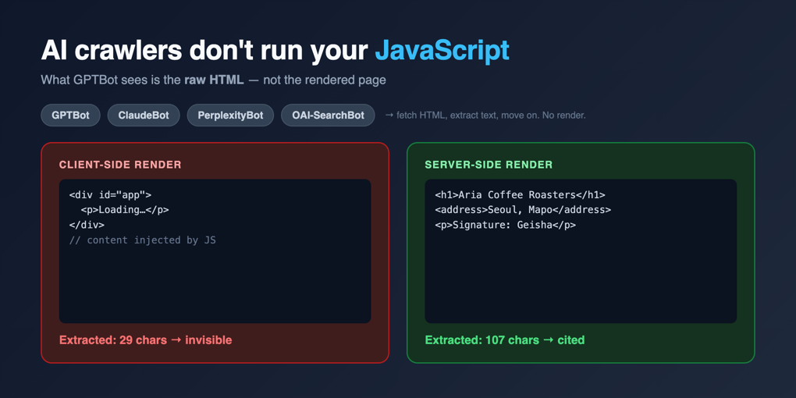
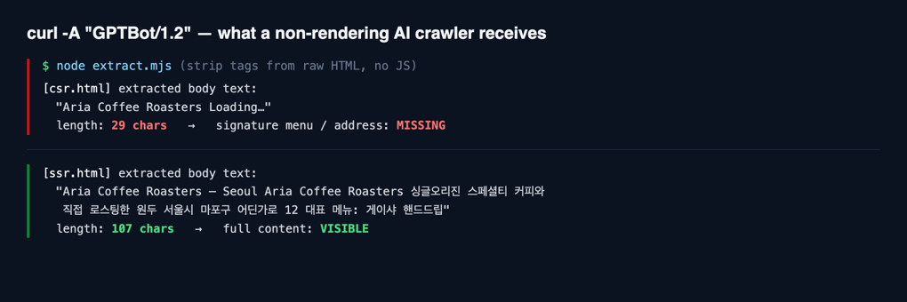

先说结论：如果你的网站靠浏览器里的 JavaScript 来渲染内容，大多数 AI 爬虫根本看不到它。不是"晚点看到"，也不是"看到一部分"。它们抓走原始 HTML，提取文字，就走了。GPTBot、ClaudeBot、PerplexityBot 不渲染你的页面，也不会等着二次抓取。

这件事的分量每个月都在变重。越来越多人先问 ChatGPT、用 Perplexity 搜索、看 Google 的 AI 概览，之后才点蓝色链接。而组装这些答案的爬虫，行为和 Googlebot 完全不同。于是那句老话——"Googlebot 能处理 JS，我们没问题"——就悄悄不成立了。我不想只是断言，所以在沙盒里用 curl 把它复现了一遍。



## 先把"渲染"这个词说清楚

要读懂后面的内容，得先搞清楚：你的内容到底在哪里被组装成 HTML。

<strong>服务端渲染（SSR）</strong>和静态生成（SSG）是服务器把成品 HTML 发出来。无论浏览器还是爬虫，一收到响应，里头就已经有 `<h1>店名</h1>`、地址、正文。而<strong>客户端渲染（CSR）</strong>里，服务器只发一个近乎空的壳（`<div id="app"></div>`）加一个 JavaScript 包。真正的内容要等浏览器执行那段 JS 才填进去。用 React、Vue 写的典型 SPA 就是这样。

人用浏览器看时感觉不到差别，因为浏览器会执行 JavaScript。差别只在<strong>不执行 JS 的访客</strong>到来时才暴露。而如今的网络上，这类访客——也就是 AI 爬虫——正在快速增多。

## 别把 Googlebot 和 AI 爬虫装进同一个盒子

这里是最容易翻车的地方。Google 官方文档（<a href="https://developers.google.com/search/docs/crawling-indexing/javascript/javascript-seo-basics">理解 JavaScript SEO 基础</a>）写得清楚：Googlebot 用无头 Chromium 渲染页面，执行 JavaScript，再把渲染后的 HTML 拿去索引。Google 早就把动态渲染称作"一种权宜之计，而非推荐方案"，引导大家改用 SSR、SSG 或 hydration（<a href="https://developers.google.com/search/docs/crawling-indexing/javascript/dynamic-rendering">Dynamic Rendering as a workaround</a>）。2026 年 3 月，他们甚至把 JS SEO 文档里"确保页面在没有 JavaScript 时也能工作"的那条警告删掉了。Google 对自家渲染器的信任就有这么足。

但要是把这读成"CSR 现在到处都安全"，那会摔得很惨。那份文档说的是 <strong>Googlebot</strong>，不是 AI 爬虫。据我核实的情况，也和业界抓取数据分析（Vercel《The rise of the AI crawler》。参考值，非官方）一致：GPTBot、OAI-SearchBot、ClaudeBot、PerplexityBot、Bytespider 都不渲染 JS。有报告分析了超过 5 亿次 GPTBot 抓取，没发现任何执行 JavaScript 的迹象（参考值，非官方）。GPTBot 有时会下载 JS 文件，但不执行。

有一个例外值得点名。Google Gemini 借用 Googlebot 的渲染基础设施（Web Rendering Service），所以能执行 JavaScript。这意味着 Google 的 AI 概览也许能看到 CSR 页面。可 ChatGPT、Claude、Perplexity 看不到。所以别拿 Google 一个数据点去推出"AI 能读我的 SPA"。

## 一行 curl 就能原样复现爬虫的视野

空谈没用，我实测了。诀窍很简单：<strong>curl 不执行 JavaScript。</strong>所以它能忠实地充当一个不渲染的 AI 爬虫，还原它从服务器拿到的原始 HTML。堪称完美替身。

我在沙盒里做了两个版本的虚构咖啡馆网站，内容完全一样，一个 CSR，一个 SSR。

```html
<!-- csr.html —— 内容只在客户端注入 -->
<div id="app"><p>Loading…</p></div>
<script>
  fetch('/data.json').then(r => r.json()).then(d => {
    document.getElementById('app').innerHTML =
      '<h1>' + d.name + '</h1><p>' + d.tagline + '</p>' +
      '<address>' + d.address + '</address>' +
      '<p>招牌: ' + d.signature + '</p>';
  });
</script>
```

```html
<!-- ssr.html —— 服务器响应里已经带着内容 -->
<main id="app">
  <h1>Aria Coffee Roasters</h1>
  <p>单一产地精品咖啡，自家烘焙豆子</p>
  <address>首尔市麻浦区某某路 12 号</address>
  <p>招牌: 瑰夏手冲</p>
</main>
```

然后我冒充 GPTBot 去抓这两页。改 User-Agent 只是做做样子，curl 本来就不会跑 JS。

```bash
curl -A "GPTBot/1.2" http://127.0.0.1:8971/csr.html | grep -c "瑰夏"
# → 0

curl -A "GPTBot/1.2" http://127.0.0.1:8971/ssr.html | grep -c "瑰夏"
# → 1
```

招牌饮品，正是能让这家店被答案引用的那条信息。它在 CSR 响应里出现了<strong>零次</strong>。只有塞进 `<title>` 的店名勉强被抓到，正文、地址、菜单全没了。把爬虫会保留的可读文本真正提取出来，差距更刺眼。



从 CSR 页面，爬虫捞到的正文是 `"Aria Coffee Roasters Loading…"`，一共 29 个字符，连加载提示都一起抓走了。SSR 页面给出 107 个字符：店名、简介、地址、招牌菜完好无损。同样的内容，同样的设计，对人眼没有区别。可爬虫读到的东西天差地别。

## 那你的网站是哪一种？30 秒自查

听着像别人的问题，但一查就知道，而且只要半分钟。两种办法。

第一，直接在终端里看爬虫的视野。填上你的网址，再加一句这个页面上必须出现的核心短语。

```bash
curl -A "GPTBot" https://example.com/my-page | grep "这里放核心短语"
```

如果这句短语没出现在输出里，AI 爬虫也看不到它。如果只回来一个标题标签、正文却没有，说明你对 CSR 的依赖很重。

第二，在开发者工具里关掉 JavaScript 再刷新。Chrome 的话，打开命令面板（Cmd+Shift+P）执行 "Disable JavaScript"。页面变空白或者卡在 "Loading…"，那就是 GPTBot 正在看的画面。我给客户网站做体检时，第一步就用这个。不用等报告，用眼睛就能当场判定。

## 怎么修，按框架分

修法并不新鲜：<strong>把核心内容放进服务器的 HTML 响应里。</strong>动手的位置取决于你的技术栈。

- <strong>Next.js</strong>：用 App Router 的服务端组件（RSC）、`getServerSideProps` 或静态生成，把取数据挪到服务端。别只在 `useEffect` 里 `fetch` 内容。
- <strong>Nuxt</strong>：默认就是通用模式。确认 `ssr: true` 还开着，出问题的组件没有被 `<ClientOnly>` 包住。
- <strong>Astro</strong>：默认静态生成，通常安全。但要小心只存在于 `client:only` 岛屿里的文本，它不会进入初始 HTML。
- <strong>SvelteKit / Angular</strong>：SvelteKit 打开 `load` 函数的服务端执行，Angular 启用 Angular Universal（SSR）。

有一个模式特别要当心：用 Google Tag Manager 这类客户端脚本去注入结构化数据（JSON-LD）或 meta 标签。人眼看着好好的，可 AI 爬虫不会跑那段脚本，JSON-LD 就跟着一起消失。这个坑我在[LocalBusiness 结构化数据用 JS 注入与服务端注入的差别](/zh/blog/zh/localbusiness-structured-data-server-side-vs-js-2026/)里实测过，到了 AI 爬虫的时代，"服务端更可靠"这条原则的分量重了太多。哪怕你用了组织良好的 [JSON-LD @graph 实体模型](/zh/blog/zh/json-ld-graph-entity-linking-2026/)，也得它出现在服务器响应里才算数。

如果全面迁到 SSR 太重，混合也行。壳和核心文本在服务端渲染，只把需要交互的组件放到客户端 hydration。判断标准只有一条：<strong>有意义的正文是否已在初始 HTML 里。</strong>

改完之后，一定用同一条 curl 命令再验一遍。部署流水线跳过预渲染步骤、CDN 给机器人缓存了另一个响应、某些路由依旧在客户端渲染——这些都很常见。我会挑几个关键落地页，把 `curl -A "GPTBot" ... | grep` 放进部署后的检查清单。一行就能抓住回归。

再补一句：SSR 对 Googlebot 也有好处。Googlebot 确实执行 JS，但抓取和渲染走两条独立队列。CSR 页面要经历两步——先抓 HTML，等渲染资源空出来再重画然后索引——内容进入索引会有时间差。服务器直接给成品 HTML，这段渲染队列的等待就整个消失了。目标是照顾 AI 爬虫，索引更新更快是顺带的红利。

## "llms.txt 能解决"这话得打折扣听

一提这个话题，总有人接一句"那放个 llms.txt 不就行了？"。我认为把 llms.txt 当成 CSR 问题的解药，方向就错了。

llms.txt 是一个社区提案，用 Markdown 把网站内容摘要出来递给爬虫。想法本身不坏。问题在现实。Google 已明确表示不支持 llms.txt，也没有计划支持（2025 年 7 月 Search Central Live，Gary Illyes），John Mueller 把它比作被搜索引擎无视了十多年的 keywords meta 标签——一个由站长自称"我这网站是讲什么的"的文件，天然容易被操纵。没有哪个主流 AI 服务官方确认在推理时使用它。在一项 30 万域名的调查里采用率约 10%，而有效的 llms.txt 中约 97% 在 2026 年 5 月整月没收到任何请求（参考值，非官方）。

一句话：AI 爬虫读不到你，根源不是"缺一个摘要文件"，而是"正文藏在 JavaScript 后面"。llms.txt 是绕开病根去铺一条岔路。至于怎么从源头控制 AI 爬虫的访问，是另一个话题，我在[用 robots.txt 管控 AI 爬虫](/zh/blog/zh/ai-crawler-control-robots-txt-llms-txt-2026/)里单独写过，允许/拦截的策略看那篇就好。但"被引用"的第一步，永远是服务端可见性。

## 诚实交代局限

有两点我想说清楚。

第一，这个实验是用 curl <strong>复现了一次不渲染的抓取</strong>，并没有捕获真实的 GPTBot 流量。但我要复现的机制——不执行 JavaScript——正是这些爬虫被记录在案的行为，所以结果的方向是可信的。

第二，也更重要：<strong>用 SSR 让内容可见，并不保证被引用或提升排名。</strong>可见是必要条件，不是充分条件。爬虫能读到你之后，内容质量、可信度、结构化数据才开始起作用。这和 Google 反复强调"结构化数据不保证排名"是同一个道理。这篇文章承诺的只到这一步——把看不见变成看得见。再往后，是内容的活儿。

我的结论很直白。你要是真在意 AI 搜索，先跑一行 `curl -A "GPTBot"`，别急着堆花哨的 GEO 技巧。要是你的核心短语不在那段输出里，其余所有优化都是盖在一张空白页上。

---

如果你想把结构化数据稳妥地从服务端输出，或者想检查现有的 SPA、无头架构是否真的对 AI 搜索和爬虫可见，我个人接咨询和落地实现的委托。用主页上的联系方式找我就好。
