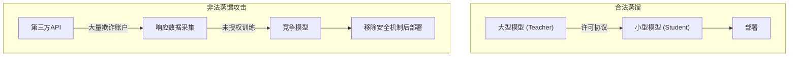
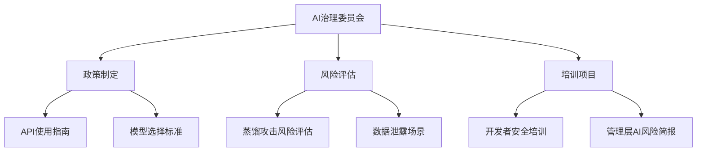

## 1600万次请求、24,000个虚假账户——究竟发生了什么

2026年2月，Anthropic公开了针对其Claude模型的大规模<strong>蒸馏攻击（distillation attack）</strong>。来自DeepSeek、Moonshot AI、MiniMax三家中国AI企业，利用约24,000个欺诈账户和商业代理服务，与Claude生成了<strong>超过1,600万次对话</strong>，并将这些数据用于训练自家模型。

各企业所针对的领域各不相同：

- <strong>DeepSeek</strong>：推理（reasoning）能力、评分标准评估、审查绕过查询（15万+次）
- <strong>Moonshot AI</strong>：智能体推理、工具使用、编程、计算机视觉（340万+次）
- <strong>MiniMax</strong>：智能体编程与工具使用能力（1,300万+次）

Anthropic表示，通过IP地址关联、请求元数据和基础设施指标，成功将各攻击活动归因至特定AI实验室。

## 什么是蒸馏攻击

<strong>模型蒸馏（model distillation）</strong>本身是一种合法的机器学习技术。它利用大型模型（Teacher）的输出来训练小型模型（Student），在正规许可下被广泛使用。

问题在于<strong>未经授权</strong>地执行这一操作时：



非法蒸馏的核心风险在于<strong>安全机制（safeguard）的丢失</strong>。原始模型内置的有害内容过滤、偏见防护机制等在蒸馏过程中被剥离，导致危险能力在缺乏保护措施的情况下扩散。

## EM/CTO视角下的威胁分析

### 对企业AI治理的影响

这一事件并非简单的企业间纠纷，而是对所有使用AI API的企业具有重要启示：

<strong>1. API使用数据的安全风险</strong>

企业通过AI API传输的数据——提示词、上下文、业务逻辑——可能面临外部泄露的风险，必须重新审视这一现实。蒸馏攻击者完全有可能通过类似的代理网络截获流量。

<strong>2. 供应商选择的安全评估标准变化</strong>

在选择AI供应商时，除了性能和成本之外，还需评估其<strong>蒸馏攻击防御能力</strong>：

- 行为分类器（behavioral classifier）的实施情况
- 异常使用模式检测系统
- 账户验证与身份认证强化程度
- 速率限制（rate limiting）的精细化水平

<strong>3. 开源模型的来源风险</strong>

通过非法蒸馏生成的模型一旦以开源形式发布，使用这些模型的企业也可能间接涉及IP侵权。验证模型的<strong>来源（provenance）</strong>变得至关重要。

### 国家安全层面的隐忧

Anthropic警告称，非法蒸馏的模型可能被投入军事、情报和监控系统。移除了安全机制的前沿AI模型可能被用于攻击性网络行动、虚假信息传播和大规模监控。

## 企业实战应对策略

### 第一阶段：重新审查AI API使用政策

```yaml
# AI API治理检查清单
安全策略:
  - 在向AI API发送敏感数据前建立分类体系
  - 构建PII/机密数据脱敏管道
  - 运营API调用日志与审计系统

供应商管理:
  - 评估AI供应商的蒸馏攻击防御能力
  - 审查服务条款中的数据使用条款
  - 定期进行供应商安全审计

模型来源管理:
  - 确认正在使用的开源模型的训练数据来源
  - 审查模型许可与IP政策
  - 将AI模型纳入SBOM（软件物料清单）
```

### 第二阶段：构建技术防御体系

从Anthropic公开的防御策略中可以学到的技术方法：

<strong>基于行为分析的检测</strong>

传统的防火墙、DLP、网络监控无法检测ML-API层的威胁。需要以下全新视角的监控手段：

- <strong>使用模式异常检测</strong>：大量系统化查询、异常时段使用、重复性模式
- <strong>账户集群分析</strong>：检测同一IP段、相似查询模式的账户群组
- <strong>指纹识别</strong>：在模型输出中嵌入可检测的水印

### 第三阶段：提升组织层面的AI素养



## 行业整体的应对方向

在此事件之后，AI行业出现了以下动向：

<strong>1. 行业全面协作加强</strong>

Anthropic正与OpenAI共同呼吁行业对蒸馏攻击进行整体性应对。单靠个别企业的防御远远不够，需要AI产业、云服务商和政策制定者的协同合作。

<strong>2. Microsoft的开放权重模型后门扫描器</strong>

Microsoft开发了一款用于检测开放权重AI模型后门的扫描器，可用于识别蒸馏模型中植入的恶意功能。

<strong>3. 监管框架的演进</strong>

伴随美国AI芯片出口管制的讨论，围绕AI模型IP保护的监管讨论也日趋活跃。

## 实战要点速查表

| 领域 | 措施 | 优先级 |
|------|------|--------|
| API安全 | 敏感数据分类与脱敏 | 立即 |
| 供应商管理 | 新增蒸馏防御能力评估 | 1个月内 |
| 模型管理 | 开源模型来源验证 | 每季度 |
| 组织 | 组建AI治理委员会 | 3个月内 |
| 培训 | 开发者AI安全培训 | 每半年 |
| 监控 | API使用异常检测系统 | 6个月内 |

## 结语——"信任但要验证"

AI模型蒸馏攻击动摇了AI产业的信任根基。作为EM或CTO，我们能做的事情很明确：

1. <strong>重新审查正在使用的AI API的安全策略</strong>
2. <strong>验证开源模型的来源</strong>
3. <strong>在组织内建立AI治理体系</strong>

AI技术的民主化值得欢迎，但绝不能以未经授权窃取他人知识产权的方式实现。"信任但要验证（Trust but verify）"的原则在AI时代依然适用。

## 参考资料

- [Anthropic官方公告：Detecting and Preventing Distillation Attacks](https://www.anthropic.com/news/detecting-and-preventing-distillation-attacks)
- [CNBC：Anthropic accuses DeepSeek, Moonshot and MiniMax of distillation attacks on Claude](https://www.cnbc.com/2026/02/24/anthropic-openai-china-firms-distillation-deepseek.html)
- [TechCrunch：Anthropic accuses Chinese AI labs of mining Claude](https://techcrunch.com/2026/02/23/anthropic-accuses-chinese-ai-labs-of-mining-claude-as-us-debates-ai-chip-exports/)
- [The Hacker News：Anthropic Says Chinese AI Firms Used 16 Million Claude Queries](https://thehackernews.com/2026/02/anthropic-says-chinese-ai-firms-used-16.html)
- [Google GTIG：AI Threat Tracker — Distillation and Adversarial AI Use](https://cloud.google.com/blog/topics/threat-intelligence/distillation-experimentation-integration-ai-adversarial-use)
