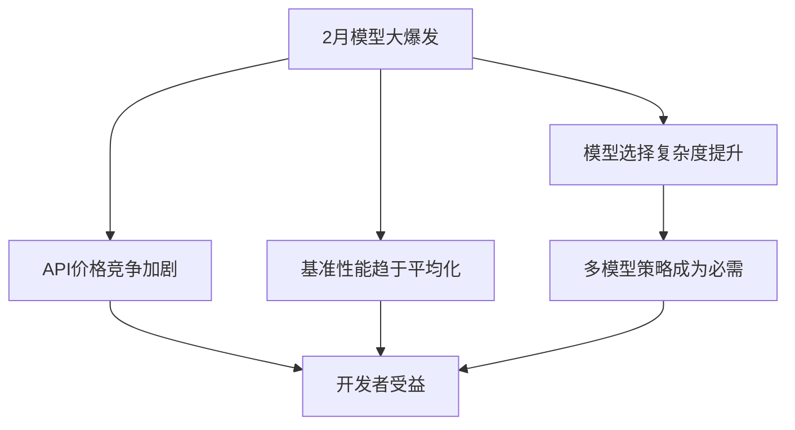

2026年2月，AI行业正在经历前所未有的事件。<strong>7个主要AI模型计划在同一个月内发布</strong>的消息传出后，整个行业已进入"模型大爆发（Model Rush）"状态。

## 2月预计发布模型一览

根据[Mark（@mark_k）的X帖子](https://x.com/mark_k/status/2020822166984372373)，以下7个模型预计将在2026年2月发布：

| 模型 | 开发方 | 备注 |
|------|--------|------|
| <strong>Gemini 3 Pro GA</strong> | Google DeepMind | Gemini 3 Pro正式发布（General Availability） |
| <strong>Sonnet 5</strong> | Anthropic | Claude Sonnet系列的下一版本 |
| <strong>GPT-5.3</strong> | OpenAI | GPT-5系列的小版本更新 |
| <strong>Qwen 3.5</strong> | 阿里云 | 开源阵营的领军者 |
| <strong>GLM 5</strong> | 智谱AI | 中国AI创业公司的下一代模型 |
| <strong>Deepseek v4</strong> | DeepSeek | 推理特化模型的新版本 |
| <strong>Grok 4.20</strong> | xAI | Elon Musk的xAI推出的最新模型 |

## 为什么集中在2月？

### 1. 年初发布季的全面展开

2月位于CES和MWC之间，是企业展示年度技术路线图的关键时期。2026年AI竞争极度白热化，各企业争相抢先占领市场。

### 2. 开源 vs 闭源的全面对决

本次发布潮的一大看点是<strong>开源模型（Qwen 3.5、DeepSeek v4）与闭源模型（Gemini、Sonnet、GPT）同时交锋</strong>。自2025年下半年以来，开源模型性能急剧提升，闭源阵营不得不以更快的更新周期应对。

### 3. 中国AI企业的崛起

GLM 5（智谱AI）、DeepSeek v4和Qwen 3.5——<strong>中国模型多达3个</strong>。这表明中美AI竞争已在模型层面全面展开。

## 各模型亮点

### Gemini 3 Pro GA — Google的全面反击

Gemini 3 Pro在预览阶段就凭借多模态性能和长上下文窗口备受关注。GA发布后，API稳定性和定价竞争力将成为焦点。

### Sonnet 5 — Anthropic的均衡策略

在Claude系列中，Sonnet承担着性能与成本的平衡角色。Sonnet 5将在编程、分析、创作等哪个领域实现差异化值得关注。

### GPT-5.3 — OpenAI的渐进式演进

GPT-5发布后持续推出小版本更新是OpenAI的策略。5.3有望在推理能力和工具调用（function calling）准确度方面取得提升。

### Qwen 3.5 — 开源新标杆

阿里云的Qwen在开源LLM中保持着最快的更新节奏。3.5版本预计将在多语言性能和编程能力方面实现大幅提升。

### GLM 5 — 智谱AI的全球化挑战

GLM系列已在中国国内建立了强大地位，GLM 5有望标志着智谱AI正式进军全球市场。

### DeepSeek v4 — 推理能力的终极形态

DeepSeek一直以推理（reasoning）特化模型著称。v4极有可能在数学、编程和逻辑推理基准测试中创下新纪录。

### Grok 4.20 — xAI的独特路线

xAI的Grok以实时信息访问和幽默的对话风格实现了差异化。4.20版本预计将重点强化企业级API能力。

## 对开发者的影响

### 1. API价格竞争的红利

7个模型同时竞争，API价格将进一步下降。特别是开源模型的自托管选项为成本节约提供了巨大帮助。

### 2. 多模型策略成为刚需

依赖单一模型的时代已经结束。按任务类型选择最优模型的<strong>模型路由（Model Routing）</strong>策略正变得越来越重要。

### 3. 超越基准的实战评估

模型越多，仅凭基准分数越难做出判断。构建适合自身使用场景的<strong>实战评估（Eval）流水线</strong>已成为必需。

## 未来展望

2026年2月的模型大爆发表明，AI行业竞争已进入全新阶段。随着模型间绝对性能差距的缩小，<strong>价格、速度、专业领域、生态系统</strong>将成为模型选择的核心标准。

作为开发者，我们的方向很明确：设计不锁定于任何单一模型的架构，构建能够灵活适应快速变化的模型生态系统的基础设施。

## 参考资料

- [Mark（@mark_k）— 2026年2月AI模型发布日程汇总](https://x.com/mark_k/status/2020822166984372373)
