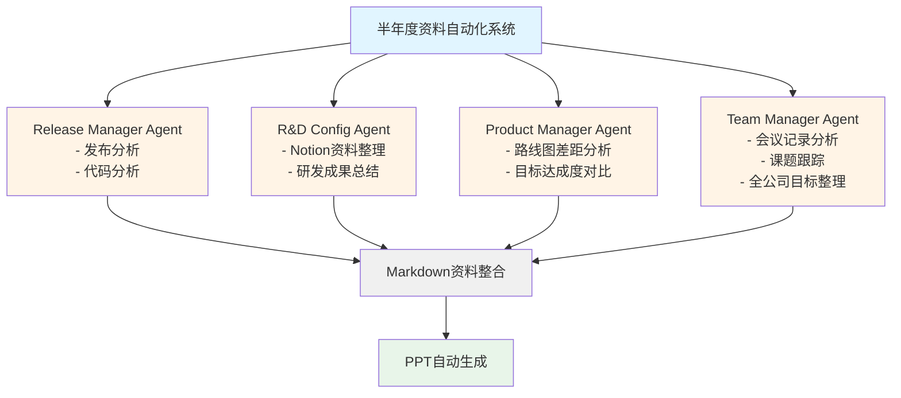

## 引言：60小时的痛苦

作为团队负责人，我每年需要两次在全体员工面前进行半年度成果汇报。这包括发布记录、研发成果、路线图执行情况、团队沟通状况等所有内容，都需要整理成PPT并进行演示。

<strong>传统流程总共需要60小时以上</strong>：
- 发布分析：4〜5小时
- 研发资料整理：20〜30小时
- 路线图审查：4〜5小时
- 会议记录分析：8〜10小时
- 全公司目标了解：2〜3小时
- PPT制作：20〜30小时
- 审查和改进：6〜11小时
- 演示练习：5〜10小时

但通过引入AI和自动化工具，<strong>我们将这个时间缩短到了约10小时</strong>。本文将分享如何实现这一革命性变化的实战流程。

## 可获得的效果

通过引入AI自动化系统，我们获得了以下效果：

### 1. 时间缩短：60小时 → 10小时
不仅仅是工作速度变快了。AI代替了重复且枯燥的数据收集工作，让我们能够专注于核心信息构建和故事讲述。

### 2. 防止数据遗漏
人工整理时容易遗漏部分发布内容或会议记录。AI代理（AI Agent）会无遗漏地收集指定期间的所有数据并系统化整理。

### 3. 删除不必要的内容
过去常常因为"可能需要"而包含所有内容，导致PPT增加到50〜60页。AI判断重要性并提取核心内容后，我们能够只专注于需要传达给高层的信息。

### 4. 有效的故事讲述
AI会自动将收集的数据按照"概览 → 以成果为中心的回顾 → 课题提取"的逻辑结构整理。基于此可以创建具有说服力的故事。

## 传统流程分析

首先详细了解一下传统的低效流程。

### 1. 发布说明和代码分析（4〜5小时）
通过查找Git历史和发布说明，手动提取半年期间部署的功能。如果提交信息不明确或发布说明不完善，就需要直接打开代码确认。

### 2. 研发资料整理（20〜30小时）
整理团队内进行的研发活动（新技术审查、POC、性能优化等）。需要找到并整合每个工程师编写的Notion文档、Slack对话、代码注释等所有内容。<strong>这是最耗时的阶段</strong>。

### 3. 开发路线图审查（4〜5小时）
比较年初制定的开发计划与实际完成情况。核心是进行差距分析，如"为什么完成了A功能而B功能延迟了？"

### 4. 会议记录分析（8〜10小时）
阅读每周团队会议、双周业务方会议等的会议记录，提取主要问题和决策事项。半年期间至少需要查看20〜30份会议记录。

### 5. 了解全公司/部门目标（2〜3小时）
整理我们团队的成果如何与全公司目标相关联。参考CEO演示资料或部门OKR文档。

### 6. PPT资料制作（20〜30小时）
基于收集的所有资料构建故事，设计幻灯片，制作图表和表格。<strong>这是第二耗时的阶段</strong>。

### 7. 审查和改进（6〜11小时）
接受同事或上级的审查，并根据反馈进行修改。通常需要2〜3次迭代。

### 8. 演示练习（5〜10小时）
根据演示时间（通常10〜15分钟）编写脚本，检查流程，并进行实际演示练习。

## 引入AI和生产力工具

在正式自动化之前，我们先在日常工作中引入了AI和生产力工具。

### 1. 使用Notion AI自动编写会议记录
利用[Notion AI的会议笔记功能](https://www.notion.so/help/guides/using-notions-meeting-notes-feature)，在会议中将语音实时转换为文本并进行总结。

<strong>效果</strong>：
- 会议后编写会议记录的时间为零
- 会议内容无遗漏
- 获得可检索的结构化数据

### 2. 使用Notion API MCP自动文档化
利用[Notion API MCP（Model Context Protocol，模型上下文协议）](https://modelcontextprotocol.io/introduction)，自动从代码库提取文档并整理到Notion。

<strong>自动化项目</strong>：
- 开发进度
- 发生的问题和解决方法
- 技术调查内容
- 规格说明和API文档

<strong>实现示例</strong>：
```typescript
// 通过Notion API MCP自动将代码注释转换为Notion页面
// 为代码添加特定标签后会自动文档化
/**
 * @notion-doc
 * @category: Infrastructure
 * @title: Redis缓存策略
 *
 * 使用Redis实现API响应缓存。
 * TTL设置：5分钟
 * 缓存键模式：api:{endpoint}:{params}
 */
export class CacheService {
  // ...
}
```

### 3. AI代码审查和基础设施故障排除
积极利用Claude Code、ChatGPT、Gemini等各种AI工具进行代码审查和基础设施问题解决。

<strong>效果</strong>：
- 缩短代码审查时间
- 提高错误日志分析速度
- 快速解决基础设施配置问题

## 基于AI代理的自动化系统

现在介绍核心的半年度资料生成自动化系统。4个专业AI代理并行工作，各自负责各自的领域。

### 整体架构



### 1. Release Manager Agent（发布管理代理）

<strong>职责</strong>：分析Git历史和发布说明，自动整理半年期间的所有部署记录

<strong>输入数据</strong>：
- Git commit history（特定日期范围）
- GitHub/GitLab Release Notes
- JIRA/Linear工单信息

<strong>输出格式</strong>：
```markdown
# 发布总结（2024-04 〜 2024-09）

## 主要功能发布
- [2024-04-15] 用户通知系统 v2.0
  - 实现实时推送通知
  - 通知设置自定义功能

- [2024-06-20] 支付系统改进
  - 集成Kakao Pay
  - 添加定期支付功能

## Bug修复和改进
- [2024-05-03] 登录速度提升40%
- [2024-07-12] 解决内存泄漏问题

## 统计
- 总部署次数：23次
- 主要功能：8个
- Bug修复：47项
```

<strong>实现提示</strong>：
利用Claude Code的MCP直接访问Git API，或使用GitHub Actions定期收集发布数据并保存到Notion。

### 2. R&D Configuration Agent（研发形态管理代理）

<strong>职责</strong>：自动分类和总结Notion中编写的研发相关资料

<strong>输入数据</strong>：
- Notion页面（特定数据库过滤）
- 技术调查文档
- POC结果报告
- 性能测量数据

<strong>输出格式</strong>：
```markdown
# 研发活动总结

## 新技术引入
### GraphQL引入审查（2024-04 〜 2024-05）
- <strong>目的</strong>：相比REST API提高网络效率
- <strong>结果</strong>：POC完成，计划在部分服务中逐步应用
- <strong>投入工时</strong>：120小时
- <strong>核心学习</strong>：Schema-first设计的重要性

## 性能优化
### 数据库查询优化（2024-06）
- <strong>问题</strong>：特定API响应时间超过3秒
- <strong>解决</strong>：添加索引并消除N+1查询
- <strong>成果</strong>：响应时间缩短至300ms（改善90%）
- <strong>投入工时</strong>：40小时

## 统计
- 研究主题：5个
- 总投入时间：280小时
- 实际应用：3个
```

<strong>实现提示</strong>：
通过Notion API过滤特定期间的页面，让AI总结每个页面的核心内容。通过标签或属性自动分类。

### 3. Product Manager Agent（产品经理代理）

<strong>职责</strong>：分析路线图与实际达成度，识别目标与实际的差距

<strong>输入数据</strong>：
- 年初产品路线图（Excel/Notion/JIRA）
- Release Manager的发布数据
- R&D Agent的研发数据

<strong>输出格式</strong>：
```markdown
# 路线图达成度分析

## 计划与实绩对比
### 已完成功能（达成80%）
✅ 用户通知系统 v2.0（计划：Q2，完成：Q2）
✅ 支付系统改进（计划：Q2，完成：Q2）
✅ 管理员仪表板 v3（计划：Q3，完成：Q3）

### 延迟功能（20%）
⚠️ 多语言支持（计划：Q3，预计：Q4）
- <strong>延迟原因</strong>：翻译资源不足，外部翻译公司合同延迟
- <strong>应对方案</strong>：Q4提升优先级

## 差距分析
### 计划外但添加的工作
- Kakao Pay集成（因业务需求紧急添加）
- 数据库迁移（因性能问题不可避免）

### 影响分析
由于额外工作，多语言支持日程延迟1个月。
```

<strong>实现提示</strong>：
Product Manager Agent接收Release Manager和R&D Agent的结果作为输入，与路线图Excel进行比较。利用Claude的结构化输出以JSON格式生成差距分析结果。

### 4. Team Manager Agent（团队管理代理）

<strong>职责</strong>：分析AI会议记录，整理课题进展和全公司目标

<strong>输入数据</strong>：
- Notion AI会议记录（半年期间所有会议）
- 全公司OKR文档
- 部门目标文档

<strong>输出格式</strong>：
```markdown
# 团队沟通及目标对齐

## 主要会议主题分析
### 1. 与业务方协作（10次会议）
- <strong>主要议程</strong>：新功能优先级调整、Bug问题应对
- <strong>决策</strong>：紧急添加Kakao Pay集成（CEO批准）

### 2. 团队内部会议（24次会议）
- <strong>主要议程</strong>：技术栈改进、代码审查流程改进
- <strong>行动项完成率</strong>：85%（34/40项）

## 对全公司目标的贡献度
### 2024全公司目标："用户体验创新"
- <strong>我们团队的贡献</strong>：
  - 通知系统改版使用户重访率提高15%
  - 支付流程简化使转化率提升8%

### 部门目标："开发生产力提高20%"
- <strong>我们团队达成度</strong>：
  - 通过引入AI工具缩短代码审查时间30%
  - 通过CI/CD改进使部署频率增加2倍
```

<strong>实现提示</strong>：
Notion AI会议记录已经结构化，编写简单脚本提取特定关键词（行动项、决策、问题等）。AI将其与全公司目标文档匹配，自动计算贡献度。

## PPT自动生成流程

4个代理的工作完成后，所有资料都保存为Markdown文件。现在由Product Manager Agent生成最终PPT。

### Step 1：生成结构化Markdown

对Product Manager Agent下达如下指示：

```
利用以下资料，按照[概览 → 以成果为中心的回顾 → 课题提取]
结构生成各幻灯片的Markdown：

- release_summary.md
- rnd_summary.md
- roadmap_gap_analysis.md
- team_communication.md

各部分遵循以下原则：
1. 每张幻灯片只包含1〜2个核心信息
2. 高层能在3秒内理解的简洁表达
3. 用数字和数据支撑
4. 积极利用可视化（图表、表格）
```

<strong>输出示例</strong>：
```markdown
# Slide 1: 概览
## 2024上半年开发团队成果总结
- ✅ 发布8个主要功能（相对计划100%）
- ✅ 研发投资280小时，应用3项技术
- ⚠️ 多语言支持延迟1个月（预计Q4完成）

---

# Slide 2: 发布成果
## 以用户体验改进为中心的开发
| 功能 | 发布日期 | 业务影响 |
|------|--------|----------|
| 通知系统 v2.0 | 2024-04 | 重访率 +15% |
| 支付系统改进 | 2024-06 | 转化率 +8% |
| 管理员仪表板 v3 | 2024-09 | 运营效率 +25% |

---

# Slide 3: 研发活动
## 技术债务解决和未来准备
- <strong>GraphQL引入</strong>：提高API效率，Q4逐步应用
- <strong>数据库查询优化</strong>：响应时间改善90%（3秒 → 300ms）
- <strong>CI/CD改进</strong>：部署频率增加2倍，故障减少
```

### Step 2：AI审查和改进

将生成的草稿分别附加到Claude、Gemini、ChatGPT，请求审查：

```
附加的Markdown资料是半年度高层报告用PPT草稿。
请从以下角度提出改进建议：

1. 信息是否明确？（从高层角度）
2. 逻辑流程是否自然？
3. 是否有不必要或重复的内容？
4. 数字和数据是否具有说服力？
5. 是否有适合可视化表达的内容？
```

<strong>各AI的反馈示例</strong>：
- <strong>Claude</strong>："Slide 2的业务影响定量表达得很好。但Slide 3的研发活动技术术语较多，非技术高层可能难以理解。与其说'性能改善90%'，不如说'用户等待时间缩短至十分之一'更直观。"
- <strong>Gemini</strong>："在概览中提到延迟的功能很好，但如果同时提出解决方案会更积极。"
- <strong>ChatGPT</strong>："建议在Slide 3添加图表。例如：研发投资时间 vs 业务影响相关性"

### Step 3：手动检查和修改

参考AI反馈，直接修正错误或上下文不当的内容。特别是敏感的数字或业务数据必须进行验证。

### Step 4：PowerPoint生成

利用Claude Code的"Create File"功能将Markdown转换为PowerPoint：

```
基于修改后的Markdown文件生成PowerPoint文件（.pptx）。

要求：
- 模板：使用公司标准模板（template.pptx）
- 字体：Microsoft YaHei，标题28pt，正文18pt
- 颜色：公司品牌色（#1E40AF主色，#F59E0B强调色）
- 表格和图表优先考虑可读性
- 动画：最小化（仅fade-in程度）
```

或者可以使用Python库（`python-pptx`）以编程方式生成：

```python
from pptx import Presentation
from pptx.util import Inches, Pt

prs = Presentation('template.pptx')

# 添加幻灯片
slide_layout = prs.slide_layouts[1]  # Title and Content
slide = prs.slides.add_slide(slide_layout)

# 添加标题
title = slide.shapes.title
title.text = "2024上半年开发团队成果总结"

# 添加正文
content = slide.placeholders[1]
tf = content.text_frame
tf.text = "✅ 发布8个主要功能（相对计划100%）"
# ...

prs.save('presentation.pptx')
```

### Step 5：生成演示脚本

最后让AI编写10分钟的演示脚本：

```
请为附加的PPT编写10分钟的演示脚本。

- 听众：高层（CEO、CFO、各部门负责人）
- 语气：自信但谦逊
- 结构：引言（1分钟）→ 正文（7分钟）→ 结论（2分钟）
- 详细编写每张幻灯片要说的内容
- 包含预期问题和答复
```

<strong>输出示例</strong>：
```markdown
## 幻灯片1：引言（30秒）
"各位领导好，我是开发团队负责人张三。今天我将向大家汇报2024年上半年
开发团队的成果和下半年计划。"

（指向幻灯片）
"一目了然，我们完成了计划的8个主要功能的发布，
为引入新技术的研发也投资了280小时。"

## 幻灯片2：发布成果（2分钟）
"首先是发布成果。今年上半年，我们围绕'用户体验创新'这一
全公司目标，推出了三个核心功能。"

（指向表格）
"特别是4月推出的通知系统v2.0使用户重访率提高了15%，
6月的支付系统改进使转化率提升了8%..."

## 预期问题
问："多语言支持延迟的原因是什么？"
答："与外部翻译公司的合同延迟超出预期，加上紧急添加Kakao Pay集成
导致资源分散。但我们已将其设为下半年最优先课题，
计划在Q4必须完成。"
```

## 最终结果和效果

### 时间投入对比

| 阶段 | 传统（手工） | AI自动化 | 节省率 |
|------|-------------|---------|--------|
| 数据收集 | 18〜23小时 | 2小时 | <strong>90%</strong> |
| 资料整理 | 20〜30小时 | 1小时 | <strong>96%</strong> |
| PPT制作 | 20〜30小时 | 4小时 | <strong>85%</strong> |
| 审查和改进 | 6〜11小时 | 2小时 | <strong>75%</strong> |
| 演示练习 | 5〜10小时 | 1小时 | <strong>87%</strong> |
| <strong>合计</strong> | <strong>60+ 小时</strong> | <strong>~10小时</strong> | <strong>83%</strong> |

### 定性效果

<strong>1. 工作满意度提高</strong>
从重复的数据收集工作中解放出来，能够专注于创意性的故事讲述。

<strong>2. 可信度提高</strong>
得益于AI系统化整理的数据，减少了"这个数字正确吗？"之类的问题。

<strong>3. 构建可重用系统</strong>
一旦构建的代理系统可以在下个半年、明年继续使用。改进也很容易。

<strong>4. 提高整个团队的生产力</strong>
随着团队整体利用Notion AI会议记录、自动文档化等构建的基础设施，其他工作的效率也一起提高了。

## 构建时注意事项

### 1. 数据质量是核心
"垃圾进，垃圾出。"AI完全依赖于输入数据的质量。如果Notion文档不完善，或Git提交信息不明确，AI也无法正确整理。

<strong>解决方案</strong>：平时在团队中建立文档化和提交信息编写规则。

### 2. AI需要验证
AI生成的内容必须由人审查。特别是数字、日期、因果关系可能出错。

<strong>解决方案</strong>：绝不省略Step 3（手动检查）。

### 3. 初始构建成本
首次构建代理系统需要试错。第一次的半年度报告可能反而花费更多时间。

<strong>解决方案</strong>：从长远角度投资。从第二次开始，10小时确实足够。

### 4. 安全和敏感信息
向AI输入公司内部数据时必须遵守安全政策。

<strong>解决方案</strong>：使用本地部署LLM（如Llama、GPT-4 Azure Enterprise），或对敏感信息进行脱敏处理。

## 扩展性

该系统除了半年度报告外，还可以多样化应用：

- <strong>月度团队报告</strong>：只需将代理输入期间调整为1个月
- <strong>项目回顾</strong>：只过滤特定项目的时间线和数据
- <strong>年度绩效评估</strong>：综合1年的数据生成个人/团队评估资料
- <strong>对外演示资料</strong>：也可转换为会议或招聘说明会用资料

## 结论：AI是工具，核心是流程

AI自动化的核心不是技术本身，而是<strong>流程设计</strong>。
- 需要什么数据？
- 按什么顺序整理？
- 最终产出物的形式是什么？

首先回答这些问题后，AI应该作为执行该流程的"工具"来利用。

将60小时缩短到10小时，不是单纯使用了"快速工具"，而是因为<strong>将重复工作系统化</strong>了。AI只是实现该系统的最佳手段。

如果您的工作中也有这种重复且耗时的任务，建议尝试一次AI自动化。虽然首次尝试会有困难，但一旦系统构建完成，其效果将超出想象。

---

<strong>下篇预告</strong>：[AI代理系统构建实战指南：用Notion API MCP和Claude Code创建自动化流水线](/zh/blog/zh/ai-agent-notion-mcp-automation)

如有疑问或想了解更多内容，请在评论中留言！
