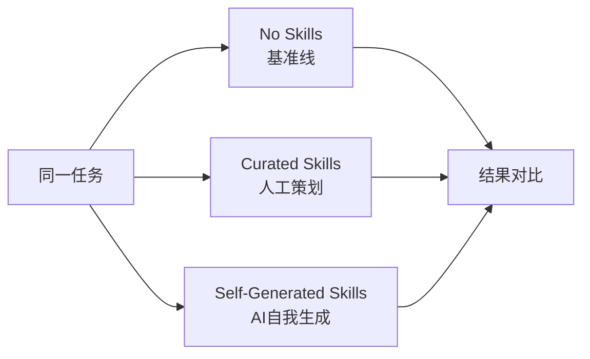

## 概述

"AI创造更好的AI"——self-play、self-improvement范式是AI行业最具吸引力的叙事之一。然而，最新研究<strong>SkillsBench</strong>（arXiv:2602.12670）正面反驳了这一神话。

在11个领域、86个任务、7种代理模型配置、<strong>7,308条轨迹</strong>的大规模实验中：

- 人工策划的技能：平均<strong>+16.2pp</strong>性能提升
- AI自我生成的技能：<strong>零效果（0pp）</strong>

换言之，<strong>LLM无法可靠地编写它们消费后能受益的程序性知识</strong>。

## 什么是Agent Skill

研究中定义的<strong>Agent Skill</strong>是在推理时注入LLM代理的结构化程序性知识包。

```
Skills包结构
├── SKILL.md          # 程序指南（工作流、SOP）
├── scripts/          # 可执行脚本
├── templates/        # 代码模板
└── examples/         # 参考示例
```

与现有方法的核心区别：

| 类型 | System Prompt | RAG | Few-shot | <strong>Skills</strong> |
|------|--------------|-----|----------|---------|
| 结构化 | ✗ | ✗ | ✗ | <strong>✓</strong> |
| 程序性 | △ | ✗ | ✗ | <strong>✓</strong> |
| 可执行资源 | ✗ | ✗ | ✗ | <strong>✓</strong> |
| 可移植性 | ✗ | △ | △ | <strong>✓</strong> |

Claude Code的`CLAUDE.md`、Gemini CLI、Codex CLI等最新代理工具已采用此Skills概念。

## 实验设计：3种条件对比

SkillsBench在3种条件下评估同一任务：



<strong>实验规模：</strong>
- 11个领域（软件工程、数据分析、医疗保健等）
- 86个任务（105位贡献者从322个候选中筛选）
- 7种代理模型配置（Claude Code、Gemini CLI、Codex CLI）
- <strong>7,308条轨迹</strong>（全量评估）

所有评估均使用确定性验证器（deterministic verifier）判定pass/fail，消除了LLM-as-judge的偏差。

## 核心发现1：策划技能是有效的

人工策划的技能显示平均<strong>+16.2pp</strong>的性能提升。但领域间差异极大：

| 领域 | 性能提升 |
|------|---------|
| 医疗保健 | <strong>+51.9pp</strong> |
| 数据分析 | 较高提升 |
| 软件工程 | <strong>+4.5pp</strong> |
| 部分任务（16/84） | <strong>负值</strong> |

<strong>84个任务中有16个任务的技能反而降低了性能</strong>，这一点至关重要。技能并非万能。

## 核心发现2：自我生成技能毫无意义

这是本研究最令人震惊的结果。

当让LLM"自己编写技能来更好地执行此任务"，然后使用这些技能时：

> <strong>"Self-generated Skills provide no benefit on average, showing that models cannot reliably author the procedural knowledge they benefit from consuming."</strong>

自我生成技能的平均效果为<strong>0pp</strong>。某些情况下甚至有害。


这是对<strong>self-play/self-improvement万能论</strong>的有力反证。模型擅长<strong>消费</strong>外部提供的程序性知识，但缺乏<strong>生产</strong>有用程序性知识的能力。

## 核心发现3：少即是多

另一个重要发现涉及技能的规模：

> <strong>由2-3个模块组成的集中技能比综合文档更有效</strong>

小而精的技能包比庞大的手册更能提升性能。这可能与LLM的上下文窗口利用效率有关。

此外，<strong>小模型 + 技能 ≈ 大模型（无技能）</strong>的结果也值得关注。配备适当技能的小型模型可以匹敌大型模型的基准性能。

## 实践启示

这项研究对使用AI代理的从业者传达了明确信息：

<strong>1. 重新审视技能自动生成流程</strong>

"AI生成并改进自己的技能"这一方法在当前阶段无效。人类专家的策划仍然不可或缺。

<strong>2. 技能要小而集中</strong>

2-3个模块的核心技能比庞大的文档集更有效。简洁地编写`CLAUDE.md`聚焦核心工作流比写数百行要好。

<strong>3. 认识领域间的效果差异</strong>

医疗保健（+51.9pp）和软件工程（+4.5pp）之间的差距超过10倍。在模型已经擅长的领域，技能的边际效用较低。

<strong>4. 认识到技能可能有害</strong>

84个任务中有16个任务的技能降低了性能。错误的技能还不如没有技能。

## 技术分析：为什么自我生成会失败

论文未直接提供原因分析，但可以推断以下结构性原因：

<strong>元认知的局限</strong>：LLM无法准确评估"自己不知道什么"。它们缺乏诊断自身需要哪些程序性知识的能力。

<strong>通用知识 vs 程序性知识</strong>：LLM的预训练数据偏向声明性（declarative）知识。它们学习"是什么"比"怎么做"更好。

<strong>不可验证性</strong>：模型无法验证自我生成技能的质量。策划技能经过了人类专家的验证。

## 结论

SkillsBench作为首个AI代理技能系统性基准测试，<strong>为"AI自我改进"这一诱人叙事提供了冷静的数据</strong>。

核心信息很简单：

- ✅ 人工创建的技能有效（+16.2pp）
- ❌ AI创建的技能无效（0pp）
- ✅ 小而集中的技能优于庞大文档
- ✅ 小模型 + 好技能 ≈ 大模型

self-improvement的梦想很诱人，但当前的LLM尚未达到那个水平。<strong>人类的领域专业知识和策划仍然不可替代</strong>。

## 参考资料

- [SkillsBench: Benchmarking How Well Agent Skills Work Across Diverse Tasks](https://arxiv.org/abs/2602.12670) — Xiangyi Li et al., 2026
- [Anthropic Claude Code Skills Documentation](https://docs.anthropic.com/en/docs/agents-and-tools/claude-code/skills)
- [Harbor Framework](https://github.com/harbor-ai/harbor) — 代理基准测试框架
