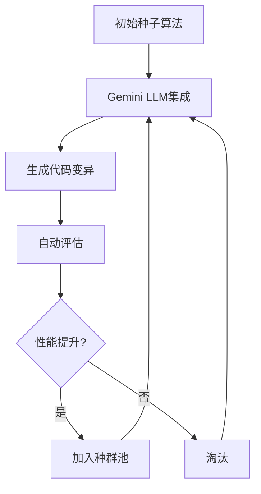
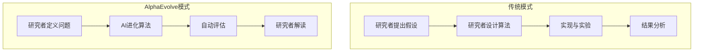
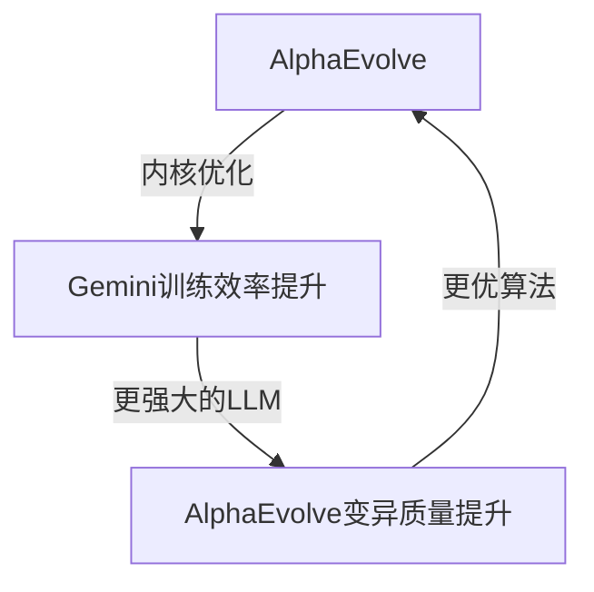

## 引言

2026年3月10日，Google DeepMind团队在arXiv上发表的论文"Reinforced Generation of Combinatorial Structures: Ramsey Numbers"悄然树立了一座意义深远的里程碑。<strong>名为AlphaEvolve的单一元算法同时刷新了5项经典Ramsey数下界</strong>，其中部分记录已保持长达20年之久。

AI编写代码、修复Bug、审查PR已是日常。然而AI<strong>发现数学家数十年未能攻克的问题的全新解</strong>，则是完全不同层次的突破。本文将梳理AlphaEvolve的工作机制、Ramsey数突破的意义，以及这一成果对工程组织的启示。

## 什么是Ramsey数

Ramsey理论是组合数学的一个分支，研究的核心原理是"在足够大的结构中，必然出现规则性的子结构"。

<strong>Ramsey数 R(s, t)</strong> 是满足以下条件的最小整数 n：

> 当n个人聚在一起时，必然存在一个彼此全部认识的s人组，或者一个彼此全部不认识的t人组。

用图论的语言来表述：将n个顶点的完全图的边用红/蓝两色着色时，必然出现红色完全子图 K_s 或蓝色完全子图 K_t 的最小 n 值。

求Ramsey数的精确值被公认为<strong>组合数学中最困难的问题之一</strong>。著名数学家Paul Erdos曾这样说道：

> "如果外星人威胁要毁灭地球并要求我们给出R(5,5)的值，我们应该动员所有的计算机和数学家去寻找答案。但如果他们要求的是R(6,6)，那我们还不如直接向外星人发起进攻。"

## AlphaEvolve取得的成果

AlphaEvolve此次刷新了5项Ramsey数下界（lower bound）：

| Ramsey数 | 原下界 | 新下界 | 记录保持时间 |
|-----------|----------|------------|--------------|
| R(3, 13) | 60 | <strong>61</strong> | 11年 |
| R(3, 18) | 99 | <strong>100</strong> | 20年 |
| R(4, 13) | 138 | <strong>139</strong> | 11年 |
| R(4, 14) | 147 | <strong>148</strong> | 11年 |
| R(4, 15) | 158 | <strong>159</strong> | 6年 |

虽然看上去只是将下界各提升了1，但在Ramsey数研究领域，这样的进展<strong>对单篇论文而言极为罕见</strong>。以往改进一个Ramsey数下界通常需要数年的研究投入。

更值得关注的是，AlphaEvolve对所有已知精确值的Ramsey数也成功复现了相应的下界，这充分验证了系统的可靠性。

## AlphaEvolve的工作原理

AlphaEvolve是Google DeepMind开发的<strong>进化式编码智能体（evolutionary coding agent）</strong>。其核心思想是"不直接求解问题，而是进化出求解问题的算法"。

### 第一步：初始化

定义问题规格、评估逻辑和种子程序（初始算法）。种子程序即使不是最优的，也必须能够求解问题的基础代码。

### 第二步：变异（Mutation）

Gemini模型集成分析当前代码并生成变异版本：

- <strong>Gemini Flash</strong>：以快速迭代探索多样化创意（搜索广度）
- <strong>Gemini Pro</strong>：通过深入分析提出高质量改进方案（搜索深度）

这种集成方法是关键所在。Flash在广阔空间中探索的同时，Pro负责创造突破。

### 第三步：进化（Evolution）

进化算法从种群池（population space）中选择有前景的变异体，将它们组合作为下一代的起点。

### 第四步：评估与迭代

自动化评估指标定量衡量每个候选程序的正确性和质量。结果反馈给LLM，生成下一轮改进的解决方案。

这一循环递归式地反复执行，使初始的简单种子代码<strong>进化为最先进（state-of-the-art）的算法</strong>。

## 元算法的意义

此次Ramsey数研究中最令人惊叹的发现是，分析AlphaEvolve独立发明的算法后发现，<strong>它重新发现了人类数学家此前手工开发的技术</strong>。

具体包括：

- <strong>Paley图</strong>构造方法
- <strong>二次剩余（Quadratic Residue）图</strong>构造法
- 其他代数图论技术

AI并非"学习"了这些数学构造法，而是在进化搜索过程中<strong>独立重新发现</strong>了它们。这表明AlphaEvolve的元算法方法不仅仅是简单的模式匹配，更能捕捉到根本性的数学结构。

## 与现有AI研究工具的差异

在AlphaEvolve之前，AI已有为科学研究做出贡献的先例。但方法论上存在重要差异：

| 系统 | 方法 | 特点 |
|--------|---------|------|
| AlphaFold | 蛋白质结构预测 | 针对特定领域的专用模型 |
| GPT-5.2 | 理论物理推理 | 利用大型模型的推理能力 |
| AlphaEvolve | 自动算法发现 | <strong>领域无关的元算法</strong> |

AlphaEvolve的核心差异化在于<strong>通用性</strong>。不仅限于Ramsey数：

- 优化Gemini训练中的矩阵乘法内核，性能提升23%，整体训练时间减少1%
- 在50多个公开数学问题中，约20%超越了现有最优解
- 应用于Kissing Number问题等多种组合数学问题

<strong>单一系统在数学、优化、工程全领域</strong>均取得突破性成果，这一点尤为值得关注。

## CTO/EM应当关注的要点

### 1. AI研发流程的变革

AlphaEvolve的案例表明，AI正<strong>从"工具"进化为"研究伙伴"</strong>。这对研发组织运营提出了结构性变革的要求：

研究者的角色正从"算法设计者"转变为<strong>"问题定义者 + 结果解读者"</strong>。

### 2. 工程优化的应用前景

AlphaEvolve已在Google内部投入生产优化使用：

- <strong>矩阵乘法内核优化</strong>：Gemini训练速度提升23%
- <strong>数据中心调度</strong>：资源分配算法改进
- <strong>编译器优化</strong>：自动代码优化搜索

工程团队可立即应用的领域：

- 性能关键型算法的自动优化
- A/B测试策略的进化式改进
- 基础设施成本优化算法探索

### 3. "AI优化AI"的反馈循环

AlphaEvolve改进Gemini的训练效率，改进后的Gemini又提升AlphaEvolve的性能——这一结构是<strong>自强化循环（self-reinforcing loop）</strong>的初级形态：

随着这一循环的加速，AI能力的发展速度可能呈非线性增长。作为CTO，持续监控这一趋势并在自身系统中设计类似的自动优化流水线至关重要。

### 4. 人才战略的再思考

随着AI在算法设计和优化方面日益精进，工程团队所需能力的重心正在转移：

- <strong>问题定义能力</strong>：提出正确问题的能力
- <strong>评估设计能力</strong>：设计验证AI生成结果的评估指标
- <strong>结果解读能力</strong>：理解AI发现的解决方案含义的领域知识
- <strong>AI系统编排能力</strong>：协调多个AI智能体的能力

## 未来展望

AlphaEvolve的Ramsey数突破仅仅是开始。截至2026年，AI对科学研究的影响正在加速：

- <strong>2025年5月</strong>：AlphaEvolve首次公开（矩阵乘法优化）
- <strong>2025年12月</strong>：通过Google Cloud实现AlphaEvolve服务化
- <strong>2026年3月</strong>：同时刷新5项Ramsey数

随着AlphaEvolve通过Google Cloud开放访问，不仅大企业，初创公司和研究机构也获得了使用这一工具的机会。

## 结语

AlphaEvolve的Ramsey数突破不仅仅是一项数学成就。它是<strong>AI在人类智识活动中承担越来越深层角色</strong>的里程碑。

作为工程管理者，我们需要做好以下准备：

1. 将<strong>问题定义能力</strong>培养为组织的核心竞争力
2. 将<strong>自动评估流水线</strong>整合到技术栈中
3. 建立将AI定位为<strong>"研究/优化伙伴"</strong>而非"工具"的组织文化
4. 在工程流程中实验性引入<strong>进化式方法</strong>

编写代码的AI已然普及。如今，<strong>发明算法的AI</strong>时代正在开启。

## 参考资料

- [Reinforced Generation of Combinatorial Structures: Ramsey Numbers (arXiv)](https://arxiv.org/abs/2603.09172)
- [AlphaEvolve: A Gemini-powered coding agent for designing advanced algorithms (Google DeepMind)](https://deepmind.google/blog/alphaevolve-a-gemini-powered-coding-agent-for-designing-advanced-algorithms/)
- [AI as a research partner: Advancing theoretical computer science with AlphaEvolve (Google Research)](https://research.google/blog/ai-as-a-research-partner-advancing-theoretical-computer-science-with-alphaevolve/)
- [AlphaEvolve on Google Cloud](https://cloud.google.com/blog/products/ai-machine-learning/alphaevolve-on-google-cloud)
