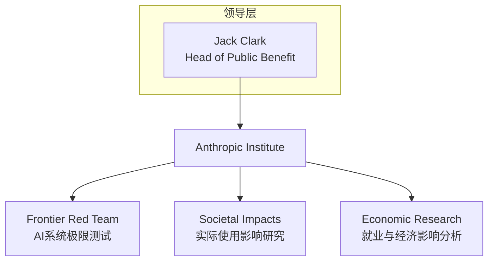
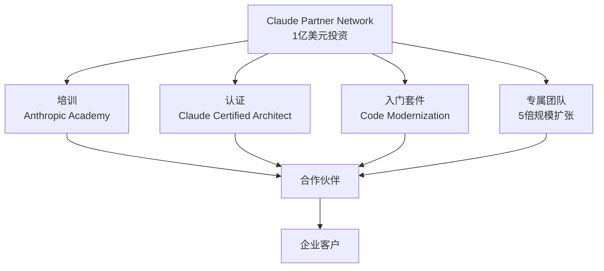

2026年3月11日和12日，Anthropic连续两天发布了重大公告。第一项是成立研究AI社会影响的<strong>Anthropic Institute</strong>，第二项是为构建企业合作伙伴生态系统而进行的<strong>1亿美元规模Claude Partner Network</strong>投资。

这两项公告绝非简单的新项目发布。这是Anthropic正在从"模型公司"向"AI平台生态系统企业"转型的明确信号。本文将从CTO和VPoE的视角分析其深层含义。

## Anthropic Institute——为什么需要AI研究所

### 三个团队的整合

Anthropic Institute是将此前分散运作的三个研究团队整合为一个组织。



<strong>Frontier Red Team</strong>是对AI系统极限能力进行压力测试的团队。近期的代表性项目是利用Claude在Firefox代码库中自主发现22个CVE（安全漏洞）。不仅仅是发现漏洞，还测试了AI能否自主利用这些漏洞进行攻击。该项目的技术细节请参阅[Claude在Firefox中发现22个CVE — AI安全审计的新范式](/zh/blog/zh/claude-firefox-22-cves-ai-security-audit)。

<strong>Societal Impacts</strong>团队负责开展AI在现实世界中实际使用情况的实地研究。<strong>Economic Research</strong>团队则跟踪AI对就业市场和宏观经济的影响。

### 为什么模型公司要建立研究所

随着AI模型性能的急剧提升，模型开发商自身研究"这项技术对社会产生什么影响"的必要性日益增大。Anthropic Institute的成立传递了三个信息：

1. <strong>先发制人的监管应对策略</strong>：在外部监管到来之前，以自有研究数据参与政策讨论。事实上，Anthropic计划今年春季在华盛顿特区开设Public Policy团队办公室。

2. <strong>建立企业信任</strong>：向大型企业客户发出"我们不仅销售模型，还对模型产生的影响负责"的信号。

3. <strong>人才吸引</strong>：将机器学习工程师、经济学家、社会科学家、网络安全专家汇聚到同一个组织中，意味着在AI安全人才市场上具备竞争力。

## Claude Partner Network——1亿美元的生态系统投资

### 项目架构

如果说Anthropic Institute代表"研究"，那么Claude Partner Network就代表"执行"。这笔1亿美元的投资专注于构建加速企业AI落地的合作伙伴生态系统。



<strong>目标合作伙伴</strong>包括管理咨询公司、SI（系统集成）企业和AI专业服务企业。虽然与AWS或Azure的合作伙伴项目结构类似，但由AI模型厂商直接运营这一点是其差异化所在。

### Claude Certified Architect——AI厂商首个技术认证

此次发布中最值得关注的是<strong>Claude Certified Architect, Foundations</strong>认证项目。这是面向使用Claude设计生产级应用的解决方案架构师的技术考试。

正如AWS Solutions Architect或Google Cloud Professional Architect一样，AI平台厂商也开始建立自己的认证体系。2026年下半年还将推出面向销售、架构师和开发者的额外认证。

其含义非常明确：

- <strong>人才市场的结构性变化</strong>："Claude专家"将成为一条独立的职业发展路径
- <strong>组织能力证明</strong>：合作伙伴有了向客户证明专业能力的官方渠道
- <strong>厂商锁定加深</strong>：认证生态系统是提高迁移成本的最强大工具

### Code Modernization Starter Kit

另一个核心要素是<strong>Code Modernization Starter Kit</strong>。它为合作伙伴提供了遗留代码库迁移和技术债务清理的标准化起点。

Anthropic自身也表示这是"需求最高的企业工作负载"。这反映了其判断：Claude的智能体编程能力在这一领域最能直接转化为客户成果。有关利用Claude构建智能体编程工作流的模式，请参阅[Claude Code智能体工作流模式5种](/zh/blog/zh/claude-code-agentic-workflow-patterns-5-types)。

## CTO必须关注的三个信号

### 信号1：AI厂商评估标准的变化

2024〜2025年，AI厂商评估主要集中在基准测试性能上。"SWE-bench得分多少"、"是否在编程基准测试中排名第一"是主要的评判标准。

从2026年开始，需要提出不同的问题：

| 过去的问题 | 2026年的问题 |
|---|---|
| 模型性能基准 | 合作伙伴生态系统规模与成熟度 |
| API定价 | 落地支持体系（培训、认证、专属团队） |
| 上下文窗口大小 | 监管应对及安全研究投入 |
| 推理速度 | 遗留系统现代化工具及Starter Kit |

各厂商的模型性能正在趋同。差异化来自生态系统。

### 信号2：安全研究成为销售利器

Anthropic Institute的Frontier Red Team在Firefox中发现CVE，既是纯粹的研究成果，同时也是有力的企业销售信息："我们的模型可以在您的代码库中发现安全漏洞。"

这表明AI安全研究不仅仅是成本中心，更可以成为直接贡献营收的资产。CTO应当重新评估厂商的安全投入——不是将其视为"道德装饰"，而是"技术能力的证明"。

### 信号3：AI认证生态系统的开端

正如AWS认证从结构上改变了云计算人才市场，AI厂商认证也有可能产生同样的效果。区别在于速度。如果云计算认证生态系统用了5〜7年才成熟，那么AI认证在已验证的模式之上可以更快地扩散。

对工程管理者而言，这意味着两件事：

1. <strong>团队成员的成长路径</strong>：Claude Certified Architect可以成为团队成员的职业里程碑
2. <strong>招聘标准</strong>：不久后"持有Claude认证"将出现在招聘公告的优先条件中

## 竞争对手定位对比

推进生态系统战略的不只有Anthropic。让我们比较一下三大AI厂商的近期动向。

| 领域 | Anthropic | OpenAI | Google |
|---|---|---|---|
| 研究机构 | Anthropic Institute | — | DeepMind（既有） |
| 合作伙伴项目 | Claude Partner Network（1亿美元） | Frontier Program | Google Cloud AI Partner |
| 安全策略 | Frontier Red Team（内部） | 收购Promptfoo（外部） | Project Zero（既有） |
| 协议标准 | MCP（Linux Foundation） | Open Responses API | A2A协议 |
| 认证项目 | Claude Certified Architect | — | Google Cloud AI认证 |

<strong>Anthropic</strong>采取"安全 + 生态系统"双轨战略。
<strong>OpenAI</strong>通过收购Promptfoo将安全能力吸纳为产品功能。
<strong>Google</strong>在既有云合作伙伴生态系统之上叠加AI能力。

## 实战：工程团队现在该做什么

### 1. 评估Claude Certified Architect准备情况

建议团队中的解决方案架构师或Tech Lead中选1〜2人率先考取认证。

```bash
# 访问Anthropic Academy（注册合作伙伴后）
# 在Partner Portal中查看培训资料
# 准备Claude Certified Architect, Foundations考试
```

### 2. 评估加入Partner Network（关于在合作伙伴生态系统中扩展Claude智能体能力，请参阅[Anthropic Agent Skills标准：AI智能体能力扩展](/zh/blog/zh/anthropic-agent-skills-standard)）

会员资格是免费的。加入后可获得：
- Anthropic Academy培训资料
- 销售资源及联合营销文档
- 专属Applied AI工程师支持
- Code Modernization Starter Kit

### 3. 更新厂商评估框架

```yaml
# AI厂商评估框架（2026年更新版）
model_performance:
  weight: 0.25
ecosystem_maturity:
  weight: 0.30
safety_and_governance:
  weight: 0.20
cost_and_scalability:
  weight: 0.15
developer_experience:
  weight: 0.10
```

### 4. Code Modernization试点

在有遗留代码库的项目中，利用Code Modernization Starter Kit启动小规模试点。

## 结语

Anthropic此次发布是AI行业正在从"模型性能竞争"转向"生态系统成熟度竞争"的最明确信号。正如AWS通过认证、合作伙伴和培训生态系统主导了云市场，AI市场也开始呈现相同的动态。

CTO和VPoE现在需要做三件事：

1. 将AI厂商评估标准从"模型性能"扩展到"生态系统成熟度"
2. 制定团队内部的AI认证路线图
3. 决定是否尽早参与合作伙伴项目

在技术差异化趋于收敛的时代，真正的竞争优势来自生态系统。

## 参考资料

- [Introducing The Anthropic Institute](https://www.anthropic.com/news/the-anthropic-institute)
- [Anthropic invests $100 million into the Claude Partner Network](https://www.anthropic.com/news/claude-partner-network)
- [Anthropic forms institute to study long-term AI risks](https://www.helpnetsecurity.com/2026/03/11/anthropic-institute-ai-challenges/)
- [Anthropic launches partner network with $100m investment](https://www.investing.com/news/economy-news/anthropic-launches-partner-network-with-100m-investment-93CH-4557957)
