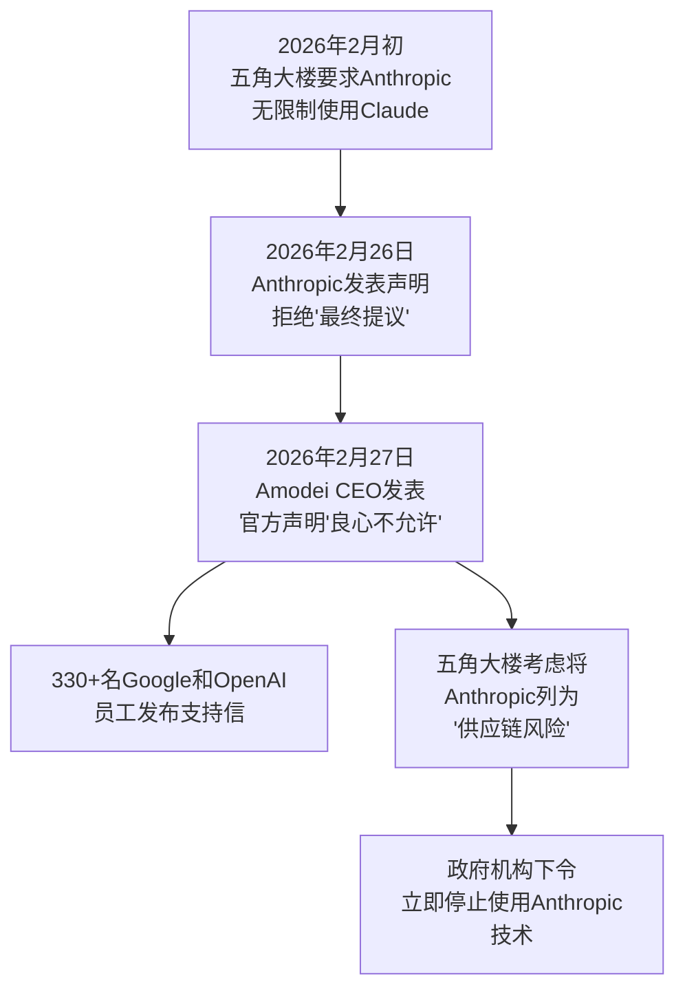
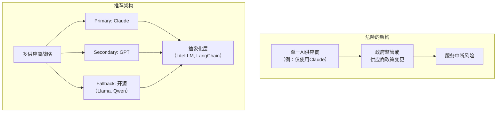
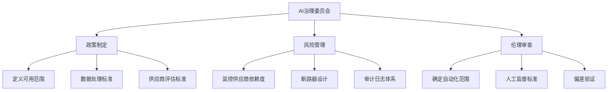
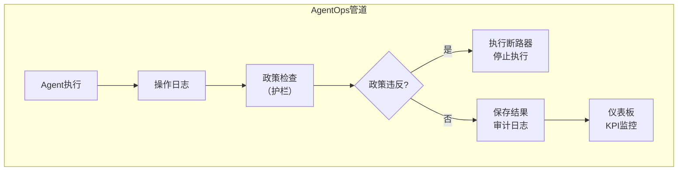

## 概述

2026年2月27日，科技行业发生了一件震撼事件。Anthropic CEO Dario Amodei正式拒绝了美国国防部（五角大楼）要求无限制军事使用Claude AI的要求。这不仅仅是一场企业与政府之间的纠纷。<strong>这个事件清晰地揭示了所有采用AI的组织的CTO和VPoE必然面临的新课题——"AI治理"</strong>。

本文分析事件的核心，并为技术领导者提供一份实用指南，说明如何建立AI供应商战略和治理框架。

## 事件核心：发生了什么

### 时间线



### 争议点总结

五角大楼的要求主要有两个方面。

<strong>1. 对美国公民进行大规模监视（大规模监视）</strong>时无限制使用Claude

<strong>2. 在完全自主武器系统（完全自主武器）</strong>中集成Claude的权利

Anthropic将这两点定为"不可逾越的界限"并予以拒绝。Amodei CEO在官方声明中表示：

> 对于这两个问题，我良心上无法接受。

### 业界反应

值得注意的是，来自Google和OpenAI的超过330名员工公开支持Anthropic。Google DeepMind首席科学家Jeff Dean也表示反对大规模监视。这表明整个AI行业正在就"AI的军事使用"形成伦理基准线。

## CTO/VPoE应该从这次事态中学到的5点

### 1. AI供应商可能在一夜之间变得不可用

五角大楼通过将Anthropic列为"供应链风险"，禁止Boeing、Lockheed Martin等国防相关企业使用Anthropic技术。更进一步，政府下令所有政府机构停止使用Anthropic技术。

<strong>启示</strong>：如果您的组织深度依赖特定的AI供应商，必须为该供应商因政治或监管原因而突然变得不可用的情景做好准备。



### 2. AI治理不再是选择，而是必须

根据Deloitte 2026技术趋势报告，拥有正式AI治理框架的企业仅占<strong>17%</strong>，但这些企业在扩展Agent部署方面表现出远高于平均水平的成功率。

<strong>CTO应该建立的AI治理框架</strong>：



### 3. "AI供应商的伦理立场"成为商业风险

Anthropic的案例表明，AI供应商的伦理决策可能对客户的商业产生直接影响。反之，选择伦理标准较低的供应商会产生声誉风险。

<strong>供应商评估时应检查的项目</strong>：

| 评估项 | 问题 | 重要度 |
|--------|------|--------|
| 伦理政策 | 供应商的AI使用政策（可接受使用政策）是否明确? | 高 |
| 政府关系 | 供应商如何应对政府压力? | 高 |
| 数据主权 | 数据存储在哪个国家的管辖权下? | 高 |
| 开源替代方案 | 供应商被禁用时是否可以转换到开源方案? | 中 |
| SLA保证 | 是否针对政治风险有服务保证? | 中 |

### 4. 多供应商 + 抽象化层是生存战略

在2026年的现在，企业在选择AI供应商时应考虑的现实架构战略。

```typescript
// AI供应商抽象化层示例
interface AIProvider {
  name: string;
  chat(messages: Message[]): Promise<Response>;
  isAvailable(): Promise<boolean>;
}

class AIGateway {
  private providers: AIProvider[];
  private primary: AIProvider;

  async chat(messages: Message[]): Promise<Response> {
    // 尝试Primary供应商
    if (await this.primary.isAvailable()) {
      return this.primary.chat(messages);
    }
    // Fallback链
    for (const provider of this.providers) {
      if (await provider.isAvailable()) {
        console.warn(
          `Primary不可用，切换到${provider.name}`
        );
        return provider.chat(messages);
      }
    }
    throw new Error('所有AI供应商均不可用');
  }
}
```

<strong>核心原则</strong>：将提示词和工具定义设计为供应商独立，仅使API调用层可替换。利用MCP（Model Context Protocol）等标准协议可以大幅降低供应商切换成本。

### 5. 投资AgentOps和可观测性（Observability）

如Anthropic-五角大楼事件所示，追踪AI系统"正在做什么"的能力已超越技术要求，成为<strong>法律和伦理必要条件</strong>。



<strong>最少应该建立的可观测性项目</strong>：

| 项目 | 说明 | 工具示例 |
|------|------|---------|
| 执行跟踪 | Agent使用了哪些工具以及使用顺序 | LangSmith, Braintrust |
| 成本监控 | 代币使用量、API调用成本 | Helicone, OpenMeter |
| 政策遵从 | 检测并阻止护栏违反 | Guardrails AI, NeMo |
| 审计日志 | 所有输入输出的不可变记录 | 自建或Langfuse |

## 实践清单：从周一开始可以做的3件事

<strong>第1阶段：AI供应商依赖度审计（1周）</strong>

列出组织当前使用的AI服务，评估每项服务中断时的业务影响。

<strong>第2阶段：制定多供应商切换计划（2〜4周）</strong>

设计Primary/Secondary/Fallback结构，审查抽象化层的采用。LiteLLM或LangChain等工具可以作为快速入门点。

<strong>第3阶段：起草AI治理初稿（1个月）</strong>

与管理层共同定义AI使用政策。至少需要文档化"自动化范围"、"人工监督标准"、"数据处理原则"这三个方面。

## 结论

Anthropic vs 五角大楼事件生动地展示，AI技术已超越纯粹的技术工具，内含<strong>政治、伦理和法律的复杂性</strong>。

作为CTO/VPoE，我们的任务是明确的：

1. 摆脱单一供应商依赖，建立多供应商战略
2. 将AI治理框架内化为组织文化的一部分
3. 从一开始就设计可观测性和审计体系

在AI成为业务核心的2026年，<strong>"正确使用AI"同样重要的是"安全管理AI"</strong>已成为技术领导者的核心能力。

## 参考资料

- [Anthropic CEO拒绝五角大楼要求 - Fortune](https://fortune.com/2026/02/27/dario-amodei-says-he-cannot-in-good-conscience-bow-to-pentagons-demands-over-ai-use-in-military/)
- [Anthropic拒绝五角大楼最终报价 - Axios](https://www.axios.com/2026/02/26/anthropic-rejects-pentagon-ai-terms)
- [Google和OpenAI员工支持Anthropic - TechCrunch](https://techcrunch.com/2026/02/27/employees-at-google-and-openai-support-anthropics-pentagon-stand-in-open-letter/)
- [Deloitte 2026 Agent AI战略报告](https://www.deloitte.com/us/en/insights/topics/technology-management/tech-trends/2026/agentic-ai-strategy.html)
- [2026年AI Agent实现最佳实践](https://onereach.ai/blog/best-practices-for-ai-agent-implementations/)
