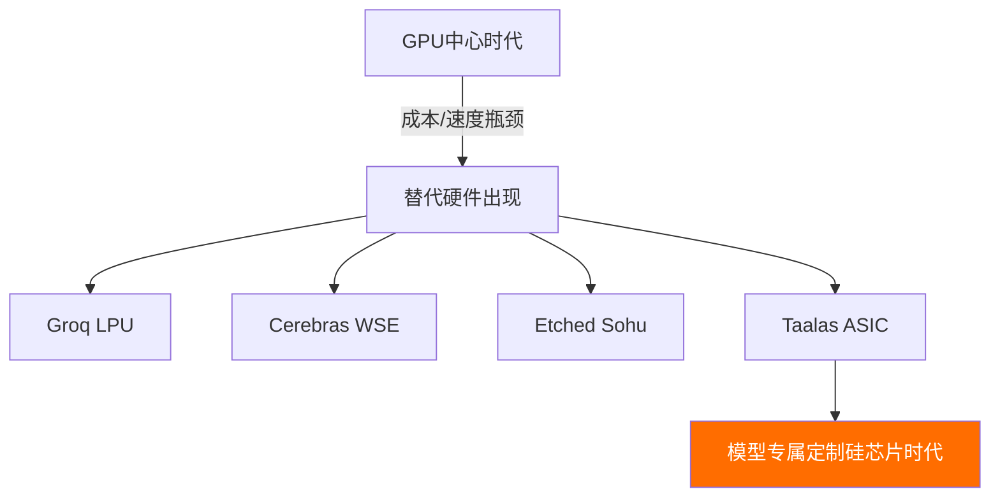

## 概述

AI推理的成本和速度长期依赖GPU硬件。然而初创公司<strong>Taalas</strong>使用ASIC专用芯片实现了<strong>Llama 3.1 8B以16,000 tok/s</strong>的惊人速度运行，并免费对外开放。该消息在Reddit r/LocalLLaMA上获得了77个积分和70多条评论，引发了广泛关注。

无需GPU即可达到如此速度，意味着AI推理基础设施正在经历范式转变。

## Taalas与ASIC推理芯片

### 传统GPU推理的局限

当前LLM推理主要依赖NVIDIA GPU（A100、H100等）。这种方案的问题很明显：

- <strong>高成本</strong>：单张H100售价超过3万美元
- <strong>高功耗</strong>：GPU集群消耗数百千瓦电力
- <strong>复杂基础设施</strong>：需要液冷、HBM堆栈、高速I/O等
- <strong>通用设计的低效</strong>：GPU本质上是为图形处理设计的通用芯片

### Taalas的方法：完全专用化

Taalas成立于2.5年前，开发了将任意AI模型转化为<strong>定制硅芯片</strong>的平台。三大核心原则：

1. <strong>完全专用化（Total Specialization）</strong>：为每个AI模型生产最优专用硅芯片
2. <strong>存储与计算融合</strong>：以DRAM级密度在单芯片上统一内存和计算
3. <strong>彻底简化</strong>：无需HBM、先进封装、3D堆叠或液冷

从接收模型到硬件实现仅需<strong>2个月</strong>。

## 性能对比：GPU vs ASIC

| 指标 | GPU（H100） | Taalas ASIC |
|------|-----------|-------------|
| Llama 3.1 8B速度 | ~1,500-2,000 tok/s | <strong>16,000+ tok/s</strong> |
| 速度倍率 | 1x | <strong>约10x</strong> |
| 能效 | 低（700W/芯片） | 高（大幅降低） |
| 散热方式 | 需要液冷 | 可用风冷 |
| 基础设施复杂度 | 高 | 低 |

相比传统GPU实现了<strong>约10倍的速度提升</strong>，同时基础设施大幅简化。

## 摆脱GPU依赖的趋势

这一趋势并非Taalas独有。AI推理硬件市场正涌现出多种GPU替代方案：

- <strong>Groq</strong>：使用LPU（语言处理单元）实现超高速推理
- <strong>Cerebras</strong>：晶圆级芯片处理大规模模型
- <strong>Etched</strong>：Transformer专用ASIC开发
- <strong>Taalas</strong>：模型专属定制ASIC

Taalas CEO Ljubisa Bajic以ENIAC到晶体管的转变为例，强调AI也必须向<strong>"易于制造、快速、低成本"</strong>的方向发展。

## 推理成本结构的剧变

### 当前成本结构

目前LLM推理成本主要来自硬件和电力：

- GPU硬件：40-50%
- 电力与散热：20-30%
- 网络/存储：10-15%
- 人力/运维：10-15%

### ASIC将如何改变成本结构

当ASIC专用芯片普及后：

- <strong>硬件成本大幅下降</strong>：无需HBM和先进封装
- <strong>电力成本骤降</strong>：效率提升10倍以上
- <strong>基础设施简化</strong>：数据中心复杂度降低
- <strong>每token成本降至1/10以下</strong>

这意味着当前按API调用收费模式将面临价格颠覆。当推理接近零成本时，AI应用范围将爆发式扩展。

## 局限与注意事项

当前阶段需要注意：

- <strong>模型受限</strong>：目前仅支持Llama 3.1 8B（小型模型）
- <strong>灵活性不足</strong>：更换模型需要新芯片
- <strong>量产未验证</strong>：大规模商用化仍需时间
- <strong>不支持大型模型</strong>：70B、405B等大型模型仍在路线图阶段

Reddit社区对此也意见不一："8B太小了"与"作为概念验证已经足够"的声音并存。

## 实践体验

Taalas目前免费提供两项服务：

1. <strong>聊天机器人演示</strong>：在[ChatJimmy](https://chatjimmy.ai/)亲身体验16,000 tok/s的速度
2. <strong>推理API</strong>：通过[API申请表](https://taalas.com/api-request-form)申请免费访问

正如Reddit用户所说，光是速度本身就是一种令人震撼的体验。

## 结论

Taalas的ASIC推理芯片是AI推理硬件未来的重要里程碑。虽然目前仅限于8B模型，但如果该技术扩展到大型模型，<strong>依赖GPU的AI基础设施结构可能发生根本性变革</strong>。

核心要点：

- 相比GPU实现<strong>10倍以上的推理速度</strong>
- 电力、散热、基础设施成本<strong>大幅降低</strong>
- 模型专属定制硅芯片的<strong>全新范式</strong>
- 推理成本结构<strong>根本性变化</strong>的可能性

AI要真正实现普及，推理基础设施必须先行民主化。ASIC专用芯片正是这条道路的起点。

## 参考资料

- [Taalas官方博客：The Path to Ubiquitous AI](https://taalas.com/the-path-to-ubiquitous-ai/)
- [Reddit r/LocalLLaMA讨论](https://www.reddit.com/r/LocalLLaMA/comments/1r9e27i/free_asic_llama_31_8b_inference_at_16000_toks_no/)
- [ChatJimmy聊天机器人演示](https://chatjimmy.ai/)
