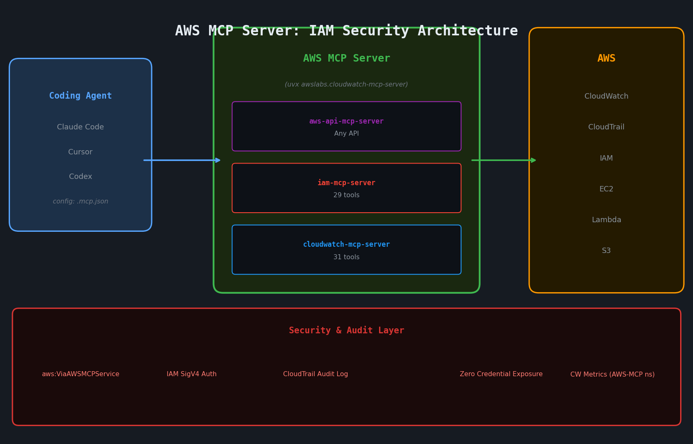

CloudWatch告警响了。Lambda函数错误率超过阈值，需要翻日志——在AWS控制台和终端之间来回切换，手动复制日志组名称。那时我脑子里突然冒出一个念头：能不能直接问Claude Code？如果它能直接看我的CloudWatch会怎样？

2026年5月6日，AWS给出了答案。**AWS MCP Server正式发布（GA）。**

## AWS MCP Server是什么

AWS MCP Server是一套标准接口，让Claude Code、Cursor、Codex等AI编程助手能够直接查询AWS服务。它以Anthropic定义的MCP（模型上下文协议）为基础，将AWS服务封装成MCP工具。

一行 `uvx awslabs.cloudwatch-mcp-server@latest`，Claude Code就能直接查询CloudWatch Logs、确认告警状态、执行Logs Insights查询。不再需要进入IAM控制台手动核查配置。

如果你曾经[从零构建过MCP服务器](/zh/blog/zh/mcp-server-build-practical-guide-2026)，理解起来会更快。AWS MCP Server是AWS官方维护的MCP服务器集合，在GitHub `awslabs/mcp`仓库公开，可通过PyPI安装。

### GA意味着什么

与正式发布前的实验版相比，有三个核心变化：

**IAM条件上下文键**。所有经AWS MCP Server路由的API调用，现在会自动附带`aws:ViaAWSMCPService`和`aws:CalledViaAWSMCP`条件键。IAM策略可以区分是代理发起的API调用还是人工发起的。

**CloudTrail完整集成**。所有MCP经由的API调用都会记录到CloudTrail，形成完整的操作审计日志。

**独立CloudWatch命名空间**。在`AWS-MCP`命名空间下单独发布指标，可以监控有多少API流量来自代理、多少来自直接调用。

核心价值：**在使用相同AWS凭证的前提下，可以在IAM层面为代理和人类设置不同权限。**

## 安装：uvx一行搞定

我亲自安装并运行了两个服务器，以下是全过程。

```bash
# 安装uv（若未安装）
curl -LsSf https://astral.sh/uv/install.sh | sh

# 运行CloudWatch MCP服务器（自动创建隔离环境）
uvx awslabs.cloudwatch-mcp-server@latest

# 运行IAM MCP服务器
uvx awslabs.iam-mcp-server@latest
```

`uvx`自动管理虚拟环境。CloudWatch服务器首次运行时会安装53个依赖包，包括botocore、pandas、scipy、statsmodels等。依赖这么多是因为CloudWatch服务器内置了异常检测和统计分析功能，而不只是简单的API透传。

已安装版本：
- `awslabs.cloudwatch-mcp-server` v0.1.1
- `awslabs.iam-mcp-server` v1.0.20

CloudWatch服务器还在0.x阶段，说明API尚未稳定。投入生产前需注意这一点。

### 接入Claude Code（.mcp.json）

在项目根目录创建`.mcp.json`：

```json
{
  "mcpServers": {
    "cloudwatch": {
      "command": "uvx",
      "args": ["awslabs.cloudwatch-mcp-server@latest"],
      "env": {
        "AWS_REGION": "ap-northeast-1",
        "AWS_PROFILE": "default",
        "FASTMCP_LOG_LEVEL": "WARNING"
      }
    },
    "iam": {
      "command": "uvx",
      "args": ["awslabs.iam-mcp-server@latest"],
      "env": {
        "AWS_REGION": "ap-northeast-1",
        "FASTMCP_LOG_LEVEL": "WARNING"
      }
    }
  }
}
```

`FASTMCP_LOG_LEVEL`设为`WARNING`，否则INFO级别日志会混入Claude Code的响应内容中。也可以通过Claude Code CLI直接添加：`claude mcp add aws-mcp-server`。

## CloudWatch MCP Server：31个工具详解

服务器启动后会注册恰好31个工具。

**日志组工具（8个）**：
```
describe_log_groups         查询日志组列表
analyze_log_group           AI驱动的日志模式分析
execute_log_insights_query  执行Logs Insights查询
get_logs_insight_query_results  获取查询结果
cancel_logs_insight_query   取消正在执行的查询
execute_cwl_insights_batch  批量查询执行
recommend_indexes_loggroup  日志组索引推荐
recommend_indexes_account   全账户索引推荐
```

**指标工具（11个）**：
```
get_metric_data             获取指标数据点
get_metric_metadata         指标元数据查询（启动时索引1,179条记录）
analyze_metric              指标异常检测分析
get_recommended_metric_alarms  告警阈值建议
execute_promql_query        执行PromQL查询
execute_promql_range_query  PromQL范围查询
get_active_alarms           获取活跃告警
get_alarm_history           告警历史记录
```

`get_metric_metadata`值得特别关注。服务器启动时会将1,179条指标元数据加载并建立内存索引，覆盖EC2、Lambda、RDS、DynamoDB等几乎所有AWS服务。服务器日志明确显示：

```
INFO | Loaded 1179 metric metadata entries
INFO | Successfully indexed 1179 metric metadata entries
```

这就是为什么代理无需查阅AWS文档，也能知道"Lambda冷启动时延对应的指标名称"。

### 真实账户测试结果

我在自己的ap-northeast-1账户上实际运行，原始输出如下：

```
可用日志组（5个）：
  /aws/lambda/remotax-renewal-fe-CustomCDKBucketDeployment: 331,695 字节
  /aws/lambda/remotax-renewal-fe-CustomS3AutoDeleteObjects:   2,038 字节
  /aws/lambda/remotax-renewal-fe-LambdaServerFunctionHandler:     0 字节
  /aws/lambda/remotax-renewal-fe-LogRetentionaae0aa3c5b4d4f:     0 字节
  RDSOSMetrics: 55,192,669 字节

CloudWatch告警（4个）：
  ✅ EC2-HighCPU-Alarm — CPU使用率 >= 80% | 状态：OK
  ❓ EC2-HighDiskUsage-Alarm — 磁盘使用率 >= 80% | INSUFFICIENT_DATA
  ❓ EC2-HighMemoryUsage-Alarm — 内存使用率 >= 80% | INSUFFICIENT_DATA
  ❓ LaravelErrorAlarm — 错误数 >= 1 | INSUFFICIENT_DATA

EC2可用指标数：85
```

3个告警处于`INSUFFICIENT_DATA`状态。磁盘和内存告警无数据意味着CloudWatch Agent未正常运行。这类"应该报警时却无声无息"的基础设施问题，以前必须手动进控制台排查，代理现在可以立即捕获并提示检查CloudWatch Agent配置。

## IAM MCP Server：29个工具与安全架构

IAM服务器提供29个工具：

```
list_users / get_user / create_user / delete_user
list_roles / create_role
list_policies / get_managed_policy_document
attach_user_policy / detach_user_policy
create_access_key / delete_access_key
simulate_principal_policy    ← 核心工具
list_groups / create_group
add_user_to_group / remove_user_from_group
put_role_policy / get_role_policy / delete_role_policy
```

我最关注`simulate_principal_policy`。它能在不实际发起API调用的情况下，模拟验证某个IAM主体是否有权执行特定操作。读完[MCP生态系统30个CVE安全危机的分析](/zh/blog/zh/mcp-security-crisis-30-cves-enterprise-hardening)之后，我认为让代理在执行前先预验证权限，是一个实质性的安全保障。

实际测试结果：

```python
response = iam.simulate_principal_policy(
    PolicySourceArn='arn:aws:iam::370193714718:user/remotax-fe',
    ActionNames=[
        'cloudwatch:DescribeAlarms',
        'logs:DescribeLogGroups',
        'iam:ListUsers',
        's3:ListBuckets'
    ],
    ResourceArns=['*']
)

# 结果：
# ✓ cloudwatch:DescribeAlarms: allowed
# ✓ logs:DescribeLogGroups: allowed
# ✓ iam:ListUsers: allowed
# ✓ s3:ListBuckets: allowed
```

### IAM条件键：区分代理与人类操作的核心机制

这是GA版本中我认为最重要的设计。所有经过AWS MCP Server的API调用会自动附带：

- `aws:ViaAWSMCPService` — 标记为经由MCP服务的请求
- `aws:CalledViaAWSMCP` — 标记为来自MCP客户端的请求

利用这些键编写IAM拒绝策略：

```json
{
  "Version": "2012-10-17",
  "Statement": [
    {
      "Effect": "Deny",
      "Action": [
        "iam:CreateUser",
        "iam:DeleteUser",
        "iam:AttachUserPolicy"
      ],
      "Resource": "*",
      "Condition": {
        "Bool": {
          "aws:ViaAWSMCPService": "true"
        }
      }
    }
  ]
}
```

附加此策略后，人类可以通过控制台管理IAM用户，但Claude Code（经由MCP的代理）无法创建或删除IAM用户。使用相同AWS凭证，对代理施加额外限制。

在[实现Claude Agent SDK的Tool Use时](/zh/blog/zh/claude-agent-sdk-tool-use-complete-guide-2026)，代理权限控制需要在应用层编写大量逻辑。AWS在这里将问题解决在了基础设施层面，这个思路我认为是对的。

## 架构图



三层架构：AI编程助手 → AWS MCP Server（stdio通信）→ AWS API（SigV4认证）。所有AWS API请求均记录至CloudTrail，并在CloudWatch的AWS-MCP命名空间下单独监控。

## 可用的AWS MCP服务器一览

| 服务器 | 用途 | 版本 |
|--------|------|------|
| `awslabs.cloudwatch-mcp-server` | CloudWatch日志/指标/告警 | v0.1.1 |
| `awslabs.iam-mcp-server` | IAM管理 | v1.0.20 |
| `awslabs.aws-api-mcp-server` | 任意AWS API调用 | 独立版本 |
| CloudWatch Application Signals | APM/SLO监控 | 独立版本 |
| AWS Network MCP Server | VPC/网络诊断 | 独立版本 |
| AWS Pricing MCP Server | 成本估算 | 独立版本 |
| EKS MCP Server | EKS集群管理 | 独立版本 |

[用FastMCP构建Python MCP服务器时](/zh/blog/zh/fastmcp-python-mcp-server-build-guide-2026)，每个API端点都需要单独定义工具。`aws-api-mcp-server`翻转了这一逻辑——一个工具覆盖全部AWS API，但代理需要更多上下文来判断该调用哪个API。

## 坦率评价——优点与不足

**确实有价值的地方：**

IAM条件键带来的代理权限隔离是真实可用的。如果你一直担心代理接触AWS基础设施的风险，这个机制让你可以在IAM层面强制实施"代理只读、人类可写"，而无需创建额外的AWS账户或IAM用户。

PromQL支持出乎意料。在使用CloudWatch Container Insights的环境中，可以通过MCP直接执行PromQL查询指标。对于已经熟悉Prometheus查询语法的用户，这种移植性相当友好。

1,179条指标元数据的预加载索引切实有用。代理无需每次查询AWS，就能了解各服务暴露了哪些指标。

**让我有顾虑的地方：**

CloudWatch服务器停留在v0.1.1。`analyze_log_group`和`analyze_metric`等AI分析工具看起来有潜力，但我还没有进行充分的压力测试。0.x版本用于生产工作流需要谨慎。

Logs Insights的成本问题。CloudWatch按扫描的日志数据量计费。代理如果无节制地发起查询，日志查询费用可能超出预期。目前工具层面没有成本护栏，需要通过IAM策略限制查询范围或通过代理指令来控制。

IAM服务器中暴露了`create_access_key`工具。代理默认就可以创建新的AWS访问密钥，这个风险点不容忽视。虽然可以用条件键策略拦截，但需要运维人员主动配置，有一定的门槛。

我的建议：先在只读场景中引入`cloudwatch-mcp-server`。IAM服务器仅在开发环境使用，并在正式引入前配置好明确的拒绝策略。

## 快速上手

AWS凭证配置完成后：

```bash
# 安装uv
curl -LsSf https://astral.sh/uv/install.sh | sh

# 立即测试
uvx awslabs.cloudwatch-mcp-server@latest

# 添加到项目
cat > .mcp.json << 'EOF'
{
  "mcpServers": {
    "cloudwatch": {
      "command": "uvx",
      "args": ["awslabs.cloudwatch-mcp-server@latest"],
      "env": {
        "AWS_REGION": "ap-northeast-1",
        "FASTMCP_LOG_LEVEL": "WARNING"
      }
    }
  }
}
EOF
```

官方文档：[awslabs.github.io/mcp](https://awslabs.github.io/mcp)。源代码：[github.com/awslabs/mcp](https://github.com/awslabs/mcp)。服务本身免费，只需为代理使用的AWS资源付费。

AI代理拥有AWS控制台级别的可见性，是无法阻挡的趋势。AWS MCP Server GA是这个方向上第一个真正可以投入使用的里程碑。
