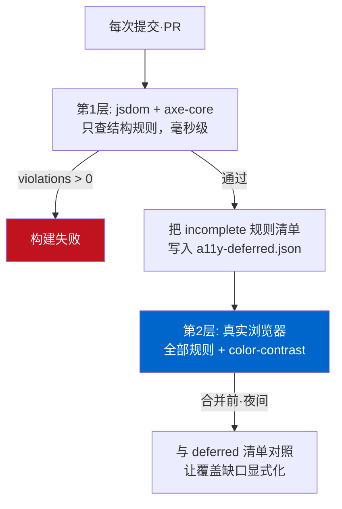

同一份 HTML，用 axe-core 跑了两遍，判定却不一样。一遍把 `color-contrast` 标为 `incomplete`，另一遍把它当成 `2.4:1` 的硬性违规抓了出来。标记我一个字都没改，变的只有运行环境这一项。

这看着像脚注，却正是把无障碍检查接进 CI 的团队最常踩的雷。把 `axe-core` 接到 Jest 或 Vitest 上，就能以单测的速度做无障碍检查，不需要浏览器。很诱人。麻烦在于，这份便利的代价是某条规则会从覆盖率里**悄悄掉出去**，而大多数人并不知道，还照旧相信那个绿色对勾。今天我在沙箱里复现了它，挖清楚了原因，也把流水线该怎么组织、才能不留洞给理清了。

## AI 生成的组件里反复出现的四类违规

如今组件常常是用生成工具做出来的，我也一样。可一旦从无障碍的角度去看这些生成的标记，同样的错误就在同样的位置反复出现：只有图标的按钮、没有 alt 的图片、没有文字的链接、缺了 `lang` 的文档。屏幕上看着都正常，人眼根本发现不了。

我做了个"预订组件"来实验，形状正是生成工具会吐出来的那种。

```html
<!DOCTYPE html>
<html>
<head><title>Booking widget</title></head>
<body>
  <div class="card">
    <h3>Reserve a table</h3>
    
    <p class="muted">Popular near you. Book in seconds.</p>

    <input type="text" placeholder="Your name">
    <input type="email" placeholder="Email">

    <button class="icon-btn">
      <svg viewBox="0 0 24 24"><path d="M12 2v20M2 12h20" stroke="black"/></svg>
    </button>
    <a href="/help">
      <svg viewBox="0 0 24 24"><circle cx="12" cy="12" r="10"/></svg>
    </a>
  </div>
</body>
</html>
```

用眼睛看是张普通卡片：两个输入框、一个图标按钮、一条帮助链接。用屏幕阅读器读就成了另一样东西。按钮只被读成"按钮"，不知道是干什么的按钮。链接也没有目的地文字。输入框在焦点进入、`placeholder` 消失的那一刻，就失去了"该填什么"的唯一线索。placeholder 不是标签。这不是口味问题，而是 W3C 定义的违规。

## 不用浏览器跑 axe-core

先从对 CI 友好的一侧说起。有了 `axe-core` 和 `jsdom`，就能不启动浏览器、在 Node 里跑无障碍检查，直接搭到单测上。

```javascript
import { readFileSync } from 'node:fs';
import { JSDOM } from 'jsdom';
import axe from 'axe-core';

async function auditFile(path) {
  const html = readFileSync(path, 'utf8');
  const dom = new JSDOM(html, { runScripts: 'dangerously', pretendToBeVisual: true });
  const { window } = dom;
  window.eval(axe.source); // 把 axe 注入这个 window
  return window.axe.run(window.document, {
    resultTypes: ['violations', 'incomplete'],
    runOnly: { type: 'tag', values: ['wcag2a', 'wcag2aa', 'wcag21a', 'wcag21aa'] },
  });
}
```

关键在 `window.eval(axe.source)`。`axe-core` 包提供了把整个库变成字符串的 `axe.source`。把它注入 jsdom 造出来的 `window`，就能在里面像真实浏览器那样调用 `axe.run()`。我用 `runOnly` 只锁定 WCAG 2.1 A/AA 标签，这是多数团队当作合规目标的基线。

下面是跑 before 页面的真实输出，没有修饰。


```text
===== BEFORE (AI-generated markup) =====
violations: 4 | incomplete: 1 | passes: 7
  [critical] button-name (1)   — Buttons must have discernible text
  [serious]  html-has-lang (1) — <html> element must have a lang attribute
  [critical] image-alt (1)     — Images must have alternative text
  [serious]  link-name (1)     — Links must have discernible text
  incomplete:
     ~ color-contrast (1)      — Elements must meet minimum contrast ratio
```

四条结构性违规被精准抓住。`button-name` 说图标按钮没有可访问名称，`link-name` 说链接没有文字，`image-alt` 和 `html-has-lang` 顾名思义。到这一步完全不需要浏览器，因为这些规则仅凭标记结构就能判定。这正是 jsdom 方式真正的价值：每次 `git push` 都能在几毫秒内拦下这类回归。

我把修好的 after 页面用同一段代码又跑了一遍。图标按钮加了 `aria-label`，SVG 加了 `aria-hidden="true"`，图片加了 `alt`，输入框配上真正的 `<label for>`。

```text
===== AFTER (fixed) =====
violations: 0 | incomplete: 1 | passes: 19
  incomplete:
     ~ color-contrast (1)      — Elements must meet minimum contrast ratio
```

违规 0，通过 19。干净利落。可 `incomplete` 里留着的那行 `color-contrast` 让我不安。before 也好 after 也好，唯独这条规则始终没给出判定。这里就是陷阱。

## 为什么偏偏 color-contrast 落到 incomplete

`incomplete` 不是 pass。它不是"没有违规"，而是**"在这个环境里无法检查"**，是 axe-core 放弃判定的信号。

原因藏在 jsdom 的根本性质里。jsdom 会造出 DOM 树，但不做布局也不做渲染。它不计算某个元素被画在屏幕哪里、什么颜色、背后压着什么背景。而对比度判定恰恰需要那个"实际被涂上的前景色和背景色"。axe-core 的对比度检查内部用 `document.createRange()` 和 `getClientRects()` 去圈出文字实际占据的区域，而 jsdom 没有实现这些 API。Deque 维护的 axe-core 仓库里的 [issue #595](https://github.com/dequelabs/axe-core/issues/595) 原样记录了这个限制，热门的 [jest-axe](https://github.com/nickcolley/jest-axe) 正是因此默认禁用了 `color-contrast` 规则。

所以事情是这样：在 jsdom 里，对比度检查不是"通过"，而是"不存在"。而刚接上 axe-core 的团队，常常不读 `incomplete` 就略过，或者干脆把它从 `resultTypes` 里去掉。就在那一刻，WCAG 中最常被违反的项之一——对比度，整块从测试覆盖里消失了。

于是我把同一个 before 页面放进真实浏览器引擎（无头 Chromium）又跑了一遍，只指定对比度这条规则。

```javascript
// 在真实浏览器的页面上下文里执行
const r = await window.axe.run(document, {
  runOnly: { type: 'rule', values: ['color-contrast'] }
});
```

结果是一条明确的违规。

```json
{
  "id": "color-contrast",
  "impact": "serious",
  "message": "Element has insufficient color contrast of 2.4
              (foreground #a7a7a7, background #ffffff, 16px).
              Expected contrast ratio of 4.5:1"
}
```

`2.4:1`。W3C 的 [WCAG 2.1 SC 1.4.3 Contrast (Minimum)](https://www.w3.org/WAI/WCAG21/Understanding/contrast-minimum.html) 要求正文文字至少 `4.5:1`（大字号 `3:1`）。`#a7a7a7` 那行浅灰提示，大约只有要求的一半。jsdom 以"判不了"放过的那个元素，浏览器一击就抓住了。我把颜色加深到 `#595959` 后，对比度越过了 `7:1`，浏览器里也变成违规 0。

同样的 axe-core，同样的标记，不同的运行时，判定就分道扬镳。渲染时机决定自动化工具视野的这个陷阱，并不只存在于无障碍领域。[结构化数据是在服务端渲染还是用客户端 JS 注入](/zh/blog/zh/localbusiness-structured-data-server-side-vs-js-2026/)，决定了爬虫能读到 schema 还是彻底错过，这与本文完全是同一种结构。这一张图就是今天全文的要点。

## 所以流水线分两层来组

要是结论变成"那就别用 jsdom，永远起浏览器"，就麻烦了。浏览器启动慢，每个单测都拉起 Chromium 会让 CI 拖沓。我选择分工。

<strong>第一层 — jsdom 加 axe-core（快速门禁）。</strong>每次提交、每个 PR 都作为单测运行。在这里拦下仅凭标记就能判定的结构性违规：`button-name`、`image-alt`、`link-name`、`label`、`html-has-lang`。以毫秒计，毫无负担，直接搭在组件快照测试旁边即可。

<strong>第二层 — 真实浏览器（完整规则集）。</strong>用 Playwright 或 Puppeteer 渲染之后，跑包含 `color-contrast` 在内的全部规则。用 `@axe-core/playwright` 这类适配器，接线很短。这一层不必每次提交都重跑，合并前或夜间流水线里挑关键页面跑就够了。

两层衔接时，有一个装置必须加上：**把第一层里落到 `incomplete` 的规则记进日志，并核对第二层确实覆盖了它们。**这样"jsdom 判不了哪些规则"就在流水线里被明确标出。否则 `incomplete` 只会变成没人看的一行日志，覆盖率的洞就一直开着。

门禁逻辑简单到这种程度就够了。

```javascript
const results = await runAxeInJsdom(html);
if (results.violations.length > 0) {
  console.error('结构性 a11y 违规:', results.violations.map(v => v.id));
  process.exit(1); // 第一层门禁：在这里让构建失败
}
// 不把 incomplete 判为失败，而是作为第二层必须覆盖的清单交出去
const deferred = results.incomplete.map(v => v.id);
writeFileSync('a11y-deferred.json', JSON.stringify(deferred));
```

这个思路本身并不新。我在[把 SEO 审计常设成构建门禁的那场行动](/zh/blog/zh/multilingual-blog-technical-audit-campaign-2026/)里用的是同一个原理：别把一次修好的东西交给人的自律，而是钉在流水线里。可访问性完全一样。审计应该是循环，不是一次性事件。

把两层结构画成一张图：



## 工具亮绿之后仍然剩下的

说实话，把上面两层都过了，也不能保证这个页面就无障碍了。这不是 axe-core 的局限，而是自动检查整体的局限。

axe-core 抓不住的有一类典型问题：只用键盘能不能到达并操作每一个按钮和链接？`Tab` 顺序跟视觉顺序、逻辑顺序对得上吗？打开模态框时焦点会不会被困在里面、关闭后回到原位？用屏幕阅读器从头读到尾，流程说得通吗？这些都无法靠标记的静态分析来判定。事实上，在[我把无障碍分数刷到 Lighthouse 100 分的那个页面](/zh/blog/zh/a11y-lighthouse-audit-fix-2026/)上，一个只给 `div` 挂了 `onclick` 的假按钮拿了满分，却依然没法用键盘按下。

所以我把自动工具当"地板"，不当"天花板"。axe-core 抓到的违规，是那种人根本不必花时间去核实、必须为 0 的下限。用 CI 把这块地板压住，把省下来的时间用在键盘走查和屏幕阅读器通读上，才是对的。一旦相信工具能全包，工具看不见的那一半就原封不动地上了生产。

## 今天就能用的清单

- 如果你把 `axe-core` 接进了单测，务必在 `resultTypes` 里带上 `'incomplete'`，并且真的去读那份清单。`color-contrast` 若在其中，那不是通过，是没查。
- 把 jsdom 阶段明确圈定为结构规则（`button-name`、`image-alt`、`link-name`、`label`、`html-has-lang`）专用。别把对比度、焦点可见性这类需要渲染的规则误当成在这里通过了。
- 对比度检查一定要升级到真实浏览器阶段。Playwright/Puppeteer 加 `@axe-core/*` 适配器，接线很短。
- 图标按钮配 `aria-label`，装饰性 SVG 配 `aria-hidden="true"`，输入框用真正的 `<label for>` 而非 `placeholder`。光这三条，就能抹掉生成标记里大部分常见违规。
- 自动门禁亮绿之后，只用键盘把那个界面从头操作一遍。工具给的绿灯是起点，不是终点。

可访问性不是修一次的事，而是拦住回归的事。它从"不把 `incomplete` 随手放过"开始。

---

我个人接洽并承接这类工作：把结构化数据可靠地从服务端输出，或基于实测对既有站点的可访问性与搜索适配做体检、再钉进门禁。如果你在搭类似流水线时卡住了，欢迎从[个人资料](/zh/about/)里的联系方式给我留言。
