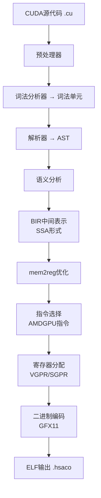

## 概述

在GPU计算的世界中，NVIDIA的CUDA是事实上的标准。但这同时也意味着<strong>供应商锁定（vendor lock-in）</strong>——用CUDA编写的代码只能在NVIDIA GPU上运行。

<strong>BarraCUDA</strong>是一个为打破这堵墙而诞生的开源编译器。它接收`.cu`文件，直接编译为AMD RDNA 3（GFX11）机器码。用15,000行C99编写，零LLVM依赖，也不需要HIP转换层。

## BarraCUDA的架构

BarraCUDA的编译管线遵循传统编译器结构，同时直接以AMD GPU为目标。



主要特点包括：

- <strong>零LLVM依赖</strong>：约1,700行手写指令选择逻辑
- <strong>基于SSA的IR</strong>：使用名为BIR（BarraCUDA IR）的自有中间表示
- <strong>完整预处理器</strong>：支持`#include`、`#define`、宏、条件编译
- <strong>验证过的编码</strong>：所有指令编码已通过`llvm-objdump`验证

## 支持的CUDA功能

BarraCUDA已经支持相当多的CUDA功能：

### 核心语言功能

- `__global__`、`__device__`、`__host__`函数限定符
- `threadIdx`、`blockIdx`、`blockDim`、`gridDim`内置变量
- 结构体、枚举、typedef、命名空间
- 指针、数组、指针运算
- 所有C控制流：if/else、for、while、switch/case、goto
- 基本模板实例化

### CUDA特有功能

- <strong>`__shared__`内存</strong>：从LDS分配，正确追踪
- <strong>`__syncthreads()`</strong>：转换为`s_barrier`
- <strong>原子操作</strong>：`atomicAdd`、`atomicSub`、`atomicMin`、`atomicMax`等
- <strong>Warp内联函数</strong>：`__shfl_sync`、`__shfl_up_sync`、`__shfl_down_sync`
- <strong>向量类型</strong>：`float2`、`float3`、`float4`等`.x/.y/.z/.w`访问
- <strong>半精度</strong>：`__half`、`__float2half()`、`__half2float()`
- <strong>Cooperative Groups</strong>：`this_thread_block()`及`.sync()`、`.thread_rank()`

## 使用方法

构建过程出人意料地简单：

```bash
# 构建 — 只需要C99编译器
make

# 编译为AMD GPU二进制文件
./barracuda --amdgpu-bin kernel.cu -o kernel.hsaco

# 导出IR（用于调试）
./barracuda --ir kernel.cu

# 输出AST
./barracuda --ast kernel.cu
```

## GPU民主化的意义

BarraCUDA的出现不仅是技术成就，更暗示着GPU生态系统的结构性变革。

### 挑战NVIDIA垄断

在当前GPU计算市场中，CUDA的地位是绝对的。绝大多数AI/ML工作负载基于CUDA，没有NVIDIA GPU就无法运行。BarraCUDA正在撼动这一格局。

### 扩展AMD GPU的可能性

AMD的ROCm/HIP生态系统在增长，但转换现有CUDA代码时仍存在摩擦。BarraCUDA通过<strong>无需代码转换直接编译</strong>的方式，将这种摩擦降至最低。

### 开源的力量

用15,000行C99实现CUDA编译器这一事实本身，就展示了开源社区的实力。在Hacker News上获得66分，吸引了开发者社区的关注。

## 当前局限与展望

当然，作为早期阶段的项目，还存在一些局限：

- <strong>仅支持GFX11（RDNA 3）</strong>：目前只支持AMD最新架构
- <strong>不包含运行时</strong>：`cudaMalloc`、`cudaMemcpy`等主机API需要单独实现
- <strong>优化有限</strong>：尚未达到nvcc级别的优化
- <strong>Tenstorrent支持进行中</strong>：计划扩展到AMD以外的架构

然而，项目的方向是明确的：提高CUDA代码的可移植性，让开发者重获GPU选择的自由。

## 总结

BarraCUDA是一个让我们得以窥见GPU计算未来的项目。作为NVIDIA CUDA垄断的开源替代方案，它展示了<strong>无需修改代码即可在AMD GPU上运行CUDA代码</strong>的可能性。

在AI/ML工作负载爆发式增长的当下，GPU选择的多样性在降低成本和供应链稳定性方面至关重要。如果BarraCUDA这样的项目走向成熟，GPU生态系统的竞争格局将变得更加健康。

## 参考资料

- [BarraCUDA GitHub仓库](https://github.com/Zaneham/BarraCUDA)
- [Hacker News讨论](https://news.ycombinator.com/item?id=barracuda)
- [AMD ROCm官方文档](https://rocm.docs.amd.com/)
- [NVIDIA CUDA官方文档](https://developer.nvidia.com/cuda-zone)
