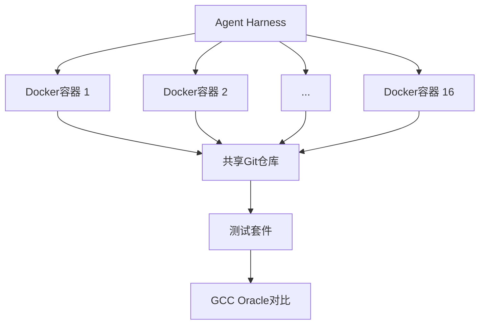

## 概述

Anthropic于2026年2月5日发布的<strong>CCC（Claude's C Compiler）</strong>是一个令人印象深刻的项目，同时展示了AI构建编译器的可能性和局限性。这是一个由Claude Opus 4.6 100%生成代码的基于Rust的C编译器，能够<strong>在x86、ARM和RISC-V上构建Linux 6.9内核</strong>。

近2,000次Claude Code会话、$20,000的API成本、10万行代码——这就是AI创建一个"可工作编译器"所需的全部。

## CCC是什么

CCC采用Anthropic Safeguards团队的Nicholas Carlini设计的<strong>Agent Teams</strong>方式开发。核心思路很简单：

> 16个Claude实例在共享代码库上并行工作，无需人工干预即可完成编译器。

### 架构



每个Agent在独立的Docker容器中运行，通过在`current_tasks/`目录中创建"锁文件"来防止工作冲突。当一个Agent锁定`parse_if_statement.txt`时，其他Agent会选择`codegen_function_definition.txt`等不同任务。

### Agent循环

每个Agent的执行循环简单得令人惊讶：

```bash
#!/bin/bash
while true; do
  COMMIT=$(git rev-parse --short=6 HEAD)
  LOGFILE="agent_logs/agent_${COMMIT}.log"
  claude --dangerously-skip-permissions \
    -p "$(cat AGENT_PROMPT.md)" \
    --model claude-opus-X-Y &> "$LOGFILE"
done
```

## CCC的成果

### 可编译的项目

| 项目 | 状态 |
|------|------|
| Linux 6.9内核（x86, ARM, RISC-V） | ✅ 启动成功 |
| QEMU | ✅ |
| FFmpeg | ✅ |
| SQLite | ✅ |
| PostgreSQL | ✅ |
| Redis | ✅ |
| Doom | ✅ 可运行 |

### 测试套件结果

- <strong>GCC torture test suite</strong>: 99%通过率
- <strong>主要编译器测试套件</strong>: 99%通过率

## CCC vs GCC — 现实的比较

GCC是拥有40多年历史的生产级编译器。与CCC的比较展示了AI的<strong>当前位置</strong>。

### 性能

> "即使启用所有优化，CCC的输出代码也不如GCC禁用优化（-O0）时高效。"

这是CCC最大的弱点。在编译器核心价值——<strong>代码优化</strong>方面，仍远远落后于GCC。

### 功能差距

| 功能 | GCC | CCC |
|------|-----|-----|
| 自带汇编器/链接器 | ✅ | ❌（使用GCC的） |
| 16位x86 | ✅ | ❌（委托给GCC） |
| 构建所有项目 | ✅ | ❌（仅部分） |
| 代码优化 | 数十个pass | 基本SSA IR |
| 架构支持 | 数十个 | 3个（x86, ARM, RISC-V） |

### 但重要的是

GCC是数千名开发者花40年构建的。CCC是<strong>AI用2周、$20,000构建的</strong>。

## 以闪电速度达到80%品质 — AI编程的本质

CCC项目的真正意义不在于"击败了GCC"，而在于以下事实：

### 1. 从零到可工作的编译器

人类编译器开发者构建10万行Rust编译器需要<strong>数月到数年</strong>。AI在2周内完成了。虽不完美，但<strong>它能工作</strong>。

### 2. 并行化的力量

16个Agent并行工作不仅仅是速度提升。每个Agent承担<strong>专业化角色</strong>：

- 功能实现Agent
- 重复代码整合Agent
- 编译器性能优化Agent
- 代码质量改进Agent
- 文档化Agent

### 3. 测试驱动开发的重要性

这个项目中投入最多精力的不是<strong>编写代码，而是设计测试环境</strong>：

- 使用GCC作为"正确答案Oracle"进行输出对比
- 最小化输出以防止上下文窗口污染
- 为无时间感知的AI设计进度追踪
- 1%/10%随机采样实现快速回归测试

## 技术设计要点

### 洁净室实现

CCC在<strong>无互联网访问</strong>的条件下开发。这是仅使用Rust标准库的完全洁净室实现。证明了AI仅凭学习到的知识就能构建编译器。

### 基于SSA IR的设计


采用SSA（Static Single Assignment）中间表示来支持多个优化pass的架构设计。这个架构决策由人类做出，但实现100%由AI完成。

### 并行Agent的局限

在Linux内核编译阶段出现了一个有趣的问题。与数百个独立测试不同，内核构建是<strong>一个巨大的任务</strong>。所有Agent都遇到同一个bug，16个Agent的优势荡然无存。

解决方案：使用GCC作为在线Oracle，<strong>随机分配内核文件</strong>，让每个Agent修复不同文件中的bug。

## 未来展望

### 模型代际演进

| 模型 | 编译器能力 |
|------|----------|
| 早期Opus 4.x | 仅能构建基本编译器 |
| Opus 4.5 | 可通过测试套件，无法构建实际项目 |
| Opus 4.6 | 成功构建Linux内核 |

每一代的能力都在急剧提升。Opus 4.7或5.0可能实现GCC级别的优化。

### 对开发者的启示

1. <strong>测试是核心</strong>: AI Agent的质量与测试环境的质量直接相关
2. <strong>架构设计仍是人类的工作</strong>: SSA IR等高层设计决策由人类做出
3. <strong>80%方案的价值</strong>: 不要低估虽不完美但能工作的成果
4. <strong>并行Agent时代</strong>: AI作为团队而非个体工作的可能性

## 结论

CCC不是GCC的替代品。它是<strong>展示AI在软件开发中走了多远的里程碑</strong>。

- 2周内生成10万行可工作的编译器
- 构建可启动的Linux内核
- $20,000成本（人类团队的极小部分）
- 尚未达到GCC级别的优化

"以闪电速度达到80%品质"的AI特性在编译器这一极限软件项目中也得到了验证。填补剩余20%仍然困难，但那80%在以前是不可能的。

## 参考资料

- [Building a C compiler with a team of parallel Claudes — Anthropic Engineering Blog](https://www.anthropic.com/engineering/building-c-compiler)
- [Claude's C Compiler — GitHub](https://github.com/anthropics/claudes-c-compiler)
- [GCC Torture Test Suite](https://gcc.gnu.org/onlinedocs/gccint/Torture-Tests.html)
