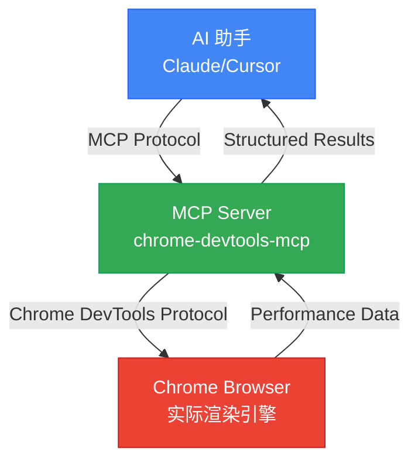

## Web 性能优化的新范式

Web 性能优化一直很重要,但要一致地测量和改进却很困难。手动打开 Chrome DevTools 进行性能分析、截图、对比指标,这些工作既耗时又重复。更大的问题是 AI 代码生成器无法验证代码在实际浏览器中的运行效果。

2025年9月22日,Google Chrome DevTools 团队发布了<strong>Chrome DevTools MCP</strong>,解决了这个问题。现在 Claude、Cursor、Copilot 等 AI 助手可以直接控制真实的 Chrome 浏览器,测量性能,并基于数据验证优化效果。

## 什么是 Chrome DevTools MCP?

Chrome DevTools MCP 是一个官方 Model Context Protocol (MCP) 服务器,赋予 AI 编码助手控制 Chrome 浏览器的能力。简而言之,AI 现在可以直接使用你的开发者工具。

### 核心功能

- <strong>实时性能测量</strong>:自动测量 Core Web Vitals (LCP、CLS、INP)
- <strong>网络监控</strong>:分析所有 HTTP 请求的时序、头部、负载
- <strong>设备模拟</strong>:通过 CPU 节流和网络限制模拟移动环境
- <strong>自动化调试</strong>:收集和分析控制台消息、错误日志
- <strong>性能洞察</strong>:自动识别渲染阻塞资源、长任务、布局偏移

### 工作原理



AI 发起请求 → MCP 服务器转换为 Chrome DevTools Protocol 命令 → Chrome 执行并返回数据 → AI 分析并提供建议。

## 安装和配置

### 1. 前置要求

- Node.js v20.19 以上(推荐 v22.12.0)
- Chrome 浏览器(最新稳定版)
- Claude Desktop 或支持的 AI IDE

### 2. Claude Desktop 配置

编辑 `~/Library/Application Support/Claude/claude_desktop_config.json` 文件:

```json
{
  "mcpServers": {
    "chrome-devtools": {
      "command": "npx",
      "args": ["-y", "chrome-devtools-mcp@latest"]
    }
  }
}
```

### 3. 高级配置选项

```json
{
  "mcpServers": {
    "chrome-devtools": {
      "command": "npx",
      "args": [
        "chrome-devtools-mcp@latest",
        "--headless=true",           // 无头模式
        "--isolated=true",           // 隔离会话(推荐用于安全)
        "--viewport=1920x1080",      // 自定义视口
        "--executablePath=/path/to/chrome"  // 指定 Chrome 二进制文件
      ]
    }
  }
}
```

重启 Claude Desktop 以应用配置。

## 核心性能优化工具

Chrome DevTools MCP 提供26个工具,这里重点介绍对性能优化至关重要的工具。

### 1. 性能追踪

<strong>`performance_start_trace()`</strong>

开始性能追踪。捕获页面加载时序、CPU 使用率、网络活动、渲染指标等所有数据。

```typescript
// 向 AI 请求示例
"在 localhost:4321 记录性能追踪。刷新页面并自动停止。"

// MCP 执行:
performance_start_trace(reload=true, autoStop=true)
```

<strong>`performance_stop_trace()`</strong>

停止追踪并返回全面的性能洞察:

- <strong>Core Web Vitals</strong>:LCP、CLS、INP、TBT、TTFB
- <strong>最长主线程任务</strong>
- <strong>渲染阻塞资源</strong>
- <strong>JavaScript 执行时序</strong>
- <strong>网络瀑布分析</strong>

<strong>`performance_analyze_insight(insightName)`</strong>

提供特定性能问题的详细分析。

```typescript
// 渲染阻塞资源详细分析
performance_analyze_insight("RenderBlocking")

// 返回示例:
// - /main.css: 200ms 阻塞
// - /analytics.js: 150ms 阻塞
// 推荐: 应用 preload 或 defer
```

### 2. Core Web Vitals 自动测量

Chrome DevTools MCP 自动测量所有 Core Web Vitals:

- <strong>LCP (Largest Contentful Paint)</strong>:2.5秒以下 = Good
- <strong>CLS (Cumulative Layout Shift)</strong>:0.1以下 = Good
- <strong>INP (Interaction to Next Paint)</strong>:200ms以下 = Good
- <strong>TBT (Total Blocking Time)</strong>:300ms以下 = Good
- <strong>TTFB (Time to First Byte)</strong>:600ms以下 = Good

AI 会分析这些指标,并立即告知哪些超过了阈值。

### 3. 设备模拟

<strong>CPU 节流</strong>

```typescript
// 模拟4倍慢速 CPU(低端移动设备)
emulate_cpu(4)

// 重新测量性能
performance_start_trace(reload=true)
```

<strong>网络节流</strong>

```typescript
// 模拟 Slow 4G 网络
emulate_network("Slow 4G")

// 选项: "Slow 3G", "Fast 3G", "Slow 4G", "Fast 4G", "No emulation"
```

### 4. 网络请求监控

<strong>查看所有请求</strong>

```typescript
list_network_requests(
  pageSize=50,
  resourceTypes=["script", "stylesheet", "image"]
)

// 返回:
// - URL、HTTP 方法、状态码
// - 请求/响应头
// - 时序(DNS、连接、TTFB)
// - 文件大小和压缩状态
```

<strong>查看特定请求详情</strong>

```typescript
get_network_request("https://example.com/main.js")

// 返回:
// - 完整请求/响应体
// - 性能时序分解
// - 缓存信息
```

## 实战工作流:性能优化自动化

现在让我们看看使用 Chrome DevTools MCP 优化网站性能的完整工作流。

### 步骤1:基线测量

```
向 Claude 请求:
"测量我的博客 localhost:4321 的性能并告诉我 Core Web Vitals"

AI 执行:
1. navigate_page("http://localhost:4321")
2. performance_start_trace(reload=true, autoStop=true)
3. [自动完成页面加载和测量]

AI 响应:
"性能测量完成:
- LCP: 3.2秒(Poor - 超过2.5秒)
- CLS: 0.05(Good)
- TBT: 450ms(Poor - 超过300ms)
- TTFB: 120ms(Good)

主要问题:
1. LCP 慢:最大图片(hero.jpg, 1.2MB)需要优化
2. TBT 高:main.js (350KB)解析耗时400ms"
```

### 步骤2:瓶颈分析

```
向 Claude 请求:
"找出渲染阻塞资源"

AI 执行:
performance_analyze_insight("RenderBlocking")

AI 响应:
"渲染阻塞资源:
1. /styles/main.css (200ms 阻塞)
   - 28KB,未压缩
   - 推荐: Critical CSS 内联 + 其余异步加载

2. /scripts/analytics.js (150ms 阻塞)
   - 在 head 中同步加载
   - 推荐: 添加 defer 或 async 属性

3. Google Fonts (100ms 阻塞)
   - 推荐: font-display: swap + preconnect"
```

### 步骤3:应用优化

图片优化:

```bash
# WebP 转换和调整大小
npm install sharp
node optimize-images.js
```

JavaScript 优化:

```html
<!-- 之前 -->
<script src="/scripts/analytics.js"></script>

<!-- 之后 -->
<script src="/scripts/analytics.js" defer></script>
```

CSS 优化:

```html
<head>
  <!-- Critical CSS 内联 -->
  <style>
    /* 仅首屏样式 */
  </style>

  <!-- 其余 CSS 异步加载 -->
  <link rel="preload" href="/styles/main.css" as="style"
        onload="this.onload=null;this.rel='stylesheet'">
</head>
```

### 步骤4:重新测量和验证

```
向 Claude 请求:
"再次测量性能并与之前对比"

AI 响应:
"性能测量完成。对比结果:

前后对比:
- LCP: 3.2秒 → 1.8秒(改善44% ✓)
- CLS: 0.05 → 0.05(无变化)
- TBT: 450ms → 180ms(改善60% ✓)
- TTFB: 120ms → 115ms

所有 Core Web Vitals 都进入 'Good' 范围!

进一步改进:
- 通过图片 preload 可将 LCP 缩短至1.5秒
- 通过 Font preconnect 可节省额外50ms"
```

## 高级应用场景

### 1. 性能回归自动检测

可以在 CI/CD 管道中自动检测性能下降。

```typescript
// 部署前自动测试
async function performanceCheck() {
  // 1. 测量当前生产环境性能
  const prodMetrics = await measurePerformance("https://example.com");

  // 2. 测量预发布环境性能
  const stagingMetrics = await measurePerformance("https://staging.example.com");

  // 3. 对比并告警
  if (stagingMetrics.LCP > prodMetrics.LCP * 1.1) {
    throw new Error(`检测到 LCP 回归: ${prodMetrics.LCP}ms → ${stagingMetrics.LCP}ms`);
  }
}
```

只需向 Claude 请求,它就会自动执行上述逻辑并报告结果。

### 2. 跨设备性能测试

```
向 Claude 请求:
"在桌面和移动设备上分别测试我的网站并对比"

AI 执行:
1. [桌面测试]
   - 无节流
   - 结果: LCP 1.8秒, TBT 200ms

2. [移动测试]
   - emulate_cpu(4)
   - emulate_network("Slow 4G")
   - 结果: LCP 5.2秒, TBT 1200ms

AI 响应:
"发现移动环境严重性能下降:
- LCP 慢3.4秒(图片优化不足)
- TBT 增加1000ms(JavaScript 过多)

移动优化优先级:
1. 添加响应式图片 srcset
2. JavaScript 代码分割
3. 第三方脚本延迟加载"
```

### 3. 生产环境问题调试

可以重现并诊断实际用户报告的性能问题。

```
用户报告: "移动端页面太慢了"

向 Claude 请求:
"在移动环境下分析 https://example.com 并找出慢的原因"

AI 执行:
1. emulate_cpu(4) + emulate_network("Slow 4G")
2. navigate_page("https://example.com")
3. performance_start_trace(reload=true)
4. list_console_messages() (检查错误)
5. list_network_requests() (网络分析)

AI 响应:
"发现问题:
1. 第三方广告脚本阻塞2秒(TBT 元凶)
2. 高分辨率图片无 WebP(LCP 元凶)
3. 控制台有3个404错误(不必要的请求)

解决方法:
1. 广告脚本异步加载
2. 图片转换为 WebP + srcset
3. 移除或修正404资源路径"
```

## 最佳实践和技巧

### 迭代优化工作流

```
1. BASELINE(基线)
   - 初始性能测量
   - 记录 Core Web Vitals
   - 识别前3个瓶颈

2. PRIORITIZE(优先级)
   - 优先处理未达标的指标
   - LCP > 2.5秒 = 优先级1
   - TBT > 300ms = 优先级2
   - CLS > 0.1 = 优先级3

3. OPTIMIZE(优化)
   - 基于洞察进行针对性修改
   - 一次一个(便于明确原因分析)

4. VALIDATE(验证)
   - 重新测量性能
   - 前后对比
   - 检查其他指标的回归

5. ITERATE(迭代)
   - 转向下一个瓶颈
   - 重复直到所有指标都达到 "Good"
```

### 安全注意事项

- <strong>使用隔离会话</strong>:用 `--isolated=true` 选项使用临时浏览器会话
- <strong>注意敏感数据</strong>:不要在包含个人信息的浏览器配置文件中使用
- <strong>生产测试</strong>:实施访问控制,推荐只读模式
- <strong>审查 AI 生成的脚本</strong>:执行前始终检查

### 与其他 MCP 结合

Chrome DevTools MCP 与其他 MCP 服务器结合使用更加强大:

```
发现性能问题(Chrome DevTools MCP)
  → 研究解决方法(Brave Search MCP)
  → 查看官方文档(Context7 MCP)
  → 修改代码并重新测量(Chrome DevTools MCP)
```

## 实际效果案例

虽然是虚构案例,但场景非常现实:

### Before:手动优化(传统方法)

- 耗时:4小时
- 流程:
  1. 手动运行 Chrome DevTools(30分钟)
  2. 截图并记录指标(20分钟)
  3. 谷歌搜索问题(1小时)
  4. 修改代码(1小时)
  5. 重新测量和对比(30分钟)
  6. 编写文档(40分钟)

### After:使用 Chrome DevTools MCP

- 耗时:1小时
- 流程:
  ```
  "优化我的网站性能。
   测量当前状态,找出问题,提供解决方案。
   修改后重新测量并对比。"
  ```
- AI 自动化所有步骤
- 结果:
  - LCP: 3.8秒 → 1.9秒(改善50%)
  - Lighthouse 评分: 62 → 94

<strong>节省时间:75%</strong>

## 未来展望

Chrome DevTools MCP 正在从根本上改变 Web 开发工作流:

### AI 作为主动开发伙伴

过去:AI 生成代码 → 开发者手动测试
现在:AI 生成代码 → AI 直接在浏览器中测试 → AI 分析结果 → 迭代

### 可预见的发展方向

1. <strong>预测性优化</strong>:AI 提前预测和预防性能下降
2. <strong>自动修复</strong>:简单的性能问题 AI 直接修复(经批准后)
3. <strong>持续监控</strong>:在生产环境实时追踪性能
4. <strong>性能预算自动化</strong>:设置阈值后在 CI/CD 中自动验证

## 开始使用

Chrome DevTools MCP 将 Web 性能优化从猜测转变为基于数据的科学。

### 第一步

1. <strong>安装</strong>:`npx chrome-devtools-mcp@latest`
2. <strong>配置 Claude Desktop</strong>:添加 MCP 服务器
3. <strong>首次测量</strong>:"测量我的网站性能"
4. <strong>开始优化</strong>:逐一应用 AI 的建议
5. <strong>验证结果</strong>:用数据确认改进效果

性能优化不再是耗时的手动工作。与 AI 合作,它变成了快速、精确、可重复的过程。

## 参考资料

- [Chrome DevTools MCP GitHub](https://github.com/ChromeDevTools/chrome-devtools-mcp)
- [Chrome DevTools Protocol 文档](https://chromedevtools.github.io/devtools-protocol/)
- [Model Context Protocol 规范](https://modelcontextprotocol.io/)
- [Web.dev Core Web Vitals 指南](https://web.dev/vitals/)
- [Vladimir Siedykh 的完整指南](https://vladimirsiedykh.com/blog/chrome-devtools-mcp-ai-browser-debugging-complete-guide-2025)

---

现在把你的网站性能优化交给 AI 吧。让数据说话,让 AI 分析,你则专注于更重要的问题。
