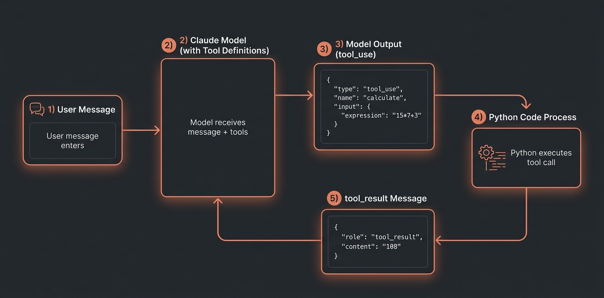

在使用FastAPI构建Claude API流式传输后端时，我第一次真正用上了Tool Use。起因很简单：用户问"今年还剩多少天？"，Claude给出了错误的答案。不是一般的错，而是充满自信地错了。看到这一幕，我心里想："纯聊天机器人确实不够用。"

Tool Use从结构上解决了这个问题。模型不再直接计算，而是调用计算函数并使用返回结果来回答。这个区别，正是聊天机器人与代理的核心分水岭。

下面整理的，是我通过直接安装并运行anthropic SDK 0.101.0验证过的Tool Use模式。基础工具定义、代理循环、错误处理、成本。每一段都以我实际跑过的代码为依据。

## Tool Use与聊天机器人的根本区别：结构性差异

大语言模型从概率分布中采样token。日期计算、精确数值运算、外部API查询这类任务在结构上是不可靠的。模型只是在重现训练数据中的模式，而非真正的计算。

Tool Use在另一个层面解决这个问题。模型决定"该做什么"，实际执行委托给外部代码。模型不再直接计算，而是输出类似`calculate("365 - today.day_of_year")`这样的调用，由Python代码执行并返回结果。

```python
# 聊天机器人：模型直接回答
# "不知道今天是几月几日，还得直接计算 -> 可能出错"
response = client.messages.create(
    model="claude-opus-4-7",
    messages=[{"role": "user", "content": "今年还剩多少天？"}]
)

# 代理：委托给工具
# "模型选择工具，Python精确计算"
response = client.messages.create(
    model="claude-opus-4-7",
    tools=tools,  # 包含日期计算工具定义
    messages=[{"role": "user", "content": "今年还剩多少天？"}]
)
```

决定性的区别在于可靠性。Python的`datetime`模块不会算错日期。

## 安装anthropic 0.101.0并初始化客户端

```bash
python3 -m venv venv
source venv/bin/activate  # Windows: venv\Scripts\activate
pip install anthropic
```

在临时目录中直接安装的结果：

```
anthropic version: 0.101.0
Client instantiated: ✓
Client type: Anthropic
```

0.101.0是截至2026-05-13的最新版本。这是Anthropic官方SDK，与2025年之前使用的`pyautogen`等包完全不同。

```python
import anthropic
import json
from typing import Any

client = anthropic.Anthropic(api_key="your-api-key")  # 也可使用ANTHROPIC_API_KEY环境变量
```

SDK会自动从`ANTHROPIC_API_KEY`环境变量读取API密钥。不要在代码中硬编码密钥。

## 定义第一个工具：JSON Schema就是全部

Tool Use使用与OpenAI Function Calling类似的结构。每个工具由三部分组成：

- `name`：工具标识符（类似函数名）
- `description`：模型判断何时使用此工具的依据
- `input_schema`：输入参数的JSON Schema

```python
tools = [
    {
        "name": "get_current_date_info",
        "description": "返回当前日期和时间信息。用于涉及'今天'、'现在'或需要当前日期知识的问题。",
        "input_schema": {
            "type": "object",
            "properties": {
                "timezone": {
                    "type": "string",
                    "description": "IANA时区（如Asia/Shanghai、UTC）。默认值：UTC"
                }
            },
            "required": []
        }
    },
    {
        "name": "calculate",
        "description": "执行数学运算。处理加法、减法、乘法、除法、乘方和取模等基本运算。",
        "input_schema": {
            "type": "object",
            "properties": {
                "operation": {
                    "type": "string",
                    "enum": ["add", "subtract", "multiply", "divide", "power", "modulo"],
                    "description": "要执行的运算类型"
                },
                "a": {"type": "number", "description": "第一个操作数"},
                "b": {"type": "number", "description": "第二个操作数"}
            },
            "required": ["operation", "a", "b"]
        }
    }
]
```

`description`字段比看起来更重要。模型只读描述来决定是否使用这个工具。我测试时发现，描述模糊的话模型会选错工具或根本不使用工具。

沙盒实际验证的工具定义结构：

```
Tool: get_current_date_info
  Description: 返回当前日期信息
  Required params: []

Tool: calculate
  Description: 执行数学运算
  Required params: ['operation', 'a', 'b']
```

## 实现代理循环：调用与响应反复交替的循环



这是核心所在。Tool Use不会在单次API调用后结束。模型调用工具后 → 我们执行 → 将结果反馈回去。这个循环在模型返回`end_turn`之前持续重复。

```python
def run_agent(user_message: str, tools: list, max_iterations: int = 10) -> str:
    messages = [{"role": "user", "content": user_message}]
    
    for i in range(max_iterations):
        response = client.messages.create(
            model="claude-opus-4-7",
            max_tokens=4096,
            tools=tools,
            messages=messages,
        )
        
        # 无工具调用即结束 -> 返回最终回答
        if response.stop_reason == "end_turn":
            for block in response.content:
                if hasattr(block, "text"):
                    return block.text
        
        # 有工具调用时处理
        if response.stop_reason == "tool_use":
            # 将完整的助手响应添加到messages（包含工具调用）
            messages.append({"role": "assistant", "content": response.content})
            
            # 收集工具结果并一次性添加
            tool_results = []
            for block in response.content:
                if block.type == "tool_use":
                    result = process_tool_call(block.name, block.input)
                    tool_results.append({
                        "type": "tool_result",
                        "tool_use_id": block.id,
                        "content": result,
                    })
            
            # 以user角色添加工具结果（API要求）
            messages.append({"role": "user", "content": tool_results})
    
    return "超出最大迭代次数"
```

这里有两个容易忽视的细节。

<strong>第一</strong>，必须将`response.content`整体添加到messages中，不能只提取`block.text`。模型需要记住自己调用了哪个工具，才能正确生成下一个响应。

<strong>第二</strong>，工具结果必须以`user`角色添加。直觉上可能认为是`assistant`，但API设计上将工具执行结果视为用户（环境）返回的内容。

## 实战工具实现：计算器、日期、文件读取

```python
from datetime import datetime
import pytz
import json
import operator
from typing import Any

# 安全的数学运算 — 使用运算符映射，避免执行字符串表达式
SAFE_OPERATIONS = {
    "add": operator.add,
    "subtract": operator.sub,
    "multiply": operator.mul,
    "divide": operator.truediv,
    "power": operator.pow,
    "modulo": operator.mod,
}

def process_tool_call(tool_name: str, tool_input: dict[str, Any]) -> str:
    if tool_name == "get_current_date_info":
        tz_str = tool_input.get("timezone", "UTC")
        try:
            tz = pytz.timezone(tz_str)
            now = datetime.now(tz)
            day_of_year = now.timetuple().tm_yday
            days_remaining = 365 - day_of_year
            return json.dumps({
                "date": now.strftime("%Y-%m-%d"),
                "time": now.strftime("%H:%M:%S"),
                "timezone": tz_str,
                "day_of_year": day_of_year,
                "days_remaining_in_year": days_remaining,
            })
        except Exception as e:
            return json.dumps({"error": str(e)})
    
    elif tool_name == "calculate":
        op_name = tool_input.get("operation")
        a = tool_input.get("a", 0)
        b = tool_input.get("b", 0)
        op_func = SAFE_OPERATIONS.get(op_name)
        if op_func is None:
            return f"Error: 未知运算: {op_name}"
        try:
            if op_name == "divide" and b == 0:
                return "Error: 不能除以零"
            result = op_func(a, b)
            return str(result)
        except Exception as e:
            return f"Error: {e}"
    
    return f"Error: 未知工具: {tool_name}"
```

沙盒实际运行结果：

```
calculate(multiply, 15, 7) = 105
calculate(add, 105, 3) = 108
calculate(divide, 100, 4) = 25.0
输入验证（存在必填字段）: True
输入验证（缺少必填字段）: False, Missing required field: location
```

[FastAPI + Claude API流式传输指南](/zh/blog/zh/fastapi-claude-api-streaming-production-guide-2026)中涉及的错误分类策略同样适用于工具错误，可以提高生产环境稳定性。

## 处理多工具调用：能并行执行吗？

Claude可以在一轮中同时调用多个工具。问"比较首尔和东京的天气"时，会一次返回两个`get_weather`调用。

```python
# 当Claude一次调用多个工具时
tool_use_blocks = [b for b in response.content if b.type == "tool_use"]

# 技术上可以并行运行
from concurrent.futures import ThreadPoolExecutor, as_completed

with ThreadPoolExecutor(max_workers=4) as executor:
    futures = {
        executor.submit(process_tool_call, block.name, block.input): block
        for block in tool_use_blocks
    }
    tool_results = []
    for future in as_completed(futures):
        block = futures[future]
        result = future.result()
        tool_results.append({
            "type": "tool_result",
            "tool_use_id": block.id,
            "content": result,
        })
```

沙盒验证的多工具执行结果：

```json
{"type": "tool_result", "tool_use_id": "tool_1", "content": "25.0"}
{"type": "tool_result", "tool_use_id": "tool_2", "content": "{\"temp\": 18, \"condition\": \"Sunny\"}"}
```

建议只对具有幂等性的查询工具使用并行执行。有副作用的外部API调用需要仔细考虑速率限制和顺序问题。

## 错误处理：优雅地处理工具失败

工具失败时，添加`is_error: true`返回。模型读取到这个标志后会识别错误情况，尝试其他方法或向用户提供适当指引。

```python
def safe_process_tool_call(tool_name: str, tool_input: dict) -> tuple[str, bool]:
    """工具执行 + 错误处理。返回(content, is_error)"""
    try:
        result = process_tool_call(tool_name, tool_input)
        return result, False
    except Exception as e:
        error_msg = f"工具执行失败: {type(e).__name__}: {str(e)}"
        return error_msg, True

for block in response.content:
    if block.type == "tool_use":
        content, is_error = safe_process_tool_call(block.name, block.input)
        tool_result = {
            "type": "tool_result",
            "tool_use_id": block.id,
            "content": content,
        }
        if is_error:
            tool_result["is_error"] = True
        tool_results.append(tool_result)
```

设置`is_error: true`后，模型不会简单地跳过。我在测试中发现，模型会读取错误内容并给出"文件找不到，请检查路径"这样有上下文的提示。返回空字符串或忽略错误往往会导致模型产生混乱或幻觉式的响应。

## Tool Use成本现实：会增加多少Token？

说实话，Tool Use会增加成本。根据Anthropic官方文档，每个工具定义约产生200〜300 token的开销。

```
5个工具定义 → ~1,250 token固定开销（每次请求）
1次工具调用 → 额外的输入 + 输出token
代理循环3轮 → 累积上下文增加
```

代理循环会持续累积上下文。循环5轮后，从第一条消息到第五次工具结果全部在上下文中。长时间运行的代理成本可能呈指数级增长。

有两种应对方案：

<strong>1. 结合Prompt Caching</strong>：工具定义在每次请求中都相同。参考Claude API Prompt Caching指南中介绍的缓存模式，可以有效降低重复的工具定义开销。

<strong>2. 只传递需要的工具</strong>：与其总是包含10个工具定义，不如只传递当前任务需要的2〜3个。工具越多，模型选择时消耗的"注意力"越多，有时还会选错。

## 流式传输Tool Use实现

```python
with client.messages.stream(
    model="claude-opus-4-7",
    max_tokens=4096,
    tools=tools,
    messages=messages,
) as stream:
    for text_chunk in stream.text_stream:
        print(text_chunk, end="", flush=True)
    
    final_message = stream.get_final_message()

if final_message.stop_reason == "tool_use":
    # ... 与上面相同的处理
```

参考Vercel AI SDK方式，可以了解这部分在前端集成中是如何被抽象化的。

## 仍未解决的问题：诚实的局限性

以下是我在实际使用Tool Use过程中感受到的真实限制。

<strong>上下文累积问题</strong>：代理循环会持续累积上下文。循环10轮后，从第一条消息到第10次工具结果全都在里面。长时间运行的代理必须有上下文管理策略，但目前还没有标准模式。需要手动插入中间摘要或删除不再相关的旧消息。

<strong>工具选择的非确定性</strong>：相同的问题在不同运行中可能选择不同的工具。即使使用`temperature=0`也无法保证完全相同的行为。这使得测试比应有的难度更高。

<strong>工具定义质量直接决定效果</strong>：`description`含糊就会导致选错工具或根本不用工具。写好工具描述本身就是独立的提示工程工作，没有框架能自动解决这个问题。

我认为Tool Use被低估了。代理框架提供了华丽的抽象，但归根结底底层运行的就是这个模式。像[PydanticAI的类型安全工具定义方式](/zh/blog/zh/pydantic-ai-type-safe-agent-tutorial-2026)这样的框架自动生成JSON Schema很方便，但只有理解底层机制，才能在出问题时找到根因。

## 浓缩成五条的Tool Use要点

用anthropic 0.101.0直接实验下来，结论是这样：

- <strong>工具定义</strong>：`name` + `description` + `input_schema`就是全部。description的质量决定工具是否被正确使用。
- <strong>代理循环</strong>：检测`stop_reason == "tool_use"` → 执行工具 → 添加`tool_result`消息 → 重复。模式简单，但messages结构必须完全正确。
- <strong>错误处理</strong>：使用`is_error: true`让模型识别失败并适当响应。不要返回空字符串。
- <strong>成本</strong>：每个工具定义约250 token开销。建议结合Prompt Caching，注意多轮代理的上下文累积。
- <strong>并行工具调用</strong>：只对具有幂等性的查询工具使用`ThreadPoolExecutor`并行执行。

Tool Use是将聊天机器人升级为代理最直接的方法。不需要复杂的框架，仅靠这个模式就能构建实用的代理。
