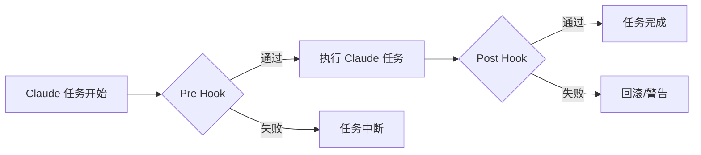
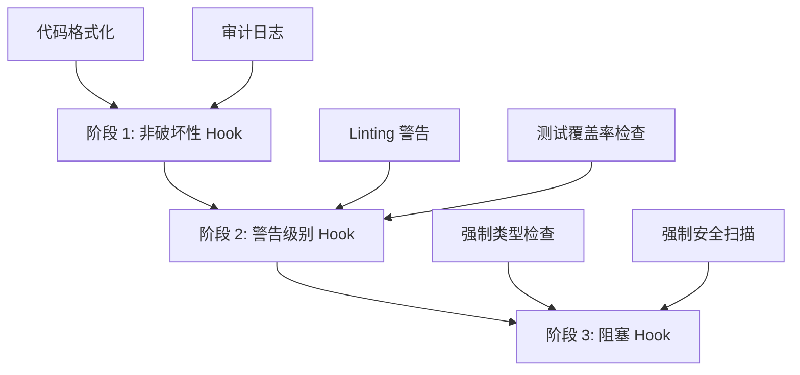
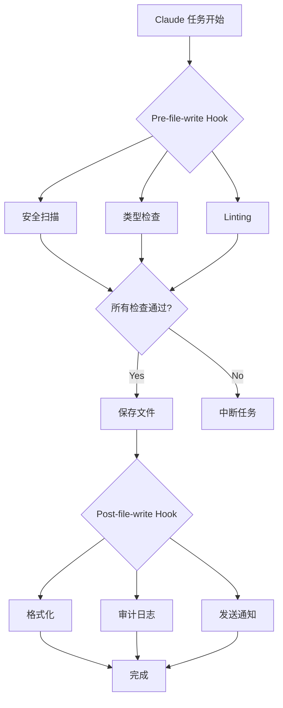

## 概述

虽然基于 AI 的编码助手能够大幅提升生产力，但<strong>确保代码质量的一致性和规则遵循</strong>仍然是一个艰巨的挑战。Claude Code 的 <strong>Hook 系统</strong>是解决这一问题的强大方案。

Hook 是在工作流程特定步骤自动执行的脚本，可以在代码编写、文件保存、提交前后等各个时点插入自定义验证逻辑。通过这种方式，可以完全自动化代码审查、测试、安全扫描、合规检查等流程。

### 本文涵盖的内容

- Hook 系统的核心概念和工作原理
- 各种 Hook 类型及其应用场景
- 实现编码规则自动验证
- 构建自动化代码审查流程
- CI/CD 流水线集成策略
- 实战示例和最佳实践

## 理解 Hook 系统

### 什么是 Hook？

Claude Code Hook 是<strong>在工作流程特定时点执行的用户自定义脚本</strong>。这与 Git Hook 的概念类似，但专门针对 Claude 的 AI 编码工作流程进行了优化。



### Hook 执行机制

Hook 通过退出码（exit code）控制 Claude 的行为：

```bash
# 成功（继续任务）
exit 0

# 失败（中断任务）
exit 1

# 警告（继续任务但显示警告）
exit 2
```

### Hook 目录结构

```
.claude/
└── hooks/
    ├── pre-file-write.sh      # 文件保存前执行
    ├── post-file-write.py     # 文件保存后执行
    ├── pre-commit.sh          # 提交前执行
    ├── post-commit.py         # 提交后执行
    └── code-review.js         # 自定义审查 Hook
```

## Hook 设置和配置

### 1. 创建基础 Hook

让我们从最简单的 Hook 开始：

````bash
#!/bin/bash
# .claude/hooks/pre-file-write.sh

# Hook 输入数据以 JSON 格式传递
input=$(cat)

# 提取文件路径
file_path=$(echo "$input" | jq -r '.file_path')

echo "Checking file: $file_path"

# 保护敏感文件
if [[ "$file_path" == *".env"* ]] || [[ "$file_path" == *"credentials"* ]]; then
    echo "Error: Cannot modify sensitive files"
    exit 1
fi

# 成功
exit 0
````

### 2. 设置执行权限

Hook 脚本必须具有可执行权限：

```bash
chmod +x .claude/hooks/pre-file-write.sh

# 为所有 Hook 授予执行权限
chmod +x .claude/hooks/*.sh
chmod +x .claude/hooks/*.py
```

### 3. Hook 数据结构

Claude 以 JSON 格式向 Hook 传递上下文信息：

```json
{
  "file_path": "src/components/Button.tsx",
  "operation": "write",
  "content": "...",
  "metadata": {
    "timestamp": "2025-10-29T10:30:00Z",
    "user": "developer@example.com"
  }
}
```

## 自动验证编码规则

### 1. TypeScript 类型检查 Hook

```bash
#!/bin/bash
# .claude/hooks/typescript-check.sh

input=$(cat)
file_path=$(echo "$input" | jq -r '.file_path')

# 仅检查 TypeScript 文件
if [[ "$file_path" != *.ts ]] && [[ "$file_path" != *.tsx ]]; then
    exit 0
fi

echo "Running TypeScript type check..."

# 执行类型检查
npx tsc --noEmit "$file_path" 2>&1 | tee /tmp/tsc-output.txt

if [ ${PIPESTATUS[0]} -ne 0 ]; then
    echo "❌ Type check failed"
    cat /tmp/tsc-output.txt
    exit 1
fi

echo "✅ Type check passed"
exit 0
```

### 2. ESLint 检查 Hook

```python
#!/usr/bin/env python3
# .claude/hooks/eslint-check.py

import sys
import json
import subprocess

def main():
    # 读取输入数据
    input_data = json.loads(sys.stdin.read())
    file_path = input_data.get('file_path', '')

    # 仅检查 JavaScript/TypeScript 文件
    if not (file_path.endswith('.js') or
            file_path.endswith('.ts') or
            file_path.endswith('.jsx') or
            file_path.endswith('.tsx')):
        sys.exit(0)

    print(f"Running ESLint on {file_path}...")

    # 运行 ESLint
    result = subprocess.run(
        ['npx', 'eslint', file_path, '--format', 'json'],
        capture_output=True,
        text=True
    )

    if result.returncode != 0:
        lint_results = json.loads(result.stdout)

        # 输出错误摘要
        for file_result in lint_results:
            for message in file_result.get('messages', []):
                severity = 'Error' if message['severity'] == 2 else 'Warning'
                print(f"{severity}: {message['message']} "
                      f"(line {message['line']}, col {message['column']})")

        sys.exit(1)

    print("✅ ESLint passed")
    sys.exit(0)

if __name__ == '__main__':
    main()
```

### 3. 自动应用代码格式化

```bash
#!/bin/bash
# .claude/hooks/post-file-write.sh

input=$(cat)
file_path=$(echo "$input" | jq -r '.file_path')

# 支持的文件扩展名
if [[ "$file_path" =~ \.(js|ts|jsx|tsx|json|css|scss)$ ]]; then
    echo "Auto-formatting $file_path with Prettier..."

    npx prettier --write "$file_path"

    if [ $? -eq 0 ]; then
        echo "✅ Formatted successfully"
    else
        echo "⚠️  Formatting failed, but continuing..."
    fi
fi

exit 0
```

## 自动化代码审查流程

### 1. 综合代码审查 Hook

```bash
#!/bin/bash
# .claude/hooks/comprehensive-review.sh

set -e

input=$(cat)
file_path=$(echo "$input" | jq -r '.file_path')

echo "🔍 Starting comprehensive code review for $file_path"

# 分步验证
declare -a checks=(
    "Security scan"
    "Type checking"
    "Linting"
    "Test coverage"
    "Documentation check"
)

# 1. 安全扫描
echo "🔒 ${checks[0]}..."
if command -v semgrep &> /dev/null; then
    semgrep --config=auto "$file_path" --quiet
fi

# 2. 类型检查
echo "📝 ${checks[1]}..."
if [[ "$file_path" =~ \.(ts|tsx)$ ]]; then
    npx tsc --noEmit "$file_path"
fi

# 3. Linting
echo "✨ ${checks[2]}..."
if [[ "$file_path" =~ \.(js|ts|jsx|tsx)$ ]]; then
    npx eslint "$file_path"
fi

# 4. 确认测试覆盖率
echo "🧪 ${checks[3]}..."
test_file="${file_path/src/tests}"
test_file="${test_file/.ts/.test.ts}"

if [ ! -f "$test_file" ]; then
    echo "⚠️  Warning: No test file found at $test_file"
    # 仅警告并继续
fi

# 5. 文档检查
echo "📚 ${checks[4]}..."
if [[ "$file_path" =~ \.(ts|tsx|js|jsx)$ ]]; then
    # JSDoc 注释检查
    if ! grep -q "\/\*\*" "$file_path"; then
        echo "⚠️  Warning: No JSDoc comments found"
    fi
fi

echo "✅ Code review completed successfully"
exit 0
```

### 2. SOX/SOC2 审计追踪 Hook

```python
#!/usr/bin/env python3
# .claude/hooks/audit-trail.py

import sys
import json
import hashlib
from datetime import datetime
import os

AUDIT_LOG = '.claude/audit/trail.jsonl'

def main():
    # 输入数据
    input_data = json.loads(sys.stdin.read())

    # 创建审计日志目录
    os.makedirs(os.path.dirname(AUDIT_LOG), exist_ok=True)

    # 生成审计条目
    audit_entry = {
        'timestamp': datetime.utcnow().isoformat(),
        'operation': input_data.get('operation', 'unknown'),
        'file_path': input_data.get('file_path', ''),
        'user': os.environ.get('USER', 'unknown'),
        'content_hash': hashlib.sha256(
            input_data.get('content', '').encode()
        ).hexdigest(),
        'metadata': input_data.get('metadata', {})
    }

    # 以 JSONL 格式追加日志
    with open(AUDIT_LOG, 'a') as f:
        f.write(json.dumps(audit_entry) + '\n')

    print(f"✅ Audit trail recorded: {audit_entry['timestamp']}")
    sys.exit(0)

if __name__ == '__main__':
    main()
```

### 3. Pull Request 自动验证

```bash
#!/bin/bash
# .claude/hooks/pr-validation.sh

input=$(cat)
file_path=$(echo "$input" | jq -r '.file_path')

echo "🔍 PR Validation Checks"

# 检查清单
declare -A checks=(
    ["Tests"]="npm test"
    ["Build"]="npm run build"
    ["Type Check"]="npm run typecheck"
    ["Lint"]="npm run lint"
)

failed=0

for check_name in "${!checks[@]}"; do
    echo ""
    echo "Running: $check_name"

    if eval "${checks[$check_name]}" > /tmp/check-output.txt 2>&1; then
        echo "✅ $check_name passed"
    else
        echo "❌ $check_name failed"
        cat /tmp/check-output.txt
        failed=1
    fi
done

if [ $failed -eq 1 ]; then
    echo ""
    echo "❌ PR validation failed. Please fix the issues before committing."
    exit 1
fi

echo ""
echo "✅ All PR validation checks passed"
exit 0
```

## CI/CD 集成策略

### 1. GitHub Actions 集成

```yaml
# .github/workflows/claude-hooks.yml
name: Claude Code Hooks

on:
  pull_request:
    types: [opened, synchronize]

jobs:
  run-hooks:
    runs-on: ubuntu-latest

    steps:
      - uses: actions/checkout@v4

      - name: Setup Node.js
        uses: actions/setup-node@v4
        with:
          node-version: '20'

      - name: Install dependencies
        run: npm ci

      - name: Make hooks executable
        run: chmod +x .claude/hooks/*.sh

      - name: Run pre-commit hooks
        run: |
          for file in $(git diff --name-only origin/main); do
            if [ -f ".claude/hooks/pre-commit.sh" ]; then
              echo "{\"file_path\": \"$file\"}" | .claude/hooks/pre-commit.sh
            fi
          done

      - name: Run code review hook
        run: |
          for file in $(git diff --name-only origin/main); do
            if [ -f ".claude/hooks/code-review.sh" ]; then
              echo "{\"file_path\": \"$file\"}" | .claude/hooks/code-review.sh
            fi
          done
```

### 2. N8N 工作流自动化

将 Hook 执行结果发送到 N8N 以实现通知自动化：

```bash
#!/bin/bash
# .claude/hooks/notify-n8n.sh

input=$(cat)
file_path=$(echo "$input" | jq -r '.file_path')

# N8N webhook URL（从环境变量获取）
WEBHOOK_URL="${N8N_WEBHOOK_URL}"

if [ -z "$WEBHOOK_URL" ]; then
    echo "Warning: N8N_WEBHOOK_URL not set"
    exit 0
fi

# 生成通知负载
payload=$(cat <<EOF
{
  "event": "code_review_completed",
  "file": "$file_path",
  "timestamp": "$(date -u +%Y-%m-%dT%H:%M:%SZ)",
  "status": "success"
}
EOF
)

# 发送到 N8N
curl -X POST "$WEBHOOK_URL" \
  -H "Content-Type: application/json" \
  -d "$payload" \
  --silent

exit 0
```

### 3. Telegram 通知集成

```python
#!/usr/bin/env python3
# .claude/hooks/telegram-notify.py

import sys
import json
import os
import requests

def send_telegram_message(message):
    bot_token = os.environ.get('TELEGRAM_BOT_TOKEN')
    chat_id = os.environ.get('TELEGRAM_CHAT_ID')

    if not bot_token or not chat_id:
        print("Warning: Telegram credentials not set")
        return

    url = f"https://api.telegram.org/bot{bot_token}/sendMessage"
    payload = {
        'chat_id': chat_id,
        'text': message,
        'parse_mode': 'Markdown'
    }

    try:
        requests.post(url, json=payload, timeout=5)
    except Exception as e:
        print(f"Warning: Failed to send Telegram notification: {e}")

def main():
    input_data = json.loads(sys.stdin.read())
    file_path = input_data.get('file_path', 'unknown')

    message = f"""
🔍 *Code Review Completed*

📁 File: `{file_path}`
✅ All checks passed
🕐 {input_data.get('metadata', {}).get('timestamp', 'N/A')}
"""

    send_telegram_message(message)
    sys.exit(0)

if __name__ == '__main__':
    main()
```

## 实战示例和模式

### 1. 渐进式 Hook 引入策略

如果一次性应用所有 Hook，可能会减慢工作流程。采用渐进式引入策略：



**阶段 1 实现：**

```bash
#!/bin/bash
# .claude/hooks/phase1-gentle.sh

input=$(cat)

# 始终成功但提供信息
echo "ℹ️  Code formatting applied"
echo "ℹ️  Audit trail recorded"

exit 0
```

**阶段 2 实现：**

```bash
#!/bin/bash
# .claude/hooks/phase2-warnings.sh

input=$(cat)
file_path=$(echo "$input" | jq -r '.file_path')

# 运行 Linting 但即使失败也继续
npx eslint "$file_path" || echo "⚠️  Linting issues found"

# 以警告码退出
exit 2
```

**阶段 3 实现：**

```bash
#!/bin/bash
# .claude/hooks/phase3-blocking.sh

input=$(cat)
file_path=$(echo "$input" | jq -r '.file_path')

# 类型检查失败时中断
npx tsc --noEmit "$file_path"

if [ $? -ne 0 ]; then
    echo "❌ Type check failed - blocking operation"
    exit 1
fi

exit 0
```

### 2. Hook 条件执行

不需要对所有文件执行所有 Hook：

```bash
#!/bin/bash
# .claude/hooks/conditional-hooks.sh

input=$(cat)
file_path=$(echo "$input" | jq -r '.file_path')

# 根据条件执行 Hook
case "$file_path" in
    *.ts|*.tsx)
        echo "Running TypeScript checks..."
        .claude/hooks/typescript-check.sh <<< "$input"
        ;;
    *.py)
        echo "Running Python checks..."
        .claude/hooks/python-check.sh <<< "$input"
        ;;
    *.md)
        echo "Running Markdown lint..."
        .claude/hooks/markdown-lint.sh <<< "$input"
        ;;
    *)
        echo "No specific checks for this file type"
        ;;
esac

exit 0
```

### 3. Hook 性能优化

如果 Hook 太慢，会影响开发体验：

```bash
#!/bin/bash
# .claude/hooks/optimized-hook.sh

input=$(cat)
file_path=$(echo "$input" | jq -r '.file_path')

# 设置超时（5秒）
TIMEOUT=5

# 并行执行
(
    timeout $TIMEOUT npx eslint "$file_path" &
    timeout $TIMEOUT npx prettier --check "$file_path" &
    wait
) 2>/dev/null

if [ $? -eq 124 ]; then
    echo "⚠️  Hook timeout - skipping detailed checks"
    exit 2
fi

exit 0
```

### 4. 利用缓存进行优化

```bash
#!/bin/bash
# .claude/hooks/cached-checks.sh

input=$(cat)
file_path=$(echo "$input" | jq -r '.file_path')
content=$(echo "$input" | jq -r '.content')

# 生成内容哈希
content_hash=$(echo "$content" | sha256sum | cut -d' ' -f1)
cache_dir=".claude/cache"
cache_file="$cache_dir/$content_hash"

mkdir -p "$cache_dir"

# 检查缓存
if [ -f "$cache_file" ]; then
    cache_result=$(cat "$cache_file")
    echo "✅ Using cached result: $cache_result"
    exit 0
fi

# 执行实际检查
echo "Running checks..."
npx eslint "$file_path"

if [ $? -eq 0 ]; then
    echo "passed" > "$cache_file"
    exit 0
else
    echo "failed" > "$cache_file"
    exit 1
fi
```

## 最佳实践和技巧

### 1. Hook 设计原则

<strong>将 SOLID 原则应用于 Hook：</strong>

- <strong>单一职责（Single Responsibility）</strong>：一个 Hook 只负责一项任务
- <strong>开闭原则（Open/Closed）</strong>：对扩展开放，对修改封闭
- <strong>里氏替换（Liskov Substitution）</strong>：设计可替换的 Hook
- <strong>接口隔离（Interface Segregation）</strong>：只请求必要的数据
- <strong>依赖倒置（Dependency Inversion）</strong>：依赖抽象而非具体实现

### 2. 错误处理策略

```bash
#!/bin/bash
# .claude/hooks/error-handling.sh

set -euo pipefail  # 发生错误时立即中断

input=$(cat)

# 错误日志文件
ERROR_LOG=".claude/logs/hook-errors.log"
mkdir -p "$(dirname "$ERROR_LOG")"

# 错误处理器
handle_error() {
    local exit_code=$?
    local line_num=$1

    echo "Error on line $line_num (exit code: $exit_code)" | tee -a "$ERROR_LOG"

    # 记录错误详细信息
    echo "Input data:" >> "$ERROR_LOG"
    echo "$input" >> "$ERROR_LOG"
    echo "---" >> "$ERROR_LOG"

    exit 1
}

# 设置错误陷阱
trap 'handle_error $LINENO' ERR

# Hook 逻辑...
echo "Executing hook logic..."

exit 0
```

### 3. 编写可测试的 Hook

```bash
#!/bin/bash
# .claude/hooks/testable-hook.sh

# 支持测试模式
TEST_MODE=${TEST_MODE:-false}

if [ "$TEST_MODE" = "true" ]; then
    # 测试用输入数据
    input='{"file_path": "test.ts", "content": "// test"}'
else
    # 实际输入数据
    input=$(cat)
fi

# 执行逻辑
file_path=$(echo "$input" | jq -r '.file_path')
echo "Processing: $file_path"

exit 0
```

Hook 测试：

```bash
# 运行测试
TEST_MODE=true .claude/hooks/testable-hook.sh

# 使用实际数据测试
echo '{"file_path": "src/app.ts"}' | .claude/hooks/testable-hook.sh
```

### 4. 文档化模板

```bash
#!/bin/bash
# .claude/hooks/example-hook.sh

# Hook 信息
# Name: Example Hook
# Purpose: 在文件保存前执行基本验证
# Trigger: pre-file-write
# Exit Codes:
#   0 - Success（继续任务）
#   1 - Error（中断任务）
#   2 - Warning（继续任务但显示警告）
#
# Input JSON Schema:
# {
#   "file_path": "string",
#   "operation": "string",
#   "content": "string",
#   "metadata": {}
# }
#
# Environment Variables:
#   HOOK_DEBUG - 设置为 "true" 启用详细输出
#
# Dependencies:
#   - jq (JSON parser)
#   - bash 4.0+
#
# Author: Your Name
# Last Updated: 2025-10-29

# 调试模式
DEBUG=${HOOK_DEBUG:-false}

if [ "$DEBUG" = "true" ]; then
    set -x
fi

# Hook 逻辑...
input=$(cat)
echo "Hook executed successfully"

exit 0
```

### 5. 安全考虑事项

```bash
#!/bin/bash
# .claude/hooks/secure-hook.sh

set -euo pipefail

input=$(cat)

# 1. 输入验证
if ! echo "$input" | jq empty 2>/dev/null; then
    echo "Error: Invalid JSON input"
    exit 1
fi

# 2. 防止路径注入
file_path=$(echo "$input" | jq -r '.file_path')

# 仅允许绝对路径或安全地规范化相对路径
if [[ "$file_path" =~ \.\. ]]; then
    echo "Error: Path traversal detected"
    exit 1
fi

# 3. 防止记录敏感数据
# 不在日志中记录内容
echo "Processing file: $(basename "$file_path")"

# 4. 环境变量验证
if [ -n "${GITHUB_TOKEN:-}" ]; then
    echo "Warning: Sensitive env var detected, masking in logs"
fi

# 5. 安全处理临时文件
temp_file=$(mktemp)
trap "rm -f $temp_file" EXIT

# Hook 逻辑...

exit 0
```

## 故障排除指南

### 常见问题和解决方案

#### 1. Hook 未执行

<strong>症状：</strong>Hook 脚本完全不执行

<strong>解决方案：</strong>

```bash
# 检查执行权限
ls -la .claude/hooks/

# 授予执行权限
chmod +x .claude/hooks/*.sh

# 检查 Hook 目录
cat .claude/settings.json | jq '.hooks'
```

#### 2. Hook 运行缓慢

<strong>症状：</strong>Hook 执行导致工作流程显著变慢

<strong>解决方案：</strong>

```bash
# 测量 Hook 执行时间
time echo '{"file_path": "test.ts"}' | .claude/hooks/slow-hook.sh

# 通过并行执行优化
# Before: 顺序执行（慢）
check1.sh && check2.sh && check3.sh

# After: 并行执行（快）
check1.sh & check2.sh & check3.sh & wait
```

#### 3. Hook 调试

```bash
#!/bin/bash
# .claude/hooks/debug-hook.sh

# 将调试输出保存到文件
DEBUG_LOG=".claude/logs/hook-debug.log"
mkdir -p "$(dirname "$DEBUG_LOG")"

{
    echo "=== Hook Debug Log ==="
    echo "Timestamp: $(date)"
    echo "Input:"
    cat
} | tee -a "$DEBUG_LOG"

# 解析输入数据
input=$(tail -n 1 "$DEBUG_LOG")

echo "Parsed input: $input" >> "$DEBUG_LOG"

exit 0
```

#### 4. JSON 解析错误

```bash
#!/bin/bash
# .claude/hooks/safe-json-parsing.sh

input=$(cat)

# 检查 jq 是否已安装
if ! command -v jq &> /dev/null; then
    echo "Error: jq is not installed"
    exit 1
fi

# JSON 有效性验证
if ! echo "$input" | jq empty 2>/dev/null; then
    echo "Error: Invalid JSON input"
    echo "Received: $input"
    exit 1
fi

# 安全提取值
file_path=$(echo "$input" | jq -r '.file_path // "unknown"')

exit 0
```

## 实战场景：构建企业环境

### 完整的 Hook 系统架构



### 集成 Hook 脚本

```bash
#!/bin/bash
# .claude/hooks/enterprise-review.sh

set -euo pipefail

input=$(cat)
file_path=$(echo "$input" | jq -r '.file_path')

LOG_DIR=".claude/logs/$(date +%Y-%m-%d)"
mkdir -p "$LOG_DIR"

echo "🚀 Enterprise Code Review Pipeline"
echo "━━━━━━━━━━━━━━━━━━━━━━━━━━━━━━━━"

# 第1步：安全扫描
echo "🔒 Security Scan..."
if command -v semgrep &> /dev/null; then
    semgrep --config=auto "$file_path" --json > "$LOG_DIR/security.json"
    echo "✅ Security scan completed"
else
    echo "⚠️  Semgrep not installed, skipping"
fi

# 第2步：静态分析
echo "📊 Static Analysis..."
if [[ "$file_path" =~ \.(ts|tsx)$ ]]; then
    npx tsc --noEmit "$file_path" 2>&1 | tee "$LOG_DIR/typecheck.log"
    echo "✅ Type check completed"
fi

# 第3步：代码质量
echo "✨ Code Quality Check..."
if command -v sonar-scanner &> /dev/null; then
    sonar-scanner -Dsonar.sources="$file_path" > "$LOG_DIR/sonar.log"
    echo "✅ SonarQube analysis completed"
fi

# 第4步：测试覆盖率
echo "🧪 Test Coverage..."
npm run test:coverage -- "$file_path" > "$LOG_DIR/coverage.log" 2>&1 || true

# 第5步：审计追踪
echo "📝 Audit Trail..."
python3 .claude/hooks/audit-trail.py <<< "$input"

# 第6步：结果摘要
echo ""
echo "📋 Review Summary"
echo "━━━━━━━━━━━━━━━━━━━━━━━━━━━━━━━━"
echo "File: $file_path"
echo "Timestamp: $(date -u +%Y-%m-%dT%H:%M:%SZ)"
echo "Logs: $LOG_DIR/"
echo ""
echo "✅ All checks passed"

exit 0
```

## 结论

Claude Code Hook 系统是为基于 AI 的编码工作流程提供<strong>一致性、质量和安全性</strong>的强大工具。总结本文涵盖的内容：

### 核心要点

1. <strong>Hook 是工作流自动化的核心</strong>
   - 在特定时点插入用户自定义逻辑
   - 通过退出码控制 Claude 行为
   - 支持多种语言和工具

2. <strong>渐进式引入至关重要</strong>
   - 阶段 1：非破坏性 Hook（提供信息）
   - 阶段 2：警告级别 Hook（指出问题）
   - 阶段 3：阻塞 Hook（中断任务）

3. <strong>考虑性能和安全</strong>
   - 通过并行执行提升速度
   - 通过缓存防止重复工作
   - 输入验证和安全处理

4. <strong>实战应用模式</strong>
   - 通过条件执行提高效率
   - 通过 CI/CD 集成扩展自动化
   - 通过通知系统确保透明度

### 下一步

1. 为项目设置基础 Hook
2. 实现编码规则自动验证
3. 集成 CI/CD 流水线
4. 在整个团队中推广和改进

有效利用 Hook 系统可以提高代码质量、缩短审查时间并实现合规自动化。从小的 Hook 开始，逐步扩展。

## 参考资料

- [Claude Code Hooks Implementation Guide](https://medium.com/@richardhightower/claude-code-hooks-implementation-guide-audit-system-03763748700f)
- [Complete Guide: Creating Claude Code Hooks](https://suiteinsider.com/complete-guide-creating-claude-code-hooks/)
- [6 Easy Ways to Level Up Claude Code](https://blog.logrocket.com/6-easy-ways-to-level-up-claude-code/)
- [Claude Code Documentation Map](https://simonwillison.net/2025/Oct/24/claude-code-docs-map/)
- [GitHub Actions with Claude Code](https://skywork.ai/blog/claude-code-plus-ci-cd-integration-setup/)
