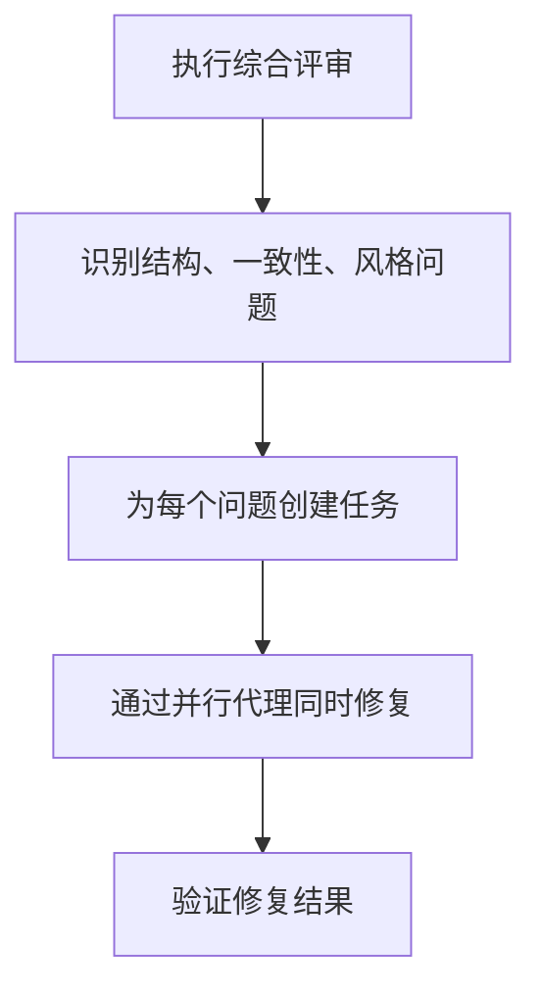
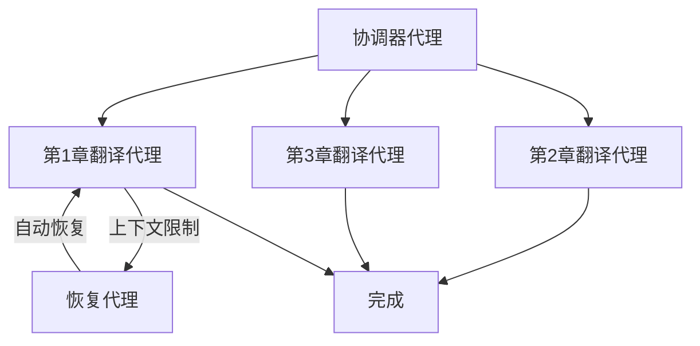

# Claude Code /insights 体验记：4,516 条消息揭示的 AI 编程模式

"我真的在高效使用 Claude Code 吗？"

即使每天都在使用 AI 编程工具，这个问题也很难明确回答。直到我发现了 Claude Code 中 `/insights` 这个隐藏的宝藏功能——它能基于实际使用数据，客观地诊断你的工作流程。

在这篇文章中，我将完整公开在实际项目中运行 `/insights` 的结果，并分享由此获得的洞察和实战技巧。

## /insights 是什么？

`/insights` 是 Claude Code v2.1 引入的使用模式分析功能。它基于本地存储的使用数据，提供以下分析：

- <strong>使用统计</strong>：消息数量、会话数量、文件修改历史
- <strong>运行良好的方面</strong>：正在有效使用的功能和模式
- <strong>阻碍因素</strong>：降低生产力的瓶颈
- <strong>改进建议</strong>：可以立即应用的实战技巧
- <strong>项目领域分析</strong>：在不同任务中的使用方式

可以把它看作"AI 编程工作流的健康检查"。使用方法也很简单——在 Claude Code 中输入 `/insights` 即可。

## 实际运行结果：核心指标

> <strong>分析期间</strong>：2025-12-31 至 2026-02-03（约 35 天）
> <strong>环境</strong>：Claude Code v2.1.31

### 使用量概览

| 指标 | 数值 |
|------|------|
| 总消息 | <strong>4,516 条</strong> |
| 总会话 | <strong>1,042 次</strong> |
| 文件修改 | <strong>6,267 个</strong> |
| 代码变更量 | <strong>+1,046,046 / -109,155 行</strong> |
| 活跃天数 | <strong>15 天</strong> |
| 日均消息 | <strong>301.1 条</strong> |

仅从数字来看就相当令人印象深刻。每天平均与 Claude Code 交换 301 条消息，这基本意味着全天候的 AI 结对编程。超过 100 万行的代码新增包含了小说项目和博客内容生成的结果。

### 工具使用 Top 6

```
Read     ████████████████████████████ 11,798 次
Edit     ████████████████████████   10,068 次
Bash     ████████████████         6,334 次
Write    ████████████             3,465 次
Grep     ██████                   2,059 次
TodoWrite ██████                  1,825 次
```

Read 和 Edit 占据压倒性地位。这表明 Claude 遵循着"先理解，后修改"的模式——在充分阅读和理解现有代码后再进行修改。TodoWrite 进入 Top 6 也很有趣，这证明了并行代理和任务编排的积极使用。

### 语言分布

| 语言 | 使用次数 | 占比 |
|------|----------|------|
| Markdown | 5,862 | 39.5% |
| TypeScript | 4,540 | 30.6% |
| Rust | 2,096 | 14.1% |
| JavaScript | 1,406 | 9.5% |
| JSON | 678 | 4.6% |
| YAML | 304 | 2.0% |

Markdown 排名第一是因为博客文章和小说内容占据了相当大的比重。TypeScript 和 Rust 合计约占总量的 45%，说明实际开发工作也非常活跃。

## "运行良好的方面"分析

以下是 `/insights` 指出的三大优势。

### 1. 并行代理与任务编排

```
TodoWrite: 1,825 次
TaskCreate: 1,276 次
合计: 4,751 次（TodoWrite + TaskCreate + TaskUpdate）
```

在执行大规模任务时，我总是先创建任务列表，然后将其分配给并行代理。`/insights` 将这评价为"精密的工作流（sophisticated workflow）"。

实际应用示例：
- <strong>小说项目</strong>：综合评审 → 问题识别 → 并行修复多个文件
- <strong>博客生成</strong>：韩语撰写 → 日语/英语/中文并行翻译
- <strong>代码重构</strong>：问题分析 → 任务分配 → 同步修复

这个模式的核心是"先计划，并行执行"。

### 2. 自定义斜杠命令的活用

创建像 `/write-post` 这样的自定义斜杠命令来自动化重复任务也获得了高度评价。撰写一篇博客文章需要调研 → 韩语撰写 → 3 种语言翻译 → 图片生成 → 元数据更新等 10 个以上的步骤，而将这些编码为一个命令是一个显著的优势。

> "将复杂的多步骤内容生成转换为可重复的单命令操作"
> — /insights 分析结果

### 3. 日语小说的两阶段模式

在日语小说项目中使用的工作流也获得了好评：



"一人 AI 出版社"这个描述令人印象深刻。寻找情节漏洞、检查角色名称一致性、验证风格统一性，然后并行修复跨多个文件的所有问题——这就是整个工作流。

## "阻碍因素"分析

并非一切都很完美。`/insights` 也会冷静地指出问题所在。

### 上下文限制——最大的瓶颈

> "上下文限制导致最有雄心的会话在执行中途终止"

这是最大的问题。特别是在以下任务中频繁发生：

- <strong>小说评审</strong>：多卷综合评审中被中断
- <strong>翻译工作</strong>：大规模翻译执行中途断开
- <strong>博客内容生成</strong>：在初始读取/设置阶段就终止

根本原因是<strong>"在单个会话中分配过大的任务"</strong>。试图一次解决所有问题的贪心反而造成了低效。

### 错误模式分析

| 错误类型 | 发生次数 |
|----------|----------|
| Command Failed | 533 次 |
| File Too Large | 293 次 |
| Other | 151 次 |
| File Changed | 62 次 |
| Edit Failed | 37 次 |
| File Not Found | 32 次 |

"File Too Large" 错误达到 293 次，是因为小说项目中的大型文本文件。看到这些数据后，我深刻认识到了文件分割策略的必要性。

## "快速改进"分析

`/insights` 提出的 Quick Wins 非常实用。

### 1. 引入检查点机制

> "在 headless 模式下通过章节/段落检查点执行翻译和内容生成"

要解决长时间任务中途断裂的问题，需要在完成每个阶段时将进度保存到文件中。这样即使会话终止，下一个会话也可以从中断处继续。

```markdown
<!-- .claude/task-status.md 示例 -->
## 博客文章撰写进度
- [x] 调研完成
- [x] 韩语初稿撰写
- [ ] 日语翻译
- [ ] 英语翻译
- [ ] 中文翻译
- [ ] 元数据更新
```

### 2. 结构化检查点文件

> "将 TodoWrite/TaskCreate 模式正式化为结构化检查点文件"

虽然已经使用了 4,751 次 TodoWrite，但建议将其发展为更系统的基于文件的检查点。关键在于会话间的状态共享。

### 3. 自动恢复设计

> "设计新会话能够检测并恢复未完成的任务"

即在 CLAUDE.md 中添加"Long-Running Tasks"部分，明确规定长时间任务时始终将中间进度保存到文件。当接近上下文限制时，在 `.claude/task-status.md` 中记录已完成/未完成任务的摘要。

## 项目领域分析

`/insights` 还提供了按任务类型的详细分析。

### 日语小说与质量评审（约 3 个会话）

进行了出版质量评估、设计一致性审查、多卷综合评审。系统性地识别结构、一致性、风格问题并并行修复，本质上是用 AI 自动化了出版行业的校对流程。

### 小说翻译——日语到韩语（约 1 个会话）

利用 Claude Code 的并行代理功能进行翻译工作。通过章节并行处理提高了速度，但上下文限制问题导致了一些会话中断。

### 博客内容生成（约 2 个会话）

通过自定义 `/write-post` 命令生成博客文章。这是一个以调研文件为输入，生成 4 种语言内容的自动化流水线，但有时在初始设置阶段就耗尽了上下文。

### TypeScript 与 Rust 开发

TypeScript 4,540 次，Rust 2,096 次，是最活跃的开发领域。还包括 JavaScript（1,406 次）、HTML、CSS、JSON 的工作。这表明从 Web 前端到系统编程都在广泛使用。

### 多文件问题修复与维护（约 48 个会话）

进行了 51 次多文件变更。广泛使用 TodoWrite 和任务管理工具，通过并行代理执行系统性审查和批量修复。这占据了总会话的最大比重。

## 时段使用模式

```
上午 (06-12)  ████████           419 次 (9.3%)
下午 (12-18)  █████████████████████████████████ 1,644 次 (36.4%)
晚间 (18-24)  ██████████████████████████████████ 1,675 次 (37.1%)
深夜 (00-06)  ████████████████   778 次 (17.2%)
```

下午和晚间集中工作的模式非常明显。深夜仍有 17% 的使用量，这也是在利用 AI 的优势——能够在深夜时分维持一个不会疲倦的编程伙伴。

用户响应时间也是有趣的数据：

| 指标 | 值 |
|------|------|
| 中位数 | 155.0 秒 |
| 平均值 | 368.1 秒 |
| 最频繁区间 | 2~5 分钟（621 次） |

响应中位数约 2.5 分钟，代表的是审查 Claude 的回复并发出下一条指令所需的时间。这反映的是"人类监督下的 AI 工作"模式，而非完全自动化。

## 面向未来的建议

`/insights` 还提出了一些值得尝试的未来工作流。

### 自愈式并行翻译流水线



当达到上下文限制时，恢复代理自动重新启动的"fire-and-forget"模式。目前需要手动重启会话，但引入这种模式后可以实现完全自动化。

### 小说质量验证测试用例

还有一个想法是像 CI 流水线一样自动验证小说质量：

- 角色名称一致性测试
- 时间线验证测试
- 风格指南合规测试

正如代码有单元测试一样，为创意写作引入自动化质量验证的想法非常新颖。

## 实战应用技巧

通过 `/insights` 获得的经验教训总结如下。

### 可以立即应用的内容

1. <strong>大任务一定要拆分</strong>：不要在单个会话中塞入所有内容，按章节/段落/模块进行拆分。

2. <strong>将检查点保存到文件</strong>：创建像 `task-status.md` 这样的文件记录进度，即使会话断开也能继续工作。

3. <strong>创建自定义斜杠命令</strong>：如果有重复性任务，就像 `/write-post` 一样编码为命令。一次创建，永久复用。

4. <strong>积极使用并行代理</strong>：通过 `TodoWrite` → `TaskCreate` 模式分配工作，效率将大幅提升。

### 最大化利用 /insights 的方法

1. <strong>定期执行</strong>：每月执行一次 `/insights`，可以追踪工作模式的变化。

2. <strong>反映到 CLAUDE.md</strong>：将 `/insights` 建议的改进事项记录到 CLAUDE.md，Claude Code 会自动遵循这些规则。

3. <strong>关注错误模式</strong>：如果"File Too Large"或"Command Failed"等错误很多，说明需要调整工作流。

4. <strong>利用 HTML 报告</strong>：`/insights` 还会生成详细的 HTML 报告。可视化的数据可以进行更深入的分析。

## 推荐给其他开发者的原因

运行 `/insights` 后最大的感受是：<strong>"我不了解自己是如何使用 AI 的，却以为自己用得很好"</strong>。

基于数据的客观诊断带来以下价值：

- <strong>发现隐藏的瓶颈</strong>：如果没有认识到上下文限制的问题，我会一直重复同样的错误。
- <strong>强化有效的模式</strong>：确认并行代理的使用确实有效，这种确认会带来信心。
- <strong>具体的改进方向</strong>：不是"用得更好"这样的泛泛而谈，而是"引入检查点机制"这样具体的行动项。

我向所有使用 AI 编程工具的开发者推荐执行 `/insights`。运行只需 5 分钟，但获得的洞察可能从根本上改变你未来的工作流。

## 结语

Claude Code `/insights` 不仅仅是一个统计功能。它是一个<strong>AI 工作流教练</strong>，通过数据展示你与 AI 编程工具的协作方式，并提出具体的改进方向。

4,516 条消息、1,042 个会话、6,267 次文件修改——这些数字告诉我们的不仅是"用了很多"，更是"如何在使用，哪里改进可以更好"。

如果你还没有运行过 `/insights`，现在就打开 Claude Code 输入 `/insights`。客观面对自己的 AI 编程模式，这是成为更好的开发者的第一步。

## 参考资料

- [Claude Code 官方文档](https://docs.anthropic.com/en/docs/claude-code)
- [Claude Code Best Practices](https://docs.anthropic.com/en/docs/claude-code/best-practices)
- [Claude Code CLI 迁移指南](/zh/blog/claude-code-cli-migration-guide)
