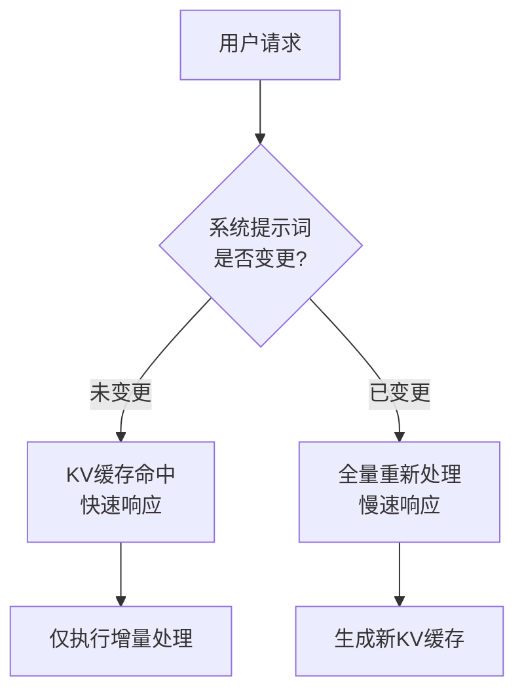
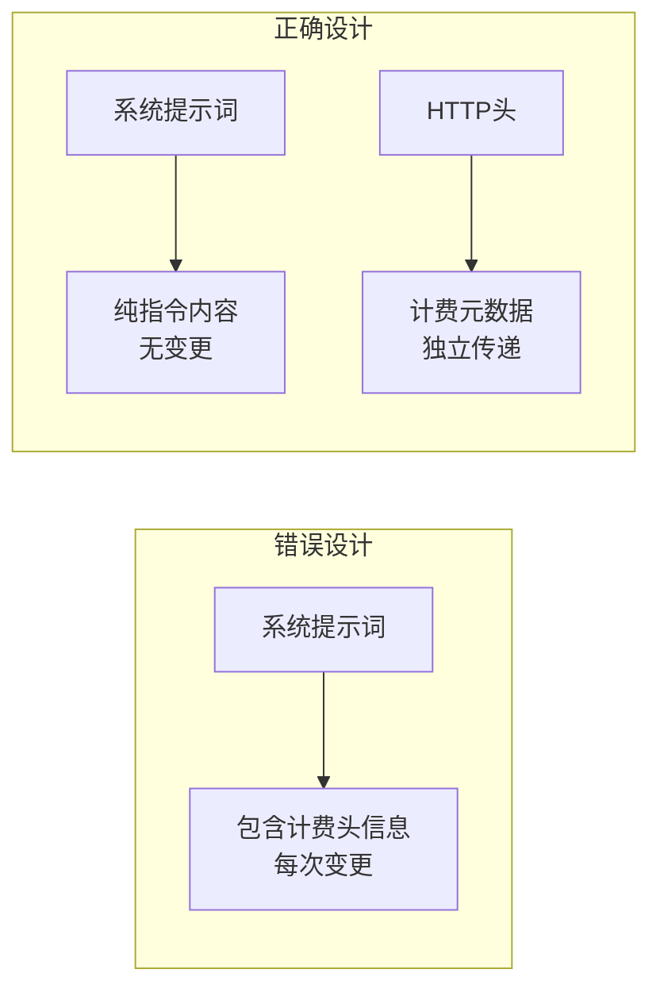

## 概述

Claude Code是Anthropic提供的基于CLI的AI编程助手。通过官方API使用时运行正常，但在通过本地LLM或第三方代理运行时，会出现<strong>每次请求都全量重新处理提示词</strong>的严重低效问题。最近，Reddit r/LocalLLaMA社区报告了这一问题，引起了广泛关注。

本文将详细分析这一问题的技术原因、影响以及解决方法。

## 问题核心：x-anthropic-billing-header

Claude Code在内部将以下计费头信息嵌入到系统提示词中：

```
x-anthropic-billing-header: cc_version=2.1.39.c39; cc_entrypoint=cli; cch=56445;
```

该头信息的值<strong>每次请求都会变化</strong>。在官方Anthropic API中，此头信息会被单独处理，但通过本地模型或第三方代理运行时，它会被渲染为系统提示词的一部分。

### KV缓存失效机制

在LLM推理中，<strong>KV（Key-Value）缓存</strong>是性能优化的关键。它存储先前请求的计算结果，并在具有相同前缀的后续请求中重复使用。



当计费头信息的值每次变化时，系统会认为整个系统提示词已被修改，导致<strong>KV缓存完全失效</strong>。结果是数千到数万token的系统提示词和对话历史每次都需要从头重新处理。

## 性能影响分析

### 本地LLM上的成本

KV缓存失效对本地模型运行的影响尤为严重：

| 项目 | KV缓存有效 | KV缓存失效 |
|------|-----------|-----------|
| 系统提示词处理 | 仅首次 | 每次请求 |
| 对话上下文处理 | 仅增量 | 全量重新处理 |
| VRAM使用量 | 稳定 | 急剧波动 |
| 响应延迟 | 0.5~2秒 | 10~30秒以上 |
| GPU计算成本 | 低 | 非常高 |

Claude Code的系统提示词可能达到数万token，加上对话历史，每次请求需要重新处理数十万token。在本地GPU上，这导致<strong>响应时间增加10倍以上</strong>。

### API代理使用时的成本

通过第三方API代理连接其他模型（如GPT-4、Gemini）时也会出现同样的问题。在支持提示词缓存的API上，缓存失效会导致<strong>token成本成倍增加</strong>。

## 解决方法

### 环境变量配置

最简单的解决方案是禁用计费头信息。在`~/.claude/settings.json`文件中添加以下内容：

```json
{
  "env": {
    "CLAUDE_CODE_ATTRIBUTION_HEADER": "0"
  }
}
```

此设置会从系统提示词中移除计费头信息，使KV缓存正常工作。

### 效果验证

应用设置后，请确认以下几点：

1. <strong>响应速度提升</strong>：从第二次请求开始，响应时间应大幅缩短
2. <strong>VRAM稳定</strong>：GPU内存使用量波动应减少
3. <strong>日志确认</strong>：确认系统提示词中不再包含计费头信息

## 架构设计的教训

这个问题不仅仅是一个bug，它提供了<strong>开发者工具设计的重要教训</strong>。

### 1. 元数据与内容分离

计费信息、遥测数据等元数据应与提示词内容明确分离。通过HTTP头、独立的API参数或带外通道传递才是正确的设计。



### 2. 缓存友好设计

设计基于LLM的工具时，必须考虑<strong>提示词的缓存友好性</strong>：

- 不要将频繁变化的元素放在提示词开头
- 在结构上分离静态内容和动态内容
- 最小化影响缓存键的因素

### 3. 第三方兼容性考虑

即使在官方API上没有问题，也需要考虑第三方环境的兼容性。特别是在开源社区中被广泛使用的工具更应如此。

## 更广阔的视角：LLM开发者工具的未来

此案例展示了LLM开发者工具生态系统面临的挑战：

- <strong>供应商锁定</strong>：针对特定API优化的工具在其他环境中表现低效
- <strong>透明度不足</strong>：内部架构未公开导致调试困难
- <strong>社区依赖</strong>：用户社区自行发现问题并分享解决方案

未来，开发者工具应朝着<strong>模型无关（model-agnostic）</strong>设计方向发展，提高内部运作的透明度，并正式支持多样化的运行环境。

## 结论

Claude Code本地模型使用时的全量提示词重新处理问题，可以通过将`CLAUDE_CODE_ATTRIBUTION_HEADER`环境变量设置为`"0"`来解决。然而，这个问题的意义远不止于此。

在开发或运营基于LLM的工具时，<strong>缓存效率、元数据分离、第三方兼容性</strong>应从设计初期就加以考虑。一个小小的头信息就能极大地改变整个系统的性能，这一事实再次提醒我们精细架构设计的重要性。

## 参考资料

- [Reddit r/LocalLLaMA — Claude Code with local models: full prompt reprocessing](https://www.reddit.com/r/LocalLLaMA/comments/1r47fz0/claude_code_with_local_models_full_prompt/)
- [claude-code-router Issue #1161 — x-anthropic-billing-header validation error](https://github.com/musistudio/claude-code-router/issues/1161)
- [Anthropic Prompt Caching Documentation](https://docs.anthropic.com/en/docs/build-with-claude/prompt-caching)
