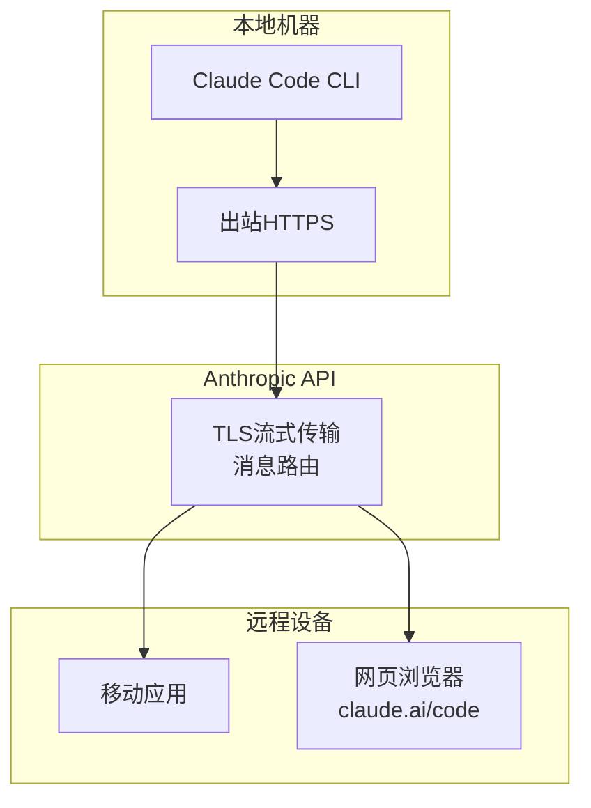
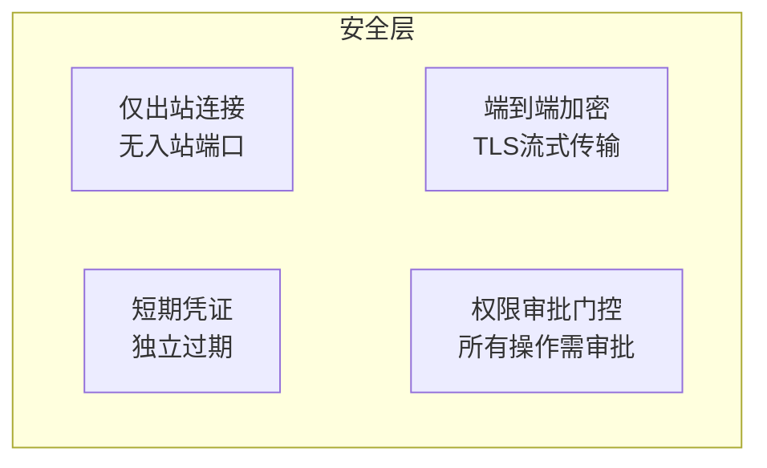

## 什么是Remote Control？

Claude Code Remote Control是一项<strong>从移动应用或网页浏览器远程控制本地机器上运行的Claude Code会话</strong>的功能。该功能于2026年2月25日作为研究预览版发布。

以下是关键要点。

- 代码和开发环境<strong>100%保留在本地</strong>
- 移动端/网页端纯粹充当<strong>遥控器</strong>角色
- 可以从沙发上监控桌面端启动的任务，或从会议室发送指令



## 设置方法

### 方法1：全局设置（推荐）

要为所有会话自动启用Remote Control，使用`/config`命令。

```bash
# 在Claude Code会话中
/config
```

从设置菜单中选择<strong>"Enable Remote Control for all sessions"</strong>。之后所有Claude Code会话将自动启用Remote Control。

### 方法2：按会话启用

仅在特定会话中启用Remote Control：

```bash
# 在活动会话中
/remote-control

# 或简写
/rc
```

### 方法3：从CLI直接启动

```bash
# 启动新的Remote Control会话
claude remote-control

# 包含详细日志
claude remote-control --verbose

# 以沙箱模式运行
claude remote-control --sandbox
```

## 从远程设备连接

Remote Control激活后，有三种连接方式。

### 扫描二维码（最快）

在终端按空格键显示二维码。用Claude移动应用扫描即可立即连接。

### 复制会话URL

复制终端显示的会话URL，粘贴到其他设备的浏览器中。在`claude.ai/code`上打开。

### 从会话列表选择

打开`claude.ai/code`或Claude移动应用，可以看到带有绿色状态指示的活动会话。

> <strong>提示</strong>：如果运行多个会话，使用`/rename`给每个会话起一个有意义的名称。这样在远程设备上查找会方便很多。

## 网络架构与安全

Remote Control的安全设计遵循以下原则。



### 核心安全特性

| 项目 | 说明 |
|------|------|
| <strong>仅出站连接</strong> | 仅使用本地机器的出站连接，不开放入站端口 |
| <strong>端到端加密</strong> | 所有流量通过TLS加密 |
| <strong>短期凭证</strong> | 每个凭证限定单一用途，独立过期 |
| <strong>Anthropic也无法查看代码</strong> | 代码保留在本地，不经过Anthropic服务器 |
| <strong>权限门控</strong> | 每次工具执行都需要明确审批 |

### 会话URL安全

会话URL应<strong>像密码一样对待</strong>。任何拥有URL的人都可以控制您的本地会话。请注意不要意外分享。

## 实战应用场景

### 场景1：监控长时间重构任务

在桌面端启动大规模重构任务，去吃午饭时用手机查看进度。

```bash
# 在桌面端
/rename "api-refactoring"
/rc

# → 用手机扫描二维码
# → 实时监控进度
# → 需要时从手机发送额外指令
```

### 场景2：会议中修复代码

在会议中收到Bug报告时，不用回到工位就能直接发送修复指令。

```bash
# 在移动应用上，连接到桌面会话：
"src/api/auth.ts的令牌验证逻辑缺少过期时间检查。请修复。"
```

### 场景3：测试套件监控

运行测试套件并远程查看结果，就像个人CI管道一样。

```bash
# 在桌面端启动测试
"运行完整测试套件，只报告失败的测试"

# → 移到沙发上
# → 在手机上查看测试结果
# → 对失败的测试发送修复指令
```

### 场景4：多项目管理

为多个项目的Claude Code会话分别命名进行管理。

```bash
# 为每个项目设置会话名称
/rename "frontend-nextjs"
/rename "backend-api"
/rename "infra-terraform"

# 在手机上：浏览会话列表 → 选择项目 → 发送指令
```

## CLI集成命令

与Remote Control配合使用的实用CLI选项。

```bash
# 在网页上创建新会话
claude --remote "修复登录Bug"

# 将网页会话转移到本地终端
claude --teleport

# 通过名称恢复之前的会话
claude --resume "api-refactoring"

# 显示移动应用下载二维码
/mobile
```

## 限制事项与注意点

作为研究预览阶段，存在一些限制。

| 限制事项 | 说明 |
|----------|------|
| <strong>单一远程连接</strong> | 每个会话仅支持一个远程连接 |
| <strong>终端必须保持运行</strong> | `claude remote-control`进程必须持续运行 |
| <strong>网络超时</strong> | 网络断开约10分钟后会话自动终止 |
| <strong>套餐限制</strong> | Max套餐优先，Pro套餐即将推出 |
| <strong>审批必需</strong> | 即使使用`--dangerously-skip-permissions`也无法绕过 |
| <strong>初期稳定性</strong> | 可能出现间歇性API 500错误 |

## 使用`/config`管理会话默认值

`/config`命令除了Remote Control外还管理各种设置。来看看Remote Control相关的设置选项。

```bash
/config

# 显示的设置项中：
# ✅ Enable Remote Control for all sessions
#    → 所有新会话自动启用
```

一旦配置完成，无需每次输入`/rc`，启动会话时Remote Control会自动激活。

## 社区替代方案

除了官方Remote Control，社区也构建了扩展解决方案。

| 项目 | 特点 |
|------|------|
| <strong>claude-agent-server</strong> | WebSocket服务器封装，E2B沙箱部署 |
| <strong>claude-code-server</strong> | Web UI执行CLI命令，Socket.io实时流式传输 |
| <strong>247 Claude Code Remote</strong> | Tailscale VPN + Fly.io VM，随处可访问 |

这些项目不在官方支持范围内，但在需要调度或编程式访问时非常有用。

## 总结

Claude Code Remote Control消除了"必须坐在桌前才能编程"的限制。代码安全地保留在本地机器上，同时可以从任何地方向AI代理发送任务指令并进行监控。

设置只需`/config`一行即可完成。虽然研究预览阶段可能存在间歇性不稳定，但核心工作流已经足够实用。

<strong>开始体验</strong>：现在就在终端运行`/config`，启用"Enable Remote Control for all sessions"。
