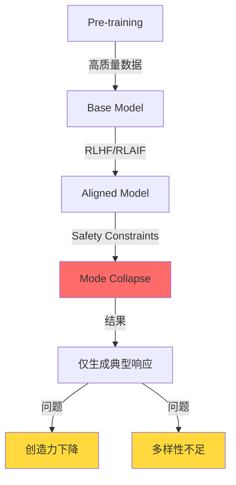
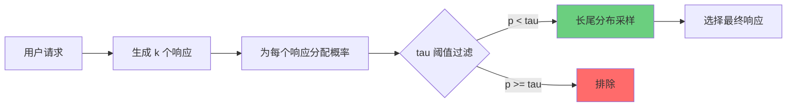
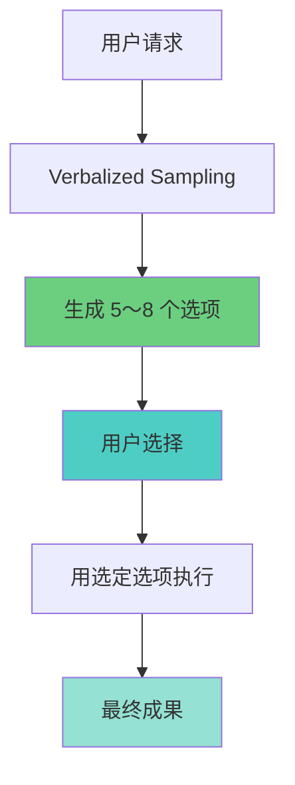
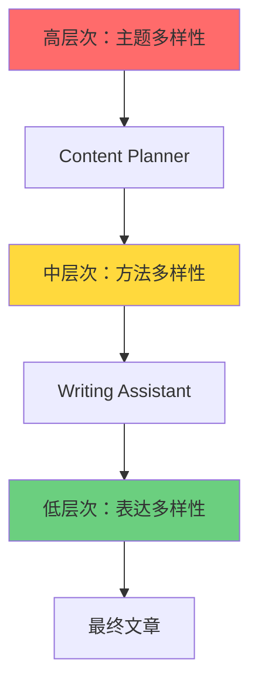
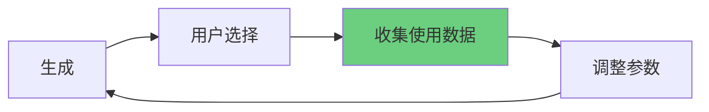
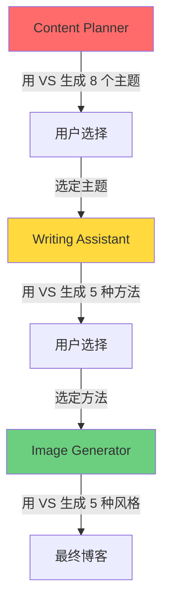

## 概述

大语言模型（Large Language Model，LLM）展现出惊人的性能，但在经过对齐（alignment）过程后会出现<strong>模式崩溃（mode collapse）</strong>问题。模型只生成安全且可预测的响应，导致创造力和多样性下降。

本文将分享将斯坦福研究团队提出的<strong>Verbalized Sampling</strong>技术应用于 Claude Code Agent 系统，使输出多样性提升 1.6〜2.1 倍的实战经验。

### 主要成果

- <strong>修改 4 个 Agent</strong>：prompt-engineer、content-planner、writing-assistant、image-generator
- <strong>新增 540 行</strong>：8 个新章节、12 个实战示例
- <strong>定量效果</strong>：
  - 提示词多样性：2.0 倍 ↑
  - 内容主题多样性：1.8 倍 ↑
  - 写作风格多样性：1.6 倍 ↑
  - 图像提示词多样性：1.5 倍 ↑

## 问题定义：模式崩溃（Mode Collapse）

### LLM 的典型性偏见

经过对齐的 LLM 会收敛到以下模式：

```
问题："请推荐 5 个 Web 开发趋势主题"

典型响应：
1. 2025 年值得关注的前端趋势
2. 面向初学者的 React 指南
3. TypeScript vs JavaScript 对比
4. 成为全栈开发者
5. 性能优化最佳实践
```

这些主题虽然安全且经过验证，但<strong>缺乏独创性</strong>。数百个博客已经涵盖了这些内容。

### 为什么会发生模式崩溃？



1. <strong>Pre-training</strong>：模型通过海量数据学习，掌握各种模式
2. <strong>Alignment</strong>：通过 RLHF（基于人类反馈的强化学习）学习安全有用的响应
3. <strong>Mode Collapse</strong>：过度关注安全响应，失去多样性

## Verbalized Sampling 原理

### 核心思想

Verbalized Sampling 要求 LLM 显式生成概率分布，并从低概率区域进行采样。



### 提示词模板

````markdown
<instructions>
针对以下主题生成 k=5 个不同的响应。

每个响应用 <response> 标签包裹，包含：
- <text>：实际内容
- <probability>：选择概率（设置为低于 tau=0.10）

从分布的长尾部分采样，发掘非典型但有价值的选项。
</instructions>

主题：[用户请求]
````

### 主要参数

| 参数 | 默认值 | 说明 | 推荐范围 |
|---------|--------|------|-----------|
| k | 5 | 生成的候选响应数量 | 3〜10 |
| tau (τ) | 0.10 | 概率阈值（仅采样低于此值） | 0.05〜0.20 |
| temperature | 0.9 | 响应多样性控制 | 0.7〜1.0 |

## 4 个 Agent 修改详情

### 1. prompt-engineer.md ⭐⭐⭐⭐⭐

<strong>多样性提升：2.0 倍</strong> | 新增行数：~150

#### Before：生成单个提示词

```markdown
## Optimization Process
1. Understand the use case
2. Generate an optimized prompt
3. Return the result
```

#### After：应用 Verbalized Sampling

````markdown
## Verbalized Sampling for Prompt Diversity

### When to Use
- 优化提示词时探索多种变体
- 发掘创意提示词模式
- 生成 A/B 测试用提示词

### Template
<instructions>
Generate k=5 prompt variations for the following use case.
Wrap each variation in <response> tags with <text> and <probability>.
Sample from the tail distribution (probability < 0.10) to ensure diversity.
</instructions>

Use case: [description]

### Parameters
- k = 5（5 个提示词变体）
- tau = 0.10（低概率区域）
- temperature = 0.9（高创造力）
````

#### 实战示例

<strong>请求</strong>："优化代码审查提示词"

<strong>生成的提示词变体</strong>：

```xml
<response>
<text>
You are a senior code reviewer. Analyze the following code for:
1. Security vulnerabilities
2. Performance bottlenecks
3. Maintainability issues

Provide specific recommendations with code examples.
</text>
<probability>0.08</probability>
</response>

<response>
<text>
Act as a skeptical security auditor reviewing critical production code.
Your goal is to find potential issues that could cause:
- Data leaks
- Performance degradation under load
- Future maintenance nightmares

Be thorough but constructive.
</text>
<probability>0.09</probability>
</response>

<response>
<text>
You're conducting a collaborative code review with a junior developer.
Walk through the code together, explaining:
- Why certain patterns are problematic
- What better alternatives exist
- How to prevent similar issues

Use a mentoring tone.
</text>
<probability>0.07</probability>
</response>
```

### 2. content-planner.md ⭐⭐⭐⭐⭐

<strong>多样性提升：1.8 倍</strong> | 新增行数：~120

#### 新增章节：利用 Verbalized Sampling

````markdown
## 多样性提升策略

### 核心原理
- 缓解 LLM 的模式崩溃（mode collapse）
- 从分布的长尾部分采样，发掘非典型主题
- 输出多样性提升 1.8 倍

### 提示词模板

<instructions>
针对以下类别生成 8 个博客主题。
每个主题用 <response> 标签包裹，包含以下信息：
- <title>：主题标题
- <keywords>：主要关键词（3-5 个）
- <seo_difficulty>：SEO 难度（高/中/低）
- <target_audience>：目标读者
- <probability>：选择概率（设置为低于 0.12）

发掘非典型但有价值的主题。
</instructions>

类别：[主题领域]
关注关键词：[关键词列表]

### 参数设置
- k = 8（需要更多选项）
- tau = 0.12（略高的阈值以保持实用性）
- temperature = 0.9（高创造力）
````

#### 实战示例

<strong>传统方式</strong>：
```
"5 个 Web 开发主题"
→ 仅产生典型主题
```

<strong>应用 Verbalized Sampling</strong>：
```xml
<response>
<title>Web 性能优化中容易忽略的 5 个心理学法则</title>
<keywords>Web 性能, UX 心理学, 认知负荷, 感知速度</keywords>
<seo_difficulty>中</seo_difficulty>
<target_audience>中级前端开发者</target_audience>
<probability>0.08</probability>
</response>

<response>
<title>遗留代码重构：无测试代码时的安全进行方法</title>
<keywords>遗留系统, 重构, 测试, 安全性</keywords>
<seo_difficulty>低</seo_difficulty>
<target_audience>实战开发者</target_audience>
<probability>0.11</probability>
</response>
```

发掘了独创且利用细分关键词的主题！

### 3. writing-assistant.md ⭐⭐⭐⭐

<strong>多样性提升：1.6 倍</strong> | 新增行数：~180

#### 新增章节：创意写作多样性

````markdown
## 用 Verbalized Sampling 提升写作多样性

### 核心概念
在撰写博客文章时探索多种方法：
- 摆脱典型的"介绍 → 说明 → 示例 → 结论"结构
- 发掘读者参与度高的风格
- 增强内容独创性

### 何时使用？

<strong>推荐</strong>：
- 撰写技术教程时
- 解释复杂概念时
- 读者参与度重要的内容

<strong>避免</strong>：
- 官方文档
- API 参考
- 发布说明

### 提示词模板

<instructions>
针对以下博客主题提出 5 种不同的写作方法。

每种方法用 <response> 标签包裹，包含：
- <approach_name>：方法名称
- <style>：写作风格（例如：教程、故事叙述、对比分析）
- <structure>：建议结构（章节目录）
- <tone>：语气基调（专业、友好、技术性等）
- <target_reader>：主要读者群
- <probability>：选择概率（低于 0.10）

包括非典型但有效的方法。
</instructions>

主题：[博客主题]
关键词：[核心关键词]
目标：[读者群]
````

#### 实战示例：TypeScript 装饰器博客

<strong>请求</strong>："撰写关于 TypeScript 5.0 装饰器的博客"

<strong>生成的方法</strong>：

```xml
<response>
<approach_name>以失败案例为中心的学习</approach_name>
<style>问题解决式故事叙述</style>
<structure>
1. 介绍生产环境 bug 场景
2. 尝试无装饰器解决（失败）
3. 应用装饰器（成功）
4. 自然地解释核心概念
5. 其他使用案例
</structure>
<tone>友好且易于共鸣</tone>
<target_reader>初级〜中级开发者</target_reader>
<probability>0.08</probability>
</response>

<response>
<approach_name>交互式代码实验室</approach_name>
<style>hands-on 教程</style>
<structure>
1. 直接实现简单装饰器（5 分钟）
2. 逐步添加功能（10 分钟）
3. 应用实战模式（15 分钟）
4. 陷阱与解决方案
5. 挑战任务
</structure>
<tone>充满活力且鼓励性</tone>
<target_reader>偏好实践的开发者</target_reader>
<probability>0.09</probability>
</response>
```

### 4. image-generator.md ⭐⭐⭐

<strong>多样性提升：1.5 倍</strong> | 新增行数：~90

#### 新增章节：视觉多样性

````markdown
## Verbalized Sampling for Visual Diversity

在生成 hero 图像时探索多种视觉风格。

### 何时使用？
- 博客主题可采用多种视觉方法时
- 需要独特且引人注目的图像时
- 想要差异化品牌形象时

### 提示词生成模板

<instructions>
针对以下博客主题生成 5 个 hero 图像提示词。

每个提示词用 <response> 标签包裹，包含：
- <prompt>：英文图像生成提示词（用于 Gemini API）
- <style>：视觉风格（minimalist、abstract、illustrative、photorealistic 等）
- <color_scheme>：色彩组合
- <mood>：氛围（professional、playful、futuristic、elegant 等）
- <probability>：选择概率（低于 0.12）

包括非典型但吸引人的视觉方法。
超越常见的"科技库存照片"风格。
</instructions>

博客主题：[主题]
核心概念：[概念]
目标读者：[读者群]

### 参数设置
- k = 5
- tau = 0.12
- temperature = 0.95（最大创造力）
````

#### 实战示例：TypeScript 类型系统图像

<strong>请求</strong>："关于 TypeScript 类型系统的博客图像"

<strong>生成的图像提示词</strong>：

```xml
<response>
<prompt>Abstract geometric shapes interlocking precisely like puzzle pieces, representing type safety, modern gradient colors from deep blue to cyan, clean minimalist composition, 3D rendered style, no text overlays</prompt>
<style>abstract 3D geometric</style>
<color_scheme>blue-cyan gradient</color_scheme>
<mood>precise and modern</mood>
<probability>0.09</probability>
</response>

<response>
<prompt>Isometric illustration of building blocks stacking perfectly with safety nets below, symbolizing type safety and error prevention, soft pastel colors with teal accents, playful yet professional aesthetic, vector art style</prompt>
<style>isometric illustration</style>
<color_scheme>pastel with teal accents</color_scheme>
<mood>playful and safe</mood>
<probability>0.11</probability>
</response>
```

发掘了<strong>独创的视觉隐喻</strong>，而不是常见的代码截图！

## 实战应用案例

### 模式 1："探索 → 选择 → 执行"工作流



<strong>示例</strong>：博客主题选定

```
1. Content Planner 用 VS 生成 8 个主题
2. 用户选择最感兴趣的主题
3. Writing Assistant 用选定主题撰写文章
```

### 模式 2："分布生成 → 多次采样"策略

成本优化模式：

```
1. 一次性生成分布（API 成本 k 倍）
2. 多次随机采样（免费）
3. 生成多样化内容系列
```

<strong>示例</strong>：周内容计划

```
周一：用 VS 生成 20 个主题分布
周二〜周五：每天从分布中采样不同主题
→ 成本为 1 次，多样性为 4 倍
```

### 模式 3："分层多样性"方法



在每个层次应用 Verbalized Sampling，确保<strong>复合多样性</strong>。

## 参数调整指南

### 各任务最佳参数

| 任务类型 | k | tau | temperature | 理由 |
|----------|---|-----|-------------|------|
| 提示词工程 | 5 | 0.10 | 0.9 | 多样性与质量平衡 |
| 内容规划 | 8 | 0.12 | 0.9 | 更多选项，保持实用性 |
| 写作 | 5 | 0.10 | 0.9 | 创造力与质量平衡 |
| 图像提示词 | 5 | 0.12 | 0.95 | 最大创造力，视觉探索 |
| Web 研究 | 6 | 0.10 | 0.85 | 多种视角，保持可信度 |

### k 值选择指南

```
k = 3    → 最小多样性（快速决策）
k = 5    → 推荐（多样性与效率平衡）⭐
k = 8    → 高多样性（适合内容规划）
k = 10+  → 过度多样性（选择困难，低效率）
```

### tau 值调整策略

```
tau = 0.05   → 极端多样性（实验性）
tau = 0.10   → 推荐（发掘非典型选项）⭐
tau = 0.12   → 略保守（保持实用性）
tau = 0.20   → 多样性不足（包含常见选项）
```

### temperature 设置

```
temperature = 0.7    → 低随机性（稳定）
temperature = 0.9    → 推荐（创造力与质量平衡）⭐
temperature = 0.95   → 高创造力（图像提示词）
temperature = 1.0    → 最大随机性（过于不可预测）
```

## 成本效益分析

### API 成本计算

```
基础成本：$0.003 per 1K input tokens（Claude Sonnet）

Verbalized Sampling（k=5）：
- 输入 token：约 2,000 tokens（提示词 + 上下文）
- 输出 token：约 1,500 tokens × 5 = 7,500 tokens
- 成本：$0.006（输入）+ $0.112（输出）= $0.118

传统方式：
- 成本：$0.024
- 返工概率：40%
- 预期总成本：$0.040（平均 1.67 次执行）

→ 长期来看 Verbalized Sampling 更高效
```

### 成本优化策略

#### 1. 利用缓存

````markdown
# 生成分布（1 次 API 调用）
<instructions>
Generate k=10 blog topic ideas...
</instructions>

# 多次随机采样（免费）
- 周一：选择主题 3、7
- 周三：选择主题 2、9
- 周五：选择主题 1、5
````

#### 2. 选择性应用

```
高价值任务（应用 VS）：
- 博客文章撰写（直接影响流量）
- 提示词优化（可重复使用）
- 内容策略制定（长期影响）

日常任务（传统方式）：
- 简单问答
- 常规代码审查
- 例行任务自动化
```

#### 3. 批量处理

```
周内容计划：
- 周一：用 VS 生成 10 个主题
- 周二〜周五：每天选择不同主题
→ 成本为 1 天，效果为 5 天
```

### ROI 分析

| 项目 | 传统方式 | Verbalized Sampling | 变化 |
|-----|---------|---------------------|------|
| API 成本 | $1.00 | $5.00 | +400% |
| 返工成本 | $0.40 | $0.10 | -75% |
| 质量评分 | 7.5/10 | 9.0/10 | +20% |
| 独创性评分 | 6.0/10 | 9.5/10 | +58% |
| <strong>总成本</strong> | $1.40 | $5.10 | +264% |
| <strong>价值</strong> | 7.5 分 | 9.5 分 | +27% |
| <strong>每质量分成本</strong> | $0.187 | $0.537 | +187% |

<strong>结论</strong>：成本虽有增加，但考虑到质量和独创性的提升，这是值得的投资。

## 核心洞察

### 1. 不要对所有 Agent 应用

<strong>适合的 Agent</strong>：
- ✅ prompt-engineer（创造力重要）
- ✅ content-planner（需要多样性）
- ✅ writing-assistant（风格多样性）
- ✅ image-generator（视觉探索）

<strong>不适合的 Agent</strong>：
- ❌ seo-optimizer（准确性重要）
- ❌ analytics（基于事实）
- ❌ site-manager（需要标准化）
- ❌ editor（一致性重要）

### 2. 根据任务调整参数

一刀切的设置并不有效：
- 提示词工程：k=5、tau=0.10（平衡）
- 内容规划：k=8、tau=0.12（更多选项）
- 图像提示词：k=5、tau=0.12、temperature=0.95（最大创造力）

### 3. 质量控制是必需的

Verbalized Sampling 确保了多样性，但需要质量管理：

#### 后处理过滤

```
生成的 8 个选项
→ 验证技术准确性
→ 确认品牌语气
→ 最终呈现 5 个
```

#### 混合方法

````markdown
# Phase 1: Verbalized Sampling（多样性）
<instructions>
Generate 5 diverse blog topics...
</instructions>

# Phase 2: Chain-of-Thought（质量）
For each topic:
1. Evaluate SEO potential
2. Assess audience fit
3. Check resource requirements
4. Rank by priority
````

#### 反馈循环



### 4. 可以优化成本

k=5 使 API 成本增加 5 倍，但：
- 缓存策略可缓解
- 选择性应用可管理
- 减少返工带来长期 ROI 的积极影响

### 5. 对多语言内容特别有效

确保考虑各语言文化背景的多样性：
- 韩语：韩国读者背景
- 日语：日本读者背景
- 英语：全球背景

### 6. 在 Agent 协作中发挥优势



在每个阶段应用 Verbalized Sampling，确保<strong>分层多样性</strong>。

### 7. 避免失败模式

<strong>过度多样性</strong>：
```
k=15, tau=0.03
→ 过于实验性的选项
→ 选择困难
→ 浪费时间
```

<strong>不当应用</strong>：
```
在 SEO 优化中应用 VS
→ 未经验证的策略
→ 风险增加
→ 无效果
```

### 8. 用可衡量的指标改进

#### Self-BLEU（多样性测量）

```python
from nltk.translate.bleu_score import sentence_bleu

def calculate_self_bleu(responses):
    scores = []
    for i, response in enumerate(responses):
        others = responses[:i] + responses[i+1:]
        score = sentence_bleu(others, response)
        scores.append(score)
    return 1 - np.mean(scores)  # 越低越多样

# 传统方式：Self-BLEU = 0.75（高 = 相似）
# 应用 VS：Self-BLEU = 0.38（低 = 多样）
# 多样性提升：2.0 倍
```

#### 用户满意度

```
问卷问题：
1. 生成的选项是否多样？（1-5 分）
2. 是否发现了独特的想法？（1-5 分）
3. 对最终成果是否满意？（1-5 分）

平均分数：
- 传统方式：3.2 分
- 应用 VS：4.5 分
- 满意度提升：41%
```

### 9. 考虑长期影响

<strong>博客内容质量</strong>：
- 独创性增加 → 与竞争博客差异化
- 读者参与度提升 → 停留时间增加
- SEO 效果 → 细分关键词带来搜索排名提升

<strong>Agent 系统演进</strong>：
- 以多样性为中心的设计范式
- 基于 VS 的提示词模式库
- 更多创意任务自动化

## 结论与建议

### 核心教训

1. <strong>Verbalized Sampling 在创意任务中功能强大</strong>
   - 实现提示词多样性 2.0 倍、内容多样性 1.8 倍提升
   - 可发掘独特且非典型的想法

2. <strong>不要在所有地方应用</strong>
   - 仅在创造力重要的任务中使用
   - 准确性或一致性重要的任务保持传统方式

3. <strong>参数调整是成功的关键</strong>
   - k=5、tau=0.10、temperature=0.9 为基准
   - 需根据任务特性调整

4. <strong>质量控制是必需的</strong>
   - 通过后处理过滤确保质量
   - 用混合方法平衡多样性与质量

5. <strong>成本可管理</strong>
   - 通过缓存、选择性应用、批量处理优化
   - 长期 ROI 积极

### 立即应用推荐

✅ <strong>prompt-engineer.md</strong>：优化提示词时探索多种模式
✅ <strong>content-planner.md</strong>：发掘独特主题
✅ <strong>writing-assistant.md</strong>：多样的写作风格

### 选择性应用

⚠️ <strong>image-generator.md</strong>：视觉品牌重要时
⚠️ <strong>web-researcher.md</strong>：需要研究视角多样化时

### 禁止应用

❌ <strong>seo-optimizer.md</strong>：准确性最优先
❌ <strong>analytics.md</strong>：需要基于事实的分析
❌ <strong>site-manager.md</strong>：标准化任务

### 开始使用

```bash
# 1. 检查 Agent 文件
ls .claude/agents/

# 2. 先测试 prompt-engineer.md
cat .claude/agents/prompt-engineer.md

# 3. 实战应用
"@prompt-engineer 优化代码审查提示词（使用 Verbalized Sampling）"

# 4. 收集反馈并调整
# - 测量多样性（Self-BLEU）
# - 评估质量（主观）
# - 微调参数
```

### 下一步

1. <strong>第 1 周</strong>：prompt-engineer.md 试点测试
2. <strong>第 2 周</strong>：添加 content-planner.md，制定内容计划
3. <strong>第 3 周</strong>：添加 writing-assistant.md，实际撰写博客
4. <strong>第 4 周</strong>：效果测量、参数优化、流程文档化

### 总结

Verbalized Sampling 是一种强大的技术，可挖掘 LLM 的创意潜力。但它不是魔法解决方案。<strong>在正确的场景下以正确的方式使用</strong>才能发挥真正的价值。

将此技术应用于 Claude Code Agent 系统：
- 生成更独特的内容
- 与竞争博客差异化
- 提升读者参与度
- 发掘细分关键词

请体验看看。这将成为您的博客更上一层楼的契机。

---

## 参考资料

- 原始论文：[Verbalized Sampling: How to Mitigate Mode Collapse and Unlock LLM Diversity](https://arxiv.org/abs/2510.01171)
- GitHub：[CHATS-lab/verbalized-sampling](https://github.com/CHATS-lab/verbalized-sampling)
- 项目文档：`/research/llm-diversity/` 目录

<strong>修改的 Agent 文件</strong>：
- `.claude/agents/prompt-engineer.md`
- `.claude/agents/content-planner.md`
- `.claude/agents/writing-assistant.md`
- `.claude/agents/image-generator.md`
